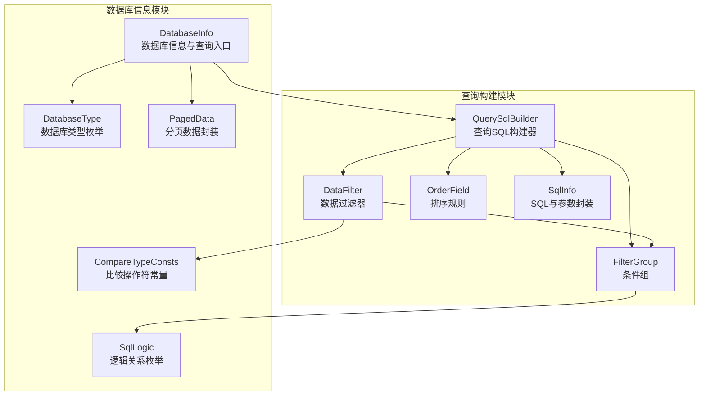
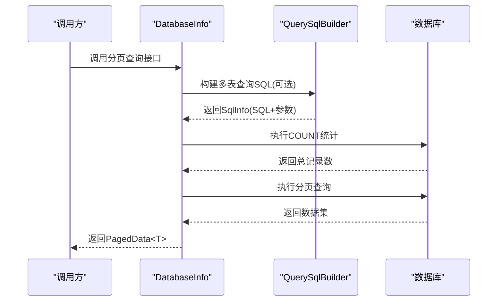
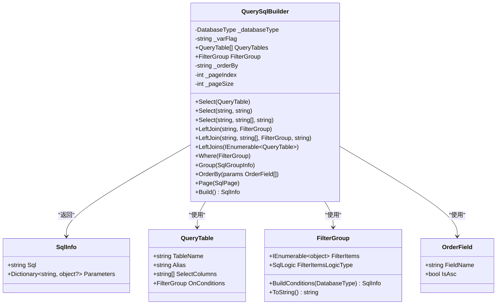
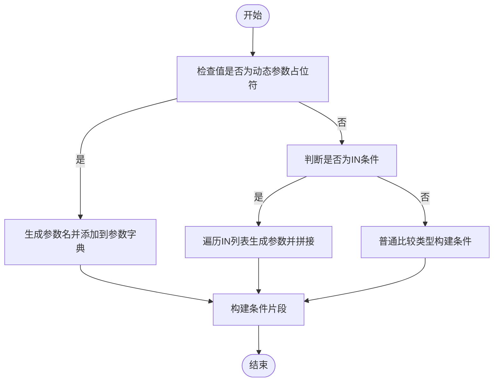
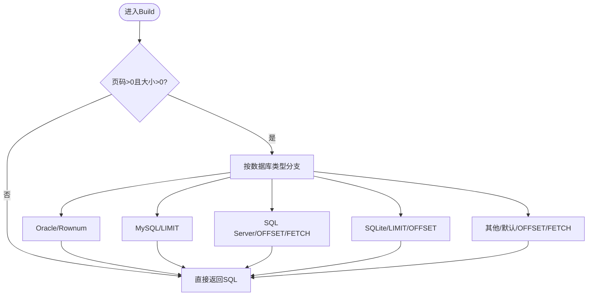
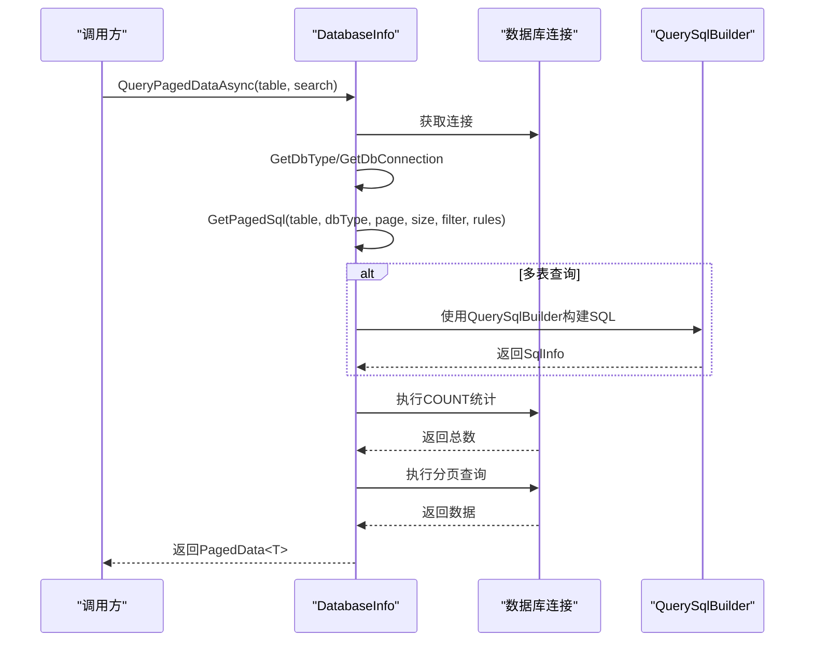
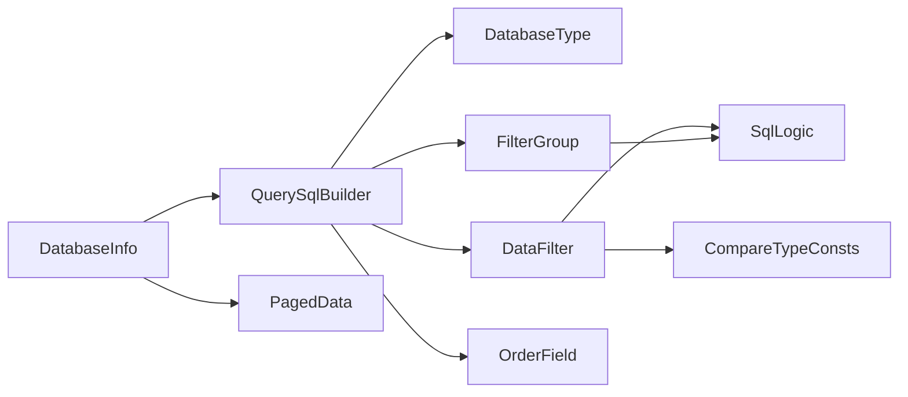

# 查询SQL构建器

<cite>
**本文档引用的文件**
- [QuerySqlBuilder.cs](file://Sylas.RemoteTasks.Database/SyncBase/QuerySqlBuilder.cs)
- [DatabaseInfo.cs](file://Sylas.RemoteTasks.Database/SyncBase/DatabaseInfo.cs)
- [SqlInfo.cs](file://Sylas.RemoteTasks.Database/SyncBase/SqlInfo.cs)
- [DataSearch.cs](file://Sylas.RemoteTasks.Database/SyncBase/DataSearch.cs)
- [DataFilter.cs](file://Sylas.RemoteTasks.Database/SyncBase/DataFilter.cs)
- [FilterGroup.cs](file://Sylas.RemoteTasks.Database/SyncBase/FilterGroup.cs)
- [OrderField.cs](file://Sylas.RemoteTasks.Database/SyncBase/OrderField.cs)
- [DatabaseType.cs](file://Sylas.RemoteTasks.Database/SyncBase/DatabaseType.cs)
- [CompareTypeConsts.cs](file://Sylas.RemoteTasks.Database/SyncBase/CompareTypeConsts.cs)
- [SqlLogic.cs](file://Sylas.RemoteTasks.Database/SyncBase/SqlLogic.cs)
- [PagedData.cs](file://Sylas.RemoteTasks.Database/SyncBase/PagedData.cs)
- [QueryConditionBuilderTest.cs](file://Sylas.RemoteTasks.Test/Database/QueryConditionBuilderTest.cs)
</cite>

## 目录
1. [简介](#简介)
2. [项目结构](#项目结构)
3. [核心组件](#核心组件)
4. [架构概览](#架构概览)
5. [详细组件分析](#详细组件分析)
6. [依赖关系分析](#依赖关系分析)
7. [性能考虑](#性能考虑)
8. [故障排除指南](#故障排除指南)
9. [结论](#结论)
10. [附录](#附录)

## 简介
本文件为查询SQL构建器的技术文档，重点阐述 QuerySqlBuilder 的设计原理、SQL 语句构建策略，以及与 DatabaseInfo 类的协作关系。文档涵盖分页查询、条件过滤、排序规则的实现机制，不同数据库类型的 SQL 语法差异与适配方案，查询优化技术与索引利用策略，SQL 注入防护与参数化查询的实现细节，并提供复杂查询场景的构建示例与性能优化建议。

## 项目结构
该功能位于数据库同步与查询模块中，核心文件包括：
- QuerySqlBuilder：查询 SQL 构建器，负责从表、联接、条件、分组、排序等维度构建最终 SQL
- DatabaseInfo：数据库信息与查询入口，提供分页查询、SQL 生成与执行能力
- DataFilter/FilterGroup：条件与过滤器模型，支持多层嵌套逻辑与参数化
- OrderField/SqlLogic：排序规则与逻辑关系枚举
- DatabaseType/CompareTypeConsts：数据库类型与比较操作符常量
- SqlInfo：封装 SQL 语句与参数的对象
- DataSearch/PagedData：分页查询参数与结果封装

**图表来源**
- [QuerySqlBuilder.cs](file://Sylas.RemoteTasks.Database/SyncBase/QuerySqlBuilder.cs#L11-L389)
- [DatabaseInfo.cs](file://Sylas.RemoteTasks.Database/SyncBase/DatabaseInfo.cs#L64-L88)
- [DataFilter.cs](file://Sylas.RemoteTasks.Database/SyncBase/DataFilter.cs#L14-L470)
- [FilterGroup.cs](file://Sylas.RemoteTasks.Database/SyncBase/FilterGroup.cs#L13-L202)
- [OrderField.cs](file://Sylas.RemoteTasks.Database/SyncBase/OrderField.cs#L6-L34)
- [SqlInfo.cs](file://Sylas.RemoteTasks.Database/SyncBase/SqlInfo.cs#L8-L38)
- [DatabaseType.cs](file://Sylas.RemoteTasks.Database/SyncBase/DatabaseType.cs#L6-L38)
- [CompareTypeConsts.cs](file://Sylas.RemoteTasks.Database/SyncBase/CompareTypeConsts.cs#L8-L55)
- [SqlLogic.cs](file://Sylas.RemoteTasks.Database/SyncBase/SqlLogic.cs#L6-L22)
- [PagedData.cs](file://Sylas.RemoteTasks.Database/SyncBase/PagedData.cs#L10-L46)

**章节来源**
- [QuerySqlBuilder.cs](file://Sylas.RemoteTasks.Database/SyncBase/QuerySqlBuilder.cs#L11-L389)
- [DatabaseInfo.cs](file://Sylas.RemoteTasks.Database/SyncBase/DatabaseInfo.cs#L64-L88)

## 核心组件
- QuerySqlBuilder：面向 Fluent API 的查询构建器，支持主表选择、左联接、条件组、分组聚合、排序与分页，最终输出参数化的 SQL 与参数字典
- DataFilter/FilterGroup：描述过滤条件的树形结构，支持 AND/OR 组合、关键字模糊匹配、IN 列表、动态参数占位符等
- OrderField：排序字段与方向（升/降）
- DatabaseInfo：提供分页查询入口、SQL 生成（含多表联查）、参数化执行与数据库类型适配
- SqlInfo：统一承载 SQL 语句与参数，便于后续执行
- DatabaseType/CompareTypeConsts/SqlLogic：数据库类型、比较操作符与逻辑关系的标准化定义

**章节来源**
- [QuerySqlBuilder.cs](file://Sylas.RemoteTasks.Database/SyncBase/QuerySqlBuilder.cs#L11-L389)
- [DataFilter.cs](file://Sylas.RemoteTasks.Database/SyncBase/DataFilter.cs#L14-L470)
- [FilterGroup.cs](file://Sylas.RemoteTasks.Database/SyncBase/FilterGroup.cs#L13-L202)
- [OrderField.cs](file://Sylas.RemoteTasks.Database/SyncBase/OrderField.cs#L6-L34)
- [SqlInfo.cs](file://Sylas.RemoteTasks.Database/SyncBase/SqlInfo.cs#L8-L38)
- [DatabaseInfo.cs](file://Sylas.RemoteTasks.Database/SyncBase/DatabaseInfo.cs#L64-L88)
- [DatabaseType.cs](file://Sylas.RemoteTasks.Database/SyncBase/DatabaseType.cs#L6-L38)
- [CompareTypeConsts.cs](file://Sylas.RemoteTasks.Database/SyncBase/CompareTypeConsts.cs#L8-L55)
- [SqlLogic.cs](file://Sylas.RemoteTasks.Database/SyncBase/SqlLogic.cs#L6-L22)

## 架构概览
QuerySqlBuilder 与 DatabaseInfo 协作完成从条件到 SQL 的完整流程：
- DatabaseInfo 提供分页查询入口与 SQL 生成（单表/多表），内部可调用 QuerySqlBuilder 完成多表联查 SQL 的构建
- QuerySqlBuilder 负责将 QueryTable、FilterGroup、OrderField、分页参数等组装为最终 SQL，并根据数据库类型选择合适的分页语法
- DataFilter/FilterGroup 负责将用户输入的过滤条件转换为参数化 SQL 片段，避免拼接风险
- SqlInfo 统一封装 SQL 与参数，确保执行时的参数化安全

**图表来源**
- [DatabaseInfo.cs](file://Sylas.RemoteTasks.Database/SyncBase/DatabaseInfo.cs#L309-L351)
- [QuerySqlBuilder.cs](file://Sylas.RemoteTasks.Database/SyncBase/QuerySqlBuilder.cs#L277-L386)

## 详细组件分析

### QuerySqlBuilder 设计与实现
- 参数化标识符选择：根据数据库类型选择参数前缀（Oracle/Dm 使用冒号，其他使用 @），保证跨数据库兼容性
- 表与联接：支持主表与多个左联接表，联接条件通过 FilterGroup 的 ToString 输出 ON 条件
- 条件构建：Where(FilterGroup) 接收条件组，内部调用 BuildConditions 生成参数化 WHERE 子句，并合并参数字典
- 分组与聚合：Group(SqlGroupInfo) 支持 Group By 与 HAVING，HAVING 条件同样来自 FilterGroup，参数命名冲突时自动重命名避免覆盖
- 排序：OrderBy 支持多字段升/降序，自动拼接 ORDER BY 子句
- 分页：Page(SqlPage) 接收页码与大小，按数据库类型生成分页子句（Oracle/达梦使用 ROWNUM，MySQL 使用 LIMIT，SQL Server 使用 OFFSET/FETCH，SQLite 使用 LIMIT/OFFSET，其他默认使用 OFFSET/FETCH）

**图表来源**
- [QuerySqlBuilder.cs](file://Sylas.RemoteTasks.Database/SyncBase/QuerySqlBuilder.cs#L11-L389)
- [SqlInfo.cs](file://Sylas.RemoteTasks.Database/SyncBase/SqlInfo.cs#L8-L38)
- [DataFilter.cs](file://Sylas.RemoteTasks.Database/SyncBase/DataFilter.cs#L450-L468)
- [FilterGroup.cs](file://Sylas.RemoteTasks.Database/SyncBase/FilterGroup.cs#L13-L202)
- [OrderField.cs](file://Sylas.RemoteTasks.Database/SyncBase/OrderField.cs#L6-L34)

**章节来源**
- [QuerySqlBuilder.cs](file://Sylas.RemoteTasks.Database/SyncBase/QuerySqlBuilder.cs#L11-L389)

### 条件过滤与参数化
- FilterItem：支持多种比较类型（>, <, =, >=, <=, !=, in, include），将字符串值识别为动态参数占位符（如 {name}）并转换为参数化片段；IN 条件会为每个值生成独立参数名，避免重复覆盖
- FilterGroup：递归构建条件树，根据 SqlLogic 决定括号与逻辑运算符，支持 JSON 反序列化后的 JObject 自动识别为 FilterItem/FilterGroup
- 关键字查询：AddKeywordsQuerying 将多个字段的包含条件组合为 OR 逻辑，再与原条件组通过 AND 组合

**图表来源**
- [DataFilter.cs](file://Sylas.RemoteTasks.Database/SyncBase/DataFilter.cs#L118-L232)
- [FilterGroup.cs](file://Sylas.RemoteTasks.Database/SyncBase/FilterGroup.cs#L67-L144)

**章节来源**
- [DataFilter.cs](file://Sylas.RemoteTasks.Database/SyncBase/DataFilter.cs#L14-L470)
- [FilterGroup.cs](file://Sylas.RemoteTasks.Database/SyncBase/FilterGroup.cs#L13-L202)
- [CompareTypeConsts.cs](file://Sylas.RemoteTasks.Database/SyncBase/CompareTypeConsts.cs#L8-L55)

### 排序规则与分组
- OrderBy：支持多字段排序，自动拼接逗号分隔的 ORDER BY 子句
- Group：支持 Group By 字段与 HAVING 条件，HAVING 参数命名冲突时自动重命名，避免参数覆盖

**章节来源**
- [OrderField.cs](file://Sylas.RemoteTasks.Database/SyncBase/OrderField.cs#L6-L34)
- [QuerySqlBuilder.cs](file://Sylas.RemoteTasks.Database/SyncBase/QuerySqlBuilder.cs#L192-L226)

### 分页查询实现机制
- Page：接收页码与大小，内部保存 _pageIndex/_pageSize
- Build：当页码与大小均大于 0 时，根据数据库类型生成分页子句
  - Oracle/Dm：ROWNUM 方案
  - MySQL：LIMIT 偏移
  - SQL Server：OFFSET/FETCH
  - SQLite：LIMIT/OFFSET
  - 其他：默认 OFFSET/FETCH

**图表来源**
- [QuerySqlBuilder.cs](file://Sylas.RemoteTasks.Database/SyncBase/QuerySqlBuilder.cs#L232-L252)
- [QuerySqlBuilder.cs](file://Sylas.RemoteTasks.Database/SyncBase/QuerySqlBuilder.cs#L368-L382)

**章节来源**
- [QuerySqlBuilder.cs](file://Sylas.RemoteTasks.Database/SyncBase/QuerySqlBuilder.cs#L232-L252)
- [QuerySqlBuilder.cs](file://Sylas.RemoteTasks.Database/SyncBase/QuerySqlBuilder.cs#L368-L382)

### 不同数据库类型的 SQL 差异与适配
- 参数前缀：Oracle/Dm 使用冒号，其他使用 @，QuerySqlBuilder 在构造时确定 _varFlag
- 分页语法：各数据库分页语法不同，Build 中按类型分支生成
- 连接字符串与连接对象：DatabaseInfo 提供多数据库连接对象工厂，支持解析连接字符串并获取数据库类型

**章节来源**
- [QuerySqlBuilder.cs](file://Sylas.RemoteTasks.Database/SyncBase/QuerySqlBuilder.cs#L17-L26)
- [DatabaseInfo.cs](file://Sylas.RemoteTasks.Database/SyncBase/DatabaseInfo.cs#L150-L163)
- [DatabaseInfo.cs](file://Sylas.RemoteTasks.Database/SyncBase/DatabaseInfo.cs#L210-L299)

### 与 DatabaseInfo 的协作关系
- DatabaseInfo.QueryPagedDataAsync 提供分页查询入口，内部调用 GetPagedSql 生成 SQL 与参数，先执行 COUNT 再执行分页查询
- DatabaseInfo.GetPagedSql 支持单表与多表联查两种模式，多表模式内部使用 QuerySqlBuilder 构建 SQL
- DatabaseInfo.ExecuteSqlAsync/ExecuteSqlsAsync 支持参数化执行与事务控制

**图表来源**
- [DatabaseInfo.cs](file://Sylas.RemoteTasks.Database/SyncBase/DatabaseInfo.cs#L309-L351)
- [DatabaseInfo.cs](file://Sylas.RemoteTasks.Database/SyncBase/DatabaseInfo.cs#L2616-L2682)
- [DatabaseInfo.cs](file://Sylas.RemoteTasks.Database/SyncBase/DatabaseInfo.cs#L2689-L2701)

**章节来源**
- [DatabaseInfo.cs](file://Sylas.RemoteTasks.Database/SyncBase/DatabaseInfo.cs#L309-L351)
- [DatabaseInfo.cs](file://Sylas.RemoteTasks.Database/SyncBase/DatabaseInfo.cs#L2616-L2682)
- [DatabaseInfo.cs](file://Sylas.RemoteTasks.Database/SyncBase/DatabaseInfo.cs#L2689-L2701)

### 复杂查询场景构建示例
- 多表联查：通过 QueryTable 集合与 LeftJoins 构建主表与多个左联接表，ON 条件由 FilterGroup 的 ToString 生成
- 关键字查询：DataFilter.AddKeywordsQuerying 将多个字段的包含条件组合为 OR，再与原条件组 AND 组合
- 分组与聚合：Group(SqlGroupInfo) 指定分组字段与 HAVING 条件，参数冲突自动重命名

**章节来源**
- [QueryConditionBuilderTest.cs](file://Sylas.RemoteTasks.Test/Database/QueryConditionBuilderTest.cs#L58-L200)
- [DataFilter.cs](file://Sylas.RemoteTasks.Database/SyncBase/DataFilter.cs#L44-L60)
- [QuerySqlBuilder.cs](file://Sylas.RemoteTasks.Database/SyncBase/QuerySqlBuilder.cs#L150-L174)

## 依赖关系分析
- QuerySqlBuilder 依赖 DatabaseType 决定参数前缀与分页语法，依赖 FilterGroup/FilterItem 构建 WHERE/HAVING，依赖 OrderField 构建排序
- DatabaseInfo 依赖 QuerySqlBuilder 实现多表联查 SQL 生成，依赖 DataFilter/FilterGroup 实现条件构建，依赖 PagedData 封装结果
- DataFilter/FilterGroup 依赖 CompareTypeConsts 与 SqlLogic 定义比较类型与逻辑关系

**图表来源**
- [QuerySqlBuilder.cs](file://Sylas.RemoteTasks.Database/SyncBase/QuerySqlBuilder.cs#L17-L389)
- [DatabaseInfo.cs](file://Sylas.RemoteTasks.Database/SyncBase/DatabaseInfo.cs#L64-L88)
- [DataFilter.cs](file://Sylas.RemoteTasks.Database/SyncBase/DataFilter.cs#L14-L470)
- [FilterGroup.cs](file://Sylas.RemoteTasks.Database/SyncBase/FilterGroup.cs#L13-L202)
- [OrderField.cs](file://Sylas.RemoteTasks.Database/SyncBase/OrderField.cs#L6-L34)
- [DatabaseType.cs](file://Sylas.RemoteTasks.Database/SyncBase/DatabaseType.cs#L6-L38)
- [CompareTypeConsts.cs](file://Sylas.RemoteTasks.Database/SyncBase/CompareTypeConsts.cs#L8-L55)
- [SqlLogic.cs](file://Sylas.RemoteTasks.Database/SyncBase/SqlLogic.cs#L6-L22)
- [PagedData.cs](file://Sylas.RemoteTasks.Database/SyncBase/PagedData.cs#L10-L46)

**章节来源**
- [QuerySqlBuilder.cs](file://Sylas.RemoteTasks.Database/SyncBase/QuerySqlBuilder.cs#L17-L389)
- [DatabaseInfo.cs](file://Sylas.RemoteTasks.Database/SyncBase/DatabaseInfo.cs#L64-L88)
- [DataFilter.cs](file://Sylas.RemoteTasks.Database/SyncBase/DataFilter.cs#L14-L470)
- [FilterGroup.cs](file://Sylas.RemoteTasks.Database/SyncBase/FilterGroup.cs#L13-L202)
- [OrderField.cs](file://Sylas.RemoteTasks.Database/SyncBase/OrderField.cs#L6-L34)
- [DatabaseType.cs](file://Sylas.RemoteTasks.Database/SyncBase/DatabaseType.cs#L6-L38)
- [CompareTypeConsts.cs](file://Sylas.RemoteTasks.Database/SyncBase/CompareTypeConsts.cs#L8-L55)
- [SqlLogic.cs](file://Sylas.RemoteTasks.Database/SyncBase/SqlLogic.cs#L6-L22)
- [PagedData.cs](file://Sylas.RemoteTasks.Database/SyncBase/PagedData.cs#L10-L46)

## 性能考虑
- 参数化查询：所有条件值通过参数传递，避免字符串拼接，降低性能损耗并提升安全性
- 分页优化：优先使用数据库原生分页语法，减少全量数据扫描；在高偏移场景下，建议结合索引与覆盖索引优化
- 条件优化：IN 列表过大时拆分批次，避免单次参数过多导致的执行计划不稳定
- 排序优化：ORDER BY 字段建立合适索引；避免在大结果集上进行复杂排序
- 连接与资源：合理复用连接与参数字典，避免频繁创建与销毁

## 故障排除指南
- 未设置数据表：Build 时若 QueryTables 为空，抛出异常提示未设置数据表
- 缺少联查表信息：联接表未设置 OnConditions 时抛出异常
- 参数命名冲突：HAVING 与 WHERE 参数可能重名，构建时自动重命名并更新参数字典
- SQL 注入防护：通过参数化与动态参数占位符机制，避免直接拼接用户输入

**章节来源**
- [QuerySqlBuilder.cs](file://Sylas.RemoteTasks.Database/SyncBase/QuerySqlBuilder.cs#L279-L282)
- [QuerySqlBuilder.cs](file://Sylas.RemoteTasks.Database/SyncBase/QuerySqlBuilder.cs#L299-L302)
- [QuerySqlBuilder.cs](file://Sylas.RemoteTasks.Database/SyncBase/QuerySqlBuilder.cs#L337-L356)

## 结论
QuerySqlBuilder 通过清晰的 Fluent API 与参数化设计，实现了跨数据库的 SQL 构建能力，配合 DatabaseInfo 的分页查询与多表联查支持，满足复杂业务场景下的查询需求。通过 FilterGroup 的递归条件构建与自动参数命名冲突处理，既保证了灵活性又确保了安全性与性能。

## 附录
- 数据库类型枚举：MySql、SqlServer、Oracle、Pg、Dm、Sqlite、MsSqlLocalDb
- 比较操作符：>, <, =, >=, <=, !=, in, include
- 逻辑关系：And、Or、None

**章节来源**
- [DatabaseType.cs](file://Sylas.RemoteTasks.Database/SyncBase/DatabaseType.cs#L6-L38)
- [CompareTypeConsts.cs](file://Sylas.RemoteTasks.Database/SyncBase/CompareTypeConsts.cs#L8-L55)
- [SqlLogic.cs](file://Sylas.RemoteTasks.Database/SyncBase/SqlLogic.cs#L6-L22)