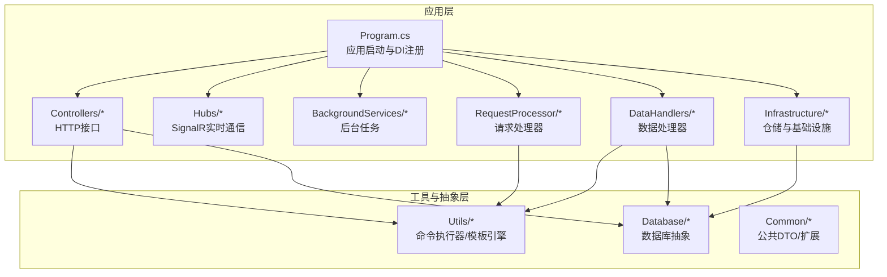
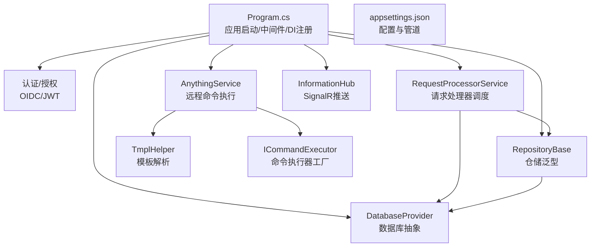
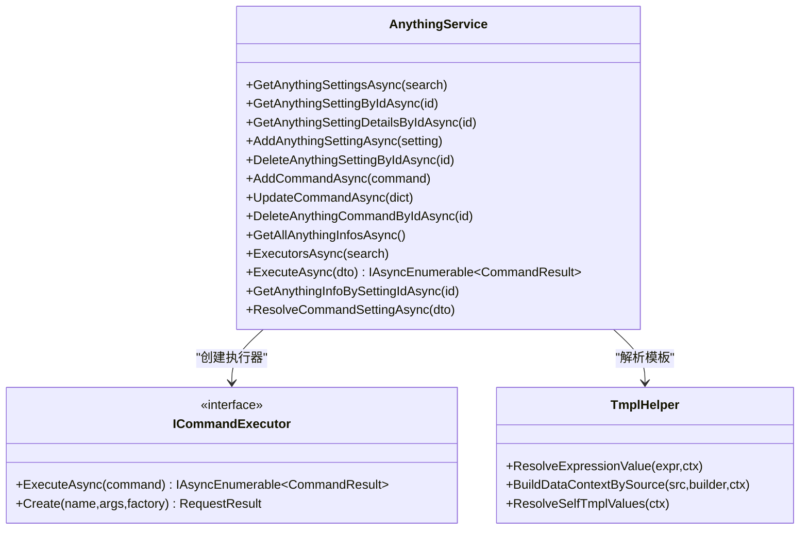
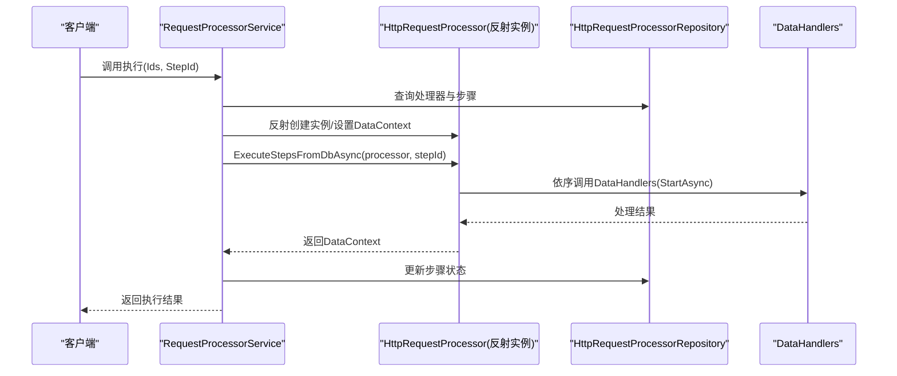
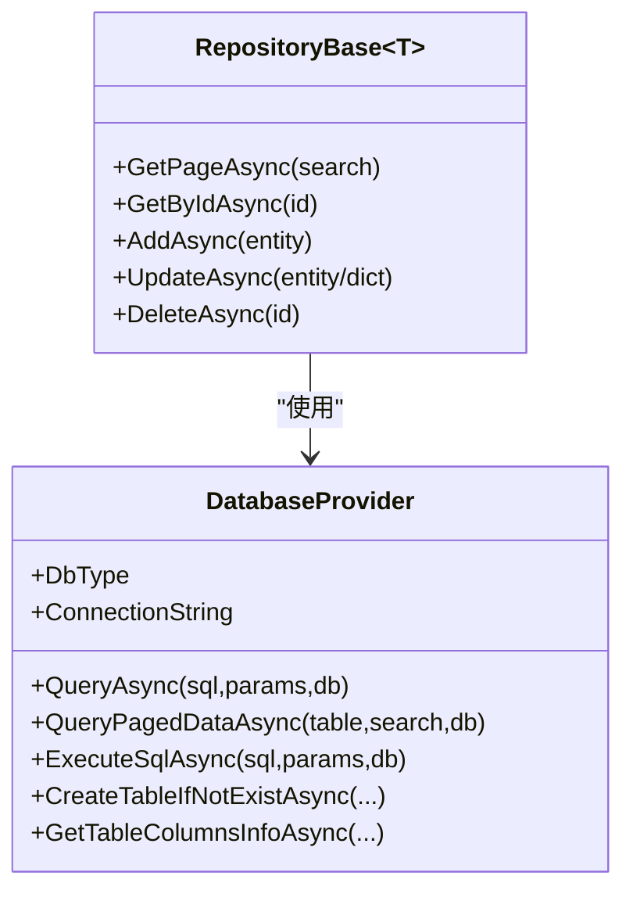
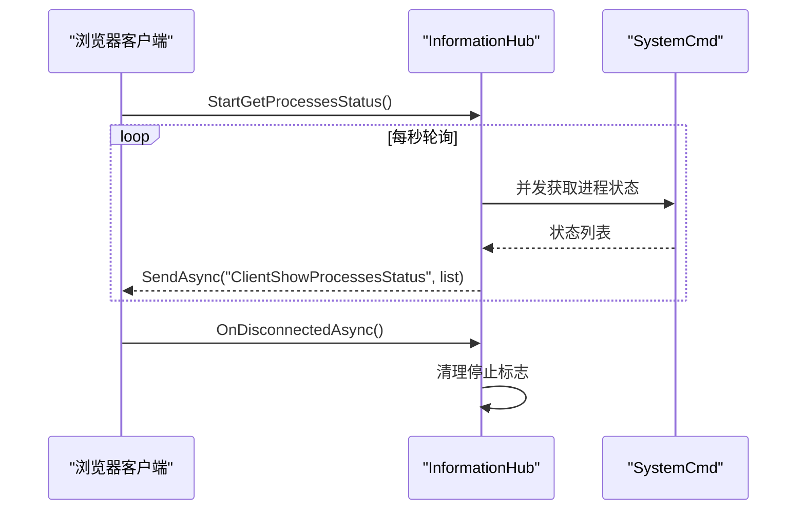
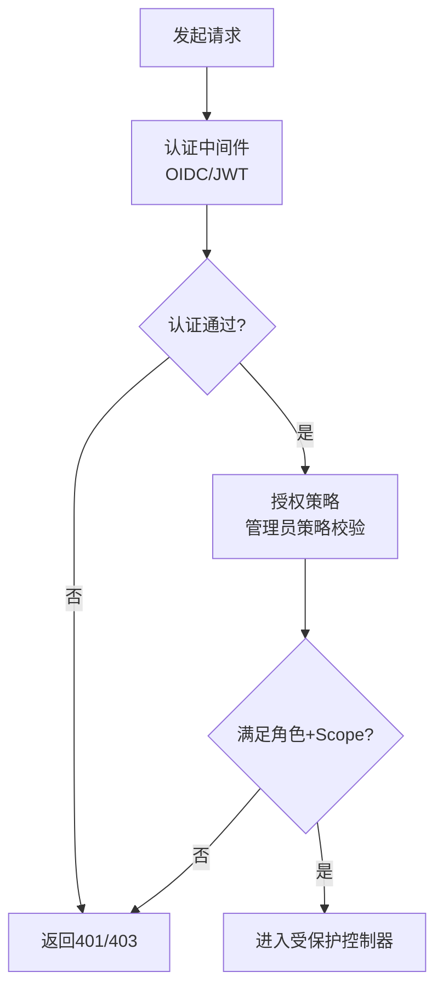
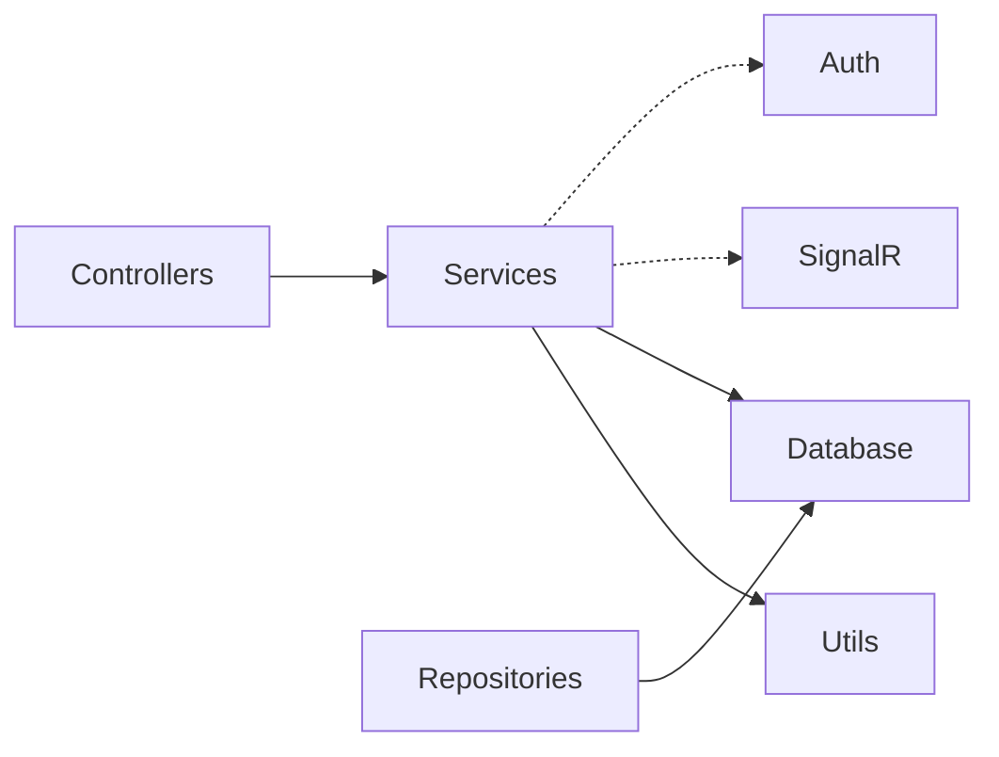

# 核心特性

<cite>
**本文档引用的文件**
- [Program.cs](file://Sylas.RemoteTasks.App/Program.cs)
- [appsettings.json](file://Sylas.RemoteTasks.App/appsettings.json)
- [README.md](file://README.md)
- [Sylas.RemoteTasks.App.csproj](file://Sylas.RemoteTasks.App/Sylas.RemoteTasks.App.csproj)
- [HostsController.cs](file://Sylas.RemoteTasks.App/Controllers/HostsController.cs)
- [DatabaseController.cs](file://Sylas.RemoteTasks.App/Controllers/DatabaseController.cs)
- [OAuthController.cs](file://Sylas.RemoteTasks.App/Controllers/OAuthController.cs)
- [InformationHub.cs](file://Sylas.RemoteTasks.App/Hubs/InformationHub.cs)
- [DataHandler.cs](file://Sylas.RemoteTasks.App/DataHandlers/DataHandler.cs)
- [IDataHandler.cs](file://Sylas.RemoteTasks.App/DataHandlers/IDataHandler.cs)
- [AnythingService.cs](file://Sylas.RemoteTasks.App/RemoteHostModule/Anything/AnythingService.cs)
- [RequestProcessorService.cs](file://Sylas.RemoteTasks.App/RequestProcessor/RequestProcessorService.cs)
- [DatabaseProvider.cs](file://Sylas.RemoteTasks.Database/DatabaseProvider.cs)
- [RepositoryBase.cs](file://Sylas.RemoteTasks.App/Infrastructure/RepositoryBase.cs)
- [TmplHelper.cs](file://Sylas.RemoteTasks.Utils/Template/TmplHelper.cs)
- [ICommandExecutor.cs](file://Sylas.RemoteTasks.Utils/CommandExecutor/ICommandExecutor.cs)
</cite>

## 目录
1. [引言](#引言)
2. [项目结构](#项目结构)
3. [核心组件](#核心组件)
4. [架构总览](#架构总览)
5. [详细组件分析](#详细组件分析)
6. [依赖关系分析](#依赖关系分析)
7. [性能考量](#性能考量)
8. [故障排查指南](#故障排查指南)
9. [结论](#结论)
10. [附录](#附录)

## 引言
Sylas.RemoteTasks 是一个面向远程主机与任务编排的 .NET 应用，提供远程命令执行、任务流水线编排、数据库抽象与同步、实时通信、身份认证与授权等能力。本文档聚焦于项目的核心特性，帮助初学者快速了解整体能力，同时为开发者提供深入的技术细节与协作关系说明。

## 项目结构
应用采用多项目分层组织，核心模块包括：
- Sylas.RemoteTasks.App：ASP.NET Core Web 应用，控制器、Hub、后台服务、数据处理器、请求处理器、基础设施等
- Sylas.RemoteTasks.Database：数据库抽象与同步基础
- Sylas.RemoteTasks.Utils：命令执行器、模板引擎、系统辅助等通用工具
- Sylas.RemoteTasks.Common：公共 DTO、扩展与常量等

图表来源
- [Program.cs](file://Sylas.RemoteTasks.App/Program.cs#L1-L122)
- [Sylas.RemoteTasks.App.csproj](file://Sylas.RemoteTasks.App/Sylas.RemoteTasks.App.csproj#L1-L61)

章节来源
- [Program.cs](file://Sylas.RemoteTasks.App/Program.cs#L1-L122)
- [Sylas.RemoteTasks.App.csproj](file://Sylas.RemoteTasks.App/Sylas.RemoteTasks.App.csproj#L1-L61)

## 核心组件
- 远程主机管理：通过 AnythingService 统一管理“可执行对象”（Anything）及其命令执行器，支持跨节点任务派发与结果回传
- 任务编排系统：RequestProcessorService 基于数据库配置驱动的步骤执行，结合 DataContext 构建与 DataHandlers 实现数据处理
- 数据处理器：IDataHandler 接口与具体实现（同步、建表、脱敏等）按步骤执行，支持参数化与顺序控制
- 数据库抽象层：DatabaseProvider 提供统一的查询、分页、增删改、建表等能力，并与仓储 RepositoryBase 协作
- 实时通信系统：InformationHub 通过 SignalR 推送进程监控状态，支持客户端订阅
- 身份认证系统：基于 IdentityServer 的 OIDC/JWT 认证与授权策略，支持管理员策略与作用域校验

章节来源
- [HostsController.cs](file://Sylas.RemoteTasks.App/Controllers/HostsController.cs#L1-L468)
- [AnythingService.cs](file://Sylas.RemoteTasks.App/RemoteHostModule/Anything/AnythingService.cs#L1-L680)
- [RequestProcessorService.cs](file://Sylas.RemoteTasks.App/RequestProcessor/RequestProcessorService.cs#L1-L72)
- [IDataHandler.cs](file://Sylas.RemoteTasks.App/DataHandlers/IDataHandler.cs#L1-L8)
- [DataHandler.cs](file://Sylas.RemoteTasks.App/DataHandlers/DataHandler.cs#L1-L16)
- [DatabaseProvider.cs](file://Sylas.RemoteTasks.Database/DatabaseProvider.cs#L1-L485)
- [RepositoryBase.cs](file://Sylas.RemoteTasks.App/Infrastructure/RepositoryBase.cs#L1-L233)
- [InformationHub.cs](file://Sylas.RemoteTasks.App/Hubs/InformationHub.cs#L1-L59)
- [OAuthController.cs](file://Sylas.RemoteTasks.App/Controllers/OAuthController.cs#L1-L49)

## 架构总览
应用启动时完成配置加载、缓存、HTTP 客户端、SignalR、后台服务、认证授权、仓储与数据处理器注册；控制器负责对外暴露 API，服务层协调执行，底层通过 DatabaseProvider 与仓储访问数据库。

图表来源
- [Program.cs](file://Sylas.RemoteTasks.App/Program.cs#L1-L122)
- [appsettings.json](file://Sylas.RemoteTasks.App/appsettings.json#L1-L142)
- [AnythingService.cs](file://Sylas.RemoteTasks.App/RemoteHostModule/Anything/AnythingService.cs#L1-L680)
- [RequestProcessorService.cs](file://Sylas.RemoteTasks.App/RequestProcessor/RequestProcessorService.cs#L1-L72)
- [InformationHub.cs](file://Sylas.RemoteTasks.App/Hubs/InformationHub.cs#L1-L59)
- [RepositoryBase.cs](file://Sylas.RemoteTasks.App/Infrastructure/RepositoryBase.cs#L1-L233)
- [DatabaseProvider.cs](file://Sylas.RemoteTasks.Database/DatabaseProvider.cs#L1-L485)
- [TmplHelper.cs](file://Sylas.RemoteTasks.Utils/Template/TmplHelper.cs#L1-L740)
- [ICommandExecutor.cs](file://Sylas.RemoteTasks.Utils/CommandExecutor/ICommandExecutor.cs#L1-L74)

## 详细组件分析

### 远程主机管理（AnythingService）
- 核心功能
  - Anything 配置与命令管理：分页查询、新增、更新、删除、命令增删改
  - 命令执行：解析命令模板、选择执行器、跨节点任务派发、结果聚合与超时处理
  - 缓存优化：MemoryCache 缓存 AnythingInfo 与执行器映射，减少重复解析与实例化
  - 工作流集成：支持将命令环境变量同步到工作流，便于流程编排
- 技术实现
  - 通过 ICommandExecutor 工厂按名称创建执行器实例，支持静态类与带依赖注入的执行器
  - 使用模板引擎 TmplHelper 解析命令与上下文变量，支持多种 Parser（属性解析、集合处理、正则提取等）
  - 支持中心节点与子节点的命令转发，通过 HTTP 客户端与授权头传递
- 实际场景
  - 远程服务器命令执行（如系统命令、SSH、HTTP 请求等）
  - 多节点任务编排与结果汇总
  - 命令模板化与变量注入，提升复用性与可维护性

图表来源
- [AnythingService.cs](file://Sylas.RemoteTasks.App/RemoteHostModule/Anything/AnythingService.cs#L1-L680)
- [ICommandExecutor.cs](file://Sylas.RemoteTasks.Utils/CommandExecutor/ICommandExecutor.cs#L1-L74)
- [TmplHelper.cs](file://Sylas.RemoteTasks.Utils/Template/TmplHelper.cs#L1-L740)

章节来源
- [HostsController.cs](file://Sylas.RemoteTasks.App/Controllers/HostsController.cs#L1-L468)
- [AnythingService.cs](file://Sylas.RemoteTasks.App/RemoteHostModule/Anything/AnythingService.cs#L1-L680)
- [ICommandExecutor.cs](file://Sylas.RemoteTasks.Utils/CommandExecutor/ICommandExecutor.cs#L1-L74)
- [TmplHelper.cs](file://Sylas.RemoteTasks.Utils/Template/TmplHelper.cs#L1-L740)

### 任务编排系统（RequestProcessorService + DataHandlers）
- 核心功能
  - 基于数据库配置的请求处理器执行：按步骤顺序执行，支持 DataContext 共享与持久化
  - DataHandlers 插件化：在每个步骤中调用数据处理器，实现数据同步、建表、脱敏等
- 技术实现
  - 通过反射获取 RequestProcessor 实例与 ExecuteStepsFromDbAsync 方法，动态执行步骤
  - 步骤执行后将 DataContext 持久化到仓储，支持断点续跑
  - DataHandlerInfo 定义处理器名称与参数顺序，便于配置驱动
- 实际场景
  - 从外部 API 拉取数据并同步到本地数据库
  - 多步骤数据清洗、建表与脱敏处理
  - 通过 appsettings.json 的 RequestPipeline 配置实现可视化编排

图表来源
- [RequestProcessorService.cs](file://Sylas.RemoteTasks.App/RequestProcessor/RequestProcessorService.cs#L1-L72)
- [DataHandler.cs](file://Sylas.RemoteTasks.App/DataHandlers/DataHandler.cs#L1-L16)
- [IDataHandler.cs](file://Sylas.RemoteTasks.App/DataHandlers/IDataHandler.cs#L1-L8)

章节来源
- [RequestProcessorService.cs](file://Sylas.RemoteTasks.App/RequestProcessor/RequestProcessorService.cs#L1-L72)
- [DataHandler.cs](file://Sylas.RemoteTasks.App/DataHandlers/DataHandler.cs#L1-L16)
- [IDataHandler.cs](file://Sylas.RemoteTasks.App/DataHandlers/IDataHandler.cs#L1-L8)
- [appsettings.json](file://Sylas.RemoteTasks.App/appsettings.json#L65-L106)

### 数据库抽象层（DatabaseProvider + RepositoryBase）
- 核心功能
  - 统一查询、分页、增删改、建表、列信息获取
  - 支持多数据库类型（SQL Server、MySQL、SQLite、PostgreSQL 等），自动识别并生成适配 SQL
  - 与仓储配合，提供泛型实体的 CRUD 与局部更新
- 技术实现
  - DatabaseProvider 通过配置读取默认连接串，支持按需切换数据库或使用传入连接串
  - RepositoryBase<T> 基于 Dapper，自动推导表名、插入/更新 SQL 与参数映射，支持属性转换器与更新时间字段自动填充
- 实际场景
  - 数据库连接信息管理、备份与还原
  - 任意实体的分页查询与局部更新
  - 跨数据库迁移与同步

图表来源
- [DatabaseProvider.cs](file://Sylas.RemoteTasks.Database/DatabaseProvider.cs#L1-L485)
- [RepositoryBase.cs](file://Sylas.RemoteTasks.App/Infrastructure/RepositoryBase.cs#L1-L233)

章节来源
- [DatabaseController.cs](file://Sylas.RemoteTasks.App/Controllers/DatabaseController.cs#L1-L235)
- [DatabaseProvider.cs](file://Sylas.RemoteTasks.Database/DatabaseProvider.cs#L1-L485)
- [RepositoryBase.cs](file://Sylas.RemoteTasks.App/Infrastructure/RepositoryBase.cs#L1-L233)

### 实时通信系统（InformationHub + SignalR）
- 核心功能
  - 通过 SignalR 推送进程监控状态（CPU、内存等），客户端订阅并展示
  - 支持断开连接清理，避免资源泄露
- 技术实现
  - Hub 暴露 StartGetProcessesStatus 方法，周期性并发拉取进程状态并推送
  - 配置 ProcessMonitor.Names 控制监控目标
- 实际场景
  - 运维监控面板实时展示服务器进程状态
  - 与前端页面联动，提供可视化运维入口

图表来源
- [InformationHub.cs](file://Sylas.RemoteTasks.App/Hubs/InformationHub.cs#L1-L59)

章节来源
- [InformationHub.cs](file://Sylas.RemoteTasks.App/Hubs/InformationHub.cs#L1-L59)
- [appsettings.json](file://Sylas.RemoteTasks.App/appsettings.json#L122-L124)

### 身份认证系统（OIDC/JWT + 策略）
- 核心功能
  - 支持 OpenID Connect 与 JWT Bearer 认证
  - 基于角色与作用域的授权策略，管理员策略要求特定角色与 API Scope
- 技术实现
  - Program.cs 注册 AddAuthenticationService 与 AddAuthorization 策略
  - OAuthController 提供受保护的用户信息接口，支持从授权头获取访问令牌
- 实际场景
  - 管理后台登录与权限控制
  - 第三方登录（如微信、钉钉）的 OIDC 集成入口

图表来源
- [Program.cs](file://Sylas.RemoteTasks.App/Program.cs#L74-L87)
- [OAuthController.cs](file://Sylas.RemoteTasks.App/Controllers/OAuthController.cs#L1-L49)
- [appsettings.json](file://Sylas.RemoteTasks.App/appsettings.json#L109-L121)

章节来源
- [Program.cs](file://Sylas.RemoteTasks.App/Program.cs#L74-L87)
- [OAuthController.cs](file://Sylas.RemoteTasks.App/Controllers/OAuthController.cs#L1-L49)
- [appsettings.json](file://Sylas.RemoteTasks.App/appsettings.json#L109-L121)

## 依赖关系分析
- 组件耦合
  - 控制器仅依赖服务接口与仓储，降低对底层实现的耦合
  - 服务层通过 DI 注入执行器工厂、模板引擎与缓存，保持高内聚低耦合
  - 数据层通过 DatabaseProvider 与 RepositoryBase 解耦不同数据库差异
- 外部依赖
  - SignalR、IdentityModel、Dapper、Newtonsoft.Json、RazorEngine 等
- 循环依赖
  - 未见明显循环依赖；服务层通过接口与反射解耦

图表来源
- [Program.cs](file://Sylas.RemoteTasks.App/Program.cs#L1-L122)
- [Sylas.RemoteTasks.App.csproj](file://Sylas.RemoteTasks.App/Sylas.RemoteTasks.App.csproj#L33-L40)

章节来源
- [Program.cs](file://Sylas.RemoteTasks.App/Program.cs#L1-L122)
- [Sylas.RemoteTasks.App.csproj](file://Sylas.RemoteTasks.App/Sylas.RemoteTasks.App.csproj#L33-L40)

## 性能考量
- 缓存策略
  - MemoryCache 缓存 AnythingInfo 与执行器映射，减少重复解析与实例化成本
  - DataContext 构建与模板解析日志可选，避免高频写入影响性能
- 并发与异步
  - 命令执行与进程状态轮询均采用异步与并发，提高吞吐
- 数据访问
  - RepositoryBase 使用 Dapper，SQL 自动推导与参数绑定，减少 ORM 开销
- I/O 限制
  - Kestrel 最大请求体大小配置为无限制，注意上传文件的安全与资源控制

章节来源
- [AnythingService.cs](file://Sylas.RemoteTasks.App/RemoteHostModule/Anything/AnythingService.cs#L248-L277)
- [InformationHub.cs](file://Sylas.RemoteTasks.App/Hubs/InformationHub.cs#L23-L47)
- [RepositoryBase.cs](file://Sylas.RemoteTasks.App/Infrastructure/RepositoryBase.cs#L71-L121)
- [Program.cs](file://Sylas.RemoteTasks.App/Program.cs#L14-L17)

## 故障排查指南
- 认证失败
  - 确认 Authorization 头是否正确传递，检查 IdentityServer 配置与作用域
  - 使用 OAuthController 的 UserInfo 接口验证令牌有效性
- 命令执行异常
  - 检查命令模板解析结果与执行器名称是否匹配
  - 关注 AnythingService 的超时与结果聚合逻辑
- 数据库操作失败
  - 核对连接字符串加密/解密流程与 AllowedConnectionStringKeywords 白名单
  - 分页查询与局部更新时确认字段映射与更新时间字段自动填充
- 实时通信异常
  - 检查 ProcessMonitor.Names 配置与进程是否存在
  - 断开连接后确认停止标志已设置

章节来源
- [OAuthController.cs](file://Sylas.RemoteTasks.App/Controllers/OAuthController.cs#L30-L46)
- [DatabaseController.cs](file://Sylas.RemoteTasks.App/Controllers/DatabaseController.cs#L213-L232)
- [InformationHub.cs](file://Sylas.RemoteTasks.App/Hubs/InformationHub.cs#L51-L56)
- [AnythingService.cs](file://Sylas.RemoteTasks.App/RemoteHostModule/Anything/AnythingService.cs#L440-L491)

## 结论
Sylas.RemoteTasks 通过模块化设计与配置驱动，实现了远程主机管理、任务编排、数据库抽象、实时通信与身份认证的完整闭环。其核心优势在于：
- 模板化与插件化的命令执行与数据处理
- 基于配置的请求处理器与步骤编排
- 统一的数据库抽象与高性能仓储
- 可扩展的执行器工厂与缓存优化
建议在生产环境中强化安全策略（令牌校验、白名单、速率限制）与可观测性（日志、指标、告警），以保障稳定性与可维护性。

## 附录
- 快速部署参考
  - 参考根目录 README 的 Docker 部署示例，按需调整端口与证书
- 前端交互
  - README 提供 execute 函数的使用示例，支持简单参数与复杂表单参数传递

章节来源
- [README.md](file://README.md#L4-L17)
- [README.md](file://README.md#L19-L43)