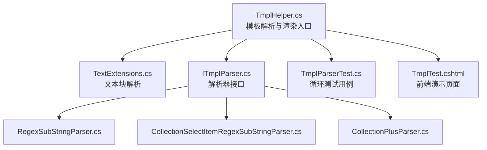
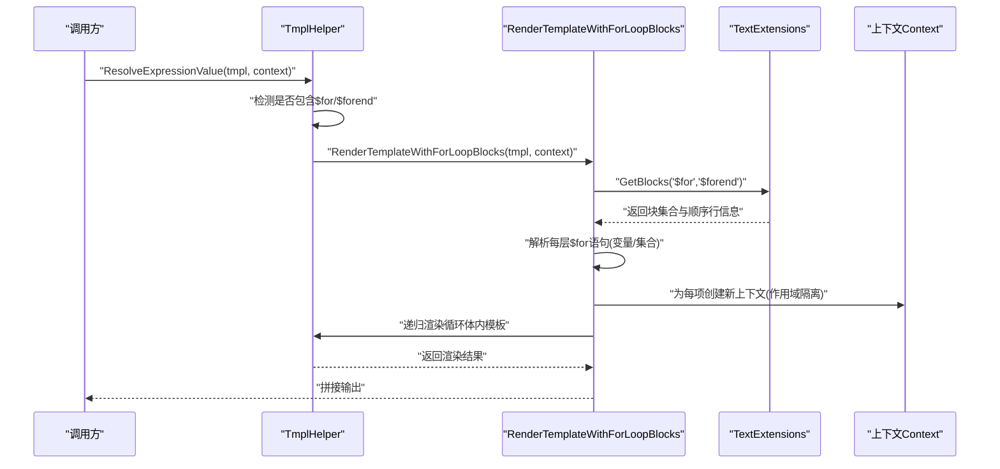
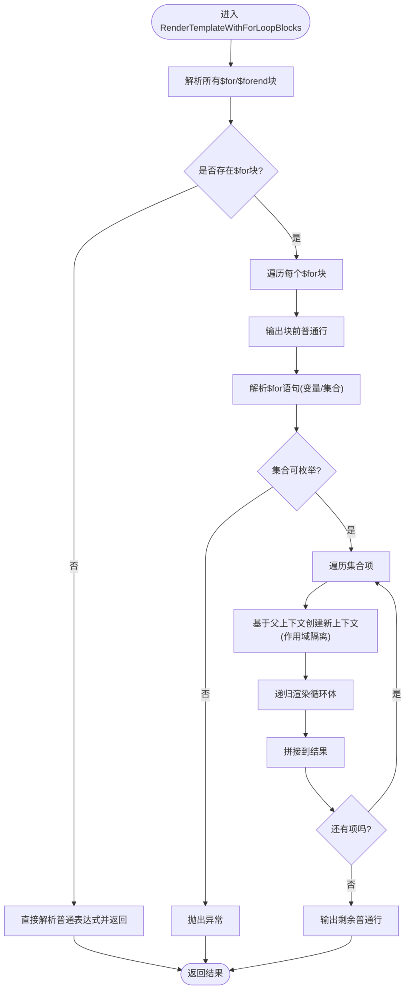
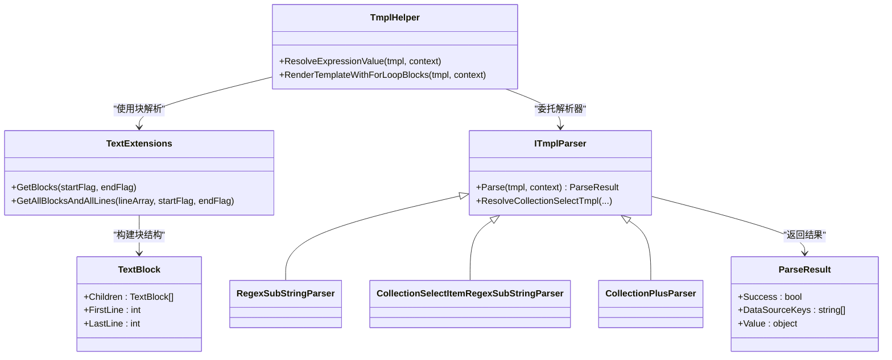

# 循环处理机制

<cite>
**本文档引用的文件**
- [TmplHelper.cs](file://Sylas.RemoteTasks.Utils/Template/TmplHelper.cs)
- [TextExtensions.cs](file://Sylas.RemoteTasks.Utils/Extensions/Text/TextExtensions.cs)
- [TextBlock.cs](file://Sylas.RemoteTasks.Utils/Extensions/Text/TextBlock.cs)
- [ITmplParser.cs](file://Sylas.RemoteTasks.Utils/Template/Parser/ITmplParser.cs)
- [RegexSubStringParser.cs](file://Sylas.RemoteTasks.Utils/Template/Parser/RegexSubStringParser.cs)
- [CollectionSelectItemRegexSubStringParser.cs](file://Sylas.RemoteTasks.Utils/Template/Parser/CollectionSelectItemRegexSubStringParser.cs)
- [CollectionPlusParser.cs](file://Sylas.RemoteTasks.Utils/Template/Parser/CollectionPlusParser.cs)
- [ParseResult.cs](file://Sylas.RemoteTasks.Utils/Template/Parser/ParseResult.cs)
- [TmplParserTest.cs](file://Sylas.RemoteTasks.Test/Tmpl/TmplParserTest.cs)
- [TmplTest.cshtml](file://Sylas.RemoteTasks.App/Views/Hosts/TmplTest.cshtml)
</cite>

## 目录
1. [简介](#简介)
2. [项目结构](#项目结构)
3. [核心组件](#核心组件)
4. [架构总览](#架构总览)
5. [详细组件分析](#详细组件分析)
6. [依赖关系分析](#依赖关系分析)
7. [性能考虑](#性能考虑)
8. [故障排除指南](#故障排除指南)
9. [结论](#结论)
10. [附录](#附录)

## 简介
本文件聚焦于模板系统中的循环处理机制，重点阐述 RenderTemplateWithForLoopBlocks 方法的实现原理与渲染流程，详细说明 $for 循环语法的解析过程（变量声明、集合引用、循环体内容）、嵌套循环的作用域隔离策略、循环上下文的创建与管理、性能优化与内存管理技巧、循环中的条件判断与控制语句、循环与模板表达式的交互机制，并提供调试与错误处理的最佳实践及测试策略。

## 项目结构
围绕循环处理的核心代码位于模板工具模块中，主要涉及：
- 模板解析与渲染入口：TmplHelper.cs
- 文本块解析与嵌套结构识别：TextExtensions.cs、TextBlock.cs
- 模板解析器接口与具体实现：ITmplParser.cs 及其若干解析器
- 测试用例与前端演示页面：TmplParserTest.cs、TmplTest.cshtml

**图表来源**
- [TmplHelper.cs](file://Sylas.RemoteTasks.Utils/Template/TmplHelper.cs#L641-L719)
- [TextExtensions.cs](file://Sylas.RemoteTasks.Utils/Extensions/Text/TextExtensions.cs#L18-L85)
- [ITmplParser.cs](file://Sylas.RemoteTasks.Utils/Template/Parser/ITmplParser.cs#L14-L103)
- [RegexSubStringParser.cs](file://Sylas.RemoteTasks.Utils/Template/Parser/RegexSubStringParser.cs#L11-L37)
- [CollectionSelectItemRegexSubStringParser.cs](file://Sylas.RemoteTasks.Utils/Template/Parser/CollectionSelectItemRegexSubStringParser.cs#L13-L36)
- [CollectionPlusParser.cs](file://Sylas.RemoteTasks.Utils/Template/Parser/CollectionPlusParser.cs#L13-L38)
- [TmplParserTest.cs](file://Sylas.RemoteTasks.Test/Tmpl/TmplParserTest.cs#L353-L401)
- [TmplTest.cshtml](file://Sylas.RemoteTasks.App/Views/Hosts/TmplTest.cshtml#L154-L195)

**章节来源**
- [TmplHelper.cs](file://Sylas.RemoteTasks.Utils/Template/TmplHelper.cs#L641-L719)
- [TextExtensions.cs](file://Sylas.RemoteTasks.Utils/Extensions/Text/TextExtensions.cs#L18-L85)
- [TmplParserTest.cs](file://Sylas.RemoteTasks.Test/Tmpl/TmplParserTest.cs#L353-L401)

## 核心组件
- RenderTemplateWithForLoopBlocks：递归解析并渲染包含 $for/$forend 的模板块，支持嵌套循环与作用域隔离。
- TextExtensions.GetBlocks/GetAllBlocksAndAllLines：解析模板中的块结构，维护嵌套层级与顺序。
- ITmplParser 及其实现：提供正则提取、集合选择、集合拼接等解析能力，支撑循环体内的表达式求值。
- ResolveExpressionValue：统一的表达式解析入口，当检测到模板包含 $for/$forend 时委托给 RenderTemplateWithForLoopBlocks。

**章节来源**
- [TmplHelper.cs](file://Sylas.RemoteTasks.Utils/Template/TmplHelper.cs#L641-L719)
- [TextExtensions.cs](file://Sylas.RemoteTasks.Utils/Extensions/Text/TextExtensions.cs#L18-L85)
- [ITmplParser.cs](file://Sylas.RemoteTasks.Utils/Template/Parser/ITmplParser.cs#L14-L103)

## 架构总览
循环渲染的整体流程如下：

**图表来源**
- [TmplHelper.cs](file://Sylas.RemoteTasks.Utils/Template/TmplHelper.cs#L461-L466)
- [TmplHelper.cs](file://Sylas.RemoteTasks.Utils/Template/TmplHelper.cs#L641-L719)
- [TextExtensions.cs](file://Sylas.RemoteTasks.Utils/Extensions/Text/TextExtensions.cs#L18-L85)

## 详细组件分析

### RenderTemplateWithForLoopBlocks 方法详解
- 功能概述
  - 解析模板中的 $for...$forend 块，提取循环变量与集合引用，遍历集合并对循环体进行递归渲染。
  - 对于嵌套循环，每次进入内层循环都会基于父级上下文创建新的上下文副本，确保作用域隔离。
- 关键步骤
  - 块解析：使用 TextExtensions.GetBlocks 获取所有 $for/$forend 块及其顺序信息。
  - 块内渲染：对每个块，先输出块前的普通行，再解析 $for 语句，获取集合与循环变量。
  - 集合求值：通过 ResolveExpressionValue 对集合变量求值，要求必须为可枚举类型。
  - 作用域隔离：为集合中的每一项创建新的上下文字典，仅包含父级上下文与当前项变量，避免污染父级作用域。
  - 递归渲染：将循环体内容作为模板再次交给 RenderTemplateWithForLoopBlocks 递归处理，从而支持嵌套循环。
  - 结尾输出：渲染完成后输出剩余的普通行。
- 错误处理
  - $for 语法不合法时抛出异常。
  - 集合非可枚举类型时抛出异常。
  - 未找到集合变量时抛出异常。

**图表来源**
- [TmplHelper.cs](file://Sylas.RemoteTasks.Utils/Template/TmplHelper.cs#L641-L719)

**章节来源**
- [TmplHelper.cs](file://Sylas.RemoteTasks.Utils/Template/TmplHelper.cs#L641-L719)

### $for 循环语法解析
- 语法格式
  - $for 变量 in 集合
  - 循环体以 $forend 结束
- 解析细节
  - 变量声明：从 $for 行中提取循环变量名。
  - 集合引用：从 $for 行中提取集合变量名，若未以 $ 开头则自动补全。
  - 集合求值：通过 ResolveExpressionValue 在当前上下文中解析集合变量，要求为可枚举类型。
  - 循环体内容：去除首尾行后，将中间内容作为模板递归渲染。

**章节来源**
- [TmplHelper.cs](file://Sylas.RemoteTasks.Utils/Template/TmplHelper.cs#L668-L685)

### 嵌套循环与作用域隔离
- 嵌套循环
  - RenderTemplateWithForLoopBlocks 对循环体内容再次调用自身，天然支持任意层级嵌套。
- 作用域隔离
  - 每次进入集合项时，复制父级上下文并注入当前项变量，保证不同循环项之间互不影响。
  - 循环变量名可与父级相同，不会发生冲突，因为每次进入循环都会创建新的上下文。

**章节来源**
- [TmplHelper.cs](file://Sylas.RemoteTasks.Utils/Template/TmplHelper.cs#L687-L705)

### 循环上下文的创建与管理
- 创建策略
  - 使用 JSON 序列化/反序列化复制父级上下文，确保深度隔离。
  - 在新上下文中设置循环变量，然后递归渲染循环体。
- 管理策略
  - 仅在循环项级别持有该上下文，循环结束后释放，避免长期占用内存。
  - 集合过大时建议在上游进行分页或限制数量，减少单次渲染压力。

**章节来源**
- [TmplHelper.cs](file://Sylas.RemoteTasks.Utils/Template/TmplHelper.cs#L689-L705)

### 循环与模板表达式的交互
- 表达式解析
  - RenderTemplateWithForLoopBlocks 中的循环体内容由 ResolveExpressionValue 统一解析，支持多种解析器（正则、集合选择、类型转换等）。
- 解析器协作
  - ITmplParser 接口定义了解析规范，具体解析器负责从数据上下文中提取或转换所需值。
  - 解析器结果通过 ParseResult 返回，包含是否成功、依赖的数据源键与最终值。

**章节来源**
- [TmplHelper.cs](file://Sylas.RemoteTasks.Utils/Template/TmplHelper.cs#L461-L585)
- [ITmplParser.cs](file://Sylas.RemoteTasks.Utils/Template/Parser/ITmplParser.cs#L14-L103)
- [RegexSubStringParser.cs](file://Sylas.RemoteTasks.Utils/Template/Parser/RegexSubStringParser.cs#L11-L37)
- [CollectionSelectItemRegexSubStringParser.cs](file://Sylas.RemoteTasks.Utils/Template/Parser/CollectionSelectItemRegexSubStringParser.cs#L13-L36)
- [CollectionPlusParser.cs](file://Sylas.RemoteTasks.Utils/Template/Parser/CollectionPlusParser.cs#L13-L38)

### 条件判断与控制语句
- 条件判断
  - 模板系统未内置显式的 if/else 控制结构；可通过解析器组合实现条件逻辑（例如先用集合选择/正则提取得到候选值，再在模板中按需使用）。
- 控制语句
  - 通过块结构与递归渲染实现“循环展开”；对于“跳过某项”的需求，可在上游过滤集合或在循环体内部根据表达式决定是否输出。

**章节来源**
- [ITmplParser.cs](file://Sylas.RemoteTasks.Utils/Template/Parser/ITmplParser.cs#L39-L102)

### 文本块解析与嵌套结构
- TextExtensions 提供块解析能力，能够识别 $for/$forend 标识，维护嵌套层级与顺序行信息。
- TextBlock 记录块的起止行索引与子块列表，便于后续按序渲染。

**章节来源**
- [TextExtensions.cs](file://Sylas.RemoteTasks.Utils/Extensions/Text/TextExtensions.cs#L18-L85)
- [TextBlock.cs](file://Sylas.RemoteTasks.Utils/Extensions/Text/TextBlock.cs#L1-L32)

## 依赖关系分析

**图表来源**
- [TmplHelper.cs](file://Sylas.RemoteTasks.Utils/Template/TmplHelper.cs#L641-L719)
- [TextExtensions.cs](file://Sylas.RemoteTasks.Utils/Extensions/Text/TextExtensions.cs#L18-L85)
- [TextBlock.cs](file://Sylas.RemoteTasks.Utils/Extensions/Text/TextBlock.cs#L1-L32)
- [ITmplParser.cs](file://Sylas.RemoteTasks.Utils/Template/Parser/ITmplParser.cs#L14-L103)
- [RegexSubStringParser.cs](file://Sylas.RemoteTasks.Utils/Template/Parser/RegexSubStringParser.cs#L11-L37)
- [CollectionSelectItemRegexSubStringParser.cs](file://Sylas.RemoteTasks.Utils/Template/Parser/CollectionSelectItemRegexSubStringParser.cs#L13-L36)
- [CollectionPlusParser.cs](file://Sylas.RemoteTasks.Utils/Template/Parser/CollectionPlusParser.cs#L13-L38)
- [ParseResult.cs](file://Sylas.RemoteTasks.Utils/Template/Parser/ParseResult.cs#L1-L41)

**章节来源**
- [TmplHelper.cs](file://Sylas.RemoteTasks.Utils/Template/TmplHelper.cs#L641-L719)
- [ITmplParser.cs](file://Sylas.RemoteTasks.Utils/Template/Parser/ITmplParser.cs#L14-L103)

## 性能考虑
- 集合大小控制
  - 在上游对集合进行分页或限制数量，避免一次性渲染过多项导致内存与时间开销激增。
- 上下文复制成本
  - 每项渲染均进行上下文深拷贝，建议控制循环层数与每层集合规模。
- 表达式解析优化
  - 将重复使用的表达式结果缓存至数据上下文，减少重复计算。
- 渲染策略
  - 对于超大模板，优先拆分为小块，减少单次解析与渲染的复杂度。

[本节为通用指导，无需特定文件引用]

## 故障排除指南
- 常见错误与定位
  - “无法解析 $for 语句”：检查 $for 行格式是否符合“$for 变量 in 集合”。
  - “变量不是可枚举类型”：确认集合变量在上下文中存在且为可枚举类型。
  - “for 循环不足三行”：确认 $for 与 $forend 成对出现。
- 调试建议
  - 使用前端演示页面 TmplTest.cshtml 输入模板与数据，逐步验证循环渲染结果。
  - 在测试用例中构造最小可复现场景，定位问题出现在集合求值还是循环体渲染阶段。
- 最佳实践
  - 在上游对集合进行预处理，确保数据类型一致。
  - 对关键表达式使用解析器组合，提前完成过滤与转换。

**章节来源**
- [TmplHelper.cs](file://Sylas.RemoteTasks.Utils/Template/TmplHelper.cs#L668-L682)
- [TmplParserTest.cs](file://Sylas.RemoteTasks.Test/Tmpl/TmplParserTest.cs#L353-L401)
- [TmplTest.cshtml](file://Sylas.RemoteTasks.App/Views/Hosts/TmplTest.cshtml#L154-L195)

## 结论
该循环处理机制通过块解析与递归渲染实现了对 $for/$forend 的完整支持，具备良好的嵌套能力与作用域隔离策略。配合 ITmplParser 生态，循环体内的表达式解析能力得到充分扩展。在实际应用中，应关注集合规模与上下文复制的成本，结合测试用例与前端演示页面进行验证与调试，以获得稳定高效的渲染效果。

[本节为总结性内容，无需特定文件引用]

## 附录

### 测试策略与验证方法
- 单元测试
  - 使用 TmplParserTest 中的 TemplateForLoopTest 验证嵌套循环与多集合渲染的正确性。
- 端到端验证
  - 使用 TmplTest.cshtml 页面输入模板与数据，点击按钮触发渲染，观察输出结果。
- 边界与异常测试
  - 构造空集合、非可枚举集合、语法错误等场景，验证异常抛出与错误提示。

**章节来源**
- [TmplParserTest.cs](file://Sylas.RemoteTasks.Test/Tmpl/TmplParserTest.cs#L353-L401)
- [TmplTest.cshtml](file://Sylas.RemoteTasks.App/Views/Hosts/TmplTest.cshtml#L154-L195)