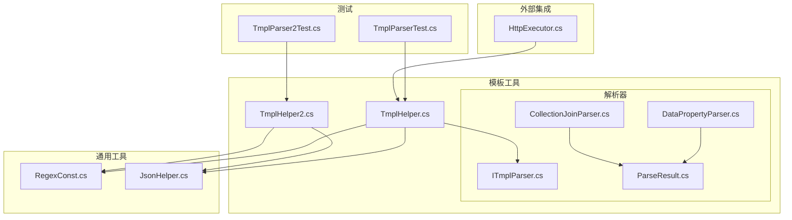
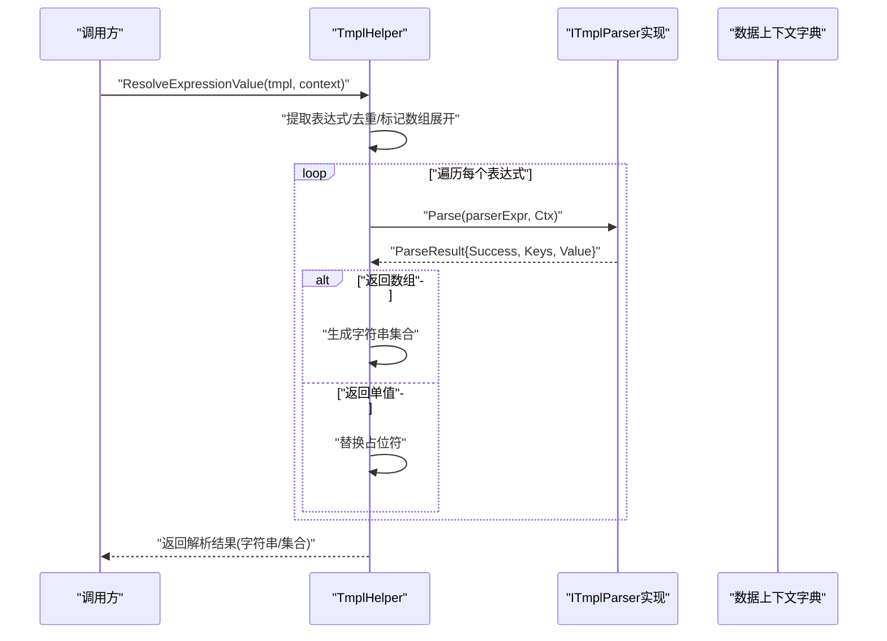
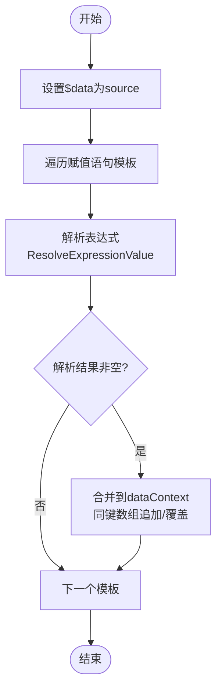
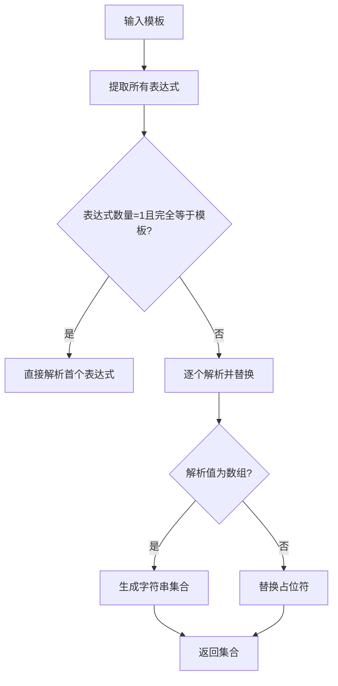
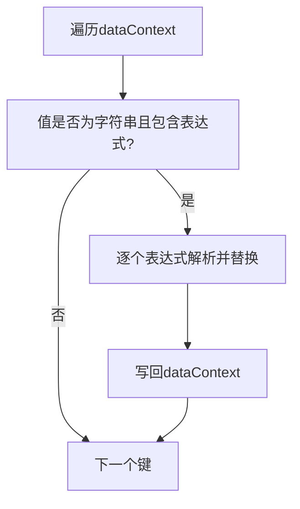
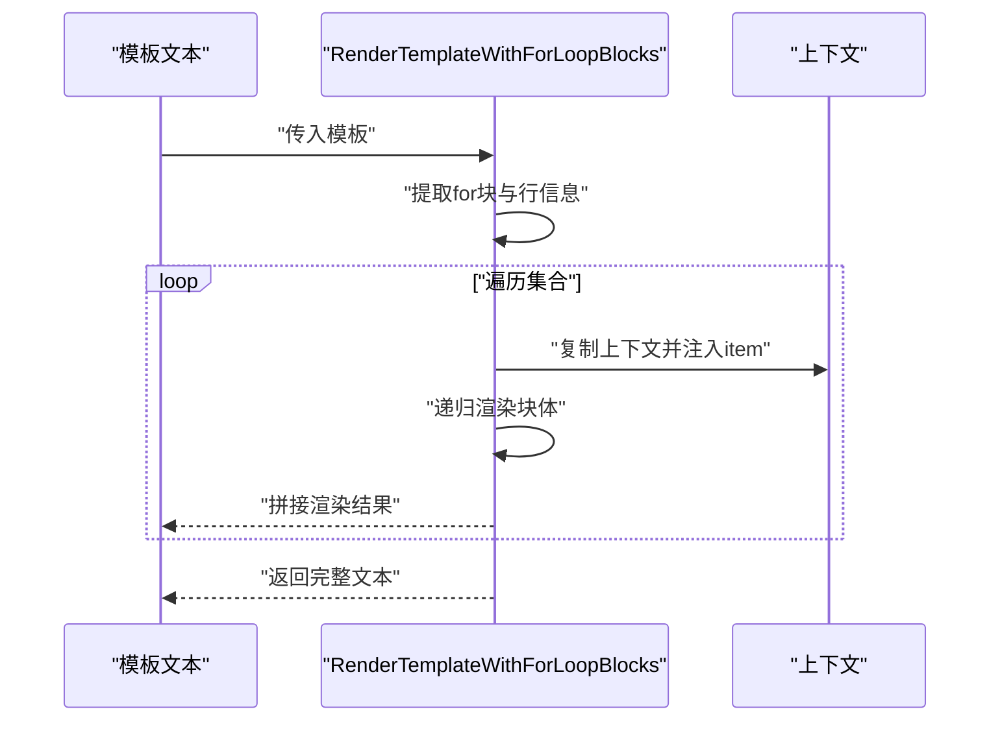
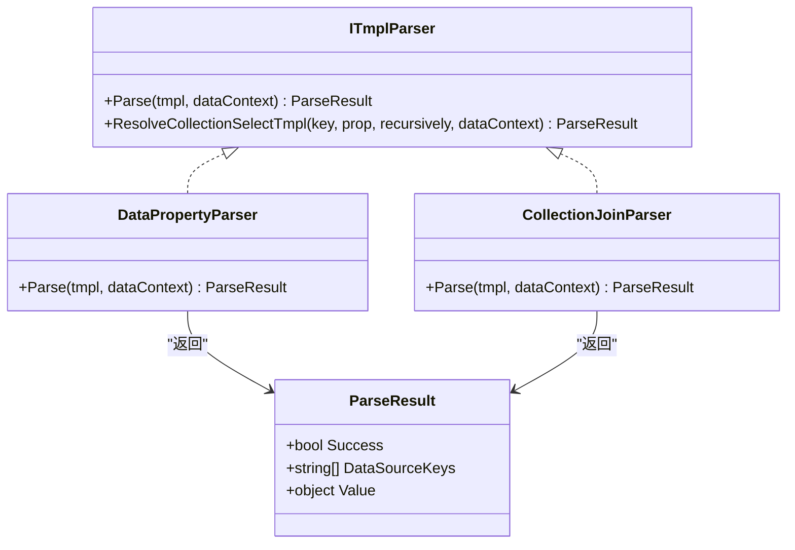
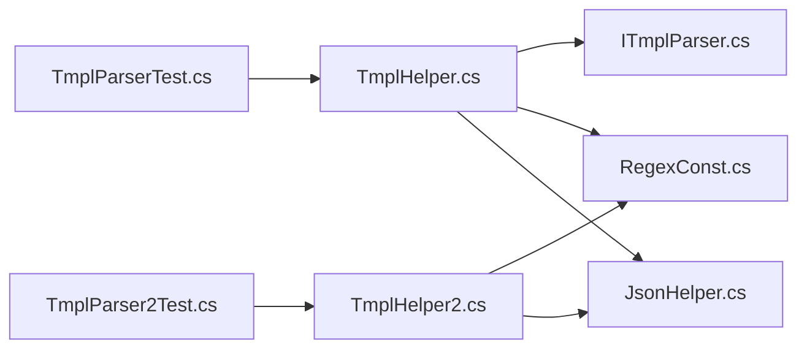

# 模板上下文管理

<cite>
**本文档引用的文件**
- [TmplHelper.cs](file://Sylas.RemoteTasks.Utils/Template/TmplHelper.cs)
- [TmplHelper2.cs](file://Sylas.RemoteTasks.Utils/Template/TmplHelper2.cs)
- [ITmplParser.cs](file://Sylas.RemoteTasks.Utils/Template/Parser/ITmplParser.cs)
- [DataPropertyParser.cs](file://Sylas.RemoteTasks.Utils/Template/Parser/DataPropertyParser.cs)
- [CollectionJoinParser.cs](file://Sylas.RemoteTasks.Utils/Template/Parser/CollectionJoinParser.cs)
- [ParseResult.cs](file://Sylas.RemoteTasks.Utils/Template/Parser/ParseResult.cs)
- [RegexConst.cs](file://Sylas.RemoteTasks.Common/RegexConst.cs)
- [JsonHelper.cs](file://Sylas.RemoteTasks.Common/JsonHelper.cs)
- [HttpExecutor.cs](file://Sylas.RemoteTasks.Utils/CommandExecutor/HttpExecutor.cs)
- [TmplParser2Test.cs](file://Sylas.RemoteTasks.Test/Tmpl/TmplParser2Test.cs)
- [TmplParserTest.cs](file://Sylas.RemoteTasks.Test/Tmpl/TmplParserTest.cs)
</cite>

## 目录
1. [简介](#简介)
2. [项目结构](#项目结构)
3. [核心组件](#核心组件)
4. [架构总览](#架构总览)
5. [详细组件分析](#详细组件分析)
6. [依赖关系分析](#依赖关系分析)
7. [性能考虑](#性能考虑)
8. [故障排查指南](#故障排查指南)
9. [结论](#结论)
10. [附录](#附录)

## 简介
本文件围绕模板上下文管理展开，系统性阐述以下主题：
- BuildDataContextBySource 方法的实现原理与数据上下文构建流程
- 模板表达式的解析过程与变量赋值机制
- ResolveSelfTmplValues 方法的自引用模板解析能力
- 数据上下文的生命周期管理与内存优化策略
- 模板变量的作用域规则与命名约定
- 上下文数据的序列化与反序列化处理
- 与外部数据源的集成方式与数据绑定技术
- 上下文调试与日志记录的最佳实践

## 项目结构
模板上下文相关代码主要位于 Utils 模块的 Template 命名空间下，并辅以通用的正则常量、JSON 工具与测试用例。

**图表来源**
- [TmplHelper.cs](file://Sylas.RemoteTasks.Utils/Template/TmplHelper.cs#L1-L740)
- [TmplHelper2.cs](file://Sylas.RemoteTasks.Utils/Template/TmplHelper2.cs#L1-L416)
- [ITmplParser.cs](file://Sylas.RemoteTasks.Utils/Template/Parser/ITmplParser.cs#L1-L105)
- [DataPropertyParser.cs](file://Sylas.RemoteTasks.Utils/Template/Parser/DataPropertyParser.cs#L1-L145)
- [CollectionJoinParser.cs](file://Sylas.RemoteTasks.Utils/Template/Parser/CollectionJoinParser.cs#L1-L72)
- [ParseResult.cs](file://Sylas.RemoteTasks.Utils/Template/Parser/ParseResult.cs#L1-L42)
- [RegexConst.cs](file://Sylas.RemoteTasks.Common/RegexConst.cs#L146-L160)
- [JsonHelper.cs](file://Sylas.RemoteTasks.Common/JsonHelper.cs#L105-L118)
- [TmplParser2Test.cs](file://Sylas.RemoteTasks.Test/Tmpl/TmplParser2Test.cs#L193-L224)
- [TmplParserTest.cs](file://Sylas.RemoteTasks.Test/Tmpl/TmplParserTest.cs#L206-L212)
- [HttpExecutor.cs](file://Sylas.RemoteTasks.Utils/CommandExecutor/HttpExecutor.cs#L206-L224)

**章节来源**
- [TmplHelper.cs](file://Sylas.RemoteTasks.Utils/Template/TmplHelper.cs#L1-L740)
- [TmplHelper2.cs](file://Sylas.RemoteTasks.Utils/Template/TmplHelper2.cs#L1-L416)

## 核心组件
- 模板解析主入口：TmplHelper.ResolveExpressionValue
- 上下文构建：TmplHelper.BuildDataContextBySource
- 自引用解析：TmplHelper.ResolveSelfTmplValues
- 模板渲染（带 for 循环）：TmplHelper.RenderTemplateWithForLoopBlocks
- 模板解析器接口与实现：ITmplParser、DataPropertyParser、CollectionJoinParser
- 表达式抽取：TmplHelper.TryGetExpressions、TmplHelper2.TryGetExpressions
- 正则常量：RegexConst.StringTmpl
- JSON 辅助：JsonHelper、JObject/JToken 转换

**章节来源**
- [TmplHelper.cs](file://Sylas.RemoteTasks.Utils/Template/TmplHelper.cs#L461-L634)
- [TmplHelper.cs](file://Sylas.RemoteTasks.Utils/Template/TmplHelper.cs#L213-L271)
- [TmplHelper.cs](file://Sylas.RemoteTasks.Utils/Template/TmplHelper.cs#L314-L328)
- [TmplHelper.cs](file://Sylas.RemoteTasks.Utils/Template/TmplHelper.cs#L641-L719)
- [ITmplParser.cs](file://Sylas.RemoteTasks.Utils/Template/Parser/ITmplParser.cs#L20-L29)
- [DataPropertyParser.cs](file://Sylas.RemoteTasks.Utils/Template/Parser/DataPropertyParser.cs#L25-L142)
- [CollectionJoinParser.cs](file://Sylas.RemoteTasks.Utils/Template/Parser/CollectionJoinParser.cs#L22-L69)
- [RegexConst.cs](file://Sylas.RemoteTasks.Common/RegexConst.cs#L146-L160)
- [JsonHelper.cs](file://Sylas.RemoteTasks.Common/JsonHelper.cs#L105-L118)

## 架构总览
模板上下文管理采用“表达式解析 + 解析器插件 + 上下文字典”的分层架构：
- 表达式层：统一识别模板占位符，支持单值与数组展开
- 解析器层：按解析器名称动态加载并执行，返回 ParseResult
- 上下文层：以字典形式承载数据，支持自引用解析与增量赋值
- 渲染层：支持 for 循环块与嵌套上下文，保证作用域隔离

**图表来源**
- [TmplHelper.cs](file://Sylas.RemoteTasks.Utils/Template/TmplHelper.cs#L461-L585)
- [ITmplParser.cs](file://Sylas.RemoteTasks.Utils/Template/Parser/ITmplParser.cs#L20-L29)
- [DataPropertyParser.cs](file://Sylas.RemoteTasks.Utils/Template/Parser/DataPropertyParser.cs#L25-L142)
- [CollectionJoinParser.cs](file://Sylas.RemoteTasks.Utils/Template/Parser/CollectionJoinParser.cs#L22-L69)

## 详细组件分析

### BuildDataContextBySource：数据上下文构建流程
该方法负责将外部 source 与一组“赋值语句模板”合并到 dataContext 中，形成可用于后续模板渲染的上下文。

关键步骤：
- 将 source 缓存到 dataContext["$data"]，确保模板可访问原始数据
- 遍历 dataContextBuilderTmpls，逐条解析表达式并写回 dataContext
- 支持数组追加与同键覆盖策略，避免丢失历史值
- 记录解析详情与调试日志

**图表来源**
- [TmplHelper.cs](file://Sylas.RemoteTasks.Utils/Template/TmplHelper.cs#L213-L271)

**章节来源**
- [TmplHelper.cs](file://Sylas.RemoteTasks.Utils/Template/TmplHelper.cs#L213-L271)

### 模板表达式解析与变量赋值机制
- 表达式识别：通过 RegexConst.StringTmpl 统一匹配 $var、${var}、{{var}} 等形式
- 解析顺序：先去重，再按顺序替换；若任一表达式解析为数组，则整模板展开为字符串集合
- 数组展开：当解析值为可枚举集合时，对集合中每个元素生成一个替换后的字符串
- 单值替换：将表达式替换为其解析值，支持 JsonElement 与字符串类型

**图表来源**
- [TmplHelper.cs](file://Sylas.RemoteTasks.Utils/Template/TmplHelper.cs#L480-L585)
- [RegexConst.cs](file://Sylas.RemoteTasks.Common/RegexConst.cs#L146-L160)

**章节来源**
- [TmplHelper.cs](file://Sylas.RemoteTasks.Utils/Template/TmplHelper.cs#L461-L585)
- [RegexConst.cs](file://Sylas.RemoteTasks.Common/RegexConst.cs#L146-L160)

### ResolveSelfTmplValues：自引用模板解析
该方法允许 dataContext 中的字符串值引用上下文中已存在的变量，实现“先占位后补全”的自解析。

工作流程：
- 遍历 dataContext 中的键值对
- 若值为字符串，抽取其中的模板表达式
- 对每个表达式再次解析并替换，直至无可用表达式

**图表来源**
- [TmplHelper.cs](file://Sylas.RemoteTasks.Utils/Template/TmplHelper.cs#L314-L328)

**章节来源**
- [TmplHelper.cs](file://Sylas.RemoteTasks.Utils/Template/TmplHelper.cs#L314-L328)

### 模板渲染与 for 循环：RenderTemplateWithForLoopBlocks
支持块级 for 循环，自动识别 $for ... $forend 块，按集合项逐一渲染，并为每项生成独立上下文，避免作用域污染。

要点：
- 提取 for 块与行信息，按块渲染
- 为每次迭代创建新上下文，包含 item 变量
- 支持嵌套循环，内层循环不影响外层上下文

**图表来源**
- [TmplHelper.cs](file://Sylas.RemoteTasks.Utils/Template/TmplHelper.cs#L641-L719)

**章节来源**
- [TmplHelper.cs](file://Sylas.RemoteTasks.Utils/Template/TmplHelper.cs#L641-L719)

### 解析器体系：ITmplParser 与实现
- ITmplParser：定义 Parse 接口与集合 Select 工具方法
- DataPropertyParser：解析对象属性、索引与多级路径
- CollectionJoinParser：将集合按分隔符连接为字符串
- ParseResult：封装解析结果与数据源键列表

**图表来源**
- [ITmplParser.cs](file://Sylas.RemoteTasks.Utils/Template/Parser/ITmplParser.cs#L20-L103)
- [DataPropertyParser.cs](file://Sylas.RemoteTasks.Utils/Template/Parser/DataPropertyParser.cs#L25-L142)
- [CollectionJoinParser.cs](file://Sylas.RemoteTasks.Utils/Template/Parser/CollectionJoinParser.cs#L22-L69)
- [ParseResult.cs](file://Sylas.RemoteTasks.Utils/Template/Parser/ParseResult.cs#L6-L41)

**章节来源**
- [ITmplParser.cs](file://Sylas.RemoteTasks.Utils/Template/Parser/ITmplParser.cs#L20-L103)
- [DataPropertyParser.cs](file://Sylas.RemoteTasks.Utils/Template/Parser/DataPropertyParser.cs#L25-L142)
- [CollectionJoinParser.cs](file://Sylas.RemoteTasks.Utils/Template/Parser/CollectionJoinParser.cs#L22-L69)
- [ParseResult.cs](file://Sylas.RemoteTasks.Utils/Template/Parser/ParseResult.cs#L6-L41)

### 与外部数据源的集成与数据绑定
- HTTP 执行器中通过上下文变量动态获取目标数据与连接信息，体现“上下文驱动”的数据绑定思想
- 测试用例展示了数组上下文与模板渲染的联动效果

**章节来源**
- [HttpExecutor.cs](file://Sylas.RemoteTasks.Utils/CommandExecutor/HttpExecutor.cs#L206-L224)
- [TmplParser2Test.cs](file://Sylas.RemoteTasks.Test/Tmpl/TmplParser2Test.cs#L193-L224)
- [TmplParserTest.cs](file://Sylas.RemoteTasks.Test/Tmpl/TmplParserTest.cs#L206-L212)

## 依赖关系分析
- TmplHelper 依赖 ITmplParser 插件体系、RegexConst 正则常量与 JsonHelper JSON 工具
- TmplHelper2 提供更简洁的表达式解析与 for 循环支持，内部同样依赖 JToken 转换
- 测试用例验证了两种模板解析器的行为一致性

**图表来源**
- [TmplHelper.cs](file://Sylas.RemoteTasks.Utils/Template/TmplHelper.cs#L1-L740)
- [TmplHelper2.cs](file://Sylas.RemoteTasks.Utils/Template/TmplHelper2.cs#L1-L416)
- [ITmplParser.cs](file://Sylas.RemoteTasks.Utils/Template/Parser/ITmplParser.cs#L1-L105)
- [RegexConst.cs](file://Sylas.RemoteTasks.Common/RegexConst.cs#L146-L160)
- [JsonHelper.cs](file://Sylas.RemoteTasks.Common/JsonHelper.cs#L105-L118)
- [TmplParser2Test.cs](file://Sylas.RemoteTasks.Test/Tmpl/TmplParser2Test.cs#L193-L224)
- [TmplParserTest.cs](file://Sylas.RemoteTasks.Test/Tmpl/TmplParserTest.cs#L206-L212)

**章节来源**
- [TmplHelper.cs](file://Sylas.RemoteTasks.Utils/Template/TmplHelper.cs#L1-L740)
- [TmplHelper2.cs](file://Sylas.RemoteTasks.Utils/Template/TmplHelper2.cs#L1-L416)

## 性能考虑
- 表达式去重：同一模板中重复表达式仅解析一次，减少重复计算
- 数组展开：仅在必要时生成字符串集合，避免不必要的内存分配
- 解析器缓存：TmplHelper 内部维护解析器实例映射，避免反射开销
- JSON 类型处理：优先使用 JsonElement/JsonArray，减少中间对象转换
- 上下文复制：for 循环块渲染时复制上下文，避免全局状态污染

[本节为通用性能建议，不直接分析具体文件]

## 故障排查指南
- 表达式未解析：检查 dataContext 中是否存在对应键，确认表达式语法与大小写
- 数组越界：检查集合索引与实际长度，确保 select/selectr 等操作的输入类型
- for 循环异常：确认 $for 与 $forend 成对出现，集合可迭代
- 日志辅助：利用 TmplHelper.LogTmplResolving 记录上下文与解析详情，便于定位问题

**章节来源**
- [TmplHelper.cs](file://Sylas.RemoteTasks.Utils/Template/TmplHelper.cs#L273-L307)
- [TmplHelper.cs](file://Sylas.RemoteTasks.Utils/Template/TmplHelper.cs#L384-L442)

## 结论
模板上下文管理通过“表达式解析 + 插件化解析器 + 字典上下文”的设计，实现了灵活、可扩展且高性能的模板渲染能力。BuildDataContextBySource 提供了从原始数据到可渲染上下文的桥梁；ResolveSelfTmplValues 支持自引用解析；RenderTemplateWithForLoopBlocks 保障了复杂场景下的作用域隔离与嵌套支持。结合正则与 JSON 工具，系统在易用性与性能之间取得良好平衡。

[本节为总结性内容，不直接分析具体文件]

## 附录

### 数据上下文生命周期与内存优化
- 生命周期：上下文通常在请求/任务范围内创建与销毁，避免跨请求共享
- 内存优化：尽量保持上下文键值为轻量类型；对大集合优先使用枚举而非复制；及时释放临时上下文

[本节为通用指导，不直接分析具体文件]

### 模板变量作用域与命名约定
- 作用域：for 循环块内新增的 item 变量仅在该块内有效，嵌套循环互不干扰
- 命名约定：键名以 $ 开头标识上下文变量；表达式支持 $var、${var}、{{var}} 三种形式

**章节来源**
- [TmplHelper.cs](file://Sylas.RemoteTasks.Utils/Template/TmplHelper.cs#L689-L705)
- [RegexConst.cs](file://Sylas.RemoteTasks.Common/RegexConst.cs#L146-L160)

### 序列化与反序列化处理
- 字典与对象互转：通过 JObject.FromObject 与 ToObject 完成上下文对象的序列化/反序列化
- JSON 元素处理：优先使用 JsonElement/JsonArray，避免中间对象的重复装箱拆箱

**章节来源**
- [TmplHelper.cs](file://Sylas.RemoteTasks.Utils/Template/TmplHelper.cs#L346-L353)
- [JsonHelper.cs](file://Sylas.RemoteTasks.Common/JsonHelper.cs#L105-L118)