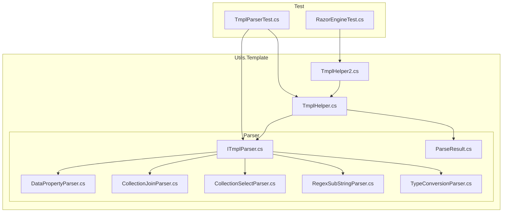
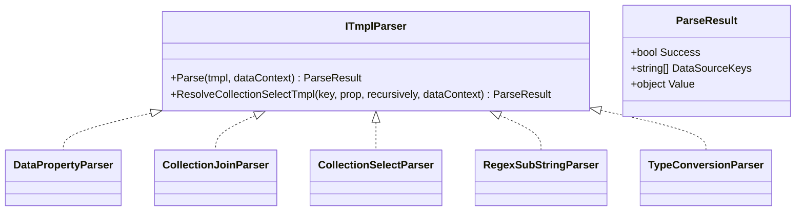
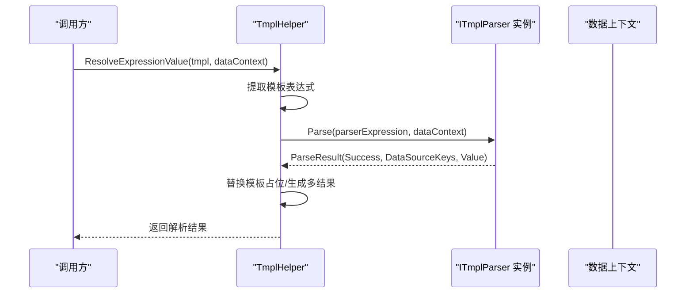
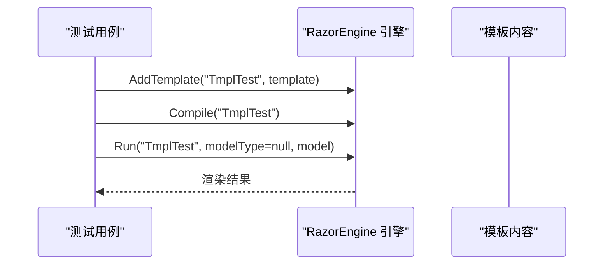
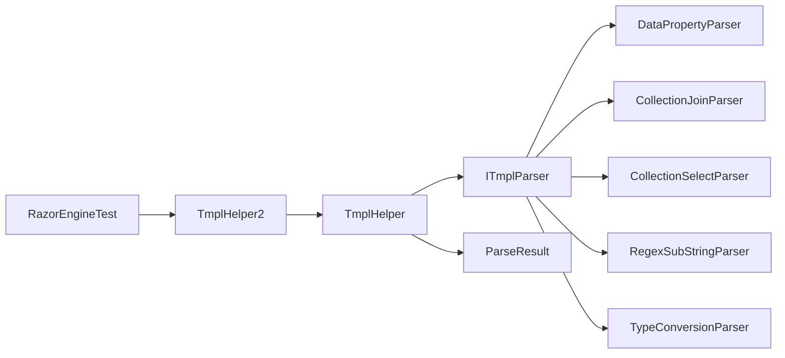

# 模板引擎系统

<cite>
**本文引用的文件**
- [ITmplParser.cs](file://Sylas.RemoteTasks.Utils/Template/Parser/ITmplParser.cs)
- [ParseResult.cs](file://Sylas.RemoteTasks.Utils/Template/Parser/ParseResult.cs)
- [DataPropertyParser.cs](file://Sylas.RemoteTasks.Utils/Template/Parser/DataPropertyParser.cs)
- [CollectionJoinParser.cs](file://Sylas.RemoteTasks.Utils/Template/Parser/CollectionJoinParser.cs)
- [CollectionSelectParser.cs](file://Sylas.RemoteTasks.Utils/Template/Parser/CollectionSelectParser.cs)
- [RegexSubStringParser.cs](file://Sylas.RemoteTasks.Utils/Template/Parser/RegexSubStringParser.cs)
- [TypeConversionParser.cs](file://Sylas.RemoteTasks.Utils/Template/Parser/TypeConversionParser.cs)
- [TmplHelper.cs](file://Sylas.RemoteTasks.Utils/Template/TmplHelper.cs)
- [TmplHelper2.cs](file://Sylas.RemoteTasks.Utils/Template/TmplHelper2.cs)
- [RazorEngineTest.cs](file://Sylas.RemoteTasks.Test/Tmpl/RazorEngineTest.cs)
- [TmplParserTest.cs](file://Sylas.RemoteTasks.Test/Tmpl/TmplParserTest.cs)
</cite>

## 目录
1. [简介](#简介)
2. [项目结构](#项目结构)
3. [核心组件](#核心组件)
4. [架构总览](#架构总览)
5. [详细组件分析](#详细组件分析)
6. [依赖关系分析](#依赖关系分析)
7. [性能考虑](#性能考虑)
8. [故障排查指南](#故障排查指南)
9. [结论](#结论)
10. [附录：语法与示例](#附录语法与示例)

## 简介
本文件面向模板引擎系统，系统由两部分构成：
- 自研模板解析器（基于接口 ITmplParser 的多实现解析器）与上下文驱动的表达式求值；
- RazorEngine 集成（用于服务端视图渲染与动态内容生成）。

文档目标：
- 深入解释 RazorEngine 的集成方式与配置要点；
- 详述模板解析器架构的设计理念、扩展机制与实现规范；
- 文档化 ITmplParser 接口的实现要求与解析策略；
- 解释 ParseResult 的数据结构与处理流程；
- 提供模板语法示例与数据绑定方法；
- 包含模板缓存机制、性能优化策略与错误处理；
- 解释与请求处理器的集成方式与动态内容生成技术；
- 提供自定义解析器开发指南与最佳实践。

## 项目结构
模板引擎相关代码主要位于 Utils 工程下的 Template 与 Template/Parser 子目录，并配套测试工程中的 TmplParserTest 与 RazorEngineTest。

图表来源
- [TmplHelper.cs](file://Sylas.RemoteTasks.Utils/Template/TmplHelper.cs#L1-L740)
- [TmplHelper2.cs](file://Sylas.RemoteTasks.Utils/Template/TmplHelper2.cs#L1-L416)
- [ITmplParser.cs](file://Sylas.RemoteTasks.Utils/Template/Parser/ITmplParser.cs#L1-L105)
- [ParseResult.cs](file://Sylas.RemoteTasks.Utils/Template/Parser/ParseResult.cs#L1-L42)
- [DataPropertyParser.cs](file://Sylas.RemoteTasks.Utils/Template/Parser/DataPropertyParser.cs#L1-L145)
- [CollectionJoinParser.cs](file://Sylas.RemoteTasks.Utils/Template/Parser/CollectionJoinParser.cs#L1-L72)
- [CollectionSelectParser.cs](file://Sylas.RemoteTasks.Utils/Template/Parser/CollectionSelectParser.cs#L1-L33)
- [RegexSubStringParser.cs](file://Sylas.RemoteTasks.Utils/Template/Parser/RegexSubStringParser.cs#L1-L39)
- [TypeConversionParser.cs](file://Sylas.RemoteTasks.Utils/Template/Parser/TypeConversionParser.cs#L1-L102)
- [TmplParserTest.cs](file://Sylas.RemoteTasks.Test/Tmpl/TmplParserTest.cs#L1-L425)
- [RazorEngineTest.cs](file://Sylas.RemoteTasks.Test/Tmpl/RazorEngineTest.cs#L1-L90)

章节来源
- [TmplHelper.cs](file://Sylas.RemoteTasks.Utils/Template/TmplHelper.cs#L1-L740)
- [TmplHelper2.cs](file://Sylas.RemoteTasks.Utils/Template/TmplHelper2.cs#L1-L416)
- [ITmplParser.cs](file://Sylas.RemoteTasks.Utils/Template/Parser/ITmplParser.cs#L1-L105)
- [ParseResult.cs](file://Sylas.RemoteTasks.Utils/Template/Parser/ParseResult.cs#L1-L42)

## 核心组件
- 自研模板解析器体系
  - ITmplParser：统一解析接口，定义 Parse 方法与集合 Select 工具静态方法；
  - ParseResult：封装解析结果（Success、DataSourceKeys、Value）；
  - 多种解析器实现：DataPropertyParser、CollectionJoinParser、CollectionSelectParser、RegexSubStringParser、TypeConversionParser。
- 上下文驱动的表达式求值与模板渲染
  - TmplHelper：负责表达式解析、for 循环块渲染、上下文构建与日志记录；
  - TmplHelper2：提供更简洁的表达式解析、管道提取与 for 循环解析能力；
- RazorEngine 集成
  - 测试用例展示如何注册模板、编译与运行，支持匿名对象与 ExpandoObject 模型。

章节来源
- [ITmplParser.cs](file://Sylas.RemoteTasks.Utils/Template/Parser/ITmplParser.cs#L1-L105)
- [ParseResult.cs](file://Sylas.RemoteTasks.Utils/Template/Parser/ParseResult.cs#L1-L42)
- [DataPropertyParser.cs](file://Sylas.RemoteTasks.Utils/Template/Parser/DataPropertyParser.cs#L1-L145)
- [CollectionJoinParser.cs](file://Sylas.RemoteTasks.Utils/Template/Parser/CollectionJoinParser.cs#L1-L72)
- [CollectionSelectParser.cs](file://Sylas.RemoteTasks.Utils/Template/Parser/CollectionSelectParser.cs#L1-L33)
- [RegexSubStringParser.cs](file://Sylas.RemoteTasks.Utils/Template/Parser/RegexSubStringParser.cs#L1-L39)
- [TypeConversionParser.cs](file://Sylas.RemoteTasks.Utils/Template/Parser/TypeConversionParser.cs#L1-L102)
- [TmplHelper.cs](file://Sylas.RemoteTasks.Utils/Template/TmplHelper.cs#L1-L740)
- [TmplHelper2.cs](file://Sylas.RemoteTasks.Utils/Template/TmplHelper2.cs#L1-L416)
- [RazorEngineTest.cs](file://Sylas.RemoteTasks.Test/Tmpl/RazorEngineTest.cs#L1-L90)

## 架构总览
系统采用“接口 + 多实现”的解析器架构，结合上下文字典驱动的表达式求值，支持：
- 属性路径解析、集合索引访问、集合属性选择、字符串正则截取、JSON 字符串类型转换；
- for 循环块渲染与嵌套循环；
- 模板缓存（RazorEngine）与解析器实例缓存（按解析器类型名）。

图表来源
- [ITmplParser.cs](file://Sylas.RemoteTasks.Utils/Template/Parser/ITmplParser.cs#L1-L105)
- [ParseResult.cs](file://Sylas.RemoteTasks.Utils/Template/Parser/ParseResult.cs#L1-L42)
- [DataPropertyParser.cs](file://Sylas.RemoteTasks.Utils/Template/Parser/DataPropertyParser.cs#L1-L145)
- [CollectionJoinParser.cs](file://Sylas.RemoteTasks.Utils/Template/Parser/CollectionJoinParser.cs#L1-L72)
- [CollectionSelectParser.cs](file://Sylas.RemoteTasks.Utils/Template/Parser/CollectionSelectParser.cs#L1-L33)
- [RegexSubStringParser.cs](file://Sylas.RemoteTasks.Utils/Template/Parser/RegexSubStringParser.cs#L1-L39)
- [TypeConversionParser.cs](file://Sylas.RemoteTasks.Utils/Template/Parser/TypeConversionParser.cs#L1-L102)

## 详细组件分析

### ITmplParser 接口与扩展机制
- 设计理念
  - 统一解析入口，便于扩展新解析器；
  - 解析器通过正则表达式解析模板片段，返回 ParseResult；
  - 提供集合 Select 的通用工具方法，减少重复实现。
- 扩展机制
  - 新增解析器需实现 Parse 方法；
  - 解析器实例按类型名缓存，避免重复反射创建；
  - 解析器可声明性地从上下文提取所需数据键（DataSourceKeys），便于调试与追踪。

章节来源
- [ITmplParser.cs](file://Sylas.RemoteTasks.Utils/Template/Parser/ITmplParser.cs#L1-L105)
- [TmplHelper.cs](file://Sylas.RemoteTasks.Utils/Template/TmplHelper.cs#L588-L634)

### ParseResult 数据结构与处理流程
- 字段
  - Success：解析是否成功；
  - DataSourceKeys：解析过程中引用的上下文键集合；
  - Value：解析结果值（可为标量、集合、JToken 等）。
- 处理流程
  - 解析器返回 ParseResult；
  - 上下文解析器根据 Success 与 Value 决定是否替换模板占位；
  - 若未返回 DataSourceKeys，抛出异常提示缺少数据源键。

章节来源
- [ParseResult.cs](file://Sylas.RemoteTasks.Utils/Template/Parser/ParseResult.cs#L1-L42)
- [TmplHelper.cs](file://Sylas.RemoteTasks.Utils/Template/TmplHelper.cs#L608-L633)

### DataPropertyParser：属性路径解析
- 功能
  - 支持键索引访问（如 $data[0]）、属性链访问（如 .name）；
  - 支持 JsonElement、JObject、IEnumerable 等多种数据形态；
  - 返回字符串、数值或完整对象，依据属性类型自动转换。
- 错误处理
  - 未找到键或属性时抛出异常；
  - 数组越界或类型不匹配时抛出异常。

章节来源
- [DataPropertyParser.cs](file://Sylas.RemoteTasks.Utils/Template/Parser/DataPropertyParser.cs#L1-L145)
- [TmplHelper.cs](file://Sylas.RemoteTasks.Utils/Template/TmplHelper.cs#L588-L634)

### CollectionJoinParser：集合拼接
- 功能
  - 将集合元素以指定分隔符拼接为字符串；
  - 支持 JsonElement、JArray、IEnumerable 等。
- 典型用途
  - 将菜单 ID 列表拼接为逗号分隔字符串，供 SQL 条件使用。

章节来源
- [CollectionJoinParser.cs](file://Sylas.RemoteTasks.Utils/Template/Parser/CollectionJoinParser.cs#L1-L72)

### CollectionSelectParser：集合属性选择
- 功能
  - 从集合中选取指定属性，形成新集合；
  - 支持递归遍历（-r）与 SELF 自身选择。
- 与 ITmplParser.ResolveCollectionSelectTmpl 的协作
  - 通过静态方法统一实现集合选择逻辑，解析器仅负责解析模板参数。

章节来源
- [CollectionSelectParser.cs](file://Sylas.RemoteTasks.Utils/Template/Parser/CollectionSelectParser.cs#L1-L33)
- [ITmplParser.cs](file://Sylas.RemoteTasks.Utils/Template/Parser/ITmplParser.cs#L39-L102)

### RegexSubStringParser：正则截取
- 功能
  - 对字符串应用正则表达式，按命名分组提取子串；
  - 适用于 URL、日志、标识符等结构化文本抽取。
- 典型用途
  - 从路径中提取 formId、appId 等关键信息。

章节来源
- [RegexSubStringParser.cs](file://Sylas.RemoteTasks.Utils/Template/Parser/RegexSubStringParser.cs#L1-L39)

### TypeConversionParser：类型转换
- 功能
  - 将字符串转换为 List 或 Object；
  - 支持 JsonElement、JArray、IEnumerable 等输入形态。
- 典型用途
  - 将 JSON 字符串还原为对象或对象列表，便于后续属性解析。

章节来源
- [TypeConversionParser.cs](file://Sylas.RemoteTasks.Utils/Template/Parser/TypeConversionParser.cs#L1-L102)

### TmplHelper：表达式求值与 for 循环渲染
- 表达式求值
  - 支持单表达式与多表达式混合；
  - 支持数组表达式生成多结果；
  - 支持 $$ 转义与双花括号表达式。
- for 循环块渲染
  - 识别 $for ... $forend 块；
  - 递归渲染嵌套循环；
  - 每次循环生成独立上下文，避免变量污染。
- 上下文构建
  - 支持将解析结果写回 dataContext；
  - 支持 self 引用解析（模板内部引用自身变量）。

图表来源
- [TmplHelper.cs](file://Sylas.RemoteTasks.Utils/Template/TmplHelper.cs#L461-L634)
- [ITmplParser.cs](file://Sylas.RemoteTasks.Utils/Template/Parser/ITmplParser.cs#L29-L29)

章节来源
- [TmplHelper.cs](file://Sylas.RemoteTasks.Utils/Template/TmplHelper.cs#L339-L449)
- [TmplHelper.cs](file://Sylas.RemoteTasks.Utils/Template/TmplHelper.cs#L641-L719)
- [TmplHelper.cs](file://Sylas.RemoteTasks.Utils/Template/TmplHelper.cs#L213-L271)

### TmplHelper2：简洁表达式与管道提取
- 表达式解析
  - 支持 $var、${var}、{{var}} 三种表达式形式；
  - 支持数组元素以逗号拼接。
- 管道提取
  - 支持链式提取器（如 select、selectr、r）；
  - 支持 .add(...) 将结果追加到集合。
- for 循环解析
  - 使用正则匹配 for (...) { ... } 结构，按集合迭代渲染。

章节来源
- [TmplHelper2.cs](file://Sylas.RemoteTasks.Utils/Template/TmplHelper2.cs#L27-L81)
- [TmplHelper2.cs](file://Sylas.RemoteTasks.Utils/Template/TmplHelper2.cs#L89-L176)
- [TmplHelper2.cs](file://Sylas.RemoteTasks.Utils/Template/TmplHelper2.cs#L185-L362)
- [TmplHelper2.cs](file://Sylas.RemoteTasks.Utils/Template/TmplHelper2.cs#L369-L396)

### RazorEngine 集成与配置
- 基础用法
  - 使用 AddTemplate 注册模板；
  - 使用 Compile 编译模板；
  - 使用 Run 执行渲染，支持匿名对象或 ExpandoObject 模型。
- 配置要点
  - 模板缓存：通过 IsTemplateCached 检查缓存命中；
  - 模型绑定：字典需转换为可动态访问的对象（如 ExpandoObject）；
  - 多行代码与方法调用：可在模板中嵌入 C# 片段与静态方法调用。

图表来源
- [RazorEngineTest.cs](file://Sylas.RemoteTasks.Test/Tmpl/RazorEngineTest.cs#L16-L86)

章节来源
- [RazorEngineTest.cs](file://Sylas.RemoteTasks.Test/Tmpl/RazorEngineTest.cs#L1-L90)

## 依赖关系分析
- 组件耦合
  - TmplHelper 依赖 ITmplParser 及其各实现；
  - 各解析器之间无直接依赖，通过接口解耦；
  - TmplHelper2 与 TmplHelper 在功能上互补，分别面向不同场景。
- 外部依赖
  - RazorEngine：用于服务端视图渲染；
  - Newtonsoft.Json：用于 JObject/JArray/JsonElement 的处理；
  - System.Text.RegularExpressions：用于表达式与正则解析。

图表来源
- [TmplHelper.cs](file://Sylas.RemoteTasks.Utils/Template/TmplHelper.cs#L1-L740)
- [TmplHelper2.cs](file://Sylas.RemoteTasks.Utils/Template/TmplHelper2.cs#L1-L416)
- [ITmplParser.cs](file://Sylas.RemoteTasks.Utils/Template/Parser/ITmplParser.cs#L1-L105)
- [RazorEngineTest.cs](file://Sylas.RemoteTasks.Test/Tmpl/RazorEngineTest.cs#L1-L90)

## 性能考虑
- 模板缓存
  - RazorEngine：通过 IsTemplateCached/Compile/Run 实现模板缓存，避免重复编译；
  - 解析器缓存：TmplHelper 内部按解析器类型名缓存实例，减少反射开销。
- 数据类型优化
  - 优先使用 JsonElement/JArray 等轻量结构处理 JSON；
  - 避免在解析链路中频繁进行类型转换。
- 表达式求值
  - 对数组表达式生成多结果时，注意内存占用；
  - 合理使用 DataSourceKeys 追踪数据源，避免重复解析。
- for 循环渲染
  - 嵌套循环会显著增加渲染次数，建议控制集合规模；
  - 使用独立上下文避免变量覆盖，提高可维护性。

## 故障排查指南
- 常见异常与定位
  - 未找到解析器：检查解析器类型名与反射创建逻辑；
  - 未返回 DataSourceKeys：确保解析器在成功时设置 DataSourceKeys；
  - 表达式解析失败：检查模板语法与上下文键是否存在；
  - for 循环异常：确认 $for 与 $forend 成对出现，集合可迭代。
- 日志与调试
  - TmplHelper 提供模板解析过程的日志记录；
  - 使用测试用例验证解析器行为与边界条件。

章节来源
- [TmplHelper.cs](file://Sylas.RemoteTasks.Utils/Template/TmplHelper.cs#L273-L307)
- [TmplHelper.cs](file://Sylas.RemoteTasks.Utils/Template/TmplHelper.cs#L381-L390)
- [TmplHelper.cs](file://Sylas.RemoteTasks.Utils/Template/TmplHelper.cs#L431-L439)
- [TmplHelper.cs](file://Sylas.RemoteTasks.Utils/Template/TmplHelper.cs#L632-L633)

## 结论
该模板引擎系统通过接口化的解析器架构与上下文驱动的表达式求值，提供了灵活、可扩展的模板处理能力；配合 RazorEngine 的视图渲染，能够满足动态内容生成与请求处理器集成的需求。通过合理的缓存策略与错误处理，系统在易用性与性能之间取得平衡。

## 附录：语法与示例
- 表达式语法
  - 属性解析：DataPropertyParser[$data[0].IDPATH]
  - 正则截取：RegexSubStringParser[$idpath reg `(?<appid>\w+)/` appid]
  - 类型转换：TypeConversionParser[$appItems as List]
  - 集合拼接：CollectionJoinParser[menuIds join ,]
  - 集合选择：CollectionSelectParser[$appItemList select Id -r]
- for 循环语法
  - $for item in users
  - $forend
- 数据绑定
  - 匿名对象模型：new { Name = "zhangsan" }
  - ExpandoObject 模型：动态字典转对象
- 集成建议
  - 请求处理器中先构建 dataContext，再调用 TmplHelper.ResolveExpressionValue 或 TmplHelper2.ResolveTmpl 完成渲染；
  - 对于复杂视图，使用 RazorEngine 的模板缓存与编译机制提升性能。

章节来源
- [TmplParserTest.cs](file://Sylas.RemoteTasks.Test/Tmpl/TmplParserTest.cs#L42-L58)
- [TmplParserTest.cs](file://Sylas.RemoteTasks.Test/Tmpl/TmplParserTest.cs#L353-L401)
- [RazorEngineTest.cs](file://Sylas.RemoteTasks.Test/Tmpl/RazorEngineTest.cs#L16-L86)