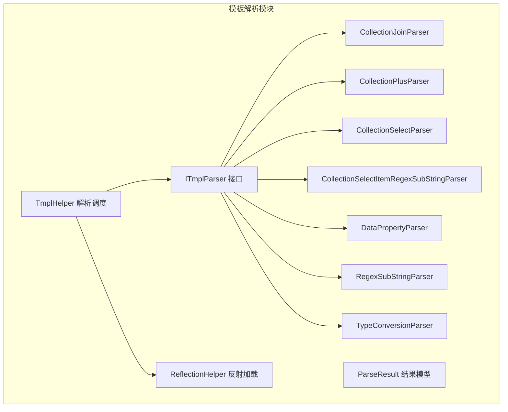
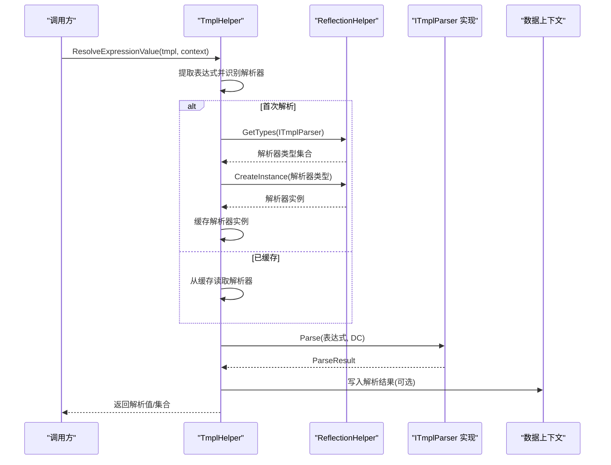
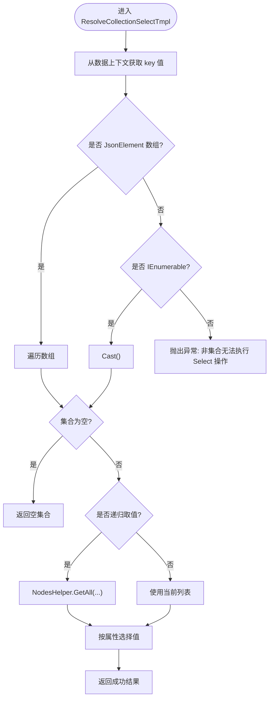
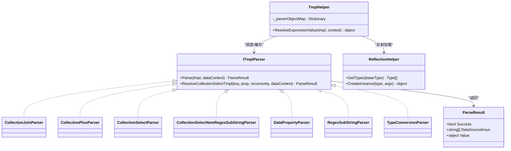
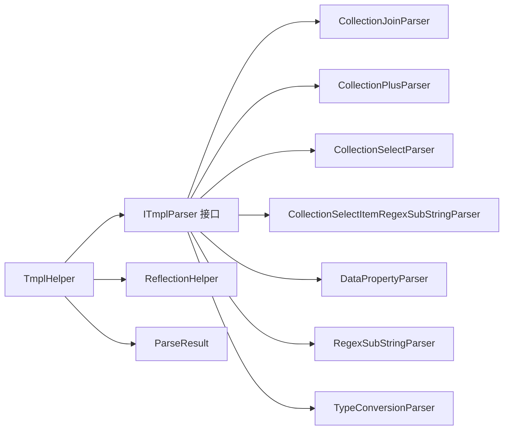

# 模板解析器架构

<cite>
**本文档引用的文件**
- [ITmplParser.cs](file://Sylas.RemoteTasks.Utils/Template/Parser/ITmplParser.cs)
- [ParseResult.cs](file://Sylas.RemoteTasks.Utils/Template/Parser/ParseResult.cs)
- [CollectionJoinParser.cs](file://Sylas.RemoteTasks.Utils/Template/Parser/CollectionJoinParser.cs)
- [CollectionPlusParser.cs](file://Sylas.RemoteTasks.Utils/Template/Parser/CollectionPlusParser .cs)
- [CollectionSelectParser.cs](file://Sylas.RemoteTasks.Utils/Template/Parser/CollectionSelectParser.cs)
- [CollectionSelectItemRegexSubStringParser.cs](file://Sylas.RemoteTasks.Utils/Template/Parser/CollectionSelectItemRegexSubStringParser.cs)
- [DataPropertyParser.cs](file://Sylas.RemoteTasks.Utils/Template/Parser/DataPropertyParser.cs)
- [RegexSubStringParser.cs](file://Sylas.RemoteTasks.Utils/Template/Parser/RegexSubStringParser.cs)
- [TypeConversionParser.cs](file://Sylas.RemoteTasks.Utils/Template/Parser/TypeConversionParser.cs)
- [TmplHelper.cs](file://Sylas.RemoteTasks.Utils/Template/TmplHelper.cs)
- [ReflectionHelper.cs](file://Sylas.RemoteTasks.Utils/ReflectionHelper.cs)
- [TmplParserTest.cs](file://Sylas.RemoteTasks.Test/Tmpl/TmplParserTest.cs)
- [TmplParser2Test.cs](file://Sylas.RemoteTasks.Test/Tmpl/TmplParser2Test.cs)
</cite>

## 目录
1. [简介](#简介)
2. [项目结构](#项目结构)
3. [核心组件](#核心组件)
4. [架构总览](#架构总览)
5. [详细组件分析](#详细组件分析)
6. [依赖关系分析](#依赖关系分析)
7. [性能考量](#性能考量)
8. [故障排查指南](#故障排查指南)
9. [结论](#结论)
10. [附录](#附录)

## 简介
本文件系统性阐述模板解析器架构，围绕 ITmplParser 接口设计、ParseResult 数据结构、内置解析器功能与使用场景、解析器注册与反射加载机制，以及自定义解析器开发指南展开，并提供性能优化与缓存策略建议。文档同时给出关键流程的时序图与类图，帮助读者快速理解与落地实践。

## 项目结构
模板解析器位于 Sylas.RemoteTasks.Utils 模块下的 Template/Parser 目录，配合 TmplHelper 提供统一的表达式解析入口；反射加载由 ReflectionHelper 提供；测试用例位于 Sylas.RemoteTasks.Test/Tmpl 下，覆盖各解析器的行为验证。

图表来源
- [ITmplParser.cs](file://Sylas.RemoteTasks.Utils/Template/Parser/ITmplParser.cs#L20-L103)
- [ParseResult.cs](file://Sylas.RemoteTasks.Utils/Template/Parser/ParseResult.cs#L6-L40)
- [CollectionJoinParser.cs](file://Sylas.RemoteTasks.Utils/Template/Parser/CollectionJoinParser.cs#L13-L71)
- [CollectionPlusParser.cs](file://Sylas.RemoteTasks.Utils/Template/Parser/CollectionPlusParser .cs#L13-L68)
- [CollectionSelectParser.cs](file://Sylas.RemoteTasks.Utils/Template/Parser/CollectionSelectParser.cs#L9-L32)
- [CollectionSelectItemRegexSubStringParser.cs](file://Sylas.RemoteTasks.Utils/Template/Parser/CollectionSelectItemRegexSubStringParser.cs#L13-L63)
- [DataPropertyParser.cs](file://Sylas.RemoteTasks.Utils/Template/Parser/DataPropertyParser.cs#L16-L144)
- [RegexSubStringParser.cs](file://Sylas.RemoteTasks.Utils/Template/Parser/RegexSubStringParser.cs#L11-L38)
- [TypeConversionParser.cs](file://Sylas.RemoteTasks.Utils/Template/Parser/TypeConversionParser.cs#L15-L101)
- [TmplHelper.cs](file://Sylas.RemoteTasks.Utils/Template/TmplHelper.cs#L451-L634)
- [ReflectionHelper.cs](file://Sylas.RemoteTasks.Utils/ReflectionHelper.cs#L26-L78)

章节来源
- [TmplHelper.cs](file://Sylas.RemoteTasks.Utils/Template/TmplHelper.cs#L195-L271)
- [ITmplParser.cs](file://Sylas.RemoteTasks.Utils/Template/Parser/ITmplParser.cs#L14-L103)

## 核心组件
- ITmplParser 接口：定义解析器契约，提供 Parse 方法；并提供静态工具 ResolveCollectionSelectTmpl，用于集合属性选择与递归取值。
- ParseResult 结果模型：封装解析成功标志、数据源键数组、解析值，作为所有解析器的标准返回载体。
- 内置解析器：覆盖集合连接、集合合并、集合选择、正则子串提取、数据属性访问、正则子串、类型转换等常用场景。
- TmplHelper：统一调度入口，负责表达式抽取、解析器选择与实例化、结果回填、for 循环渲染等。
- ReflectionHelper：基于接口类型扫描实现类，支持按名称创建实例，配合 TmplHelper 的解析器缓存。

章节来源
- [ITmplParser.cs](file://Sylas.RemoteTasks.Utils/Template/Parser/ITmplParser.cs#L20-L103)
- [ParseResult.cs](file://Sylas.RemoteTasks.Utils/Template/Parser/ParseResult.cs#L6-L40)
- [TmplHelper.cs](file://Sylas.RemoteTasks.Utils/Template/TmplHelper.cs#L451-L634)
- [ReflectionHelper.cs](file://Sylas.RemoteTasks.Utils/ReflectionHelper.cs#L26-L78)

## 架构总览
模板解析的整体流程如下：
- 表达式识别：从字符串中提取模板表达式，支持 $var、${var}、{{var}} 等多种写法。
- 解析器选择：若显式声明 Parser 名称则优先使用；否则默认使用 DataPropertyParser。
- 反射加载与缓存：首次解析某解析器时通过反射查找并实例化，随后缓存到内存字典中，避免重复反射开销。
- 解析执行：调用解析器 Parse，返回 ParseResult；若成功且包含数据源键，则将值写入数据上下文。
- 结果回填：将解析结果替换到原始字符串中，或返回集合以生成多行输出。

图表来源
- [TmplHelper.cs](file://Sylas.RemoteTasks.Utils/Template/TmplHelper.cs#L588-L634)
- [ReflectionHelper.cs](file://Sylas.RemoteTasks.Utils/ReflectionHelper.cs#L62-L77)

## 详细组件分析

### ITmplParser 接口与集合选择工具
- 设计理念：接口统一解析入口，静态工具方法集中复用集合选择逻辑，减少重复代码与提升一致性。
- 关键点：
  - ResolveCollectionSelectTmpl 支持 JsonElement 数组、IEnumerable 集合、可选递归取值（通过 NodesHelper）。
  - SELF 属性可直接返回集合本身，便于后续链式处理。
  - 异常抛出明确提示“非集合无法执行 Select 操作”。

图表来源
- [ITmplParser.cs](file://Sylas.RemoteTasks.Utils/Template/Parser/ITmplParser.cs#L39-L102)

章节来源
- [ITmplParser.cs](file://Sylas.RemoteTasks.Utils/Template/Parser/ITmplParser.cs#L20-L103)

### ParseResult 数据结构
- 字段说明：
  - Success：解析是否成功。
  - DataSourceKeys：本次解析所依赖的数据源键数组（可能为空）。
  - Value：解析结果值（可为字符串、集合、对象等）。
- 构造方式：提供无参与带参数构造函数，便于快速构建成功/失败结果。

章节来源
- [ParseResult.cs](file://Sylas.RemoteTasks.Utils/Template/Parser/ParseResult.cs#L6-L40)

### 内置解析器详解

#### CollectionJoinParser（集合连接）
- 功能：将集合元素按指定分隔符连接为字符串；字符串直接返回。
- 参数：key join separator
- 典型场景：将菜单 ID 列表连接为逗号分隔字符串，便于 SQL IN 条件拼接。
- 错误处理：非集合类型抛出异常；空集合返回空字符串。

章节来源
- [CollectionJoinParser.cs](file://Sylas.RemoteTasks.Utils/Template/Parser/CollectionJoinParser.cs#L13-L71)
- [TmplParserTest.cs](file://Sylas.RemoteTasks.Test/Tmpl/TmplParserTest.cs#L307-L327)

#### CollectionPlusParser（集合合并）
- 功能：将左右两个变量（可为单值或集合）合并为一个列表。
- 参数：left + right
- 典型场景：将两个配置列表合并为一个统一列表。
- 错误处理：任一变量缺失时抛出异常。

章节来源
- [CollectionPlusParser.cs](file://Sylas.RemoteTasks.Utils/Template/Parser/CollectionPlusParser .cs#L13-L68)
- [TmplParserTest.cs](file://Sylas.RemoteTasks.Test/Tmpl/TmplParserTest.cs#L307-L327)

#### CollectionSelectParser（集合选择）
- 功能：从集合中选取每个元素的指定属性，形成新集合；支持递归取值。
- 参数：key select prop [-r]
- 典型场景：从菜单列表中提取所有 ID 组成新列表。
- 依赖：内部委托给 ITmplParser.ResolveCollectionSelectTmpl 完成实际选择逻辑。

章节来源
- [CollectionSelectParser.cs](file://Sylas.RemoteTasks.Utils/Template/Parser/CollectionSelectParser.cs#L9-L32)
- [ITmplParser.cs](file://Sylas.RemoteTasks.Utils/Template/Parser/ITmplParser.cs#L39-L102)
- [TmplParserTest.cs](file://Sylas.RemoteTasks.Test/Tmpl/TmplParserTest.cs#L263-L301)

#### CollectionSelectItemRegexSubStringParser（正则子串提取）
- 功能：先对集合执行选择，再对每个元素应用正则分组提取子串，形成新集合。
- 参数：key select prop [-r] reg `pattern` group
- 典型场景：从 URL 列表中提取 formId。
- 错误处理：若选择结果为空抛出异常。

章节来源
- [CollectionSelectItemRegexSubStringParser.cs](file://Sylas.RemoteTasks.Utils/Template/Parser/CollectionSelectItemRegexSubStringParser.cs#L13-L63)
- [TmplParserTest.cs](file://Sylas.RemoteTasks.Test/Tmpl/TmplParserTest.cs#L329-L351)

#### DataPropertyParser（数据属性访问）
- 功能：支持索引访问集合元素、链式属性访问、JsonElement/Dictionary/JObject 等多种数据类型。
- 参数：key[index].prop1.prop2...
- 典型场景：从数据上下文中读取嵌套属性值，兼容字符串 JSON、JArray、JsonElement 等。
- 错误处理：属性不存在或类型不匹配时抛出异常。

章节来源
- [DataPropertyParser.cs](file://Sylas.RemoteTasks.Utils/Template/Parser/DataPropertyParser.cs#L16-L144)
- [TmplParserTest.cs](file://Sylas.RemoteTasks.Test/Tmpl/TmplParserTest.cs#L42-L182)

#### RegexSubStringParser（正则子串）
- 功能：对字符串变量应用正则分组提取子串。
- 参数：key reg `pattern` group
- 典型场景：从 IDPath 中提取 AppId。
- 错误处理：变量缺失或正则未命中时抛出异常。

章节来源
- [RegexSubStringParser.cs](file://Sylas.RemoteTasks.Utils/Template/Parser/RegexSubStringParser.cs#L11-L38)
- [TmplParserTest.cs](file://Sylas.RemoteTasks.Test/Tmpl/TmplParserTest.cs#L42-L85)

#### TypeConversionParser（类型转换）
- 功能：将字符串或 JsonElement 转换为 List 或 Object。
- 参数：key as List|Object
- 典型场景：将 JSON 字符串转换为强类型集合或对象。
- 错误处理：不支持的类型或转换失败时抛出异常。

章节来源
- [TypeConversionParser.cs](file://Sylas.RemoteTasks.Utils/Template/Parser/TypeConversionParser.cs#L15-L101)
- [TmplParserTest.cs](file://Sylas.RemoteTasks.Test/Tmpl/TmplParserTest.cs#L218-L258)

### 解析器注册机制与反射加载
- 注册与缓存：TmplHelper 内部维护 _parserObjectMap，按解析器名称缓存实例，避免重复反射。
- 反射加载：通过 ReflectionHelper.GetTypes(typeof(ITmplParser)) 获取所有实现类，再按名称匹配创建实例。
- 使用约定：表达式可显式声明 Parser 名称，如 CollectionJoinParser[...]；若省略则默认 DataPropertyParser。

图表来源
- [ITmplParser.cs](file://Sylas.RemoteTasks.Utils/Template/Parser/ITmplParser.cs#L20-L103)
- [ParseResult.cs](file://Sylas.RemoteTasks.Utils/Template/Parser/ParseResult.cs#L6-L40)
- [TmplHelper.cs](file://Sylas.RemoteTasks.Utils/Template/TmplHelper.cs#L451-L634)
- [ReflectionHelper.cs](file://Sylas.RemoteTasks.Utils/ReflectionHelper.cs#L62-L77)

章节来源
- [TmplHelper.cs](file://Sylas.RemoteTasks.Utils/Template/TmplHelper.cs#L588-L634)
- [ReflectionHelper.cs](file://Sylas.RemoteTasks.Utils/ReflectionHelper.cs#L32-L77)

### 自定义解析器开发指南
- 实现步骤
  - 新建类实现 ITmplParser 接口，实现 Parse 方法。
  - 在表达式中通过 “YourParserName[...params...]” 方式使用。
  - 若需访问集合选择能力，可复用 ITmplParser.ResolveCollectionSelectTmpl。
- 参数解析
  - 采用正则匹配解析表达式参数，确保健壮性与可扩展性。
  - 对集合类型（IEnumerable、JsonElement、JArray）分别处理。
- 错误处理
  - 明确的异常信息，包含解析器名称与缺失键，便于定位问题。
  - 对空集合、空结果、类型不匹配等情况进行分支处理与异常抛出。
- 性能建议
  - 尽量避免在 Parse 中进行重复 IO 或复杂计算。
  - 对热点数据可结合 TmplHelper 的解析器实例缓存减少反射成本。

章节来源
- [ITmplParser.cs](file://Sylas.RemoteTasks.Utils/Template/Parser/ITmplParser.cs#L20-L103)
- [TmplHelper.cs](file://Sylas.RemoteTasks.Utils/Template/TmplHelper.cs#L588-L634)

## 依赖关系分析
- 组件耦合
  - TmplHelper 依赖 ITmplParser 接口族，通过反射与缓存解耦具体实现。
  - 各解析器之间低耦合，仅在公共工具（如 ResolveCollectionSelectTmpl）处有逻辑共享。
- 外部依赖
  - Newtonsoft.Json 与 System.Text.Json 用于序列化/反序列化与 JsonElement 操作。
  - 正则表达式库用于模式匹配与分组提取。
- 潜在风险
  - 反射加载失败或类型不匹配会导致异常；建议在初始化阶段预热常用解析器。
  - 集合选择依赖 NodesHelper 的递归遍历，需注意大数据量时的性能与内存占用。

图表来源
- [TmplHelper.cs](file://Sylas.RemoteTasks.Utils/Template/TmplHelper.cs#L451-L634)
- [ITmplParser.cs](file://Sylas.RemoteTasks.Utils/Template/Parser/ITmplParser.cs#L20-L103)
- [ParseResult.cs](file://Sylas.RemoteTasks.Utils/Template/Parser/ParseResult.cs#L6-L40)
- [ReflectionHelper.cs](file://Sylas.RemoteTasks.Utils/ReflectionHelper.cs#L62-L77)

章节来源
- [TmplHelper.cs](file://Sylas.RemoteTasks.Utils/Template/TmplHelper.cs#L451-L634)

## 性能考量
- 反射缓存：TmplHelper 内部缓存解析器实例，避免重复反射带来的性能损耗。
- 集合处理：优先使用 IEnumerable/JsonElement 的迭代器特性，避免一次性装箱与深拷贝。
- 正则匹配：尽量简化正则表达式，避免回溯；对高频模式可考虑编译正则（当前实现未做编译，可在自定义解析器中引入）。
- 递归取值：集合选择的递归遍历对大数据量有较大成本，建议在业务层限制层级或提前扁平化。
- 字符串替换：在字符串模板中批量替换时，注意避免频繁的字符串拼接，可使用 StringBuilder 或一次性替换策略。

[本节为通用性能建议，不直接分析具体文件]

## 故障排查指南
- 常见异常
  - “未找到 Parser”：检查表达式中解析器名称是否正确，或确认实现类已编译到目标程序集。
  - “数据上下中未发现数据 key”：确认数据上下文键名大小写与表达式一致，或检查 BuildDataContextBySource 的赋值顺序。
  - “非集合无法执行 Select 操作”：确认集合类型为 IEnumerable 或 JsonElement 数组。
  - “无法找到属性”：核对属性链路是否存在大小写差异或类型不匹配。
- 调试建议
  - 使用 TmplHelper.ResolveExpressionValue 的日志输出定位解析阶段。
  - 在测试中逐步拆分表达式，先验证基础解析器，再组合复杂表达式。
  - 对集合选择与正则提取，分别验证中间结果（集合选择 vs 正则匹配）。

章节来源
- [TmplHelper.cs](file://Sylas.RemoteTasks.Utils/Template/TmplHelper.cs#L273-L307)
- [TmplParserTest.cs](file://Sylas.RemoteTasks.Test/Tmpl/TmplParserTest.cs#L42-L425)
- [TmplParser2Test.cs](file://Sylas.RemoteTasks.Test/Tmpl/TmplParser2Test.cs#L102-L312)

## 结论
该模板解析器架构以 ITmplParser 为核心契约，通过统一的调度与反射加载机制，实现了高扩展性的解析器生态。内置解析器覆盖集合、属性、正则、类型转换等典型场景，满足复杂数据上下文的动态解析需求。结合缓存与测试用例，可在保证可维护性的同时获得良好的性能表现。建议在生产环境中配合初始化预热与性能监控，持续优化热点路径。

[本节为总结性内容，不直接分析具体文件]

## 附录
- 使用场景速查
  - 集合连接：$menuIds join , → 生成逗号分隔字符串
  - 集合合并：$a + $b → 合并为列表
  - 集合选择：$items select Id [-r] → 选择 Id 并可递归
  - 正则子串：$url reg `pattern` group → 提取分组
  - 数据属性：$data[0].IDPATH → 嵌套属性访问
  - 类型转换：$json as List → JSON 转集合

[本节为概念性内容，不直接分析具体文件]