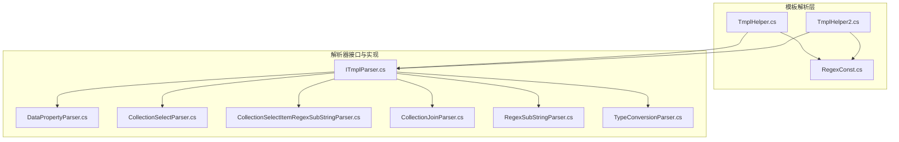
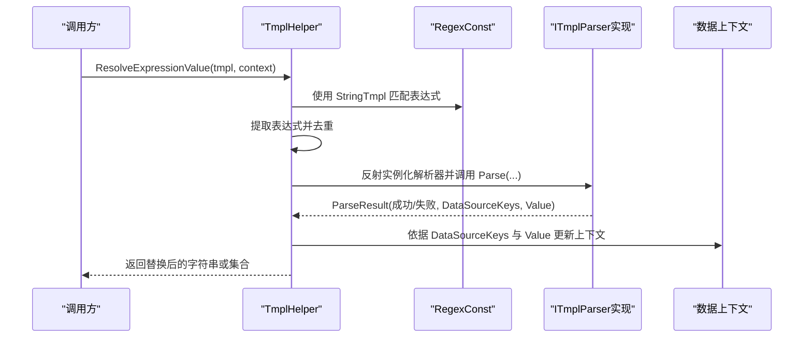
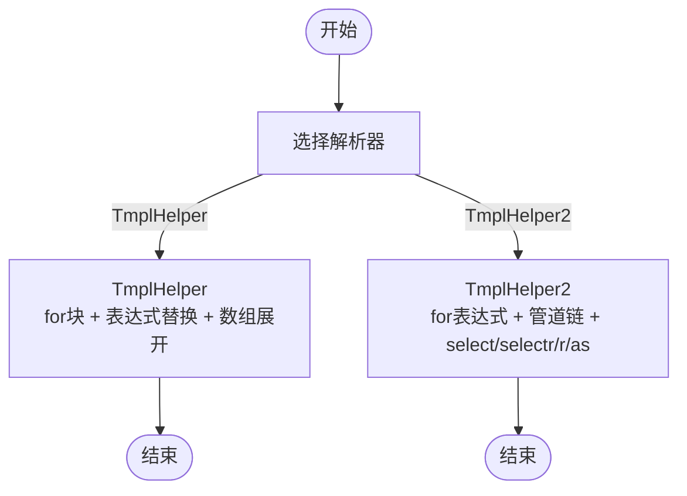
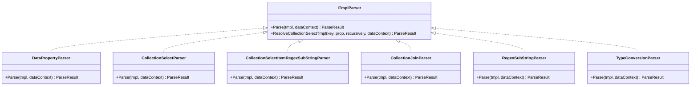
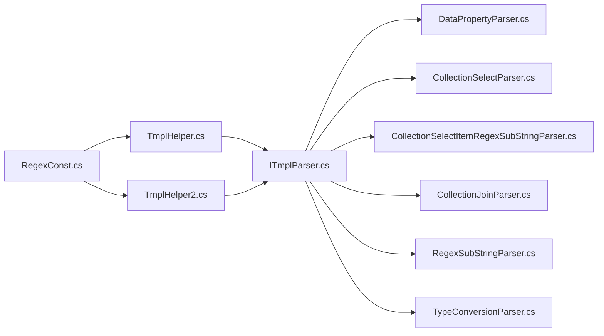

# 模板语法与表达式

<cite>
**本文档引用的文件**
- [TmplHelper.cs](file://Sylas.RemoteTasks.Utils/Template/TmplHelper.cs)
- [TmplHelper2.cs](file://Sylas.RemoteTasks.Utils/Template/TmplHelper2.cs)
- [RegexConst.cs](file://Sylas.RemoteTasks.Common/RegexConst.cs)
- [ITmplParser.cs](file://Sylas.RemoteTasks.Utils/Template/Parser/ITmplParser.cs)
- [DataPropertyParser.cs](file://Sylas.RemoteTasks.Utils/Template/Parser/DataPropertyParser.cs)
- [CollectionSelectParser.cs](file://Sylas.RemoteTasks.Utils/Template/Parser/CollectionSelectParser.cs)
- [CollectionSelectItemRegexSubStringParser.cs](file://Sylas.RemoteTasks.Utils/Template/Parser/CollectionSelectItemRegexSubStringParser.cs)
- [CollectionJoinParser.cs](file://Sylas.RemoteTasks.Utils/Template/Parser/CollectionJoinParser.cs)
- [RegexSubStringParser.cs](file://Sylas.RemoteTasks.Utils/Template/Parser/RegexSubStringParser.cs)
- [TypeConversionParser.cs](file://Sylas.RemoteTasks.Utils/Template/Parser/TypeConversionParser.cs)
- [TmplParserTest.cs](file://Sylas.RemoteTasks.Test/Tmpl/TmplParserTest.cs)
- [TmplParser2Test.cs](file://Sylas.RemoteTasks.Test/Tmpl/TmplParser2Test.cs)
- [RazorEngineTest.cs](file://Sylas.RemoteTasks.Test/Tmpl/RazorEngineTest.cs)
- [TmplTest.cshtml](file://Sylas.RemoteTasks.App/Views/Hosts/TmplTest.cshtml)
</cite>

## 目录
1. [简介](#简介)
2. [项目结构](#项目结构)
3. [核心组件](#核心组件)
4. [架构总览](#架构总览)
5. [详细组件分析](#详细组件分析)
6. [依赖关系分析](#依赖关系分析)
7. [性能考虑](#性能考虑)
8. [故障排查指南](#故障排查指南)
9. [结论](#结论)
10. [附录](#附录)

## 简介
本文件系统性阐述该代码库中的模板语法与表达式体系，涵盖以下主题：
- 模板表达式的语法规则与解析机制
- 表达式类型：简单变量表达式（$variable）、花括号表达式（${property}）、双重花括号表达式（{{property}}）
- 集合操作语法：数组索引、属性访问、嵌套属性、集合选择与正则提取
- 条件表达式与逻辑运算符的使用
- 模板转义机制与特殊字符处理
- 正则表达式在模板中的应用与匹配规则
- 模板缓存机制与性能优化策略
- 常见语法错误与调试技巧

## 项目结构
模板系统主要由两套解析器与一组通用正则常量构成：
- TmplHelper 与 TmplHelper2：两类模板解析入口，分别面向不同场景与能力边界
- Parser 子模块：多种解析器（ITmplParser 及其具体实现）负责解析特定表达式语法
- RegexConst：集中管理模板与正则相关常量，统一表达式匹配规则

图表来源
- [TmplHelper.cs](file://Sylas.RemoteTasks.Utils/Template/TmplHelper.cs#L1-L740)
- [TmplHelper2.cs](file://Sylas.RemoteTasks.Utils/Template/TmplHelper2.cs#L1-L416)
- [RegexConst.cs](file://Sylas.RemoteTasks.Common/RegexConst.cs#L1-L161)
- [ITmplParser.cs](file://Sylas.RemoteTasks.Utils/Template/Parser/ITmplParser.cs#L1-L105)

章节来源
- [TmplHelper.cs](file://Sylas.RemoteTasks.Utils/Template/TmplHelper.cs#L1-L740)
- [TmplHelper2.cs](file://Sylas.RemoteTasks.Utils/Template/TmplHelper2.cs#L1-L416)
- [RegexConst.cs](file://Sylas.RemoteTasks.Common/RegexConst.cs#L1-L161)

## 核心组件
- 模板表达式匹配与提取：通过统一的正则常量完成表达式识别，支持 $variable、${property}、{{property}} 以及 XxxParser[...] 形式
- 表达式求值与替换：在 TmplHelper 中按表达式顺序解析并替换；在 TmplHelper2 中支持 for 循环与更丰富的集合/正则操作
- 解析器接口与多实现：ITmplParser 定义统一解析协议，各解析器实现特定语法（属性访问、集合选择、正则截取、类型转换、集合拼接等）

章节来源
- [RegexConst.cs](file://Sylas.RemoteTasks.Common/RegexConst.cs#L127-L131)
- [TmplHelper.cs](file://Sylas.RemoteTasks.Utils/Template/TmplHelper.cs#L461-L634)
- [TmplHelper2.cs](file://Sylas.RemoteTasks.Utils/Template/TmplHelper2.cs#L27-L81)

## 架构总览
模板解析流程分为两条主线：
- TmplHelper 主线：支持 for 循环块、表达式提取与替换、解析器调用、数组展开生成多结果
- TmplHelper2 主线：支持 for 循环表达式、管道式表达式链、正则提取 r(...)、集合选择 select/selectr、类型转换 as

图表来源
- [TmplHelper.cs](file://Sylas.RemoteTasks.Utils/Template/TmplHelper.cs#L461-L634)
- [RegexConst.cs](file://Sylas.RemoteTasks.Common/RegexConst.cs#L127-L131)
- [ITmplParser.cs](file://Sylas.RemoteTasks.Utils/Template/Parser/ITmplParser.cs#L20-L29)

## 详细组件分析

### 表达式类型与转义机制
- 简单变量表达式：$variable，支持嵌套属性与数组索引
- 花括号表达式：${property}，用于在字符串中明确界定变量边界
- 双重花括号表达式：{{property}}，用于显示渲染场景，避免与前端框架冲突
- 转义与特殊字符处理：模板中 $$ 会被临时标记为内部标志位，解析完成后恢复为 $

章节来源
- [TmplHelper.cs](file://Sylas.RemoteTasks.Utils/Template/TmplHelper.cs#L329-L331)
- [TmplHelper.cs](file://Sylas.RemoteTasks.Utils/Template/TmplHelper.cs#L480-L585)
- [RegexConst.cs](file://Sylas.RemoteTasks.Common/RegexConst.cs#L127-L131)

### 集合操作语法
- 数组索引：$data[0].field
- 属性访问：$data[0].items[1].name
- 嵌套属性：支持多层级点号访问
- 集合选择：select 与 selectr
  - select(prop)：提取集合中每个元素的指定属性，形成新集合
  - selectr(prop,pattern1,...)：先按属性提取值，再对每个值执行正则匹配，收集非重复分组结果
- 正则提取：r(prop,pattern1,...)，对字符串类型的源执行正则匹配，返回匹配结果集合

章节来源
- [DataPropertyParser.cs](file://Sylas.RemoteTasks.Utils/Template/Parser/DataPropertyParser.cs#L25-L142)
- [TmplHelper2.cs](file://Sylas.RemoteTasks.Utils/Template/TmplHelper2.cs#L273-L347)
- [TmplHelper2.cs](file://Sylas.RemoteTasks.Utils/Template/TmplHelper2.cs#L324-L323)

### 条件表达式与逻辑运算符
- 模板系统未内置显式的“条件表达式”或“逻辑运算符”语法。条件分支通常通过：
  - 上下文变量的存在与否决定是否解析
  - 解析器返回失败时回退为原始表达式
  - 在业务侧通过模板外层控制（例如 for 循环块）实现分支效果

章节来源
- [TmplHelper.cs](file://Sylas.RemoteTasks.Utils/Template/TmplHelper.cs#L619-L632)

### 正则表达式在模板中的应用
- 正则截取：RegexSubStringParser 支持 reg `pattern` groupname
- 正则提取：r(...) 与 selectr(...) 支持传入多个正则模式，自动去重并返回匹配分组
- 分组命名：通过 (?<name>...) 命名分组，解析器按名称提取结果

章节来源
- [RegexSubStringParser.cs](file://Sylas.RemoteTasks.Utils/Template/Parser/RegexSubStringParser.cs#L20-L36)
- [TmplHelper2.cs](file://Sylas.RemoteTasks.Utils/Template/TmplHelper2.cs#L233-L272)
- [TmplHelper2.cs](file://Sylas.RemoteTasks.Utils/Template/TmplHelper2.cs#L273-L323)
- [RegexConst.cs](file://Sylas.RemoteTasks.Common/RegexConst.cs#L134-L137)

### 模板缓存机制与性能优化
- 解析器实例缓存：TmplHelper 维护解析器对象映射表，避免重复反射创建
- 表达式去重：同一表达式多次出现时仅解析一次
- 数组展开：当表达式值为集合时，一次性生成多条结果，减少后续替换成本
- 正则复用：RegexConst 预编译常用正则，提升匹配效率

章节来源
- [TmplHelper.cs](file://Sylas.RemoteTasks.Utils/Template/TmplHelper.cs#L451-L451)
- [TmplHelper.cs](file://Sylas.RemoteTasks.Utils/Template/TmplHelper.cs#L500-L585)
- [RegexConst.cs](file://Sylas.RemoteTasks.Common/RegexConst.cs#L127-L131)

### TmplHelper 与 TmplHelper2 的差异与协作
- TmplHelper
  - 支持 for 循环块（$for ... $forend），块内逐行解析
  - 表达式解析后直接替换，支持数组展开生成集合结果
  - 通过反射加载解析器，统一 ParseResult 接口
- TmplHelper2
  - 支持 for 循环表达式 for (item in $collection) { ... }
  - 支持管道式表达式链（多个 | 管道函数）
  - 更丰富的集合/正则操作：select、selectr、r(...)、as 类型转换
  - 忽略不存在变量的策略（ignoreNotExistExpressions）

图表来源
- [TmplHelper.cs](file://Sylas.RemoteTasks.Utils/Template/TmplHelper.cs#L641-L719)
- [TmplHelper2.cs](file://Sylas.RemoteTasks.Utils/Template/TmplHelper2.cs#L369-L396)

章节来源
- [TmplHelper.cs](file://Sylas.RemoteTasks.Utils/Template/TmplHelper.cs#L461-L719)
- [TmplHelper2.cs](file://Sylas.RemoteTasks.Utils/Template/TmplHelper2.cs#L27-L396)

### 解析器类图

图表来源
- [ITmplParser.cs](file://Sylas.RemoteTasks.Utils/Template/Parser/ITmplParser.cs#L20-L103)
- [DataPropertyParser.cs](file://Sylas.RemoteTasks.Utils/Template/Parser/DataPropertyParser.cs#L16-L142)
- [CollectionSelectParser.cs](file://Sylas.RemoteTasks.Utils/Template/Parser/CollectionSelectParser.cs#L9-L31)
- [CollectionSelectItemRegexSubStringParser.cs](file://Sylas.RemoteTasks.Utils/Template/Parser/CollectionSelectItemRegexSubStringParser.cs#L13-L36)
- [CollectionJoinParser.cs](file://Sylas.RemoteTasks.Utils/Template/Parser/CollectionJoinParser.cs#L13-L71)
- [RegexSubStringParser.cs](file://Sylas.RemoteTasks.Utils/Template/Parser/RegexSubStringParser.cs#L11-L36)
- [TypeConversionParser.cs](file://Sylas.RemoteTasks.Utils/Template/Parser/TypeConversionParser.cs#L15-L100)

## 依赖关系分析
- RegexConst 为所有解析器提供统一的正则匹配能力
- ITmplParser 作为接口，约束各解析器的输入输出契约
- TmplHelper 与 TmplHelper2 分别依赖 ITmplParser 与 RegexConst
- 测试用例覆盖了多种表达式组合与边界场景

图表来源
- [RegexConst.cs](file://Sylas.RemoteTasks.Common/RegexConst.cs#L127-L131)
- [TmplHelper.cs](file://Sylas.RemoteTasks.Utils/Template/TmplHelper.cs#L461-L634)
- [TmplHelper2.cs](file://Sylas.RemoteTasks.Utils/Template/TmplHelper2.cs#L27-L81)
- [ITmplParser.cs](file://Sylas.RemoteTasks.Utils/Template/Parser/ITmplParser.cs#L20-L103)

章节来源
- [TmplParserTest.cs](file://Sylas.RemoteTasks.Test/Tmpl/TmplParserTest.cs#L1-L200)
- [TmplParser2Test.cs](file://Sylas.RemoteTasks.Test/Tmpl/TmplParser2Test.cs#L193-L224)
- [RazorEngineTest.cs](file://Sylas.RemoteTasks.Test/Tmpl/RazorEngineTest.cs#L1-L89)

## 性能考虑
- 解析器实例缓存：避免重复反射创建，降低 CPU 开销
- 表达式去重与一次性替换：减少多次字符串替换的开销
- 集合展开批处理：一次性生成多结果，减少循环次数
- 正则预编译：RegexConst 预编译常用正则，提升匹配速度
- 建议
  - 对高频使用的模板表达式进行复用
  - 尽量避免深层嵌套与过多正则匹配
  - 使用 select/selectr 减少后续二次处理

[本节为通用性能建议，无需列出章节来源]

## 故障排查指南
- 表达式未解析
  - 检查变量是否存在于数据上下文中
  - 确认表达式语法是否符合解析器要求
- 数组越界
  - 确认数组索引不超过集合长度
- 正则匹配失败
  - 检查正则模式与分组命名是否正确
- 解析器未找到
  - 确认解析器名称与反射路径一致
- for 循环异常
  - 检查 $for ... $forend 块结构与集合可迭代性

章节来源
- [TmplHelper.cs](file://Sylas.RemoteTasks.Utils/Template/TmplHelper.cs#L384-L442)
- [TmplHelper2.cs](file://Sylas.RemoteTasks.Utils/Template/TmplHelper2.cs#L222-L231)
- [TmplHelper2.cs](file://Sylas.RemoteTasks.Utils/Template/TmplHelper2.cs#L244-L247)

## 结论
该模板系统通过统一的表达式匹配与解析器接口，提供了灵活而强大的表达式求值能力。TmplHelper 侧重于 for 块与数组展开，TmplHelper2 则提供更丰富的集合/正则/类型转换能力。配合 RegexConst 的正则统一管理与解析器实例缓存，整体具备良好的可扩展性与性能表现。

[本节为总结，无需列出章节来源]

## 附录

### 常用表达式语法速查
- 变量：$var
- 花括号：${var}
- 双花括号：{{var}}
- 解析器：XxxParser[...]
- 集合选择：$list select prop
- 集合选择并正则提取：$list select prop reg `pattern` group`
- 正则提取：r(prop,pattern1,...)
- 类型转换：$str as List/Object
- 拼接：$list join ,

章节来源
- [RegexConst.cs](file://Sylas.RemoteTasks.Common/RegexConst.cs#L127-L131)
- [CollectionSelectParser.cs](file://Sylas.RemoteTasks.Utils/Template/Parser/CollectionSelectParser.cs#L17-L30)
- [CollectionSelectItemRegexSubStringParser.cs](file://Sylas.RemoteTasks.Utils/Template/Parser/CollectionSelectItemRegexSubStringParser.cs#L22-L36)
- [TmplHelper2.cs](file://Sylas.RemoteTasks.Utils/Template/TmplHelper2.cs#L233-L323)
- [TypeConversionParser.cs](file://Sylas.RemoteTasks.Utils/Template/Parser/TypeConversionParser.cs#L25-L99)
- [CollectionJoinParser.cs](file://Sylas.RemoteTasks.Utils/Template/Parser/CollectionJoinParser.cs#L22-L69)

### 示例与测试参考
- for 循环（TmplHelper）：参见测试用例
- for 循环表达式（TmplHelper2）：参见测试用例
- 正则截取与集合选择：参见测试用例
- RazorEngine 对比：参见测试用例

章节来源
- [TmplParserTest.cs](file://Sylas.RemoteTasks.Test/Tmpl/TmplParserTest.cs#L193-L200)
- [TmplParser2Test.cs](file://Sylas.RemoteTasks.Test/Tmpl/TmplParser2Test.cs#L193-L224)
- [RazorEngineTest.cs](file://Sylas.RemoteTasks.Test/Tmpl/RazorEngineTest.cs#L15-L86)
- [TmplTest.cshtml](file://Sylas.RemoteTasks.App/Views/Hosts/TmplTest.cshtml#L99-L125)