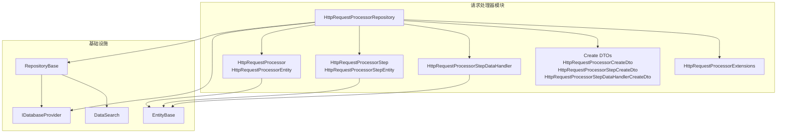
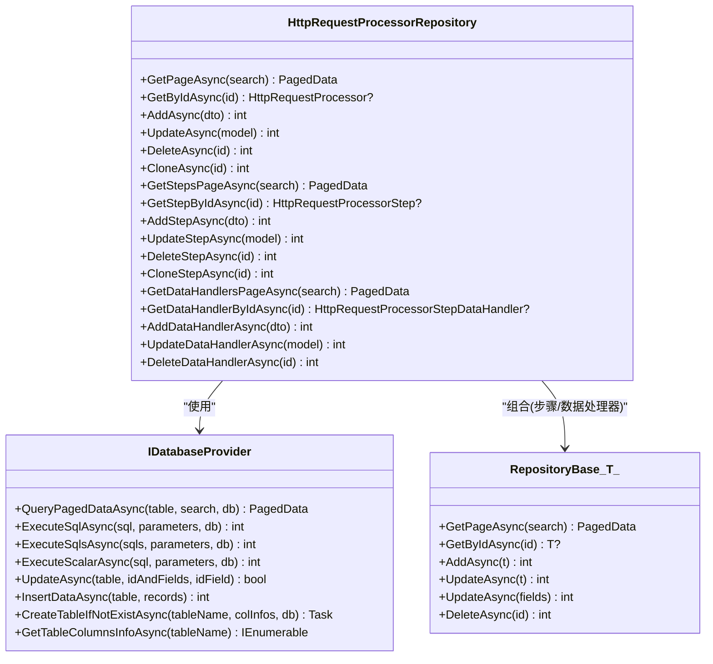
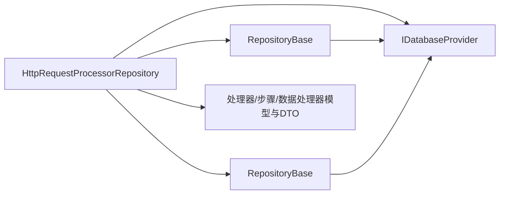

# 请求处理器仓储

<cite>
**本文引用的文件**
- [HttpRequestProcessorRepository.cs](file://Sylas.RemoteTasks.App/RequestProcessor/HttpRequestProcessorRepository.cs)
- [RepositoryBase.cs](file://Sylas.RemoteTasks.App/Infrastructure/RepositoryBase.cs)
- [HttpRequestProcessor.cs](file://Sylas.RemoteTasks.App/RequestProcessor/Models/HttpRequestProcessor.cs)
- [HttpRequestProcessorEntity.cs](file://Sylas.RemoteTasks.App/RequestProcessor/Models/HttpRequestProcessorEntity.cs)
- [HttpRequestProcessorStep.cs](file://Sylas.RemoteTasks.App/RequestProcessor/Models/HttpRequestProcessorStep.cs)
- [HttpRequestProcessorStepEntity.cs](file://Sylas.RemoteTasks.App/RequestProcessor/Models/HttpRequestProcessorStepEntity.cs)
- [HttpRequestProcessorStepDataHandlers.cs](file://Sylas.RemoteTasks.App/RequestProcessor/Models/HttpRequestProcessorStepDataHandlers.cs)
- [HttpRequestProcessorInDto.cs](file://Sylas.RemoteTasks.App/RequestProcessor/Models/Dtos/HttpRequestProcessorInDto.cs)
- [HttpRequestProcessorStepCreateDto.cs](file://Sylas.RemoteTasks.App/RequestProcessor/Models/Dtos/HttpRequestProcessorStepCreateDto.cs)
- [HttpRequestProcessorStepDataHandlerCreateDto.cs](file://Sylas.RemoteTasks.App/RequestProcessor/Models/Dtos/HttpRequestProcessorStepDataHandlerCreateDto.cs)
- [HttpRequestProcessorExtensions.cs](file://Sylas.RemoteTasks.App/RequestProcessor/Models/HttpRequestProcessorExtensions.cs)
- [DataSearch.cs](file://Sylas.RemoteTasks.Database/SyncBase/DataSearch.cs)
- [EntityBase.cs](file://Sylas.RemoteTasks.Database/EntityBase.cs)
- [IDatabaseProvider.cs](file://Sylas.RemoteTasks.Database/IDatabaseProvider.cs)
</cite>

## 目录
1. [简介](#简介)
2. [项目结构](#项目结构)
3. [核心组件](#核心组件)
4. [架构总览](#架构总览)
5. [详细组件分析](#详细组件分析)
6. [依赖关系分析](#依赖关系分析)
7. [性能考虑](#性能考虑)
8. [故障排查指南](#故障排查指南)
9. [结论](#结论)
10. [附录：使用示例与最佳实践](#附录使用示例与最佳实践)

## 简介
本文件面向“请求处理器仓储”（HttpRequestProcessorRepository）的实现与使用，系统性阐述其设计模式、数据访问策略、查询优化与缓存机制，以及与数据库的交互方式、事务管理与并发控制。文档同时给出仓储接口方法签名、参数处理与返回值结构说明，并提供完整的增删改查使用示例、性能优化建议、错误处理策略与调试技巧，帮助开发者在请求处理器系统中高效、安全地使用该仓储层。

## 项目结构
请求处理器仓储位于应用层的 RequestProcessor 子模块中，围绕三张核心表组织数据：处理器表、步骤表、步骤下的数据处理器表。仓储通过通用仓储基类与数据库提供者协作，完成分页查询、单条读取、新增、更新、删除与克隆等操作；同时对关联对象（步骤、数据处理器）进行批量加载与组装。

图表来源
- [HttpRequestProcessorRepository.cs](file://Sylas.RemoteTasks.App/RequestProcessor/HttpRequestProcessorRepository.cs#L11-L412)
- [RepositoryBase.cs](file://Sylas.RemoteTasks.App/Infrastructure/RepositoryBase.cs#L10-L233)
- [HttpRequestProcessor.cs](file://Sylas.RemoteTasks.App/RequestProcessor/Models/HttpRequestProcessor.cs#L9-L21)
- [HttpRequestProcessorEntity.cs](file://Sylas.RemoteTasks.App/RequestProcessor/Models/HttpRequestProcessorEntity.cs#L9-L20)
- [HttpRequestProcessorStep.cs](file://Sylas.RemoteTasks.App/RequestProcessor/Models/HttpRequestProcessorStep.cs#L3-L18)
- [HttpRequestProcessorStepEntity.cs](file://Sylas.RemoteTasks.App/RequestProcessor/Models/HttpRequestProcessorStepEntity.cs#L6-L20)
- [HttpRequestProcessorStepDataHandlers.cs](file://Sylas.RemoteTasks.App/RequestProcessor/Models/HttpRequestProcessorStepDataHandlers.cs#L3-L14)
- [HttpRequestProcessorInDto.cs](file://Sylas.RemoteTasks.App/RequestProcessor/Models/Dtos/HttpRequestProcessorInDto.cs#L3-L12)
- [HttpRequestProcessorStepCreateDto.cs](file://Sylas.RemoteTasks.App/RequestProcessor/Models/Dtos/HttpRequestProcessorStepCreateDto.cs#L3-L14)
- [HttpRequestProcessorStepDataHandlerCreateDto.cs](file://Sylas.RemoteTasks.App/RequestProcessor/Models/Dtos/HttpRequestProcessorStepDataHandlerCreateDto.cs#L3-L12)
- [HttpRequestProcessorExtensions.cs](file://Sylas.RemoteTasks.App/RequestProcessor/Models/HttpRequestProcessorExtensions.cs#L7-L48)
- [DataSearch.cs](file://Sylas.RemoteTasks.Database/SyncBase/DataSearch.cs#L8-L47)
- [EntityBase.cs](file://Sylas.RemoteTasks.Database/EntityBase.cs#L9-L32)
- [IDatabaseProvider.cs](file://Sylas.RemoteTasks.Database/IDatabaseProvider.cs#L12-L98)

章节来源
- [HttpRequestProcessorRepository.cs](file://Sylas.RemoteTasks.App/RequestProcessor/HttpRequestProcessorRepository.cs#L11-L412)
- [RepositoryBase.cs](file://Sylas.RemoteTasks.App/Infrastructure/RepositoryBase.cs#L10-L233)
- [DataSearch.cs](file://Sylas.RemoteTasks.Database/SyncBase/DataSearch.cs#L8-L47)

## 核心组件
- HttpRequestProcessorRepository：请求处理器仓储，负责处理器、步骤、数据处理器的增删改查与克隆，封装跨表查询与组装逻辑。
- RepositoryBase<T>：通用仓储基类，提供统一的分页查询、新增、更新（含局部更新）、删除能力，并针对不同数据库类型处理自增返回值。
- IDatabaseProvider：数据库提供者接口，抽象出分页查询、执行SQL、动态更新、表结构操作等能力。
- 模型与DTO：处理器、步骤、数据处理器的实体与创建DTO，配合扩展方法实现对象转换。

章节来源
- [HttpRequestProcessorRepository.cs](file://Sylas.RemoteTasks.App/RequestProcessor/HttpRequestProcessorRepository.cs#L11-L412)
- [RepositoryBase.cs](file://Sylas.RemoteTasks.App/Infrastructure/RepositoryBase.cs#L10-L233)
- [IDatabaseProvider.cs](file://Sylas.RemoteTasks.Database/IDatabaseProvider.cs#L12-L98)

## 架构总览
仓储层采用“组合+分层”的设计：构造函数注入数据库提供者与两个通用仓储实例（分别用于步骤与数据处理器），以复用通用CRUD能力；同时在仓储内实现复杂查询与跨表组装逻辑，保证上层调用的简洁性与一致性。

图表来源
- [HttpRequestProcessorRepository.cs](file://Sylas.RemoteTasks.App/RequestProcessor/HttpRequestProcessorRepository.cs#L11-L412)
- [RepositoryBase.cs](file://Sylas.RemoteTasks.App/Infrastructure/RepositoryBase.cs#L10-L233)
- [IDatabaseProvider.cs](file://Sylas.RemoteTasks.Database/IDatabaseProvider.cs#L12-L98)

## 详细组件分析

### 设计模式与职责
- 组合优于继承：通过组合通用仓储与数据库提供者，避免重复实现CRUD，提升可维护性。
- 分层解耦：仓储专注于业务实体的聚合查询与跨表组装，数据库提供者负责底层SQL执行与方言适配。
- 领域驱动：以处理器-步骤-数据处理器的层次关系建模，仓储负责将扁平查询结果还原为树形结构。

章节来源
- [HttpRequestProcessorRepository.cs](file://Sylas.RemoteTasks.App/RequestProcessor/HttpRequestProcessorRepository.cs#L11-L412)
- [RepositoryBase.cs](file://Sylas.RemoteTasks.App/Infrastructure/RepositoryBase.cs#L10-L233)

### 数据访问策略与查询优化
- 分页查询：统一使用 DataSearch 参数，支持分页索引、页大小、过滤条件与排序规则，减少一次性加载大量数据。
- 关联加载：先分页获取主实体，再基于主实体ID集合批量查询子项（步骤、数据处理器），最后在内存中组装树形结构，降低N+1查询风险。
- 批量过滤：通过“IN 列表”一次性拉取所有子项，避免循环逐条查询。
- 查询范围限制：对子项查询设置合理上限（如1000），防止异常数据导致内存与网络压力过大。

章节来源
- [HttpRequestProcessorRepository.cs](file://Sylas.RemoteTasks.App/RequestProcessor/HttpRequestProcessorRepository.cs#L23-L48)
- [DataSearch.cs](file://Sylas.RemoteTasks.Database/SyncBase/DataSearch.cs#L24-L30)

### 缓存机制
- 内存缓存：仓储未实现数据库级或应用级缓存。建议在上层服务层引入轻量缓存（如基于Key的LRU缓存）以加速热点查询（如按ID读取处理器及其步骤）。
- 建议策略：对高频读取的处理器详情（含步骤与数据处理器）进行短期缓存；写操作后主动失效相关缓存键。

章节来源
- [HttpRequestProcessorRepository.cs](file://Sylas.RemoteTasks.App/RequestProcessor/HttpRequestProcessorRepository.cs#L23-L48)

### 事务管理与并发控制
- 事务管理：仓储未显式开启事务。删除处理器时使用多条SQL一次性执行，确保原子性；更新与新增操作依赖数据库默认事务行为。
- 并发控制：未使用悲观锁或乐观锁。建议在高并发场景下对关键更新（如更新处理器标题、步骤顺序）引入乐观锁版本号或行级锁，避免竞态条件。
- 建议：对外暴露的批量操作（如克隆）应封装在事务中，失败时回滚全部变更。

章节来源
- [HttpRequestProcessorRepository.cs](file://Sylas.RemoteTasks.App/RequestProcessor/HttpRequestProcessorRepository.cs#L154-L161)
- [RepositoryBase.cs](file://Sylas.RemoteTasks.App/Infrastructure/RepositoryBase.cs#L113-L121)

### 方法签名、参数处理与返回值结构
- 分页查询处理器：GetPageAsync(DataSearch) → PagedData<HttpRequestProcessor>；内部先分页查询处理器，再批量查询步骤与数据处理器，最后在内存组装。
- 按ID查询处理器：GetByIdAsync(int) → HttpRequestProcessor?；若不存在返回空。
- 新增处理器：AddAsync(HttpRequestProcessorCreateDto) → int；返回新记录ID。
- 更新处理器：UpdateAsync(HttpRequestProcessor) → int；按非空字段动态拼接SET子句，自动更新时间戳。
- 删除处理器：DeleteAsync(int) → int；级联删除步骤与数据处理器。
- 克隆处理器：CloneAsync(int) → int；复制处理器、步骤与数据处理器。
- 步骤相关：GetStepsPageAsync、GetStepByIdAsync、AddStepAsync、UpdateStepAsync、DeleteStepAsync、CloneStepAsync。
- 数据处理器相关：GetDataHandlersPageAsync、GetDataHandlerByIdAsync、AddDataHandlerAsync、UpdateDataHandlerAsync、DeleteDataHandlerAsync。

章节来源
- [HttpRequestProcessorRepository.cs](file://Sylas.RemoteTasks.App/RequestProcessor/HttpRequestProcessorRepository.cs#L23-L182)
- [HttpRequestProcessorRepository.cs](file://Sylas.RemoteTasks.App/RequestProcessor/HttpRequestProcessorRepository.cs#L191-L311)
- [HttpRequestProcessorRepository.cs](file://Sylas.RemoteTasks.App/RequestProcessor/HttpRequestProcessorRepository.cs#L320-L408)

### 与数据库的交互方式
- 分页查询：通过 IDatabaseProvider.QueryPagedDataAsync<T> 完成，传入表名、DataSearch 与可选数据库标识。
- 执行SQL：通过 ExecuteSqlAsync/ExecuteSqlsAsync 执行单条或多条SQL，支持参数化输入。
- 动态更新：通过局部更新接口或手动拼接SET子句，仅更新传入字段。
- 自增返回值：根据数据库类型（PostgreSQL、SQLite、MySQL、SQL Server、Oracle等）选择合适的返回值查询语句。

章节来源
- [HttpRequestProcessorRepository.cs](file://Sylas.RemoteTasks.App/RequestProcessor/HttpRequestProcessorRepository.cs#L25-L26)
- [RepositoryBase.cs](file://Sylas.RemoteTasks.App/Infrastructure/RepositoryBase.cs#L72-L104)
- [IDatabaseProvider.cs](file://Sylas.RemoteTasks.Database/IDatabaseProvider.cs#L25-L58)

### 错误处理策略
- 存在性检查：更新前先查询记录数量，不存在则抛出异常，避免静默失败。
- 主键缺失：通用仓储在局部更新时要求提供主键字段，否则抛出异常。
- 数据库类型不支持：通用仓储在新增时对未知数据库类型抛出异常。
- 建议：对外捕获并包装异常，提供明确的错误码与消息，便于上层统一处理。

章节来源
- [HttpRequestProcessorRepository.cs](file://Sylas.RemoteTasks.App/RequestProcessor/HttpRequestProcessorRepository.cs#L106-L110)
- [RepositoryBase.cs](file://Sylas.RemoteTasks.App/Infrastructure/RepositoryBase.cs#L133-L136)
- [RepositoryBase.cs](file://Sylas.RemoteTasks.App/Infrastructure/RepositoryBase.cs#L102)

### 调试技巧
- SQL日志：通用仓储在生成SQL参数时输出耗时日志，可用于定位慢查询。
- 参数校验：在调用前验证DTO字段与过滤条件，避免无效查询。
- 分步调试：先单独测试分页查询与子项查询，确认数据正确后再组装。

章节来源
- [RepositoryBase.cs](file://Sylas.RemoteTasks.App/Infrastructure/RepositoryBase.cs#L73-L78)
- [RepositoryBase.cs](file://Sylas.RemoteTasks.App/Infrastructure/RepositoryBase.cs#L178)

## 依赖关系分析
仓储层依赖关系清晰，职责边界明确：处理器仓储依赖数据库提供者与通用仓储；通用仓储依赖数据库提供者与查询参数；模型与DTO作为数据契约贯穿各层。

图表来源
- [HttpRequestProcessorRepository.cs](file://Sylas.RemoteTasks.App/RequestProcessor/HttpRequestProcessorRepository.cs#L11-L13)
- [RepositoryBase.cs](file://Sylas.RemoteTasks.App/Infrastructure/RepositoryBase.cs#L10-L12)
- [IDatabaseProvider.cs](file://Sylas.RemoteTasks.Database/IDatabaseProvider.cs#L12-L17)

章节来源
- [HttpRequestProcessorRepository.cs](file://Sylas.RemoteTasks.App/RequestProcessor/HttpRequestProcessorRepository.cs#L11-L13)
- [RepositoryBase.cs](file://Sylas.RemoteTasks.App/Infrastructure/RepositoryBase.cs#L10-L12)
- [IDatabaseProvider.cs](file://Sylas.RemoteTasks.Database/IDatabaseProvider.cs#L12-L17)

## 性能考虑
- 分页与批量：优先使用分页查询与批量IN过滤，避免一次性加载全量数据。
- 内存组装：在内存中按ID映射组装树形结构，注意大数据量时的内存占用。
- SQL参数化：始终使用参数化查询，避免SQL注入与编译缓存碎片。
- 数据库类型适配：利用通用仓储对不同数据库的自增返回值处理，减少分支判断开销。
- 建议：对高频查询引入Redis等缓存；对写密集场景评估批量插入与事务粒度。

章节来源
- [HttpRequestProcessorRepository.cs](file://Sylas.RemoteTasks.App/RequestProcessor/HttpRequestProcessorRepository.cs#L27-L44)
- [RepositoryBase.cs](file://Sylas.RemoteTasks.App/Infrastructure/RepositoryBase.cs#L79-L104)

## 故障排查指南
- 查询无结果：确认过滤条件是否正确，检查DataSearch的PageIndex/PageSize/Filter/Rules。
- 更新失败：检查是否存在记录（存在性检查会抛异常），确认传入字段是否为空。
- 新增返回0：检查数据库类型与自增返回值处理逻辑，确认SQL拼接是否正确。
- 删除不完整：确认删除顺序与级联条件，确保先删数据处理器，再删步骤，最后删处理器。
- 并发冲突：在高并发场景下引入乐观锁或分布式锁，避免更新覆盖。

章节来源
- [HttpRequestProcessorRepository.cs](file://Sylas.RemoteTasks.App/RequestProcessor/HttpRequestProcessorRepository.cs#L106-L110)
- [HttpRequestProcessorRepository.cs](file://Sylas.RemoteTasks.App/RequestProcessor/HttpRequestProcessorRepository.cs#L154-L161)
- [RepositoryBase.cs](file://Sylas.RemoteTasks.App/Infrastructure/RepositoryBase.cs#L102)

## 结论
HttpRequestProcessorRepository 通过组合通用仓储与数据库提供者，实现了对处理器-步骤-数据处理器三层结构的高效管理。其分页查询与批量组装策略有效降低了N+1查询风险；通过存在性检查与参数化SQL提升了安全性与稳定性。建议在上层引入缓存与事务封装，在高并发场景下增加并发控制策略，以进一步提升性能与可靠性。

## 附录：使用示例与最佳实践

### 使用示例（路径指引）
- 分页查询处理器并加载步骤与数据处理器
  - 参考：[GetPageAsync](file://Sylas.RemoteTasks.App/RequestProcessor/HttpRequestProcessorRepository.cs#L23-L48)
- 按ID查询处理器并加载步骤与数据处理器
  - 参考：[GetByIdAsync](file://Sylas.RemoteTasks.App/RequestProcessor/HttpRequestProcessorRepository.cs#L54-L76)
- 新增处理器
  - 参考：[AddAsync](file://Sylas.RemoteTasks.App/RequestProcessor/HttpRequestProcessorRepository.cs#L82-L95)
- 更新处理器（动态字段）
  - 参考：[UpdateAsync](file://Sylas.RemoteTasks.App/RequestProcessor/HttpRequestProcessorRepository.cs#L102-L145)
- 删除处理器（级联）
  - 参考：[DeleteAsync](file://Sylas.RemoteTasks.App/RequestProcessor/HttpRequestProcessorRepository.cs#L152-L161)
- 克隆处理器（含步骤与数据处理器）
  - 参考：[CloneAsync](file://Sylas.RemoteTasks.App/RequestProcessor/HttpRequestProcessorRepository.cs#L163-L182)
- 步骤相关操作
  - 参考：[GetStepsPageAsync](file://Sylas.RemoteTasks.App/RequestProcessor/HttpRequestProcessorRepository.cs#L191-L194)，[GetStepByIdAsync](file://Sylas.RemoteTasks.App/RequestProcessor/HttpRequestProcessorRepository.cs#L211-L226)，[AddStepAsync](file://Sylas.RemoteTasks.App/RequestProcessor/HttpRequestProcessorRepository.cs#L232-L246)，[UpdateStepAsync](file://Sylas.RemoteTasks.App/RequestProcessor/HttpRequestProcessorRepository.cs#L253-L295)，[DeleteStepAsync](file://Sylas.RemoteTasks.App/RequestProcessor/HttpRequestProcessorRepository.cs#L302-L311)，[CloneStepAsync](file://Sylas.RemoteTasks.App/RequestProcessor/HttpRequestProcessorRepository.cs#L196-L210)
- 数据处理器相关操作
  - 参考：[GetDataHandlersPageAsync](file://Sylas.RemoteTasks.App/RequestProcessor/HttpRequestProcessorRepository.cs#L320-L323)，[GetDataHandlerByIdAsync](file://Sylas.RemoteTasks.App/RequestProcessor/HttpRequestProcessorRepository.cs#L329-L334)，[AddDataHandlerAsync](file://Sylas.RemoteTasks.App/RequestProcessor/HttpRequestProcessorRepository.cs#L340-L353)，[UpdateDataHandlerAsync](file://Sylas.RemoteTasks.App/RequestProcessor/HttpRequestProcessorRepository.cs#L360-L397)，[DeleteDataHandlerAsync](file://Sylas.RemoteTasks.App/RequestProcessor/HttpRequestProcessorRepository.cs#L404-L408)

### 最佳实践
- 在服务层封装事务：将克隆、批量更新等操作包裹在事务中，失败回滚。
- 引入缓存：对处理器详情与常用列表进行缓存，设置合理的过期时间与失效策略。
- 参数校验：在仓储外层对DTO进行严格校验，减少无效SQL执行。
- 日志与监控：记录关键SQL与耗时，结合APM工具定位性能瓶颈。