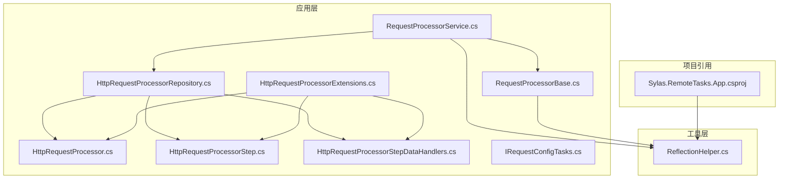
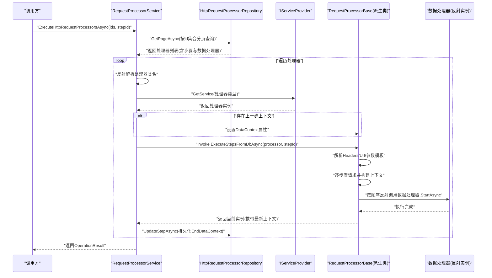
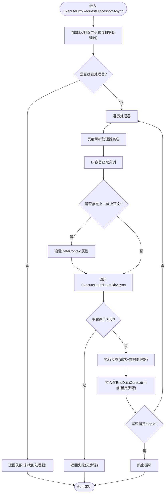
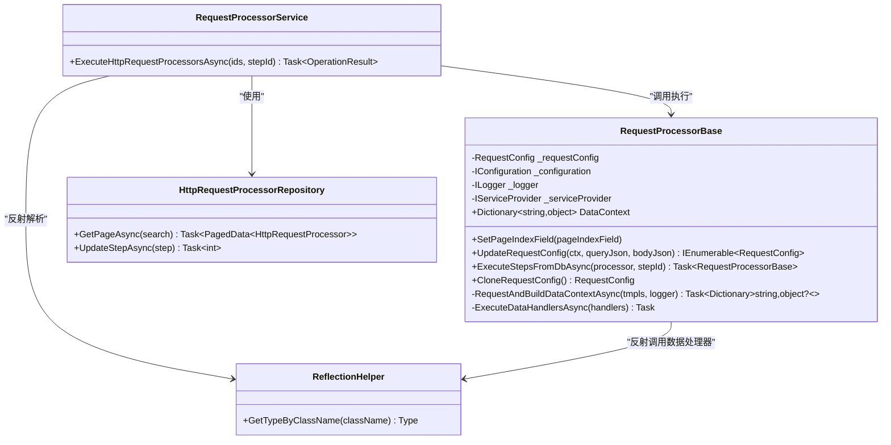
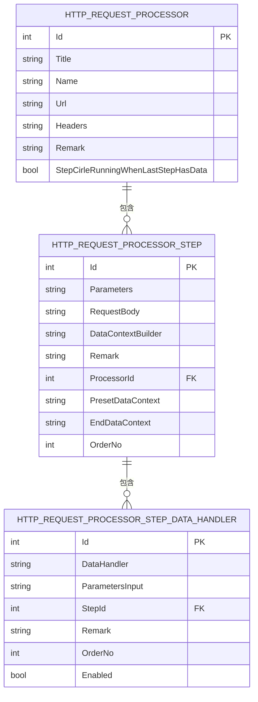
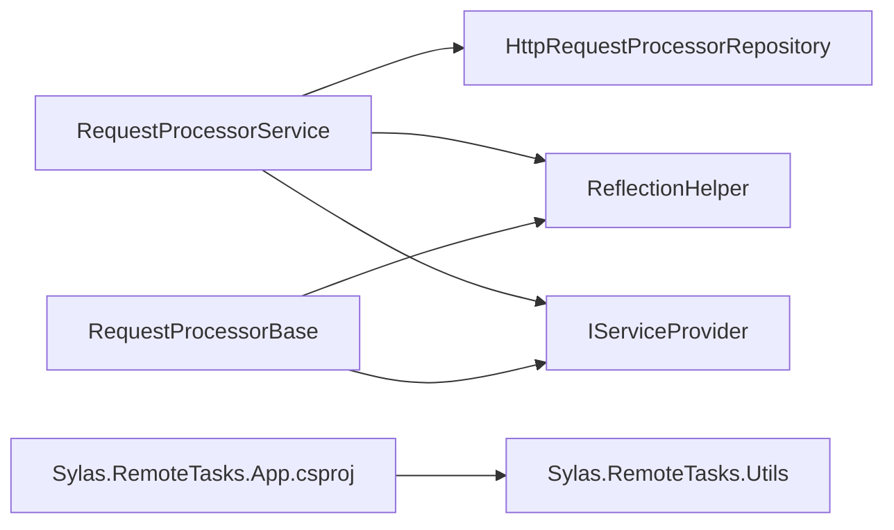

# 请求处理器服务

<cite>
**本文档引用的文件**
- [RequestProcessorService.cs](file://Sylas.RemoteTasks.App/RequestProcessor/RequestProcessorService.cs)
- [RequestProcessorBase.cs](file://Sylas.RemoteTasks.App/RequestProcessor/RequestProcessorBase.cs)
- [HttpRequestProcessor.cs](file://Sylas.RemoteTasks.App/RequestProcessor/Models/HttpRequestProcessor.cs)
- [HttpRequestProcessorStep.cs](file://Sylas.RemoteTasks.App/RequestProcessor/Models/HttpRequestProcessorStep.cs)
- [HttpRequestProcessorStepDataHandlers.cs](file://Sylas.RemoteTasks.App/RequestProcessor/Models/HttpRequestProcessorStepDataHandlers.cs)
- [HttpRequestProcessorExtensions.cs](file://Sylas.RemoteTasks.App/RequestProcessor/Models/HttpRequestProcessorExtensions.cs)
- [HttpRequestProcessorRepository.cs](file://Sylas.RemoteTasks.App/RequestProcessor/HttpRequestProcessorRepository.cs)
- [IRequestConfigTasks.cs](file://Sylas.RemoteTasks.App/RequestProcessor/IRequestConfigTasks.cs)
- [ReflectionHelper.cs](file://Sylas.RemoteTasks.Utils/ReflectionHelper.cs)
- [Sylas.RemoteTasks.App.csproj](file://Sylas.RemoteTasks.App/Sylas.RemoteTasks.App.csproj)
</cite>

## 目录
1. [简介](#简介)
2. [项目结构](#项目结构)
3. [核心组件](#核心组件)
4. [架构总览](#架构总览)
5. [详细组件分析](#详细组件分析)
6. [依赖关系分析](#依赖关系分析)
7. [性能考量](#性能考量)
8. [故障排查指南](#故障排查指南)
9. [结论](#结论)
10. [附录：使用示例与最佳实践](#附录使用示例与最佳实践)

## 简介
本文件面向“请求处理器服务”的技术文档，聚焦于 RequestProcessorService 的核心职责与实现机制，涵盖以下关键主题：
- 任务执行流程：从数据库加载处理器与步骤，按步骤顺序执行请求与数据处理器，支持断点续跑与循环回溯。
- 依赖注入容器（IServiceProvider）：在运行时通过反射解析类型并获取实例，确保可插拔扩展。
- 反射机制：动态解析处理器类名、调用执行方法、设置共享上下文、调用数据处理器等。
- ExecuteHttpRequestProcessorsAsync 方法详解：参数处理、任务查找、实例化过程、执行策略与持久化。
- RequestProcessorBase 基类设计：请求配置、上下文管理、模板解析、请求构建与数据处理器执行。
- 使用示例：如何配置与启动复杂多步骤任务执行。
- 错误处理策略、性能优化技巧与调试方法。

## 项目结构
请求处理器相关代码位于应用层的 RequestProcessor 子目录，并依赖 Utils 中的反射与远程调用能力，以及数据库仓储层完成持久化。

图表来源
- [RequestProcessorService.cs](file://Sylas.RemoteTasks.App/RequestProcessor/RequestProcessorService.cs#L1-L72)
- [RequestProcessorBase.cs](file://Sylas.RemoteTasks.App/RequestProcessor/RequestProcessorBase.cs#L1-L279)
- [HttpRequestProcessorRepository.cs](file://Sylas.RemoteTasks.App/RequestProcessor/HttpRequestProcessorRepository.cs#L1-L412)
- [HttpRequestProcessor.cs](file://Sylas.RemoteTasks.App/RequestProcessor/Models/HttpRequestProcessor.cs#L1-L22)
- [HttpRequestProcessorStep.cs](file://Sylas.RemoteTasks.App/RequestProcessor/Models/HttpRequestProcessorStep.cs#L1-L19)
- [HttpRequestProcessorStepDataHandlers.cs](file://Sylas.RemoteTasks.App/RequestProcessor/Models/HttpRequestProcessorStepDataHandlers.cs#L1-L15)
- [HttpRequestProcessorExtensions.cs](file://Sylas.RemoteTasks.App/RequestProcessor/Models/HttpRequestProcessorExtensions.cs#L1-L49)
- [IRequestConfigTasks.cs](file://Sylas.RemoteTasks.App/RequestProcessor/IRequestConfigTasks.cs#L1-L6)
- [ReflectionHelper.cs](file://Sylas.RemoteTasks.Utils/ReflectionHelper.cs#L1-L80)
- [Sylas.RemoteTasks.App.csproj](file://Sylas.RemoteTasks.App/Sylas.RemoteTasks.App.csproj#L1-L61)

章节来源
- [RequestProcessorService.cs](file://Sylas.RemoteTasks.App/RequestProcessor/RequestProcessorService.cs#L1-L72)
- [RequestProcessorBase.cs](file://Sylas.RemoteTasks.App/RequestProcessor/RequestProcessorBase.cs#L1-L279)
- [HttpRequestProcessorRepository.cs](file://Sylas.RemoteTasks.App/RequestProcessor/HttpRequestProcessorRepository.cs#L1-L412)
- [ReflectionHelper.cs](file://Sylas.RemoteTasks.Utils/ReflectionHelper.cs#L1-L80)
- [Sylas.RemoteTasks.App.csproj](file://Sylas.RemoteTasks.App/Sylas.RemoteTasks.App.csproj#L1-L61)

## 核心组件
- RequestProcessorService：负责批量加载处理器、通过反射与DI容器获取实例、调用执行方法、维护上下文并持久化步骤状态。
- RequestProcessorBase：定义请求配置、上下文、模板解析、请求构建与数据处理器执行的通用逻辑。
- HttpRequestProcessorRepository：封装处理器、步骤、数据处理器的增删改查与关联查询，支持分页与批量装载。
- 模型层：处理器、步骤、数据处理器实体与DTO，以及扩展映射。
- ReflectionHelper：提供基于类名解析类型的反射工具，支持在运行时发现与实例化类型。

章节来源
- [RequestProcessorService.cs](file://Sylas.RemoteTasks.App/RequestProcessor/RequestProcessorService.cs#L1-L72)
- [RequestProcessorBase.cs](file://Sylas.RemoteTasks.App/RequestProcessor/RequestProcessorBase.cs#L1-L279)
- [HttpRequestProcessorRepository.cs](file://Sylas.RemoteTasks.App/RequestProcessor/HttpRequestProcessorRepository.cs#L1-L412)
- [HttpRequestProcessor.cs](file://Sylas.RemoteTasks.App/RequestProcessor/Models/HttpRequestProcessor.cs#L1-L22)
- [HttpRequestProcessorStep.cs](file://Sylas.RemoteTasks.App/RequestProcessor/Models/HttpRequestProcessorStep.cs#L1-L19)
- [HttpRequestProcessorStepDataHandlers.cs](file://Sylas.RemoteTasks.App/RequestProcessor/Models/HttpRequestProcessorStepDataHandlers.cs#L1-L15)
- [HttpRequestProcessorExtensions.cs](file://Sylas.RemoteTasks.App/RequestProcessor/Models/HttpRequestProcessorExtensions.cs#L1-L49)
- [ReflectionHelper.cs](file://Sylas.RemoteTasks.Utils/ReflectionHelper.cs#L1-L80)

## 架构总览
请求处理器服务采用“仓储+基类+反射+DI”的组合模式：
- 仓储负责从数据库加载完整任务图谱（处理器、步骤、数据处理器），并按需分页加载。
- 服务层通过反射解析处理器类名，借助DI容器获取实例，调用统一的执行入口。
- 基类负责参数模板解析、请求构建、上下文传递与数据处理器链式执行。
- 执行过程中将每步的上下文序列化并持久化，支持断点续跑与回溯控制。

图表来源
- [RequestProcessorService.cs](file://Sylas.RemoteTasks.App/RequestProcessor/RequestProcessorService.cs#L11-L69)
- [RequestProcessorBase.cs](file://Sylas.RemoteTasks.App/RequestProcessor/RequestProcessorBase.cs#L83-L211)
- [HttpRequestProcessorRepository.cs](file://Sylas.RemoteTasks.App/RequestProcessor/HttpRequestProcessorRepository.cs#L23-L48)
- [ReflectionHelper.cs](file://Sylas.RemoteTasks.Utils/ReflectionHelper.cs#L51-L56)

## 详细组件分析

### RequestProcessorService 组件
- 职责
  - 加载指定ID集合的处理器及其步骤与数据处理器。
  - 通过反射与DI容器获取处理器实例。
  - 调用处理器的执行入口，支持断点执行与上下文传递。
  - 将每步执行后的上下文持久化到数据库。
- 关键点
  - 参数校验与错误处理：缺失处理器或步骤时直接返回失败。
  - 上下文传递：将上一步的 DataContext 注入当前实例的同名属性。
  - 反射调用：定位 ExecuteStepsFromDbAsync 方法并执行，兼容同步/异步返回。
  - 步骤持久化：仅持久化指定步骤或全部步骤的 EndDataContext。

图表来源
- [RequestProcessorService.cs](file://Sylas.RemoteTasks.App/RequestProcessor/RequestProcessorService.cs#L11-L69)

章节来源
- [RequestProcessorService.cs](file://Sylas.RemoteTasks.App/RequestProcessor/RequestProcessorService.cs#L1-L72)

### RequestProcessorBase 基类
- 设计理念
  - 以“请求配置 + 数据上下文 + 模板解析 + 数据处理器链”为核心，提供可扩展的多步骤执行框架。
  - 通过 CloneRequestConfig 保证每次请求配置独立，避免共享引用导致的状态污染。
- 属性与成员
  - DataContext：跨步骤共享的字典，承载请求结果与中间变量。
  - _requestConfig：默认请求配置（URL、分页字段、请求方法、鉴权等）。
  - UpdateRequestConfig：根据模板解析 Query/Body 参数，生成一组请求配置。
  - ExecuteStepsFromDbAsync：主执行流程，支持断点执行、预设上下文、循环回溯。
  - RequestAndBuildDataContextAsync：发起请求、记录查询/请求体快照、构建上下文。
  - ExecuteDataHandlersAsync：按顺序反射调用数据处理器的 StartAsync。
- 扩展机制
  - 派生类只需关注业务细节（如鉴权、参数拼装），复用基类的执行骨架。
  - 数据处理器通过字符串类名注册，运行时反射实例化，便于热扩展。

图表来源
- [RequestProcessorBase.cs](file://Sylas.RemoteTasks.App/RequestProcessor/RequestProcessorBase.cs#L12-L279)
- [RequestProcessorService.cs](file://Sylas.RemoteTasks.App/RequestProcessor/RequestProcessorService.cs#L7-L71)
- [HttpRequestProcessorRepository.cs](file://Sylas.RemoteTasks.App/RequestProcessor/HttpRequestProcessorRepository.cs#L11-L412)
- [ReflectionHelper.cs](file://Sylas.RemoteTasks.Utils/ReflectionHelper.cs#L26-L80)

章节来源
- [RequestProcessorBase.cs](file://Sylas.RemoteTasks.App/RequestProcessor/RequestProcessorBase.cs#L1-L279)

### 模型与仓储
- HttpRequestProcessor：处理器实体，包含名称、URL、Headers、步骤集合等。
- HttpRequestProcessorStep：步骤实体，包含参数模板、请求体模板、预设上下文、结束上下文、数据处理器集合等。
- HttpRequestProcessorStepDataHandlers：步骤下的数据处理器条目，包含处理器类名、参数输入、排序与启用状态。
- HttpRequestProcessorRepository：提供处理器、步骤、数据处理器的增删改查与关联装载，支持分页与批量查询。
- 扩展映射：提供 ToCreateDto 映射，便于创建与克隆。

图表来源
- [HttpRequestProcessor.cs](file://Sylas.RemoteTasks.App/RequestProcessor/Models/HttpRequestProcessor.cs#L9-L20)
- [HttpRequestProcessorStep.cs](file://Sylas.RemoteTasks.App/RequestProcessor/Models/HttpRequestProcessorStep.cs#L3-L16)
- [HttpRequestProcessorStepDataHandlers.cs](file://Sylas.RemoteTasks.App/RequestProcessor/Models/HttpRequestProcessorStepDataHandlers.cs#L3-L12)

章节来源
- [HttpRequestProcessor.cs](file://Sylas.RemoteTasks.App/RequestProcessor/Models/HttpRequestProcessor.cs#L1-L22)
- [HttpRequestProcessorStep.cs](file://Sylas.RemoteTasks.App/RequestProcessor/Models/HttpRequestProcessorStep.cs#L1-L19)
- [HttpRequestProcessorStepDataHandlers.cs](file://Sylas.RemoteTasks.App/RequestProcessor/Models/HttpRequestProcessorStepDataHandlers.cs#L1-L15)
- [HttpRequestProcessorRepository.cs](file://Sylas.RemoteTasks.App/RequestProcessor/HttpRequestProcessorRepository.cs#L1-L412)
- [HttpRequestProcessorExtensions.cs](file://Sylas.RemoteTasks.App/RequestProcessor/Models/HttpRequestProcessorExtensions.cs#L1-L49)

### 反射与DI集成
- 类型解析：通过 ReflectionHelper.GetTypeByClassName 根据类名在主程序域内查找类型。
- 实例获取：通过 IServiceProvider.GetService 获取处理器实例，确保生命周期与依赖注入生效。
- 数据处理器调用：同样通过反射解析类名并调用 StartAsync，支持异步等待。

章节来源
- [ReflectionHelper.cs](file://Sylas.RemoteTasks.Utils/ReflectionHelper.cs#L26-L80)
- [RequestProcessorService.cs](file://Sylas.RemoteTasks.App/RequestProcessor/RequestProcessorService.cs#L26-L28)
- [RequestProcessorBase.cs](file://Sylas.RemoteTasks.App/RequestProcessor/RequestProcessorBase.cs#L266-L276)

## 依赖关系分析
- RequestProcessorService 依赖 HttpRequestProcessorRepository 完成数据加载；依赖 ReflectionHelper 完成类型解析；依赖 IServiceProvider 完成实例获取。
- RequestProcessorBase 依赖 ReflectionHelper 调用数据处理器；依赖模板引擎与远程调用工具构建上下文。
- 项目引用：应用项目引用 Utils 工程，确保反射与远程调用能力可用。

图表来源
- [RequestProcessorService.cs](file://Sylas.RemoteTasks.App/RequestProcessor/RequestProcessorService.cs#L7-L9)
- [RequestProcessorBase.cs](file://Sylas.RemoteTasks.App/RequestProcessor/RequestProcessorBase.cs#L15-L17)
- [Sylas.RemoteTasks.App.csproj](file://Sylas.RemoteTasks.App/Sylas.RemoteTasks.App.csproj#L43-L43)

章节来源
- [RequestProcessorService.cs](file://Sylas.RemoteTasks.App/RequestProcessor/RequestProcessorService.cs#L1-L72)
- [RequestProcessorBase.cs](file://Sylas.RemoteTasks.App/RequestProcessor/RequestProcessorBase.cs#L1-L279)
- [Sylas.RemoteTasks.App.csproj](file://Sylas.RemoteTasks.App/Sylas.RemoteTasks.App.csproj#L1-L61)

## 性能考量
- 分页加载：仓储按批分页加载处理器与步骤，避免一次性拉取大量数据造成内存压力。
- 单步持久化：仅在步骤执行完成后持久化 EndDataContext，减少写入次数。
- 请求配置克隆：CloneRequestConfig 避免共享引用导致的重复解析与并发问题。
- 异步执行：数据处理器与远程请求均采用异步，提升吞吐量。
- 建议
  - 对大数据量的步骤循环，结合 StepCirleRunningWhenLastStepHasData 控制回溯频率。
  - 在模板解析与远程请求处增加超时与重试策略，提升稳定性。
  - 对频繁使用的处理器与数据处理器实例，评估长生命周期与缓存策略。

[本节为通用建议，不直接分析具体文件]

## 故障排查指南
- 常见异常与定位
  - 未找到处理器或步骤：检查ID是否正确、仓储查询条件与分页参数。
  - 类型解析失败：确认处理器类名与命名空间一致，且在主程序域内可见。
  - 无法获取DI实例：确认处理器已在DI容器注册，生命周期与作用域匹配。
  - 数据处理器缺少 StartAsync：确保数据处理器类实现 StartAsync 并可通过类名解析。
  - 请求失败：查看日志中的 Query/Body 快照，核对鉴权与参数模板。
- 日志与可观测性
  - 基类在关键节点输出 Debug/Information/Critical 日志，便于定位执行阶段。
  - 服务层在执行前后输出处理器名称与步骤信息，辅助排障。
- 调试建议
  - 使用 stepId 指定单步执行，快速定位问题步骤。
  - 在 ExecuteDataHandlersAsync 中断点，观察参数解析与执行顺序。
  - 检查 EndDataContext 的序列化内容，确认上下文传递是否符合预期。

章节来源
- [RequestProcessorService.cs](file://Sylas.RemoteTasks.App/RequestProcessor/RequestProcessorService.cs#L16-L19)
- [RequestProcessorBase.cs](file://Sylas.RemoteTasks.App/RequestProcessor/RequestProcessorBase.cs#L82-L102)
- [RequestProcessorBase.cs](file://Sylas.RemoteTasks.App/RequestProcessor/RequestProcessorBase.cs#L236-L254)
- [RequestProcessorBase.cs](file://Sylas.RemoteTasks.App/RequestProcessor/RequestProcessorBase.cs#L266-L276)

## 结论
请求处理器服务通过“仓储+基类+反射+DI”的架构，实现了可配置、可扩展、可持久化的多步骤任务执行框架。RequestProcessorService 负责编排与上下文传递，RequestProcessorBase 提供统一的执行骨架，ReflectionHelper 与 IServiceProvider 则保障了运行时的灵活性与可插拔性。配合完善的错误处理与日志体系，该方案适用于复杂的数据采集与处理流水线。

[本节为总结性内容，不直接分析具体文件]

## 附录：使用示例与最佳实践
- 配置处理器与步骤
  - 在数据库中创建处理器与步骤，设置 Parameters/RequestBody/DataContextBuilder/PresetDataContext 等模板。
  - 为步骤绑定数据处理器，配置参数输入与执行顺序。
- 启动执行
  - 调用 ExecuteHttpRequestProcessorsAsync(ids, stepId)，其中 stepId=0 表示从第一步开始执行，>0 表示从指定步骤断点续跑。
- 断点续跑与回溯
  - 通过 UpdateStepAsync 持久化 EndDataContext，下次执行时自动继承上一步上下文。
  - 利用 StepCirleRunningWhenLastStepHasData 实现“最后一步有数据则循环从头执行”的策略。
- 最佳实践
  - 将昂贵的上下文数据排除在持久化之外，仅保存必要字段。
  - 对模板表达式进行单元测试，确保参数解析正确。
  - 为数据处理器实现幂等与重试逻辑，增强健壮性。

章节来源
- [RequestProcessorService.cs](file://Sylas.RemoteTasks.App/RequestProcessor/RequestProcessorService.cs#L11-L69)
- [RequestProcessorBase.cs](file://Sylas.RemoteTasks.App/RequestProcessor/RequestProcessorBase.cs#L83-L211)
- [HttpRequestProcessorRepository.cs](file://Sylas.RemoteTasks.App/RequestProcessor/HttpRequestProcessorRepository.cs#L253-L295)