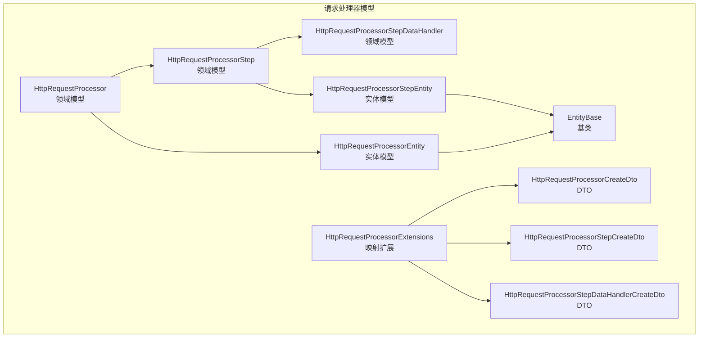
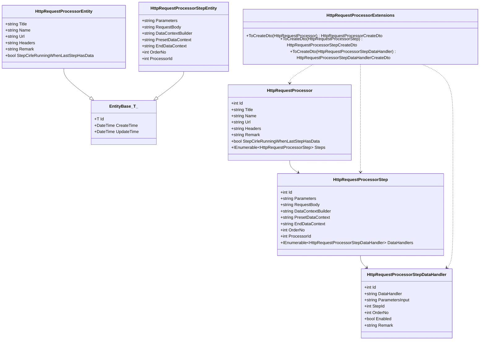
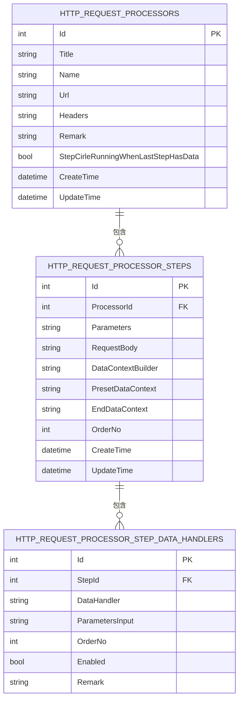
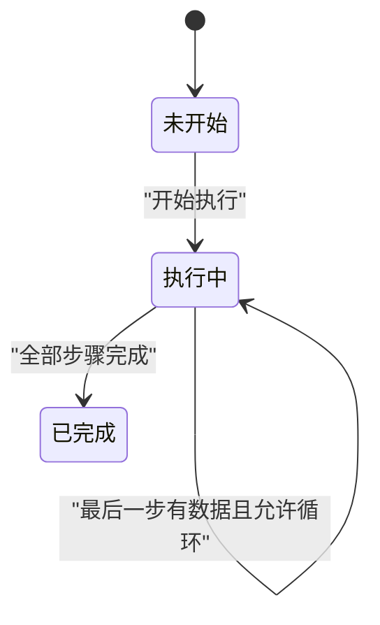
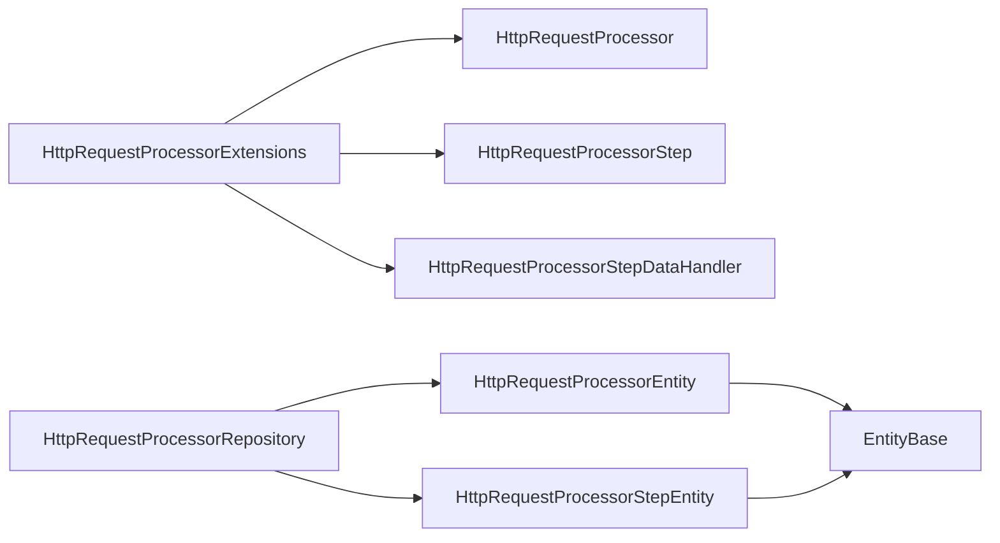

# 请求处理器模型

<cite>
**本文引用的文件**
- [HttpRequestProcessor.cs](file://Sylas.RemoteTasks.App/RequestProcessor/Models/HttpRequestProcessor.cs)
- [HttpRequestProcessorEntity.cs](file://Sylas.RemoteTasks.App/RequestProcessor/Models/HttpRequestProcessorEntity.cs)
- [HttpRequestProcessorStep.cs](file://Sylas.RemoteTasks.App/RequestProcessor/Models/HttpRequestProcessorStep.cs)
- [HttpRequestProcessorStepEntity.cs](file://Sylas.RemoteTasks.App/RequestProcessor/Models/HttpRequestProcessorStepEntity.cs)
- [HttpRequestProcessorStepDataHandlers.cs](file://Sylas.RemoteTasks.App/RequestProcessor/Models/HttpRequestProcessorStepDataHandlers.cs)
- [HttpRequestProcessorExtensions.cs](file://Sylas.RemoteTasks.App/RequestProcessor/Models/HttpRequestProcessorExtensions.cs)
- [HttpRequestProcessorInDto.cs](file://Sylas.RemoteTasks.App/RequestProcessor/Models/Dtos/HttpRequestProcessorInDto.cs)
- [HttpRequestProcessorStepCreateDto.cs](file://Sylas.RemoteTasks.App/RequestProcessor/Models/Dtos/HttpRequestProcessorStepCreateDto.cs)
- [HttpRequestProcessorStepDataHandlerCreateDto.cs](file://Sylas.RemoteTasks.App/RequestProcessor/Models/Dtos/HttpRequestProcessorStepDataHandlerCreateDto.cs)
- [EntityBase.cs](file://Sylas.RemoteTasks.Database/EntityBase.cs)
- [HttpRequestProcessorRepository.cs](file://Sylas.RemoteTasks.App/RequestProcessor/HttpRequestProcessorRepository.cs)
- [DataHandler.cs](file://Sylas.RemoteTasks.App/DataHandlers/DataHandler.cs)
- [IDataHandler.cs](file://Sylas.RemoteTasks.App/DataHandlers/IDataHandler.cs)
</cite>

## 目录
1. [简介](#简介)
2. [项目结构](#项目结构)
3. [核心组件](#核心组件)
4. [架构总览](#架构总览)
5. [详细组件分析](#详细组件分析)
6. [依赖分析](#依赖分析)
7. [性能考虑](#性能考虑)
8. [故障排查指南](#故障排查指南)
9. [结论](#结论)
10. [附录](#附录)

## 简介
本文件系统性地文档化“请求处理器模型”的数据模型设计，重点覆盖以下实体与关系：
- HttpRequestProcessor：请求处理器（流程级）
- HttpRequestProcessorStep：请求处理器步骤（步骤级）
- HttpRequestProcessorStepDataHandler：步骤数据处理器（处理器级）

文档内容包括：实体属性定义、关系映射、外键约束、数据完整性、生命周期与状态转换、持久化策略、验证规则、数据类型与字段约束、最佳实践、性能考量与扩展建议，并结合实际业务场景给出使用指导。

## 项目结构
请求处理器模型位于应用层的 RequestProcessor/Models 目录下，采用“领域模型 + 实体 + DTO + 扩展”的分层组织方式：
- 领域模型：HttpRequestProcessor、HttpRequestProcessorStep、HttpRequestProcessorStepDataHandler
- 实体模型：HttpRequestProcessorEntity、HttpRequestProcessorStepEntity
- DTO：用于输入/输出的传输对象
- 扩展：将领域模型映射到 DTO 的扩展方法
- 基类：EntityBase 提供统一的 Id、CreateTime、UpdateTime

图表来源
- [HttpRequestProcessor.cs](file://Sylas.RemoteTasks.App/RequestProcessor/Models/HttpRequestProcessor.cs#L9-L20)
- [HttpRequestProcessorStep.cs](file://Sylas.RemoteTasks.App/RequestProcessor/Models/HttpRequestProcessorStep.cs#L3-L17)
- [HttpRequestProcessorStepDataHandlers.cs](file://Sylas.RemoteTasks.App/RequestProcessor/Models/HttpRequestProcessorStepDataHandlers.cs#L3-L13)
- [HttpRequestProcessorEntity.cs](file://Sylas.RemoteTasks.App/RequestProcessor/Models/HttpRequestProcessorEntity.cs#L10-L19)
- [HttpRequestProcessorStepEntity.cs](file://Sylas.RemoteTasks.App/RequestProcessor/Models/HttpRequestProcessorStepEntity.cs#L7-L19)
- [HttpRequestProcessorExtensions.cs](file://Sylas.RemoteTasks.App/RequestProcessor/Models/HttpRequestProcessorExtensions.cs#L7-L47)
- [EntityBase.cs](file://Sylas.RemoteTasks.Database/EntityBase.cs#L9-L31)

章节来源
- [HttpRequestProcessor.cs](file://Sylas.RemoteTasks.App/RequestProcessor/Models/HttpRequestProcessor.cs#L1-L22)
- [HttpRequestProcessorStep.cs](file://Sylas.RemoteTasks.App/RequestProcessor/Models/HttpRequestProcessorStep.cs#L1-L19)
- [HttpRequestProcessorStepDataHandlers.cs](file://Sylas.RemoteTasks.App/RequestProcessor/Models/HttpRequestProcessorStepDataHandlers.cs#L1-L15)
- [HttpRequestProcessorEntity.cs](file://Sylas.RemoteTasks.App/RequestProcessor/Models/HttpRequestProcessorEntity.cs#L1-L21)
- [HttpRequestProcessorStepEntity.cs](file://Sylas.RemoteTasks.App/RequestProcessor/Models/HttpRequestProcessorStepEntity.cs#L1-L21)
- [EntityBase.cs](file://Sylas.RemoteTasks.Database/EntityBase.cs#L1-L33)

## 核心组件
- HttpRequestProcessor（领域模型）：描述一次“请求处理器”的配置与元数据，包含标题、名称、URL、请求头、备注以及是否启用“最后一步有数据时循环运行”的策略开关；同时聚合多个步骤。
- HttpRequestProcessorEntity（实体模型）：持久化实体，继承统一基类，具备 Id、Title、Name、Url、Headers、Remark、StepCirleRunningWhenLastStepHasData 等字段。
- HttpRequestProcessorStep（领域模型）：描述单个步骤的参数、请求体、上下文构建器、预设/结束上下文、顺序号、所属处理器标识等；可包含多个数据处理器。
- HttpRequestProcessorStepEntity（实体模型）：持久化实体，继承统一基类，具备 Parameters、RequestBody、DataContextBuilder、PresetDataContext、EndDataContext、OrderNo、ProcessorId 等字段。
- HttpRequestProcessorStepDataHandler（领域模型）：描述步骤内执行的数据处理器，包含处理器名、参数输入、顺序号、启用状态、备注等。
- DTO 与扩展：通过扩展方法将领域模型映射为创建用 DTO，便于控制器或服务层接收与传递。

章节来源
- [HttpRequestProcessor.cs](file://Sylas.RemoteTasks.App/RequestProcessor/Models/HttpRequestProcessor.cs#L9-L20)
- [HttpRequestProcessorEntity.cs](file://Sylas.RemoteTasks.App/RequestProcessor/Models/HttpRequestProcessorEntity.cs#L10-L19)
- [HttpRequestProcessorStep.cs](file://Sylas.RemoteTasks.App/RequestProcessor/Models/HttpRequestProcessorStep.cs#L3-L17)
- [HttpRequestProcessorStepEntity.cs](file://Sylas.RemoteTasks.App/RequestProcessor/Models/HttpRequestProcessorStepEntity.cs#L7-L19)
- [HttpRequestProcessorStepDataHandlers.cs](file://Sylas.RemoteTasks.App/RequestProcessor/Models/HttpRequestProcessorStepDataHandlers.cs#L3-L13)
- [HttpRequestProcessorExtensions.cs](file://Sylas.RemoteTasks.App/RequestProcessor/Models/HttpRequestProcessorExtensions.cs#L7-L47)

## 架构总览
请求处理器模型遵循“领域模型驱动 + 实体持久化 + DTO 映射”的分层架构。领域模型负责业务语义与行为，实体模型承载持久化契约，DTO 负责跨层传输，扩展方法提供模型间转换。

图表来源
- [EntityBase.cs](file://Sylas.RemoteTasks.Database/EntityBase.cs#L9-L31)
- [HttpRequestProcessor.cs](file://Sylas.RemoteTasks.App/RequestProcessor/Models/HttpRequestProcessor.cs#L9-L20)
- [HttpRequestProcessorEntity.cs](file://Sylas.RemoteTasks.App/RequestProcessor/Models/HttpRequestProcessorEntity.cs#L10-L19)
- [HttpRequestProcessorStep.cs](file://Sylas.RemoteTasks.App/RequestProcessor/Models/HttpRequestProcessorStep.cs#L3-L17)
- [HttpRequestProcessorStepEntity.cs](file://Sylas.RemoteTasks.App/RequestProcessor/Models/HttpRequestProcessorStepEntity.cs#L7-L19)
- [HttpRequestProcessorStepDataHandlers.cs](file://Sylas.RemoteTasks.App/RequestProcessor/Models/HttpRequestProcessorStepDataHandlers.cs#L3-L13)
- [HttpRequestProcessorExtensions.cs](file://Sylas.RemoteTasks.App/RequestProcessor/Models/HttpRequestProcessorExtensions.cs#L7-L47)

## 详细组件分析

### 实体与属性定义
- HttpRequestProcessor（领域模型）
  - 属性：Id、Title、Name、Url、Headers、Remark、StepCirleRunningWhenLastStepHasData、Steps
  - 说明：Steps 聚合多个步骤；Headers 默认空 JSON 字符串；StepCirleRunningWhenLastStepHasData 支持空值，表示“未设置”。
- HttpRequestProcessorEntity（实体模型）
  - 继承自 EntityBase<int>，具备 Id、CreateTime、UpdateTime
  - 属性：Title、Name、Url、Headers、Remark、StepCirleRunningWhenLastStepHasData
  - 表名常量：HttpRequestProcessors
- HttpRequestProcessorStep（领域模型）
  - 属性：Id、Parameters、RequestBody、DataContextBuilder、PresetDataContext、EndDataContext、OrderNo、ProcessorId、DataHandlers
  - 说明：DataHandlers 为集合，默认空列表；PresetDataContext/EndDataContext 为字符串形式的上下文片段。
- HttpRequestProcessorStepEntity（实体模型）
  - 继承自 EntityBase<int>
  - 属性：Parameters、RequestBody、DataContextBuilder、PresetDataContext、EndDataContext、OrderNo、ProcessorId
  - 表名常量：HttpRequestProcessorSteps
- HttpRequestProcessorStepDataHandler（领域模型）
  - 属性：Id、DataHandler、ParametersInput、StepId、OrderNo、Enabled、Remark
  - 说明：Enabled 默认启用；Remark 用于记录用途或说明。

章节来源
- [HttpRequestProcessor.cs](file://Sylas.RemoteTasks.App/RequestProcessor/Models/HttpRequestProcessor.cs#L9-L20)
- [HttpRequestProcessorEntity.cs](file://Sylas.RemoteTasks.App/RequestProcessor/Models/HttpRequestProcessorEntity.cs#L10-L19)
- [HttpRequestProcessorStep.cs](file://Sylas.RemoteTasks.App/RequestProcessor/Models/HttpRequestProcessorStep.cs#L3-L17)
- [HttpRequestProcessorStepEntity.cs](file://Sylas.RemoteTasks.App/RequestProcessor/Models/HttpRequestProcessorStepEntity.cs#L7-L19)
- [HttpRequestProcessorStepDataHandlers.cs](file://Sylas.RemoteTasks.App/RequestProcessor/Models/HttpRequestProcessorStepDataHandlers.cs#L3-L13)
- [EntityBase.cs](file://Sylas.RemoteTasks.Database/EntityBase.cs#L9-L31)

### 关系映射与外键约束
- HttpRequestProcessor 与 HttpRequestProcessorStep
  - 关系：一对多（一个处理器包含多个步骤）
  - 外键：HttpRequestProcessorStep.ProcessorId 指向 HttpRequestProcessor.Id
  - 约束：ProcessorId 必须存在且有效；删除处理器时需考虑级联策略（由仓储或数据库约束决定）
- HttpRequestProcessorStep 与 HttpRequestProcessorStepDataHandler
  - 关系：一对多（一个步骤包含多个数据处理器）
  - 外键：HttpRequestProcessorStepDataHandler.StepId 指向 HttpRequestProcessorStep.Id
  - 约束：StepId 必须存在且有效；OrderNo 用于排序；Enabled 控制是否启用

图表来源
- [HttpRequestProcessorEntity.cs](file://Sylas.RemoteTasks.App/RequestProcessor/Models/HttpRequestProcessorEntity.cs#L10-L19)
- [HttpRequestProcessorStepEntity.cs](file://Sylas.RemoteTasks.App/RequestProcessor/Models/HttpRequestProcessorStepEntity.cs#L7-L19)
- [HttpRequestProcessorStepDataHandlers.cs](file://Sylas.RemoteTasks.App/RequestProcessor/Models/HttpRequestProcessorStepDataHandlers.cs#L3-L13)

### 生命周期管理与状态转换
- 生命周期阶段
  - 创建：生成 HttpRequestProcessor 与步骤，设置 Headers、Remark、StepCirleRunningWhenLastStepHasData 等元数据
  - 编排：按 OrderNo 排序执行步骤；根据 StepCirleRunningWhenLastStepHasData 决策是否在最后一步有数据时继续循环
  - 执行：逐步骤执行 DataContextBuilder、RequestBody、Parameters 等配置，调用 DataHandlers 进行数据处理
  - 完成：记录 EndDataContext，汇总结果
- 状态转换
  - 未开始 → 执行中 → 已完成
  - 循环条件：当最后一步存在数据且 StepCirleRunningWhenLastStepHasData 为真时，进入下一轮循环

### 持久化策略
- 实体持久化
  - 使用 EntityBase<int> 统一 Id、CreateTime、UpdateTime
  - 表名通过 [Table] 特性或常量显式声明
- 仓储操作要点
  - 插入/更新：通过仓储进行实体持久化；更新前校验是否存在
  - 删除：需考虑外键级联或先删除子项再删除父项
- DTO 映射
  - 通过扩展方法将领域模型映射为创建 DTO，避免直接暴露实体细节

章节来源
- [EntityBase.cs](file://Sylas.RemoteTasks.Database/EntityBase.cs#L9-L31)
- [HttpRequestProcessorRepository.cs](file://Sylas.RemoteTasks.App/RequestProcessor/HttpRequestProcessorRepository.cs#L88-L120)
- [HttpRequestProcessorExtensions.cs](file://Sylas.RemoteTasks.App/RequestProcessor/Models/HttpRequestProcessorExtensions.cs#L7-L47)

### 验证规则与字段约束
- 字段类型与默认值
  - Headers 默认 "{}"（JSON 字符串）
  - StepCirleRunningWhenLastStepHasData 支持空值，映射时默认为 false
  - DataHandler.Enabled 默认 true
- 约束建议
  - ProcessorId/StepId 非空且有效
  - OrderNo 递增或唯一，确保执行顺序
  - PresetDataContext/EndDataContext 为合法的上下文片段字符串
  - Url/Name/Title/Remark 等字符串长度与业务规则一致

章节来源
- [HttpRequestProcessor.cs](file://Sylas.RemoteTasks.App/RequestProcessor/Models/HttpRequestProcessor.cs#L13-L18)
- [HttpRequestProcessorStep.cs](file://Sylas.RemoteTasks.App/RequestProcessor/Models/HttpRequestProcessorStep.cs#L6-L16)
- [HttpRequestProcessorStepDataHandlers.cs](file://Sylas.RemoteTasks.App/RequestProcessor/Models/HttpRequestProcessorStepDataHandlers.cs#L11-L12)

### 数据类型定义
- 基础类型
  - Id：整型（主键）
  - 时间：DateTime（CreateTime、UpdateTime）
  - 布尔：StepCirleRunningWhenLastStepHasData、Enabled
  - 文本：Title、Name、Url、Headers、Remark、Parameters、RequestBody、DataContextBuilder、PresetDataContext、EndDataContext、DataHandler、ParametersInput
- 集合
  - Steps：IEnumerable<HttpRequestProcessorStep>
  - DataHandlers：IEnumerable<HttpRequestProcessorStepDataHandler>

章节来源
- [EntityBase.cs](file://Sylas.RemoteTasks.Database/EntityBase.cs#L22-L30)
- [HttpRequestProcessor.cs](file://Sylas.RemoteTasks.App/RequestProcessor/Models/HttpRequestProcessor.cs#L12-L19)
- [HttpRequestProcessorStep.cs](file://Sylas.RemoteTasks.App/RequestProcessor/Models/HttpRequestProcessorStep.cs#L6-L16)
- [HttpRequestProcessorStepDataHandlers.cs](file://Sylas.RemoteTasks.App/RequestProcessor/Models/HttpRequestProcessorStepDataHandlers.cs#L6-L12)

### 数据处理接口与扩展
- IDataHandler 接口：定义异步启动方法，作为数据处理器的标准契约
- DataHandlerInfo：封装处理器名、参数列表与顺序号，便于编排与序列化

章节来源
- [IDataHandler.cs](file://Sylas.RemoteTasks.App/DataHandlers/IDataHandler.cs#L3-L6)
- [DataHandler.cs](file://Sylas.RemoteTasks.App/DataHandlers/DataHandler.cs#L3-L14)

## 依赖分析
- 组件耦合
  - 领域模型之间存在强聚合关系（处理器 → 步骤 → 数据处理器）
  - 实体模型依赖统一基类，降低重复代码
  - 扩展方法提供 DTO 映射，解耦控制器与领域模型
- 外部依赖
  - 数据库特性：通过 [Table] 特性声明表名
  - 仓储：负责实体的增删改查与事务控制

图表来源
- [HttpRequestProcessorExtensions.cs](file://Sylas.RemoteTasks.App/RequestProcessor/Models/HttpRequestProcessorExtensions.cs#L7-L47)
- [HttpRequestProcessorRepository.cs](file://Sylas.RemoteTasks.App/RequestProcessor/HttpRequestProcessorRepository.cs#L88-L120)
- [EntityBase.cs](file://Sylas.RemoteTasks.Database/EntityBase.cs#L9-L31)

## 性能考虑
- 查询优化
  - 为 ProcessorId、StepId 建立索引，加速步骤与处理器关联查询
  - 按 OrderNo 排序时，确保数据库层面的排序索引
- 写入优化
  - 批量插入步骤与数据处理器，减少往返次数
  - 合理使用事务，避免频繁提交
- 序列化与传输
  - Headers、PresetDataContext/EndDataContext 等文本字段较大时，注意压缩或分页读取
- 循环策略
  - StepCirleRunningWhenLastStepHasData 仅在必要时启用，避免无限循环

## 故障排查指南
- 常见问题
  - 外键缺失：更新步骤时未设置 ProcessorId 或设置无效
  - 顺序错乱：OrderNo 不连续或重复导致执行顺序异常
  - 循环未终止：最后一步无数据但策略仍开启，导致死循环
- 排查步骤
  - 校验实体是否存在：通过仓储查询确认记录存在
  - 检查 DTO 映射：确认扩展方法正确映射字段
  - 日志与断点：定位执行链路中的异常步骤或处理器

章节来源
- [HttpRequestProcessorRepository.cs](file://Sylas.RemoteTasks.App/RequestProcessor/HttpRequestProcessorRepository.cs#L88-L120)
- [HttpRequestProcessorExtensions.cs](file://Sylas.RemoteTasks.App/RequestProcessor/Models/HttpRequestProcessorExtensions.cs#L7-L47)

## 结论
请求处理器模型通过清晰的领域模型、实体与 DTO 分层，实现了从配置到执行的完整闭环。借助外键约束与顺序号机制，保障了数据一致性与执行顺序。通过扩展方法与仓储抽象，降低了耦合并提升了可维护性。在实际使用中，应严格遵循字段约束与循环策略，结合索引与事务优化，确保系统的稳定性与性能。

## 附录

### 使用最佳实践
- 设计阶段
  - 明确 ProcessorId/StepId 的来源与校验逻辑
  - 为 OrderNo 建立唯一性或顺序性约束
- 开发阶段
  - 使用扩展方法进行 DTO 映射，避免直接操作实体
  - 在仓储中统一处理插入/更新/删除，确保事务边界
- 运行阶段
  - 启用循环策略前，务必设置退出条件
  - 对大文本字段进行必要的压缩与分页处理

### 实际业务场景示例
- 场景一：批量抓取 API 数据
  - 设计一个处理器，包含若干步骤，每步配置不同的 URL、Headers、Parameters
  - 使用 DataContextBuilder 动态拼接上下文，DataHandlers 负责清洗与落库
- 场景二：定时同步任务
  - 设置 StepCirleRunningWhenLastStepHasData，当最后一步无数据时自动停止
  - 通过 OrderNo 保证步骤顺序，避免并发冲突