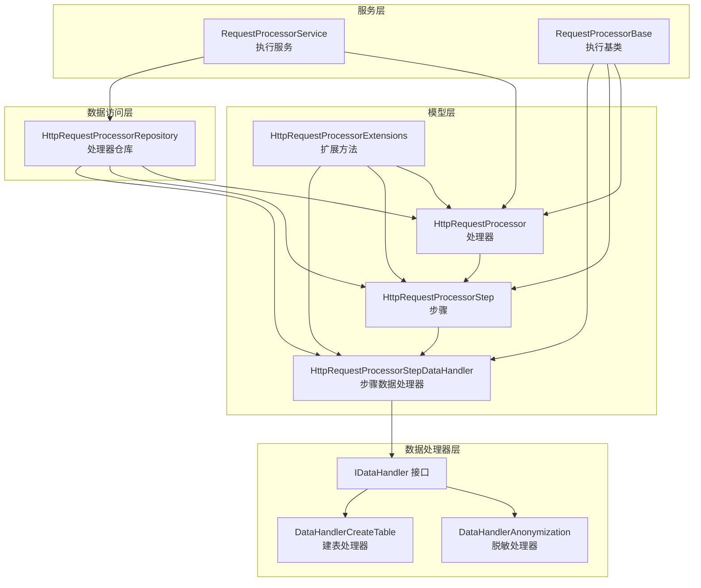
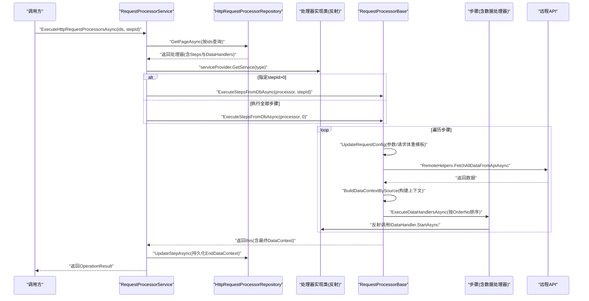
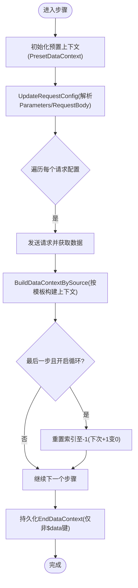
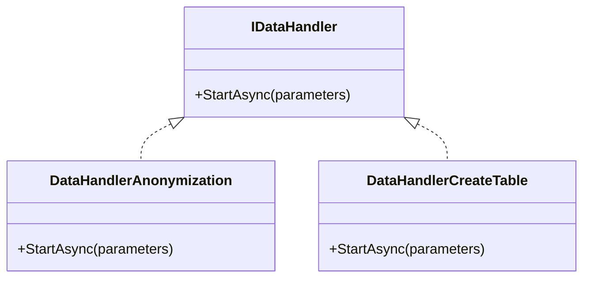
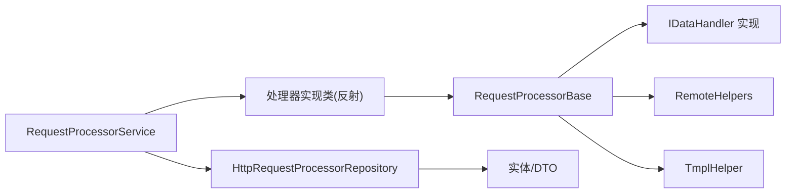

# 请求处理器步骤

<cite>
**本文档引用的文件**
- [HttpRequestProcessorStep.cs](file://Sylas.RemoteTasks.App/RequestProcessor/Models/HttpRequestProcessorStep.cs)
- [HttpRequestProcessorStepDataHandlers.cs](file://Sylas.RemoteTasks.App/RequestProcessor/Models/HttpRequestProcessorStepDataHandlers.cs)
- [HttpRequestProcessorExtensions.cs](file://Sylas.RemoteTasks.App/RequestProcessor/Models/HttpRequestProcessorExtensions.cs)
- [HttpRequestProcessor.cs](file://Sylas.RemoteTasks.App/RequestProcessor/Models/HttpRequestProcessor.cs)
- [HttpRequestProcessorEntity.cs](file://Sylas.RemoteTasks.App/RequestProcessor/Models/HttpRequestProcessorEntity.cs)
- [HttpRequestProcessorInDto.cs](file://Sylas.RemoteTasks.App/RequestProcessor/Models/Dtos/HttpRequestProcessorInDto.cs)
- [HttpRequestProcessorStepCreateDto.cs](file://Sylas.RemoteTasks.App/RequestProcessor/Models/Dtos/HttpRequestProcessorStepCreateDto.cs)
- [HttpRequestProcessorStepDataHandlerCreateDto.cs](file://Sylas.RemoteTasks.App/RequestProcessor/Models/Dtos/HttpRequestProcessorStepDataHandlerCreateDto.cs)
- [ProcessorExecuteDto.cs](file://Sylas.RemoteTasks.App/RequestProcessor/Models/Dtos/ProcessorExecuteDto.cs)
- [RequestProcessorService.cs](file://Sylas.RemoteTasks.App/RequestProcessor/RequestProcessorService.cs)
- [RequestProcessorBase.cs](file://Sylas.RemoteTasks.App/RequestProcessor/RequestProcessorBase.cs)
- [IDataHandler.cs](file://Sylas.RemoteTasks.App/DataHandlers/IDataHandler.cs)
- [DataHandlerAnonymization.cs](file://Sylas.RemoteTasks.App/DataHandlers/DataHandlerAnonymization.cs)
- [DataHandlerCreateTable.cs](file://Sylas.RemoteTasks.App/DataHandlers/DataHandlerCreateTable.cs)
- [HttpRequestProcessorRepository.cs](file://Sylas.RemoteTasks.App/RequestProcessor/HttpRequestProcessorRepository.cs)
</cite>

## 目录
1. [简介](#简介)
2. [项目结构](#项目结构)
3. [核心组件](#核心组件)
4. [架构总览](#架构总览)
5. [组件详解](#组件详解)
6. [依赖关系分析](#依赖关系分析)
7. [性能考量](#性能考量)
8. [故障排除指南](#故障排除指南)
9. [结论](#结论)
10. [附录](#附录)

## 简介
本文件面向“请求处理器步骤”的功能与实现，系统性阐述 HttpRequestProcessorStep 的设计架构与执行机制，覆盖步骤配置、数据处理与状态管理；解析步骤执行生命周期、条件判断与分支处理逻辑；说明 HttpRequestProcessorStepDataHandlers 的数据处理器集成与扩展机制；解释 HttpRequestProcessorExtensions 提供的扩展方法与工具函数；并给出完整配置示例与执行流程演示，以及调试、性能监控与故障排除建议。

## 项目结构
围绕请求处理器步骤的相关模块主要分布在以下位置：
- 模型层：处理器、步骤、数据处理器实体与DTO
- 服务层：请求处理器服务与基础执行器
- 数据访问层：处理器仓库，负责聚合步骤与数据处理器
- 数据处理器层：实现IDataHandler接口的具体处理器

图表来源
- [HttpRequestProcessor.cs](file://Sylas.RemoteTasks.App/RequestProcessor/Models/HttpRequestProcessor.cs#L1-L22)
- [HttpRequestProcessorStep.cs](file://Sylas.RemoteTasks.App/RequestProcessor/Models/HttpRequestProcessorStep.cs#L1-L19)
- [HttpRequestProcessorStepDataHandlers.cs](file://Sylas.RemoteTasks.App/RequestProcessor/Models/HttpRequestProcessorStepDataHandlers.cs#L1-L15)
- [HttpRequestProcessorExtensions.cs](file://Sylas.RemoteTasks.App/RequestProcessor/Models/HttpRequestProcessorExtensions.cs#L1-L49)
- [RequestProcessorService.cs](file://Sylas.RemoteTasks.App/RequestProcessor/RequestProcessorService.cs#L1-L72)
- [RequestProcessorBase.cs](file://Sylas.RemoteTasks.App/RequestProcessor/RequestProcessorBase.cs#L1-L279)
- [IDataHandler.cs](file://Sylas.RemoteTasks.App/DataHandlers/IDataHandler.cs#L1-L8)
- [DataHandlerAnonymization.cs](file://Sylas.RemoteTasks.App/DataHandlers/DataHandlerAnonymization.cs#L1-L42)
- [DataHandlerCreateTable.cs](file://Sylas.RemoteTasks.App/DataHandlers/DataHandlerCreateTable.cs#L1-L34)
- [HttpRequestProcessorRepository.cs](file://Sylas.RemoteTasks.App/RequestProcessor/HttpRequestProcessorRepository.cs#L1-L412)

章节来源
- [HttpRequestProcessor.cs](file://Sylas.RemoteTasks.App/RequestProcessor/Models/HttpRequestProcessor.cs#L1-L22)
- [RequestProcessorService.cs](file://Sylas.RemoteTasks.App/RequestProcessor/RequestProcessorService.cs#L1-L72)
- [RequestProcessorBase.cs](file://Sylas.RemoteTasks.App/RequestProcessor/RequestProcessorBase.cs#L1-L279)
- [HttpRequestProcessorRepository.cs](file://Sylas.RemoteTasks.App/RequestProcessor/HttpRequestProcessorRepository.cs#L1-L412)

## 核心组件
- 处理器（HttpRequestProcessor）：承载多个步骤，定义全局URL、Headers、备注等，并可配置“最后一步有数据时是否循环回到第一步”。
- 步骤（HttpRequestProcessorStep）：描述单个请求步骤，包含参数模板、请求体模板、上下文构建器、预置上下文、结束上下文、顺序号、所属处理器ID及数据处理器列表。
- 数据处理器（HttpRequestProcessorStepDataHandler）：描述步骤内要执行的数据处理器，包含处理器类名、参数输入、顺序号、启用状态、备注、所属步骤ID。
- 执行服务（RequestProcessorService）：负责按ID批量加载处理器，通过反射获取实现类实例，调用其执行方法，并在每步结束后持久化上下文。
- 执行基类（RequestProcessorBase）：封装请求配置、上下文构建、请求发送、数据处理器执行、循环与回溯控制等核心逻辑。
- 仓库（HttpRequestProcessorRepository）：负责分页查询处理器及其步骤、数据处理器，支持克隆、更新、删除等操作。
- 扩展（HttpRequestProcessorExtensions）：提供从实体到DTO的映射扩展方法，便于创建与克隆。
- 数据处理器接口（IDataHandler）与实现：定义统一的StartAsync入口，如脱敏、建表等。

章节来源
- [HttpRequestProcessor.cs](file://Sylas.RemoteTasks.App/RequestProcessor/Models/HttpRequestProcessor.cs#L1-L22)
- [HttpRequestProcessorStep.cs](file://Sylas.RemoteTasks.App/RequestProcessor/Models/HttpRequestProcessorStep.cs#L1-L19)
- [HttpRequestProcessorStepDataHandlers.cs](file://Sylas.RemoteTasks.App/RequestProcessor/Models/HttpRequestProcessorStepDataHandlers.cs#L1-L15)
- [RequestProcessorService.cs](file://Sylas.RemoteTasks.App/RequestProcessor/RequestProcessorService.cs#L1-L72)
- [RequestProcessorBase.cs](file://Sylas.RemoteTasks.App/RequestProcessor/RequestProcessorBase.cs#L1-L279)
- [HttpRequestProcessorRepository.cs](file://Sylas.RemoteTasks.App/RequestProcessor/HttpRequestProcessorRepository.cs#L1-L412)
- [HttpRequestProcessorExtensions.cs](file://Sylas.RemoteTasks.App/RequestProcessor/Models/HttpRequestProcessorExtensions.cs#L1-L49)
- [IDataHandler.cs](file://Sylas.RemoteTasks.App/DataHandlers/IDataHandler.cs#L1-L8)

## 架构总览
请求处理器步骤的整体执行链路如下：
- 服务层根据传入的处理器ID集合加载处理器及其步骤与数据处理器
- 基于反射定位具体处理器实现类，注入DI容器中的实例
- 执行器按步骤顺序或指定步骤执行，逐个生成请求配置
- 发送HTTP请求，构建上下文，再依次调用步骤内的数据处理器
- 每步结束后仅持久化必要的上下文键值，避免大对象写入
- 支持“最后一步有数据时循环回到第一步”的条件分支

图表来源
- [RequestProcessorService.cs](file://Sylas.RemoteTasks.App/RequestProcessor/RequestProcessorService.cs#L11-L69)
- [RequestProcessorBase.cs](file://Sylas.RemoteTasks.App/RequestProcessor/RequestProcessorBase.cs#L83-L211)
- [HttpRequestProcessorRepository.cs](file://Sylas.RemoteTasks.App/RequestProcessor/HttpRequestProcessorRepository.cs#L23-L47)

## 组件详解

### HttpRequestProcessorStep（步骤）
- 关键字段
  - 参数模板：Parameters（JSON字符串，用于动态拼装查询参数）
  - 请求体模板：RequestBody（POST场景下的JSON模板）
  - 上下文构建器：DataContextBuilder（JSON数组，描述如何从响应数据构建上下文键值）
  - 预置上下文：PresetDataContext（键值对形式的初始上下文）
  - 结束上下文：EndDataContext（步骤结束时持久化的上下文快照）
  - 顺序号：OrderNo（决定步骤执行顺序）
  - 所属处理器：ProcessorId
  - 数据处理器集合：DataHandlers（每个步骤可挂载多个数据处理器）
- 设计要点
  - 通过模板与表达式引擎在运行时解析参数与请求体
  - 通过DataContextBuilder将原始响应数据映射为业务可用的上下文键值
  - 仅持久化必要上下文，避免将超大数据写入数据库

章节来源
- [HttpRequestProcessorStep.cs](file://Sylas.RemoteTasks.App/RequestProcessor/Models/HttpRequestProcessorStep.cs#L1-L19)

### HttpRequestProcessorStepDataHandlers（步骤数据处理器）
- 关键字段
  - 处理器类名：DataHandler（完全限定类名，用于反射获取实现）
  - 参数输入：ParametersInput（JSON数组，作为StartAsync的参数列表）
  - 顺序号：OrderNo（同一步骤内按序执行）
  - 启用状态：Enabled（是否参与执行）
  - 所属步骤：StepId
  - 备注：Remark
- 设计要点
  - 通过DI容器解析IDataHandler实现
  - 按OrderNo排序执行，保证确定性
  - 参数输入支持表达式解析，可在运行时从上下文中取值

章节来源
- [HttpRequestProcessorStepDataHandlers.cs](file://Sylas.RemoteTasks.App/RequestProcessor/Models/HttpRequestProcessorStepDataHandlers.cs#L1-L15)

### HttpRequestProcessorExtensions（扩展方法）
- 提供从实体到DTO的映射扩展
  - HttpRequestProcessorStep.ToCreateDto
  - HttpRequestProcessorStepDataHandler.ToCreateDto
  - HttpRequestProcessor.ToCreateDto
- 用途
  - 在创建、克隆或导出配置时，快速转换为传输层DTO

章节来源
- [HttpRequestProcessorExtensions.cs](file://Sylas.RemoteTasks.App/RequestProcessor/Models/HttpRequestProcessorExtensions.cs#L1-L49)

### RequestProcessorService（执行服务）
- 职责
  - 加载处理器（支持批量ID与单步执行）
  - 反射定位实现类并注入DI容器
  - 调用实现类的ExecuteStepsFromDbAsync
  - 将每步结束后的上下文写回数据库
- 关键点
  - 支持按stepId执行特定步骤
  - 将上一步EndDataContext注入到后续步骤的DataContext
  - 返回OperationResult，便于上层判断执行结果

章节来源
- [RequestProcessorService.cs](file://Sylas.RemoteTasks.App/RequestProcessor/RequestProcessorService.cs#L11-L69)

### RequestProcessorBase（执行基类）
- 请求配置与上下文
  - RequestConfig：包含URL、请求方法、查询参数字典、请求体字典、令牌等
  - DataContext：键值对上下文，贯穿整个执行过程
- 执行流程
  - 解析Headers中的Authorization，提取Bearer令牌
  - 根据stepId决定执行范围（全部或单步）
  - 初始化预置上下文（PresetDataContext）
  - 生成请求配置（Parameters/RequestBody模板解析）
  - 发送请求并构建上下文（DataContextBuilder）
  - 执行数据处理器（按OrderNo排序）
  - 循环控制：当最后一步有数据且开启循环时，回到第一步
  - 持久化：仅保存非$data的键值到EndDataContext
- 方法要点
  - UpdateRequestConfig：解析模板，生成一组RequestConfig
  - RequestAndBuildDataContextAsync：发送请求并构建上下文
  - ExecuteDataHandlersAsync：反射调用IDataHandler.StartAsync
  - CloneRequestConfig：深拷贝请求配置，避免共享引用问题

图表来源
- [RequestProcessorBase.cs](file://Sylas.RemoteTasks.App/RequestProcessor/RequestProcessorBase.cs#L108-L207)

章节来源
- [RequestProcessorBase.cs](file://Sylas.RemoteTasks.App/RequestProcessor/RequestProcessorBase.cs#L83-L279)

### 数据处理器集成与扩展（IDataHandler）
- 接口约束
  - StartAsync(params object[])：统一入口，参数由ParametersInput解析而来
- 执行机制
  - 通过反射获取处理器类型与StartAsync方法
  - 通过DI容器解析实例并调用
  - 支持异步任务等待
- 示例实现
  - DataHandlerAnonymization：对指定列进行脱敏处理
  - DataHandlerCreateTable：根据列信息创建目标表

图表来源
- [IDataHandler.cs](file://Sylas.RemoteTasks.App/DataHandlers/IDataHandler.cs#L1-L8)
- [DataHandlerAnonymization.cs](file://Sylas.RemoteTasks.App/DataHandlers/DataHandlerAnonymization.cs#L1-L42)
- [DataHandlerCreateTable.cs](file://Sylas.RemoteTasks.App/DataHandlers/DataHandlerCreateTable.cs#L1-L34)

章节来源
- [IDataHandler.cs](file://Sylas.RemoteTasks.App/DataHandlers/IDataHandler.cs#L1-L8)
- [DataHandlerAnonymization.cs](file://Sylas.RemoteTasks.App/DataHandlers/DataHandlerAnonymization.cs#L1-L42)
- [DataHandlerCreateTable.cs](file://Sylas.RemoteTasks.App/DataHandlers/DataHandlerCreateTable.cs#L1-L34)

### 仓库与DTO（HttpRequestProcessorRepository、DTOs）
- 仓库职责
  - 分页查询处理器、步骤、数据处理器
  - 支持克隆（复制处理器、步骤、数据处理器）
  - 支持更新步骤EndDataContext
- DTO
  - HttpRequestProcessorCreateDto：创建处理器时的输入
  - HttpRequestProcessorStepCreateDto：创建步骤时的输入
  - HttpRequestProcessorStepDataHandlerCreateDto：创建数据处理器时的输入
  - ProcessorExecuteDto：执行时的输入（处理器ID数组与可选stepId）

章节来源
- [HttpRequestProcessorRepository.cs](file://Sylas.RemoteTasks.App/RequestProcessor/HttpRequestProcessorRepository.cs#L23-L47)
- [HttpRequestProcessorInDto.cs](file://Sylas.RemoteTasks.App/RequestProcessor/Models/Dtos/HttpRequestProcessorInDto.cs#L1-L13)
- [HttpRequestProcessorStepCreateDto.cs](file://Sylas.RemoteTasks.App/RequestProcessor/Models/Dtos/HttpRequestProcessorStepCreateDto.cs#L1-L15)
- [HttpRequestProcessorStepDataHandlerCreateDto.cs](file://Sylas.RemoteTasks.App/RequestProcessor/Models/Dtos/HttpRequestProcessorStepDataHandlerCreateDto.cs#L1-L13)
- [ProcessorExecuteDto.cs](file://Sylas.RemoteTasks.App/RequestProcessor/Models/Dtos/ProcessorExecuteDto.cs#L1-L9)

## 依赖关系分析
- 组件耦合
  - RequestProcessorService 依赖 HttpRequestProcessorRepository 与 DI 容器
  - RequestProcessorBase 依赖 IDataHandler 实现与模板引擎
  - 仓库负责聚合实体与DTO，减少上层复杂度
- 外部依赖
  - 远程API调用（RemoteHelpers）
  - 表达式与模板解析（TmplHelper）
  - 数据库提供者（IDatabaseProvider）

图表来源
- [RequestProcessorService.cs](file://Sylas.RemoteTasks.App/RequestProcessor/RequestProcessorService.cs#L7-L28)
- [RequestProcessorBase.cs](file://Sylas.RemoteTasks.App/RequestProcessor/RequestProcessorBase.cs#L1-L40)
- [HttpRequestProcessorRepository.cs](file://Sylas.RemoteTasks.App/RequestProcessor/HttpRequestProcessorRepository.cs#L1-L15)

章节来源
- [RequestProcessorService.cs](file://Sylas.RemoteTasks.App/RequestProcessor/RequestProcessorService.cs#L1-L72)
- [RequestProcessorBase.cs](file://Sylas.RemoteTasks.App/RequestProcessor/RequestProcessorBase.cs#L1-L279)
- [HttpRequestProcessorRepository.cs](file://Sylas.RemoteTasks.App/RequestProcessor/HttpRequestProcessorRepository.cs#L1-L412)

## 性能考量
- 上下文持久化优化
  - 仅保存非$data的键值，避免将大响应数据写入数据库
- 请求配置复用
  - CloneRequestConfig避免共享引用导致的并发问题
- 数据处理器顺序
  - 按OrderNo排序执行，确保确定性与可维护性
- 循环控制
  - “最后一步有数据时循环回到第一步”需谨慎使用，防止无限循环
- 日志与可观测性
  - 在关键节点输出日志，便于定位性能瓶颈

[本节为通用指导，无需列出章节来源]

## 故障排除指南
- 常见错误与定位
  - 缺少处理器名称或URL：在服务层与执行基类均有校验，检查配置
  - 未找到指定步骤：stepId>0时若找不到目标步骤会抛异常
  - 数据处理器未实现StartAsync：反射调用时会报错
  - Headers格式不正确：执行基类会记录警告
- 调试建议
  - 开启详细日志，观察每步的请求参数与响应数量
  - 使用单步执行（stepId>0）缩小问题范围
  - 检查模板表达式解析结果，确认上下文键是否存在
- 性能监控
  - 记录每步耗时与数据量，识别慢请求与大响应
  - 监控循环次数，避免无意义的重复执行

章节来源
- [RequestProcessorService.cs](file://Sylas.RemoteTasks.App/RequestProcessor/RequestProcessorService.cs#L23-L28)
- [RequestProcessorBase.cs](file://Sylas.RemoteTasks.App/RequestProcessor/RequestProcessorBase.cs#L85-L102)
- [RequestProcessorBase.cs](file://Sylas.RemoteTasks.App/RequestProcessor/RequestProcessorBase.cs#L266-L275)

## 结论
HttpRequestProcessorStep 通过“模板驱动的参数与请求体解析 + 上下文构建 + 数据处理器扩展”的组合，实现了灵活、可配置、可扩展的请求处理流水线。配合仓库的聚合能力与服务层的反射调度，能够在不修改核心代码的前提下，通过配置与自定义数据处理器满足多样化的业务需求。建议在生产环境中严格控制循环策略、优化上下文持久化与日志级别，并建立完善的监控与告警体系。

[本节为总结性内容，无需列出章节来源]

## 附录

### 步骤配置示例（文字说明）
- 处理器配置
  - 名称：处理器实现类的完全限定类名
  - URL：基础请求地址
  - Headers：JSON字符串，支持Authorization: Bearer Token
  - StepCirleRunningWhenLastStepHasData：布尔值，控制最后一步有数据时是否循环
- 步骤配置
  - Parameters：查询参数模板（JSON字符串）
  - RequestBody：请求体模板（JSON字符串，POST场景）
  - DataContextBuilder：上下文构建模板（JSON数组）
  - PresetDataContext：预置上下文（键值对字符串）
  - OrderNo：顺序号
  - DataHandlers：数据处理器列表（每个包含DataHandler类名、ParametersInput、OrderNo、Enabled）
- 执行方式
  - 批量执行：传入处理器ID数组
  - 单步执行：传入stepId，仅执行该步骤

章节来源
- [HttpRequestProcessorInDto.cs](file://Sylas.RemoteTasks.App/RequestProcessor/Models/Dtos/HttpRequestProcessorInDto.cs#L1-L13)
- [HttpRequestProcessorStepCreateDto.cs](file://Sylas.RemoteTasks.App/RequestProcessor/Models/Dtos/HttpRequestProcessorStepCreateDto.cs#L1-L15)
- [HttpRequestProcessorStepDataHandlerCreateDto.cs](file://Sylas.RemoteTasks.App/RequestProcessor/Models/Dtos/HttpRequestProcessorStepDataHandlerCreateDto.cs#L1-L13)
- [ProcessorExecuteDto.cs](file://Sylas.RemoteTasks.App/RequestProcessor/Models/Dtos/ProcessorExecuteDto.cs#L1-L9)