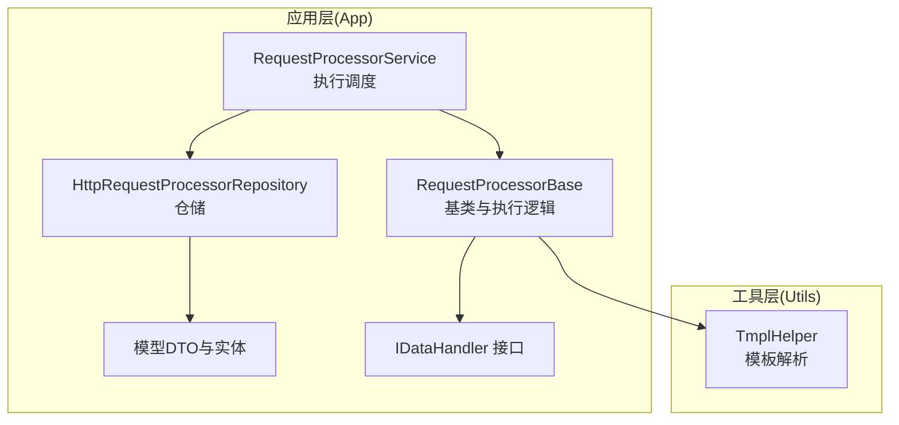
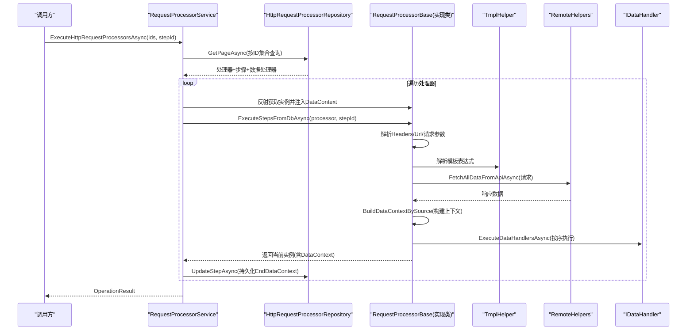
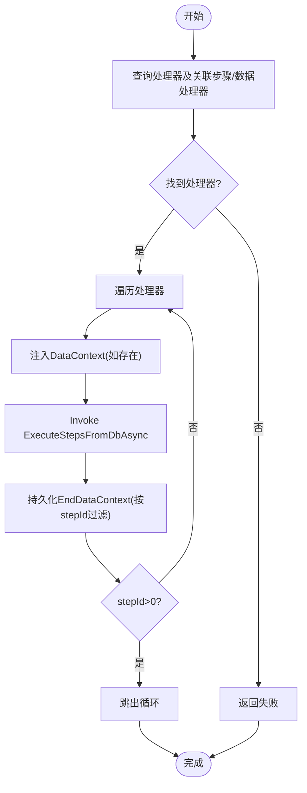
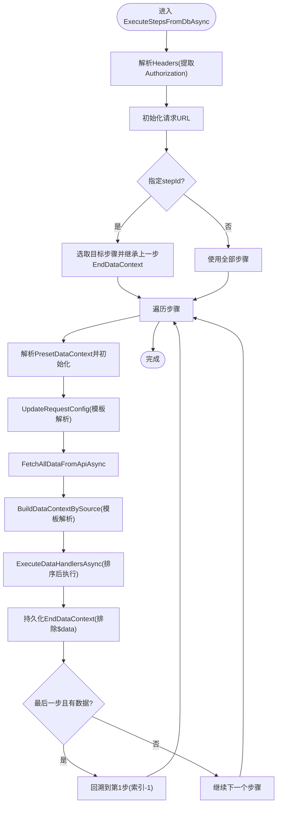
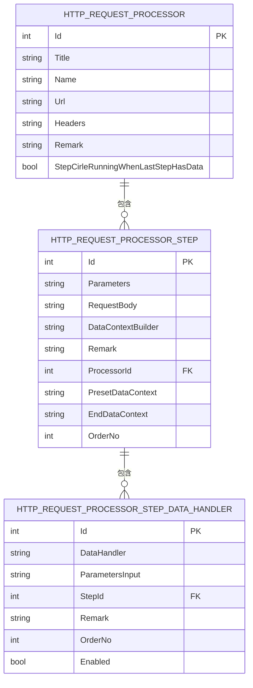
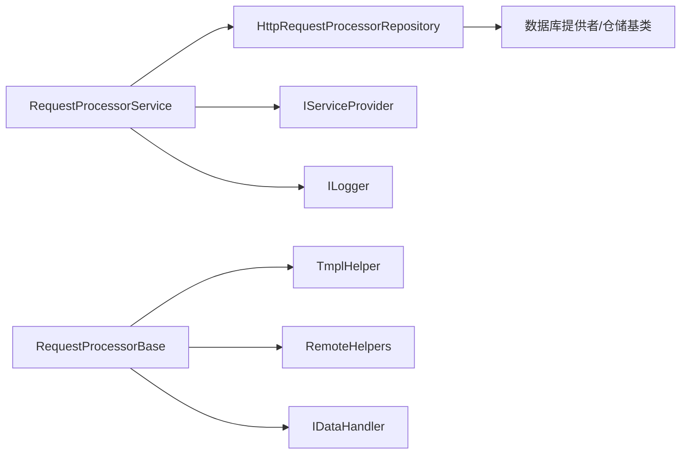

# 请求处理器系统

<cite>
**本文档引用的文件**
- [RequestProcessorService.cs](file://Sylas.RemoteTasks.App/RequestProcessor/RequestProcessorService.cs)
- [RequestProcessorBase.cs](file://Sylas.RemoteTasks.App/RequestProcessor/RequestProcessorBase.cs)
- [HttpRequestProcessor.cs](file://Sylas.RemoteTasks.App/RequestProcessor/Models/HttpRequestProcessor.cs)
- [HttpRequestProcessorStep.cs](file://Sylas.RemoteTasks.App/RequestProcessor/Models/HttpRequestProcessorStep.cs)
- [HttpRequestProcessorEntity.cs](file://Sylas.RemoteTasks.App/RequestProcessor/Models/HttpRequestProcessorEntity.cs)
- [HttpRequestProcessorStepEntity.cs](file://Sylas.RemoteTasks.App/RequestProcessor/Models/HttpRequestProcessorStepEntity.cs)
- [HttpRequestProcessorStepDataHandlers.cs](file://Sylas.RemoteTasks.App/RequestProcessor/Models/HttpRequestProcessorStepDataHandlers.cs)
- [HttpRequestProcessorRepository.cs](file://Sylas.RemoteTasks.App/RequestProcessor/HttpRequestProcessorRepository.cs)
- [IRequestConfigTasks.cs](file://Sylas.RemoteTasks.App/RequestProcessor/IRequestConfigTasks.cs)
- [TmplHelper.cs](file://Sylas.RemoteTasks.Utils/Template/TmplHelper.cs)
- [IDataHandler.cs](file://Sylas.RemoteTasks.App/DataHandlers/IDataHandler.cs)
</cite>

## 目录
1. [简介](#简介)
2. [项目结构](#项目结构)
3. [核心组件](#核心组件)
4. [架构总览](#架构总览)
5. [详细组件分析](#详细组件分析)
6. [依赖分析](#依赖分析)
7. [性能考量](#性能考量)
8. [故障排查指南](#故障排查指南)
9. [结论](#结论)
10. [附录：使用示例与最佳实践](#附录使用示例与最佳实践)

## 简介
本文件面向“请求处理器系统”，系统性阐述 RequestProcessorService 的架构与工作流、RequestProcessorBase 的基类设计与扩展机制、HttpRequestProcessor 与 HttpRequestProcessorStep 的实体模型与关系映射、模板解析与数据绑定策略、以及错误处理流程。同时提供完整的使用示例、性能优化建议、并发处理策略与调试方法，帮助读者快速理解并高效使用该系统完成复杂的多步骤任务编排。

## 项目结构
请求处理器系统位于应用层的 RequestProcessor 子目录，围绕“处理器-步骤-数据处理器”三层结构组织，并通过仓储层统一访问数据库表。模板解析能力由 Utils 模块提供，数据处理器接口位于 App 层 DataHandlers。

图表来源
- [RequestProcessorService.cs](file://Sylas.RemoteTasks.App/RequestProcessor/RequestProcessorService.cs#L1-L72)
- [RequestProcessorBase.cs](file://Sylas.RemoteTasks.App/RequestProcessor/RequestProcessorBase.cs#L1-L279)
- [HttpRequestProcessorRepository.cs](file://Sylas.RemoteTasks.App/RequestProcessor/HttpRequestProcessorRepository.cs#L1-L412)
- [TmplHelper.cs](file://Sylas.RemoteTasks.Utils/Template/TmplHelper.cs#L1-L740)
- [IDataHandler.cs](file://Sylas.RemoteTasks.App/DataHandlers/IDataHandler.cs#L1-L8)

章节来源
- [RequestProcessorService.cs](file://Sylas.RemoteTasks.App/RequestProcessor/RequestProcessorService.cs#L1-L72)
- [RequestProcessorBase.cs](file://Sylas.RemoteTasks.App/RequestProcessor/RequestProcessorBase.cs#L1-L279)
- [HttpRequestProcessorRepository.cs](file://Sylas.RemoteTasks.App/RequestProcessor/HttpRequestProcessorRepository.cs#L1-L412)

## 核心组件
- RequestProcessorService：负责批量执行处理器，按顺序加载处理器、注入 DataContext、调用 ExecuteStepsFromDbAsync 并持久化步骤上下文。
- RequestProcessorBase：基类，封装请求配置、模板解析、数据上下文构建、步骤循环与回溯、数据处理器执行等核心逻辑。
- HttpRequestProcessor / Step / StepDataHandler：领域模型，描述处理器、步骤与数据处理器的配置与执行关系。
- HttpRequestProcessorRepository：仓储，负责分页查询处理器及其步骤、数据处理器，并提供增删改与克隆能力。
- TmplHelper：模板解析引擎，支持表达式解析、集合选择、正则抽取、for 循环渲染等。
- IDataHandler：数据处理器接口，约定 StartAsync 执行入口。

章节来源
- [RequestProcessorService.cs](file://Sylas.RemoteTasks.App/RequestProcessor/RequestProcessorService.cs#L1-L72)
- [RequestProcessorBase.cs](file://Sylas.RemoteTasks.App/RequestProcessor/RequestProcessorBase.cs#L1-L279)
- [HttpRequestProcessor.cs](file://Sylas.RemoteTasks.App/RequestProcessor/Models/HttpRequestProcessor.cs#L1-L22)
- [HttpRequestProcessorStep.cs](file://Sylas.RemoteTasks.App/RequestProcessor/Models/HttpRequestProcessorStep.cs#L1-L19)
- [HttpRequestProcessorStepDataHandlers.cs](file://Sylas.RemoteTasks.App/RequestProcessor/Models/HttpRequestProcessorStepDataHandlers.cs#L1-L15)
- [HttpRequestProcessorRepository.cs](file://Sylas.RemoteTasks.App/RequestProcessor/HttpRequestProcessorRepository.cs#L1-L412)
- [TmplHelper.cs](file://Sylas.RemoteTasks.Utils/Template/TmplHelper.cs#L1-L740)
- [IDataHandler.cs](file://Sylas.RemoteTasks.App/DataHandlers/IDataHandler.cs#L1-L8)

## 架构总览
系统采用“配置驱动 + 模板解析 + 数据处理器”的流水线架构。执行流程如下：
- 服务层根据处理器ID集合批量拉取处理器及其步骤、数据处理器。
- 对每个处理器，通过反射获取其实现类，注入共享 DataContext。
- 基类按步骤顺序执行：解析模板参数、发起HTTP请求、构建数据上下文、执行数据处理器。
- 支持步骤回溯（当最后一步有数据时循环回到第一步）与步骤断点续跑。
- 每步结束后持久化 EndDataContext，便于下次从指定步骤继续执行。

图表来源
- [RequestProcessorService.cs](file://Sylas.RemoteTasks.App/RequestProcessor/RequestProcessorService.cs#L11-L69)
- [RequestProcessorBase.cs](file://Sylas.RemoteTasks.App/RequestProcessor/RequestProcessorBase.cs#L83-L211)
- [HttpRequestProcessorRepository.cs](file://Sylas.RemoteTasks.App/RequestProcessor/HttpRequestProcessorRepository.cs#L23-L47)
- [TmplHelper.cs](file://Sylas.RemoteTasks.Utils/Template/TmplHelper.cs#L213-L271)

## 详细组件分析

### RequestProcessorService：执行调度与上下文传递
- 批量查询处理器及其步骤、数据处理器，一次性载入内存，避免重复查询。
- 通过反射按名称获取处理器实现类，注入共享 DataContext，使多处理器之间可传递上下文。
- 调用实现类的 ExecuteStepsFromDbAsync 方法，等待异步完成并读取 DataContext。
- 按 stepId 持久化当前步骤 EndDataContext，支持断点续跑与步骤回溯。

图表来源
- [RequestProcessorService.cs](file://Sylas.RemoteTasks.App/RequestProcessor/RequestProcessorService.cs#L11-L69)

章节来源
- [RequestProcessorService.cs](file://Sylas.RemoteTasks.App/RequestProcessor/RequestProcessorService.cs#L1-L72)

### RequestProcessorBase：基类设计与执行流程
- 请求配置：内部维护 RequestConfig，包含 URL、Headers、Query/Body 参数、分页字段、鉴权令牌等。
- 模板解析：UpdateRequestConfig 解析 Parameters/RequestBody 中的模板表达式，结合 DataContext 动态生成请求参数。
- 步骤执行：ExecuteStepsFromDbAsync 负责：
  - 解析 Authorization 头部中的 Bearer 令牌。
  - 支持 stepId 指定执行某一步骤或全量执行。
  - 支持步骤回溯：当最后一步有数据时自动回到第一步。
  - 预设 DataContext（PresetDataContext），构建数据上下文（BuildDataContextBySource），并执行 DataHandlers。
- 数据上下文：$data 缓存本次请求数据；$QueryDictionary/$BodyDictionary 记录本次请求参数；仅持久化非 $data 的键值，避免冗余。
- 克隆请求配置：CloneRequestConfig 避免 QueryDictionary 引用共享导致的副作用。

图表来源
- [RequestProcessorBase.cs](file://Sylas.RemoteTasks.App/RequestProcessor/RequestProcessorBase.cs#L83-L211)
- [RequestProcessorBase.cs](file://Sylas.RemoteTasks.App/RequestProcessor/RequestProcessorBase.cs#L236-L276)
- [TmplHelper.cs](file://Sylas.RemoteTasks.Utils/Template/TmplHelper.cs#L213-L271)

章节来源
- [RequestProcessorBase.cs](file://Sylas.RemoteTasks.App/RequestProcessor/RequestProcessorBase.cs#L1-L279)

### 实体模型与关系映射
- HttpRequestProcessor：处理器实体，包含标题、类名、URL、Headers、备注、是否在最后一步有数据时循环运行等。
- HttpRequestProcessorStep：步骤实体，包含 Parameters、RequestBody、DataContextBuilder、预设与结束上下文、顺序号、所属处理器ID。
- HttpRequestProcessorStepDataHandler：步骤下的数据处理器配置，包含处理器类名、参数输入、顺序号、启用状态等。
- 实体类（Entity）：与数据库表一一对应，用于仓储层的 CRUD 操作。

图表来源
- [HttpRequestProcessor.cs](file://Sylas.RemoteTasks.App/RequestProcessor/Models/HttpRequestProcessor.cs#L9-L20)
- [HttpRequestProcessorStep.cs](file://Sylas.RemoteTasks.App/RequestProcessor/Models/HttpRequestProcessorStep.cs#L3-L16)
- [HttpRequestProcessorStepDataHandlers.cs](file://Sylas.RemoteTasks.App/RequestProcessor/Models/HttpRequestProcessorStepDataHandlers.cs#L3-L12)
- [HttpRequestProcessorEntity.cs](file://Sylas.RemoteTasks.App/RequestProcessor/Models/HttpRequestProcessorEntity.cs#L9-L19)
- [HttpRequestProcessorStepEntity.cs](file://Sylas.RemoteTasks.App/RequestProcessor/Models/HttpRequestProcessorStepEntity.cs#L6-L19)

章节来源
- [HttpRequestProcessor.cs](file://Sylas.RemoteTasks.App/RequestProcessor/Models/HttpRequestProcessor.cs#L1-L22)
- [HttpRequestProcessorStep.cs](file://Sylas.RemoteTasks.App/RequestProcessor/Models/HttpRequestProcessorStep.cs#L1-L19)
- [HttpRequestProcessorStepDataHandlers.cs](file://Sylas.RemoteTasks.App/RequestProcessor/Models/HttpRequestProcessorStepDataHandlers.cs#L1-L15)
- [HttpRequestProcessorEntity.cs](file://Sylas.RemoteTasks.App/RequestProcessor/Models/HttpRequestProcessorEntity.cs#L1-L21)
- [HttpRequestProcessorStepEntity.cs](file://Sylas.RemoteTasks.App/RequestProcessor/Models/HttpRequestProcessorStepEntity.cs#L1-L21)

### 模板解析机制与数据绑定策略
- 表达式解析：ResolveExpressionValue 支持多种解析器（如 DataPropertyParser、RegexSubStringParser、CollectionSelectParser 等），可从 $data 或上下文变量中抽取复杂结构。
- 上下文构建：BuildDataContextBySource 将 $data 注入上下文，按模板语句逐条解析并写入键值，支持集合拼接、选择与正则抽取。
- 自身模板解析：ResolveSelfTmplValues 支持上下文中变量互相引用的二次解析。
- 模板渲染：ResolveTemplate/RenderTemplateWithForLoopBlocks 支持 for 循环块渲染，嵌套循环独立上下文，避免冲突。
- 绑定策略：请求参数（Query/Body）与数据处理器参数均通过模板解析后绑定到实际值，支持集合展开与字符串替换。

章节来源
- [TmplHelper.cs](file://Sylas.RemoteTasks.Utils/Template/TmplHelper.cs#L213-L271)
- [TmplHelper.cs](file://Sylas.RemoteTasks.Utils/Template/TmplHelper.cs#L461-L634)
- [TmplHelper.cs](file://Sylas.RemoteTasks.Utils/Template/TmplHelper.cs#L641-L719)

### 错误处理流程
- 反射与实例化：未找到处理器类名、未找到 ExecuteStepsFromDbAsync 方法、未找到 DataHandler.StartAsync 方法时抛出异常。
- 请求阶段：远程请求失败时抛出异常，包含 Query/Body 参数日志，便于定位。
- 模板解析：表达式非法、for 循环语法错误、迭代对象不可枚举时抛出异常。
- 仓储更新：更新不存在的记录时抛出异常，保证数据一致性。
- 日志记录：关键路径记录 Debug/Info/Critical 日志，便于问题追踪。

章节来源
- [RequestProcessorService.cs](file://Sylas.RemoteTasks.App/RequestProcessor/RequestProcessorService.cs#L26-L28)
- [RequestProcessorService.cs](file://Sylas.RemoteTasks.App/RequestProcessor/RequestProcessorService.cs#L36-L42)
- [RequestProcessorBase.cs](file://Sylas.RemoteTasks.App/RequestProcessor/RequestProcessorBase.cs#L266-L275)
- [RequestProcessorBase.cs](file://Sylas.RemoteTasks.App/RequestProcessor/RequestProcessorBase.cs#L244-L249)
- [HttpRequestProcessorRepository.cs](file://Sylas.RemoteTasks.App/RequestProcessor/HttpRequestProcessorRepository.cs#L257-L261)

## 依赖分析
- RequestProcessorService 依赖：
  - HttpRequestProcessorRepository：查询与持久化步骤上下文。
  - IServiceProvider：按类名反射获取处理器实现实例。
  - ILogger：记录执行日志。
- RequestProcessorBase 依赖：
  - TmplHelper：模板解析与上下文构建。
  - RemoteHelpers：远程数据抓取。
  - IDataHandler：数据处理器接口。
- 仓储层依赖：
  - 数据库提供者与通用仓储基类，实现分页查询与 SQL 操作。

图表来源
- [RequestProcessorService.cs](file://Sylas.RemoteTasks.App/RequestProcessor/RequestProcessorService.cs#L7-L9)
- [RequestProcessorBase.cs](file://Sylas.RemoteTasks.App/RequestProcessor/RequestProcessorBase.cs#L1-L8)
- [HttpRequestProcessorRepository.cs](file://Sylas.RemoteTasks.App/RequestProcessor/HttpRequestProcessorRepository.cs#L11-L13)

章节来源
- [RequestProcessorService.cs](file://Sylas.RemoteTasks.App/RequestProcessor/RequestProcessorService.cs#L1-L72)
- [RequestProcessorBase.cs](file://Sylas.RemoteTasks.App/RequestProcessor/RequestProcessorBase.cs#L1-L279)
- [HttpRequestProcessorRepository.cs](file://Sylas.RemoteTasks.App/RequestProcessor/HttpRequestProcessorRepository.cs#L1-L412)

## 性能考量
- 批量查询与一次性载入：服务层一次性查询处理器、步骤与数据处理器，减少多次往返。
- 步骤回溯控制：仅在最后一步有数据时才回溯，避免无限循环。
- 上下文持久化裁剪：仅持久化非 $data 的键值，降低存储压力。
- 模板解析缓存：解析器实例按名称缓存，减少反射开销。
- 并发策略建议：
  - 多处理器并行执行需谨慎，若处理器间存在共享资源竞争，建议串行或加锁。
  - 数据处理器内部可并行（取决于具体实现），但需注意幂等与去重。
  - HTTP 请求并发受远端限流与自身连接池限制，建议按 QPS 与资源情况配置。
- 调优要点：
  - 合理设置分页大小与查询条件，避免一次性拉取过多数据。
  - 控制 DataContextBuilder 的复杂度，避免过度解析。
  - 对大数据集分批处理，逐步推进 EndDataContext。

## 故障排查指南
- 常见错误与定位
  - “未找到处理器实例”：检查 Name 是否与实现类完全一致，确认 DI 容器注册。
  - “未找到 ExecuteStepsFromDbAsync 方法”：确认实现类继承 RequestProcessorBase 并公开该方法。
  - “未找到 DataHandler.StartAsync 方法”：确认处理器类名与参数输入正确。
  - “查询记录失败”：查看日志中的 Query/Body 参数，核对模板表达式与远端接口。
  - “更新记录不存在”：确认 ID 是否正确，或是否存在级联删除导致的脏数据。
- 调试建议
  - 开启 Debug 日志，关注 RequestAndBuildDataContextAsync 的请求参数与响应数量。
  - 使用 TmplHelper 的日志辅助函数，观察模板解析前后上下文变化。
  - 在 IDataHandler 内部增加日志，记录参数输入与处理结果。
  - 断点续跑：通过 stepId 指定步骤，快速定位问题步骤。

章节来源
- [RequestProcessorService.cs](file://Sylas.RemoteTasks.App/RequestProcessor/RequestProcessorService.cs#L26-L28)
- [RequestProcessorBase.cs](file://Sylas.RemoteTasks.App/RequestProcessor/RequestProcessorBase.cs#L244-L249)
- [HttpRequestProcessorRepository.cs](file://Sylas.RemoteTasks.App/RequestProcessor/HttpRequestProcessorRepository.cs#L257-L261)

## 结论
请求处理器系统通过“配置驱动 + 模板解析 + 数据处理器”的组合，实现了灵活、可扩展的多步骤任务编排。RequestProcessorService 提供稳定的执行调度与上下文传递，RequestProcessorBase 抽象了请求、模板与数据处理的核心流程，仓储层保障了配置与状态的持久化。借助完善的错误处理与日志体系，系统具备良好的可观测性与可维护性。配合合理的并发与性能优化策略，可在生产环境中稳定支撑复杂业务场景。

## 附录：使用示例与最佳实践
- 创建处理器
  - 使用 HttpRequestProcessorRepository.AddAsync 添加处理器，设置 Name、Url、Headers、StepCirleRunningWhenLastStepHasData。
  - 使用 AddStepAsync 添加步骤，配置 Parameters/RequestBody、DataContextBuilder、PresetDataContext。
  - 使用 AddDataHandlerAsync 添加数据处理器，配置 DataHandler 类名与 ParametersInput。
- 执行处理器
  - 调用 RequestProcessorService.ExecuteHttpRequestProcessorsAsync(ids, stepId)，stepId=0 表示从头执行，>0 表示从指定步骤开始。
  - 若需要断点续跑，仅传入上一步的 stepId，系统会自动继承上一步 EndDataContext。
- 模板表达式示例
  - 从 $data 中选择字段：使用 DataPropertyParser 或默认属性解析。
  - 正则抽取：使用 RegexSubStringParser。
  - 集合处理：使用 CollectionSelectParser、CollectionJoinParser 等。
  - for 循环：使用 $for ... $forend 块，块内可再次使用模板表达式。
- 最佳实践
  - 将昂贵的模板解析放在 DataContextBuilder 中，尽量减少重复计算。
  - 数据处理器参数尽量使用模板表达式，避免硬编码。
  - 步骤顺序明确、职责单一，便于调试与复用。
  - 对外暴露的 Headers 中的 Authorization 使用 Bearer 令牌，系统会自动提取。
  - 对大响应数据，优先在 DataContextBuilder 中做投影，避免持久化 $data。