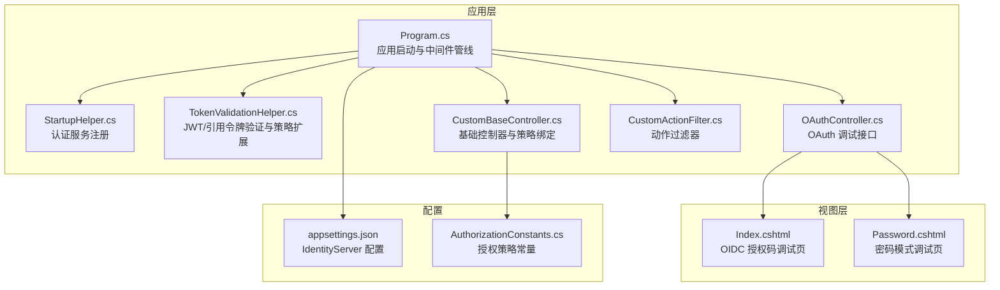
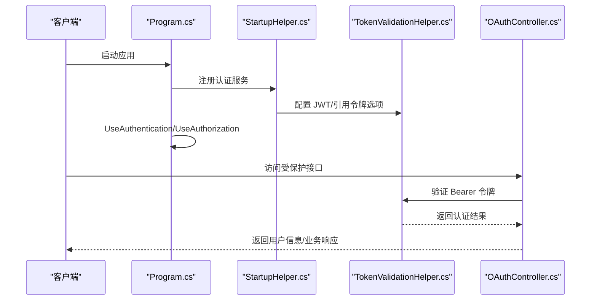
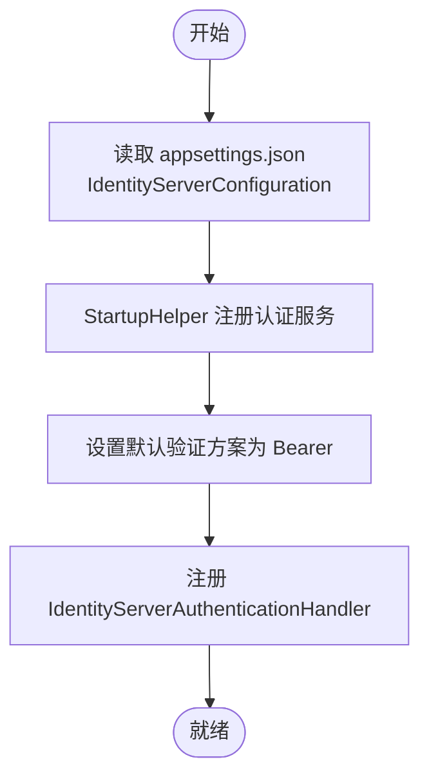
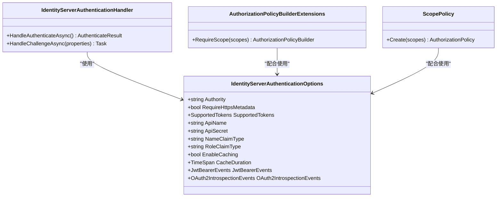
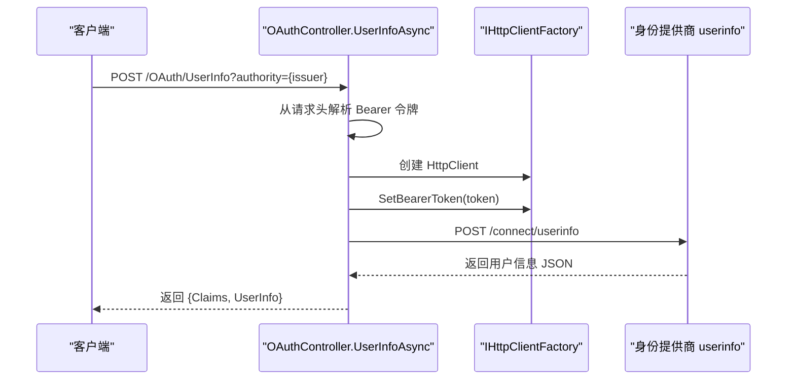
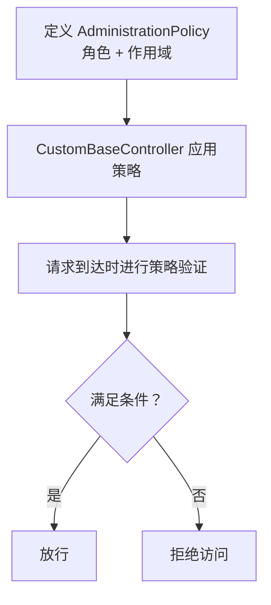
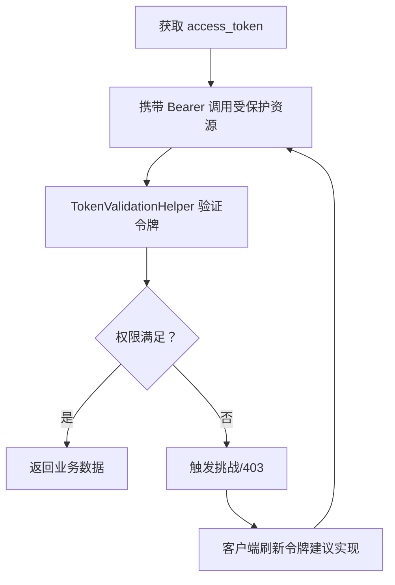
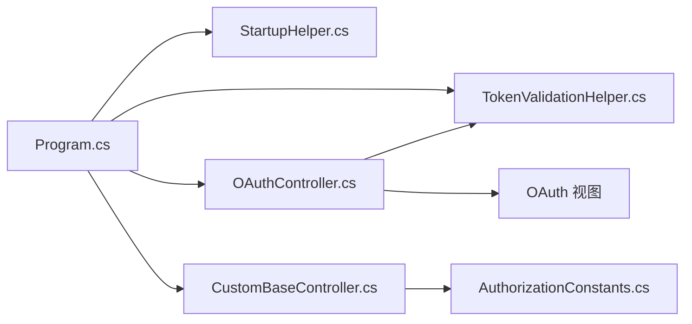

# 身份认证系统

<cite>
**本文引用的文件**
- [Program.cs](file://Sylas.RemoteTasks.App/Program.cs)
- [StartupHelper.cs](file://Sylas.RemoteTasks.App/Helpers/StartupHelper.cs)
- [TokenValidationHelper.cs](file://Sylas.RemoteTasks.App/Helpers/TokenValidationHelper.cs)
- [OAuthController.cs](file://Sylas.RemoteTasks.App/Controllers/OAuthController.cs)
- [appsettings.json](file://Sylas.RemoteTasks.App/appsettings.json)
- [Index.cshtml](file://Sylas.RemoteTasks.App/Views/OAuth/Index.cshtml)
- [Password.cshtml](file://Sylas.RemoteTasks.App/Views/OAuth/Password.cshtml)
- [AuthorizationConstants.cs](file://Sylas.RemoteTasks.Utils/Constants/AuthorizationConstants.cs)
- [CustomBaseController.cs](file://Sylas.RemoteTasks.App/Controllers/CustomBaseController.cs)
- [CustomActionFilter.cs](file://Sylas.RemoteTasks.App/Infrastructure/CustomActionFilter.cs)
- [AuthorizeAttributeTest.cs](file://Sylas.RemoteTasks.Test/Auth/AuthorizeAttributeTest.cs)
- [HomeController.cs](file://Sylas.RemoteTasks.App/Controllers/HomeController.cs)
</cite>

## 目录
1. [简介](#简介)
2. [项目结构](#项目结构)
3. [核心组件](#核心组件)
4. [架构总览](#架构总览)
5. [组件详解](#组件详解)
6. [依赖关系分析](#依赖关系分析)
7. [性能考量](#性能考量)
8. [故障排查指南](#故障排查指南)
9. [结论](#结论)
10. [附录](#附录)

## 简介
本文件为身份认证系统的全面技术文档，重点覆盖以下方面：
- OIDC/OpenID Connect 集成的配置与实现
- TokenValidationHelper 的 JWT 令牌验证机制与安全策略
- OAuthController 的认证流程与 API 接口
- 授权策略配置与角色权限管理
- 完整认证配置示例与客户端集成思路
- 令牌刷新机制、权限检查流程、安全最佳实践
- 与第三方身份提供商的集成方式与自定义认证扩展

## 项目结构
该系统采用 ASP.NET Core MVC 架构，认证与授权相关的核心代码集中在应用层的 Helpers、Controllers 与 Program.cs 中，并通过配置文件 appsettings.json 提供运行时参数。

**图表来源**
- [Program.cs](file://Sylas.RemoteTasks.App/Program.cs#L74-L87)
- [StartupHelper.cs](file://Sylas.RemoteTasks.App/Helpers/StartupHelper.cs#L124-L271)
- [TokenValidationHelper.cs](file://Sylas.RemoteTasks.App/Helpers/TokenValidationHelper.cs#L15-L575)
- [OAuthController.cs](file://Sylas.RemoteTasks.App/Controllers/OAuthController.cs#L1-L49)
- [CustomBaseController.cs](file://Sylas.RemoteTasks.App/Controllers/CustomBaseController.cs#L10-L14)
- [CustomActionFilter.cs](file://Sylas.RemoteTasks.App/Infrastructure/CustomActionFilter.cs#L7-L22)
- [Index.cshtml](file://Sylas.RemoteTasks.App/Views/OAuth/Index.cshtml#L1-L128)
- [Password.cshtml](file://Sylas.RemoteTasks.App/Views/OAuth/Password.cshtml#L1-L156)
- [appsettings.json](file://Sylas.RemoteTasks.App/appsettings.json#L109-L121)
- [AuthorizationConstants.cs](file://Sylas.RemoteTasks.Utils/Constants/AuthorizationConstants.cs#L6-L12)

**章节来源**
- [Program.cs](file://Sylas.RemoteTasks.App/Program.cs#L74-L87)
- [StartupHelper.cs](file://Sylas.RemoteTasks.App/Helpers/StartupHelper.cs#L124-L271)
- [TokenValidationHelper.cs](file://Sylas.RemoteTasks.App/Helpers/TokenValidationHelper.cs#L15-L575)
- [OAuthController.cs](file://Sylas.RemoteTasks.App/Controllers/OAuthController.cs#L1-L49)
- [CustomBaseController.cs](file://Sylas.RemoteTasks.App/Controllers/CustomBaseController.cs#L10-L14)
- [CustomActionFilter.cs](file://Sylas.RemoteTasks.App/Infrastructure/CustomActionFilter.cs#L7-L22)
- [Index.cshtml](file://Sylas.RemoteTasks.App/Views/OAuth/Index.cshtml#L1-L128)
- [Password.cshtml](file://Sylas.RemoteTasks.App/Views/OAuth/Password.cshtml#L1-L156)
- [appsettings.json](file://Sylas.RemoteTasks.App/appsettings.json#L109-L121)
- [AuthorizationConstants.cs](file://Sylas.RemoteTasks.Utils/Constants/AuthorizationConstants.cs#L6-L12)

## 核心组件
- 认证服务注册：通过 StartupHelper 在服务容器中注册 IdentityServer 认证方案与 IdentityServerAuthenticationHandler。
- 令牌验证助手：TokenValidationHelper 提供 JWT 与 OAuth2 引用令牌的统一验证、策略扩展与事件钩子。
- 授权策略：Program 中定义 AdministrationPolicy，结合角色与作用域进行授权。
- OAuth 调试控制器：OAuthController 提供第三方登录调试入口与用户信息获取接口。
- 视图与前端：Index.cshtml 与 Password.cshtml 提供 OIDC 授权码与密码模式的交互界面与脚本。
- 基础控制器与过滤器：CustomBaseController 与 CustomActionFilter 统一控制访问策略与登录跳转。

**章节来源**
- [StartupHelper.cs](file://Sylas.RemoteTasks.App/Helpers/StartupHelper.cs#L124-L271)
- [TokenValidationHelper.cs](file://Sylas.RemoteTasks.App/Helpers/TokenValidationHelper.cs#L15-L575)
- [Program.cs](file://Sylas.RemoteTasks.App/Program.cs#L77-L87)
- [OAuthController.cs](file://Sylas.RemoteTasks.App/Controllers/OAuthController.cs#L1-L49)
- [Index.cshtml](file://Sylas.RemoteTasks.App/Views/OAuth/Index.cshtml#L1-L128)
- [Password.cshtml](file://Sylas.RemoteTasks.App/Views/OAuth/Password.cshtml#L1-L156)
- [CustomBaseController.cs](file://Sylas.RemoteTasks.App/Controllers/CustomBaseController.cs#L10-L14)
- [CustomActionFilter.cs](file://Sylas.RemoteTasks.App/Infrastructure/CustomActionFilter.cs#L7-L22)

## 架构总览
系统采用“认证服务注册 + 统一令牌验证 + 授权策略 + 控制器接口”的分层架构。认证由 IdentityServerAuthenticationHandler 处理，支持 JWT 与引用令牌；授权策略通过 AuthorizationPolicyBuilder 与角色/作用域声明进行组合。

**图表来源**
- [Program.cs](file://Sylas.RemoteTasks.App/Program.cs#L74-L87)
- [StartupHelper.cs](file://Sylas.RemoteTasks.App/Helpers/StartupHelper.cs#L234-L271)
- [TokenValidationHelper.cs](file://Sylas.RemoteTasks.App/Helpers/TokenValidationHelper.cs#L207-L317)
- [OAuthController.cs](file://Sylas.RemoteTasks.App/Controllers/OAuthController.cs#L31-L46)

**章节来源**
- [Program.cs](file://Sylas.RemoteTasks.App/Program.cs#L74-L87)
- [StartupHelper.cs](file://Sylas.RemoteTasks.App/Helpers/StartupHelper.cs#L234-L271)
- [TokenValidationHelper.cs](file://Sylas.RemoteTasks.App/Helpers/TokenValidationHelper.cs#L207-L317)
- [OAuthController.cs](file://Sylas.RemoteTasks.App/Controllers/OAuthController.cs#L31-L46)

## 组件详解

### OIDC/OpenID Connect 集成与配置
- 配置来源：appsettings.json 中的 IdentityServerConfiguration 提供 Authority、ClientId、ClientSecret、OidcResponseType、Scopes、ApiName、ApiSecret 等关键参数。
- 认证注册：StartupHelper.AddAuthenticationService 读取配置，设置默认验证方案为 Bearer，并注册 IdentityServerAuthenticationHandler。
- OIDC 调试视图：Index.cshtml 与 Password.cshtml 提供授权码与密码模式的参数输入与重定向/请求逻辑，便于联调第三方身份提供商。

**图表来源**
- [appsettings.json](file://Sylas.RemoteTasks.App/appsettings.json#L109-L121)
- [StartupHelper.cs](file://Sylas.RemoteTasks.App/Helpers/StartupHelper.cs#L147-L271)
- [Index.cshtml](file://Sylas.RemoteTasks.App/Views/OAuth/Index.cshtml#L6-L76)
- [Password.cshtml](file://Sylas.RemoteTasks.App/Views/OAuth/Password.cshtml#L7-L59)

**章节来源**
- [appsettings.json](file://Sylas.RemoteTasks.App/appsettings.json#L109-L121)
- [StartupHelper.cs](file://Sylas.RemoteTasks.App/Helpers/StartupHelper.cs#L147-L271)
- [Index.cshtml](file://Sylas.RemoteTasks.App/Views/OAuth/Index.cshtml#L6-L76)
- [Password.cshtml](file://Sylas.RemoteTasks.App/Views/OAuth/Password.cshtml#L7-L59)

### TokenValidationHelper 的 JWT 令牌验证机制与安全策略
- 统一验证：IdentityServerAuthenticationHandler 根据令牌内容判定为 JWT 或引用令牌，分别委托 JwtBearer 与 OAuth2 Introspection 进行验证。
- 选项配置：IdentityServerAuthenticationOptions 支持 Authority、RequireHttpsMetadata、SupportedTokens、ApiName/ApiSecret、NameClaimType、RoleClaimType、缓存与发现文档刷新等。
- 策略扩展：AuthorizationPolicyBuilderExtensions 与 ScopePolicy 提供基于作用域的授权策略构建能力。
- 事件钩子：JwtBearerEvents 与 OAuth2IntrospectionEvents 允许在令牌接收、验证、挑战阶段插入自定义逻辑。

**图表来源**
- [TokenValidationHelper.cs](file://Sylas.RemoteTasks.App/Helpers/TokenValidationHelper.cs#L207-L317)
- [TokenValidationHelper.cs](file://Sylas.RemoteTasks.App/Helpers/TokenValidationHelper.cs#L323-L557)
- [TokenValidationHelper.cs](file://Sylas.RemoteTasks.App/Helpers/TokenValidationHelper.cs#L22-L52)

**章节来源**
- [TokenValidationHelper.cs](file://Sylas.RemoteTasks.App/Helpers/TokenValidationHelper.cs#L207-L317)
- [TokenValidationHelper.cs](file://Sylas.RemoteTasks.App/Helpers/TokenValidationHelper.cs#L323-L557)
- [TokenValidationHelper.cs](file://Sylas.RemoteTasks.App/Helpers/TokenValidationHelper.cs#L22-L52)

### OAuthController 的认证流程与 API 接口
- 接口职责：提供 OAuth 调试视图与受保护的用户信息接口，从授权服务器的 userinfo 端点获取用户信息。
- 认证流程：控制器方法通过 [Authorize] 特性启用认证；UserInfoAsync 从请求头提取 Bearer 令牌，调用 IHttpClientFactory 创建客户端并访问 userinfo。
- 安全注意：若缺少 access_token，抛出异常；建议在生产环境增加更严格的输入校验与错误处理。

**图表来源**
- [OAuthController.cs](file://Sylas.RemoteTasks.App/Controllers/OAuthController.cs#L31-L46)

**章节来源**
- [OAuthController.cs](file://Sylas.RemoteTasks.App/Controllers/OAuthController.cs#L31-L46)

### 授权策略配置与角色权限管理
- 策略定义：Program 中通过 AddAuthorization 定义 AdministrationPolicy，要求用户同时具备指定角色声明与作用域声明。
- 策略常量：AuthorizationConstants 提供策略名称常量，便于跨模块引用。
- 基础控制器：CustomBaseController 使用 [Authorize(Policy = AdministrationPolicy)] 对控制器进行统一授权约束。
- 角色映射：StartupHelper 在令牌验证事件中将角色声明映射到标准 JwtClaimTypes.Role，确保策略匹配。

**图表来源**
- [Program.cs](file://Sylas.RemoteTasks.App/Program.cs#L77-L87)
- [AuthorizationConstants.cs](file://Sylas.RemoteTasks.Utils/Constants/AuthorizationConstants.cs#L6-L12)
- [CustomBaseController.cs](file://Sylas.RemoteTasks.App/Controllers/CustomBaseController.cs#L10-L14)
- [StartupHelper.cs](file://Sylas.RemoteTasks.App/Helpers/StartupHelper.cs#L242-L265)

**章节来源**
- [Program.cs](file://Sylas.RemoteTasks.App/Program.cs#L77-L87)
- [AuthorizationConstants.cs](file://Sylas.RemoteTasks.Utils/Constants/AuthorizationConstants.cs#L6-L12)
- [CustomBaseController.cs](file://Sylas.RemoteTasks.App/Controllers/CustomBaseController.cs#L10-L14)
- [StartupHelper.cs](file://Sylas.RemoteTasks.App/Helpers/StartupHelper.cs#L242-L265)

### 令牌刷新机制与权限检查流程
- 令牌刷新：系统未内置自动刷新逻辑。建议在客户端侧基于 access_token 的过期时间与 refresh_token（若存在）实现刷新流程；服务端可通过缓存短期令牌并在必要时回查授权服务器。
- 权限检查：通过 AuthorizationPolicyBuilder 与角色/作用域声明进行检查；TokenValidationHelper 在验证阶段可配置缓存与发现文档刷新，提升性能与可用性。
- 前端集成：Password.cshtml 展示了密码模式获取令牌与调用 userinfo 的流程，可作为客户端集成参考。

**图表来源**
- [Password.cshtml](file://Sylas.RemoteTasks.App/Views/OAuth/Password.cshtml#L84-L111)
- [TokenValidationHelper.cs](file://Sylas.RemoteTasks.App/Helpers/TokenValidationHelper.cs#L225-L289)

**章节来源**
- [Password.cshtml](file://Sylas.RemoteTasks.App/Views/OAuth/Password.cshtml#L84-L111)
- [TokenValidationHelper.cs](file://Sylas.RemoteTasks.App/Helpers/TokenValidationHelper.cs#L225-L289)

### 与第三方身份提供商的集成方式与自定义扩展
- OIDC 集成：通过 appsettings.json 的 IdentityServerConfiguration 提供 Authority、ClientId、ClientSecret、Scopes 等参数；StartupHelper 读取并注册认证服务。
- 自定义扩展：可利用 ConfigureInternalOptions 与 IdentityServerAuthenticationOptions 的事件钩子扩展验证逻辑；也可在 JwtBearerEvents 与 OAuth2IntrospectionEvents 中加入审计、指标上报等自定义处理。
- 前端调试：Index.cshtml 与 Password.cshtml 提供快速联调第三方提供商的参数与流程演示。

**章节来源**
- [appsettings.json](file://Sylas.RemoteTasks.App/appsettings.json#L109-L121)
- [StartupHelper.cs](file://Sylas.RemoteTasks.App/Helpers/StartupHelper.cs#L147-L271)
- [TokenValidationHelper.cs](file://Sylas.RemoteTasks.App/Helpers/TokenValidationHelper.cs#L56-L92)
- [Index.cshtml](file://Sylas.RemoteTasks.App/Views/OAuth/Index.cshtml#L6-L76)
- [Password.cshtml](file://Sylas.RemoteTasks.App/Views/OAuth/Password.cshtml#L7-L59)

## 依赖关系分析
- 程序入口 Program 依赖 StartupHelper 与 TokenValidationHelper 完成认证与授权管线的装配。
- OAuthController 依赖 IHttpClientFactory 与 TokenValidationHelper 的验证结果。
- 授权策略依赖 AuthorizationConstants 与 StartupHelper 的角色/作用域映射。
- 视图层依赖浏览器脚本与本地存储进行参数持久化与重定向。

**图表来源**
- [Program.cs](file://Sylas.RemoteTasks.App/Program.cs#L74-L87)
- [StartupHelper.cs](file://Sylas.RemoteTasks.App/Helpers/StartupHelper.cs#L124-L271)
- [TokenValidationHelper.cs](file://Sylas.RemoteTasks.App/Helpers/TokenValidationHelper.cs#L15-L575)
- [OAuthController.cs](file://Sylas.RemoteTasks.App/Controllers/OAuthController.cs#L1-L49)
- [CustomBaseController.cs](file://Sylas.RemoteTasks.App/Controllers/CustomBaseController.cs#L10-L14)
- [AuthorizationConstants.cs](file://Sylas.RemoteTasks.Utils/Constants/AuthorizationConstants.cs#L6-L12)
- [Index.cshtml](file://Sylas.RemoteTasks.App/Views/OAuth/Index.cshtml#L1-L128)
- [Password.cshtml](file://Sylas.RemoteTasks.App/Views/OAuth/Password.cshtml#L1-L156)

**章节来源**
- [Program.cs](file://Sylas.RemoteTasks.App/Program.cs#L74-L87)
- [StartupHelper.cs](file://Sylas.RemoteTasks.App/Helpers/StartupHelper.cs#L124-L271)
- [TokenValidationHelper.cs](file://Sylas.RemoteTasks.App/Helpers/TokenValidationHelper.cs#L15-L575)
- [OAuthController.cs](file://Sylas.RemoteTasks.App/Controllers/OAuthController.cs#L1-L49)
- [CustomBaseController.cs](file://Sylas.RemoteTasks.App/Controllers/CustomBaseController.cs#L10-L14)
- [AuthorizationConstants.cs](file://Sylas.RemoteTasks.Utils/Constants/AuthorizationConstants.cs#L6-L12)
- [Index.cshtml](file://Sylas.RemoteTasks.App/Views/OAuth/Index.cshtml#L1-L128)
- [Password.cshtml](file://Sylas.RemoteTasks.App/Views/OAuth/Password.cshtml#L1-L156)

## 性能考量
- 发现文档缓存：IdentityServerAuthenticationOptions 支持 DiscoveryDocumentRefreshInterval 与 EnableCaching，建议在高并发场景开启缓存并合理设置刷新间隔。
- 引用令牌缓存：OAuth2IntrospectionOptions 支持缓存与 TTL，可降低对授权服务器的回查压力。
- 令牌处理器优化：通过 TokenHandlers 清理默认处理器并添加自定义 JwtSecurityTokenHandler，减少映射开销。
- 网络超时与缓冲区：JwtBackChannelHandler 与 BackchannelTimeouts 可控网络请求的超时与响应大小，避免阻塞。

**章节来源**
- [TokenValidationHelper.cs](file://Sylas.RemoteTasks.App/Helpers/TokenValidationHelper.cs#L466-L490)
- [TokenValidationHelper.cs](file://Sylas.RemoteTasks.App/Helpers/TokenValidationHelper.cs#L524-L556)
- [TokenValidationHelper.cs](file://Sylas.RemoteTasks.App/Helpers/TokenValidationHelper.cs#L511-L521)

## 故障排查指南
- 令牌为空：OAuthController.UserInfoAsync 若未检测到 Bearer 令牌会抛出异常，需检查前端是否正确设置 Authorization 头。
- HTTPS 与元数据：RequireHttpsMetadata 与 Authority 配置错误会导致发现文档加载失败，需确保授权服务器使用有效证书与 HTTPS。
- 角色/作用域不匹配：若 AdministrationPolicy 未满足角色或作用域，将返回 403；可在 StartupHelper 的 TokenValidated 事件中打印 Claims 进行诊断。
- 缓存与刷新：若发现文档或令牌状态异常，检查 DiscoveryDocumentRefreshInterval 与缓存配置，必要时禁用缓存定位问题。
- 前端调试：使用 Index.cshtml 与 Password.cshtml 快速验证授权码与密码模式流程，观察浏览器 Network 面板中的请求与响应。

**章节来源**
- [OAuthController.cs](file://Sylas.RemoteTasks.App/Controllers/OAuthController.cs#L36-L40)
- [StartupHelper.cs](file://Sylas.RemoteTasks.App/Helpers/StartupHelper.cs#L242-L265)
- [TokenValidationHelper.cs](file://Sylas.RemoteTasks.App/Helpers/TokenValidationHelper.cs#L446-L522)
- [Index.cshtml](file://Sylas.RemoteTasks.App/Views/OAuth/Index.cshtml#L6-L76)
- [Password.cshtml](file://Sylas.RemoteTasks.App/Views/OAuth/Password.cshtml#L7-L59)

## 结论
本系统通过 StartupHelper 与 TokenValidationHelper 实现了对 OIDC/OpenID Connect 的完整支持，结合 Program 中的授权策略与控制器层面的受保护接口，形成了从配置、验证到授权的一体化认证体系。建议在生产环境中进一步完善令牌刷新、审计日志与监控告警，并持续评估缓存与超时策略以平衡性能与一致性。

## 附录

### 完整认证配置示例（节选）
- IdentityServerConfiguration 关键项
  - Authority：授权服务器根地址
  - RequireHttpsMetadata：是否强制 HTTPS
  - ApiName / ApiSecret：API 资源名称与密钥
  - ClientId / ClientSecret：客户端凭据
  - OidcResponseType：OIDC 响应类型
  - Scopes：作用域列表
  - EnableCaching / CacheDuration：缓存开关与时长

**章节来源**
- [appsettings.json](file://Sylas.RemoteTasks.App/appsettings.json#L109-L121)

### 客户端集成要点（基于现有视图）
- 授权码模式：使用 Index.cshtml 输入参数并重定向到授权端点，回调后在服务端换取令牌并调用 userinfo。
- 密码模式：使用 Password.cshtml 直接向授权端点发起密码模式请求，获取 access_token 后调用 userinfo。
- SignalR 集成：可参考 SignalR 客户端在请求头中设置 Authorization，保持与 API 一致的认证方式。

**章节来源**
- [Index.cshtml](file://Sylas.RemoteTasks.App/Views/OAuth/Index.cshtml#L6-L76)
- [Password.cshtml](file://Sylas.RemoteTasks.App/Views/OAuth/Password.cshtml#L7-L59)
- [HomeController.cs](file://Sylas.RemoteTasks.App/Controllers/HomeController.cs#L959-L962)

### 安全最佳实践
- 强制 HTTPS：RequireHttpsMetadata 设为 true，Authority 使用 HTTPS。
- 最小权限原则：仅授予所需作用域，策略中同时校验角色与作用域。
- 令牌生命周期：合理设置过期时间与刷新策略，避免长期有效的令牌。
- 审计与监控：在 JwtBearerEvents 与 OAuth2IntrospectionEvents 中记录关键事件，便于审计与排障。
- 前端安全：避免在前端存储敏感令牌，使用 HttpOnly Cookie 或安全存储并限制访问范围。

**章节来源**
- [TokenValidationHelper.cs](file://Sylas.RemoteTasks.App/Helpers/TokenValidationHelper.cs#L446-L522)
- [Program.cs](file://Sylas.RemoteTasks.App/Program.cs#L77-L87)