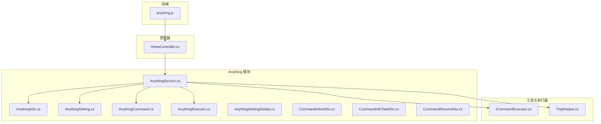
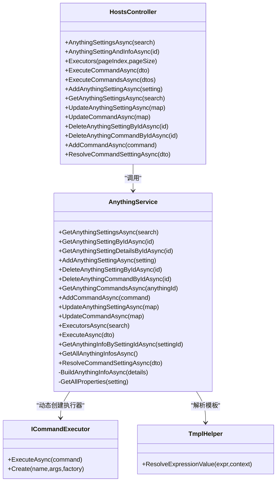
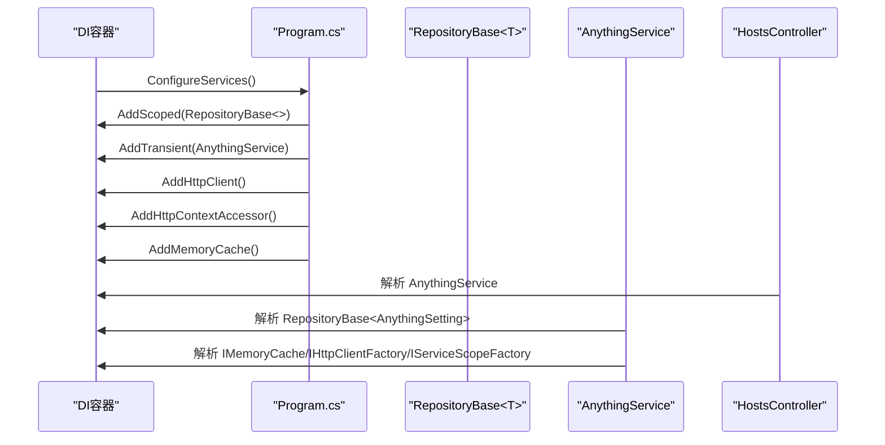
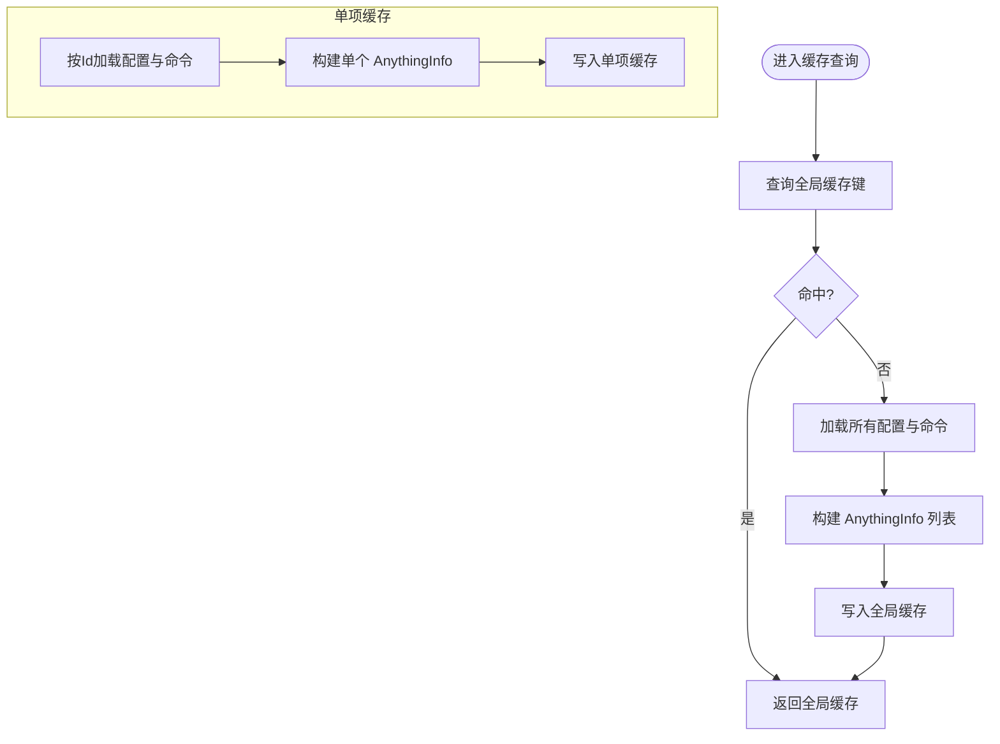
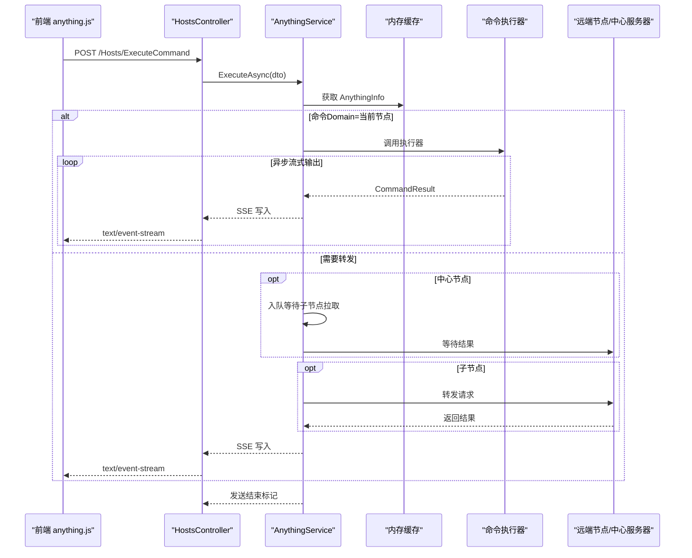
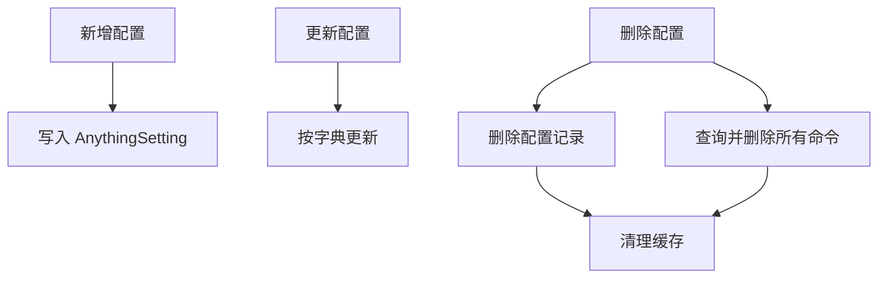
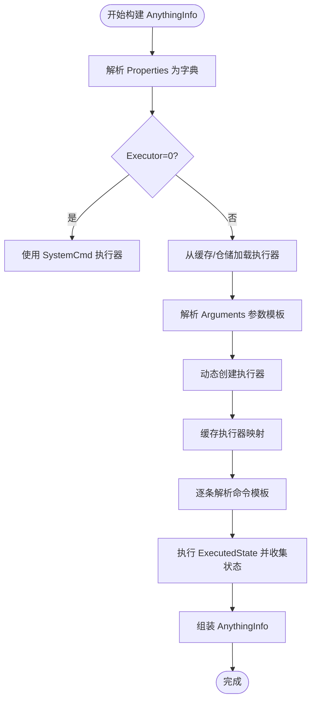
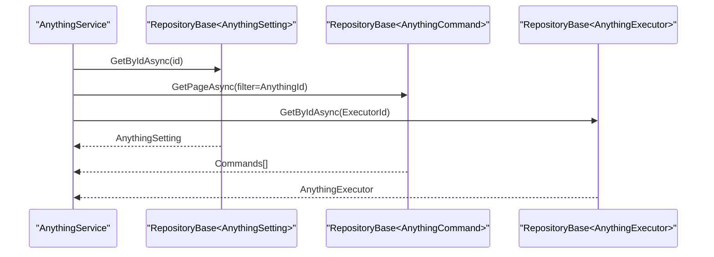
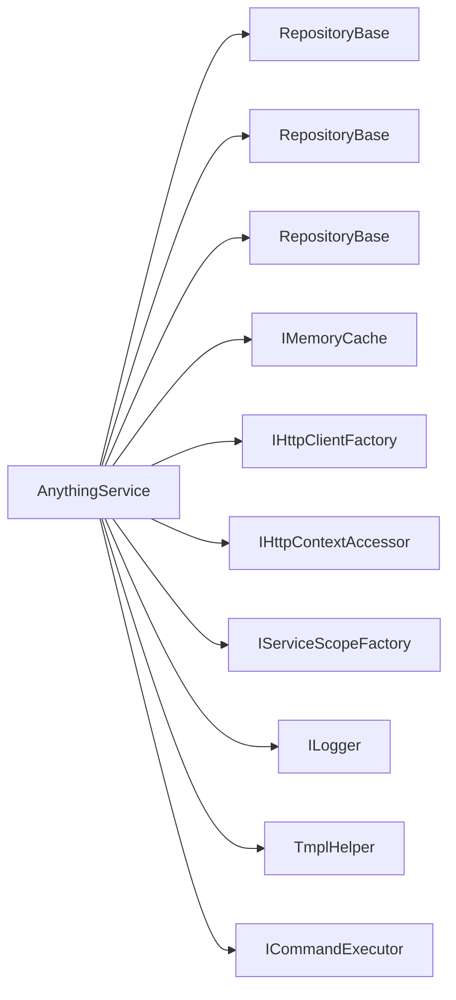

# AnythingService 核心功能

<cite>
**本文档引用的文件**
- [AnythingService.cs](file://Sylas.RemoteTasks.App/RemoteHostModule/Anything/AnythingService.cs)
- [AnythingSetting.cs](file://Sylas.RemoteTasks.App/RemoteHostModule/Anything/AnythingSetting.cs)
- [AnythingInfo.cs](file://Sylas.RemoteTasks.App/RemoteHostModule/Anything/AnythingInfo.cs)
- [AnythingExecutor.cs](file://Sylas.RemoteTasks.App/RemoteHostModule/Anything/AnythingExecutor.cs)
- [AnythingCommand.cs](file://Sylas.RemoteTasks.App/RemoteHostModule/Anything/AnythingCommand.cs)
- [AnythingSettingDetails.cs](file://Sylas.RemoteTasks.App/RemoteHostModule/Anything/AnythingSettingDetails.cs)
- [CommandInfoInDto.cs](file://Sylas.RemoteTasks.App/RemoteHostModule/Anything/CommandInfoInDto.cs)
- [CommandInfoTaskDto.cs](file://Sylas.RemoteTasks.App/RemoteHostModule/Anything/CommandInfoTaskDto.cs)
- [CommandResolveDto.cs](file://Sylas.RemoteTasks.App/RemoteHostModule/Anything/CommandResolveDto.cs)
- [HostsController.cs](file://Sylas.RemoteTasks.App/Controllers/HostsController.cs)
- [Program.cs](file://Sylas.RemoteTasks.App/Program.cs)
- [ICommandExecutor.cs](file://Sylas.RemoteTasks.Utils/CommandExecutor/ICommandExecutor.cs)
- [TmplHelper.cs](file://Sylas.RemoteTasks.Utils/Template/TmplHelper.cs)
- [anything.js](file://Sylas.RemoteTasks.App/wwwroot/js/anything.js)
</cite>

## 目录
1. [简介](#简介)
2. [项目结构](#项目结构)
3. [核心组件](#核心组件)
4. [架构总览](#架构总览)
5. [详细组件分析](#详细组件分析)
6. [依赖关系分析](#依赖关系分析)
7. [性能考量](#性能考量)
8. [故障排查指南](#故障排查指南)
9. [结论](#结论)
10. [附录](#附录)

## 简介
本文档围绕 AnythingService 的核心功能进行系统化技术文档化，重点涵盖：
- 服务类设计与依赖注入配置
- 内存缓存策略与缓存失效机制
- 异步任务处理与 SSE 流式输出
- 配置管理（AnythingSetting）的 CRUD、验证与缓存更新
- AnythingInfo 构建流程（模板解析、属性绑定、执行器映射）
- 远程主机配置管理的使用示例
- 与仓储层的交互模式与数据流转
- 性能优化建议与错误处理策略

## 项目结构
AnythingService 所在模块位于 RemoteHostModule/Anything 下，配合控制器、模板解析、命令执行器等组件协同工作。

**图表来源**
- [AnythingService.cs](file://Sylas.RemoteTasks.App/RemoteHostModule/Anything/AnythingService.cs#L30-L38)
- [HostsController.cs](file://Sylas.RemoteTasks.App/Controllers/HostsController.cs#L19-L21)
- [ICommandExecutor.cs](file://Sylas.RemoteTasks.Utils/CommandExecutor/ICommandExecutor.cs#L31-L55)
- [TmplHelper.cs](file://Sylas.RemoteTasks.Utils/Template/TmplHelper.cs#L20-L200)
- [anything.js](file://Sylas.RemoteTasks.App/wwwroot/js/anything.js#L1-L38)

**章节来源**
- [AnythingService.cs](file://Sylas.RemoteTasks.App/RemoteHostModule/Anything/AnythingService.cs#L17-L38)
- [HostsController.cs](file://Sylas.RemoteTasks.App/Controllers/HostsController.cs#L19-L21)

## 核心组件
- AnythingService：核心业务服务，负责 Anything 配置与命令的查询、增删改、缓存构建、命令执行与远程转发。
- AnythingSetting/AnythingSettingDetails：配置实体与详情视图模型。
- AnythingCommand：命令实体，支持模板命令文本与状态查询命令。
- AnythingExecutor：命令执行器元数据（名称与参数模板）。
- AnythingInfo：构建后的运行时对象，包含标题、命令集合、属性字典与执行器名称。
- DTO：CommandInfoInDto、CommandInfoTaskDto、CommandResolveDto 用于命令执行与解析。
- HostsController：对外暴露 REST 接口，封装 AnythingService 并以 SSE 输出命令执行结果。
- ICommandExecutor：命令执行器抽象与动态创建工厂。
- TmplHelper：模板解析工具，支持表达式解析与类型转换。

**章节来源**
- [AnythingService.cs](file://Sylas.RemoteTasks.App/RemoteHostModule/Anything/AnythingService.cs#L30-L38)
- [AnythingSetting.cs](file://Sylas.RemoteTasks.App/RemoteHostModule/Anything/AnythingSetting.cs#L8-L32)
- [AnythingCommand.cs](file://Sylas.RemoteTasks.App/RemoteHostModule/Anything/AnythingCommand.cs#L7-L33)
- [AnythingExecutor.cs](file://Sylas.RemoteTasks.App/RemoteHostModule/Anything/AnythingExecutor.cs#L5-L10)
- [AnythingInfo.cs](file://Sylas.RemoteTasks.App/RemoteHostModule/Anything/AnythingInfo.cs#L9-L36)
- [CommandInfoInDto.cs](file://Sylas.RemoteTasks.App/RemoteHostModule/Anything/CommandInfoInDto.cs#L3-L14)
- [CommandInfoTaskDto.cs](file://Sylas.RemoteTasks.App/RemoteHostModule/Anything/CommandInfoTaskDto.cs#L3-L18)
- [CommandResolveDto.cs](file://Sylas.RemoteTasks.App/RemoteHostModule/Anything/CommandResolveDto.cs#L3-L14)
- [HostsController.cs](file://Sylas.RemoteTasks.App/Controllers/HostsController.cs#L19-L21)
- [ICommandExecutor.cs](file://Sylas.RemoteTasks.Utils/CommandExecutor/ICommandExecutor.cs#L31-L55)
- [TmplHelper.cs](file://Sylas.RemoteTasks.Utils/Template/TmplHelper.cs#L20-L200)

## 架构总览
AnythingService 采用依赖注入装配仓储、缓存、HTTP 客户端、作用域工厂与日志器；通过内存缓存加速 AnythingInfo 与执行器解析；通过模板引擎解析命令与属性；通过异步流式输出命令执行结果；支持本地与跨节点命令转发。

**图表来源**
- [AnythingService.cs](file://Sylas.RemoteTasks.App/RemoteHostModule/Anything/AnythingService.cs#L45-L677)
- [HostsController.cs](file://Sylas.RemoteTasks.App/Controllers/HostsController.cs#L32-L234)
- [ICommandExecutor.cs](file://Sylas.RemoteTasks.Utils/CommandExecutor/ICommandExecutor.cs#L31-L55)
- [TmplHelper.cs](file://Sylas.RemoteTasks.Utils/Template/TmplHelper.cs#L20-L200)

## 详细组件分析

### 依赖注入与装配
- 仓储注册：泛型 RepositoryBase<> 注册为 Scoped，确保请求内一致性。
- 服务注册：AnythingService 注册为 Transient，按需创建。
- 缓存与 HTTP：IMemoryCache、IHttpClientFactory、IHttpContextAccessor、IServiceScopeFactory 注入。
- 控制器：HostsController 通过构造函数注入 AnythingService。

**图表来源**
- [Program.cs](file://Sylas.RemoteTasks.App/Program.cs#L40-L62)
- [HostsController.cs](file://Sylas.RemoteTasks.App/Controllers/HostsController.cs#L19-L21)
- [AnythingService.cs](file://Sylas.RemoteTasks.App/RemoteHostModule/Anything/AnythingService.cs#L30-L38)

**章节来源**
- [Program.cs](file://Sylas.RemoteTasks.App/Program.cs#L40-L62)
- [AnythingService.cs](file://Sylas.RemoteTasks.App/RemoteHostModule/Anything/AnythingService.cs#L30-L38)
- [HostsController.cs](file://Sylas.RemoteTasks.App/Controllers/HostsController.cs#L19-L21)

### 内存缓存策略
- 全局缓存键：_cacheKeyAllAnythingInfos，缓存所有 AnythingInfo 列表，默认滑动过期 8 小时。
- 单项缓存键：AnythingInfoCacheKey(settingId)，缓存单个 AnythingInfo，默认滑动过期 8 小时。
- 执行器缓存：按执行器 Id 缓存 AnythingExecutor，默认滑动过期 1 分钟，降低频繁查询开销。
- 缓存更新策略：
  - 新增/更新命令：命中缓存并同步更新内存中的 AnythingInfo.Commands。
  - 删除命令：命中缓存并移除对应命令。
  - 更新命令：命中缓存并替换对应命令项。
  - 删除配置：级联删除命令并清理缓存。

**图表来源**
- [AnythingService.cs](file://Sylas.RemoteTasks.App/RemoteHostModule/Anything/AnythingService.cs#L255-L277)
- [AnythingService.cs](file://Sylas.RemoteTasks.App/RemoteHostModule/Anything/AnythingService.cs#L500-L521)
- [AnythingService.cs](file://Sylas.RemoteTasks.App/RemoteHostModule/Anything/AnythingService.cs#L544-L550)

**章节来源**
- [AnythingService.cs](file://Sylas.RemoteTasks.App/RemoteHostModule/Anything/AnythingService.cs#L248-L277)
- [AnythingService.cs](file://Sylas.RemoteTasks.App/RemoteHostModule/Anything/AnythingService.cs#L125-L143)
- [AnythingService.cs](file://Sylas.RemoteTasks.App/RemoteHostModule/Anything/AnythingService.cs#L183-L197)
- [AnythingService.cs](file://Sylas.RemoteTasks.App/RemoteHostModule/Anything/AnythingService.cs#L229-L246)
- [AnythingService.cs](file://Sylas.RemoteTasks.App/RemoteHostModule/Anything/AnythingService.cs#L544-L550)

### 异步任务处理与 SSE
- 命令执行：ExecuteAsync 返回 IAsyncEnumerable<CommandResult>，通过 SSE 逐步推送结果。
- 本地执行：解析命令模板，获取执行器映射，直接调用执行器。
- 远程转发：当命令 Domain 与当前节点不一致且为中心节点时，入队等待子节点拉取；否则向中心服务器转发并回传结果。
- 结束标记：以特殊结束标记通知客户端停止等待。

**图表来源**
- [HostsController.cs](file://Sylas.RemoteTasks.App/Controllers/HostsController.cs#L85-L124)
- [AnythingService.cs](file://Sylas.RemoteTasks.App/RemoteHostModule/Anything/AnythingService.cs#L294-L389)
- [anything.js](file://Sylas.RemoteTasks.App/wwwroot/js/anything.js#L17-L38)

**章节来源**
- [HostsController.cs](file://Sylas.RemoteTasks.App/Controllers/HostsController.cs#L85-L124)
- [AnythingService.cs](file://Sylas.RemoteTasks.App/RemoteHostModule/Anything/AnythingService.cs#L294-L389)
- [anything.js](file://Sylas.RemoteTasks.App/wwwroot/js/anything.js#L17-L38)

### 配置管理（AnythingSetting）CRUD 与验证
- 查询：分页查询 AnythingSetting，支持排序与过滤。
- 新增：插入新配置，返回受影响行数结果。
- 更新：按字典更新配置字段。
- 删除：删除配置并级联删除其命令；同时清理缓存。
- 验证：对必需字段（如命令 id）进行校验，返回统一 OperationResult/RequestResult。

**图表来源**
- [AnythingService.cs](file://Sylas.RemoteTasks.App/RemoteHostModule/Anything/AnythingService.cs#L83-L106)
- [AnythingService.cs](file://Sylas.RemoteTasks.App/RemoteHostModule/Anything/AnythingService.cs#L204-L208)
- [AnythingService.cs](file://Sylas.RemoteTasks.App/RemoteHostModule/Anything/AnythingService.cs#L94-L106)

**章节来源**
- [AnythingService.cs](file://Sylas.RemoteTasks.App/RemoteHostModule/Anything/AnythingService.cs#L45-L106)
- [HostsController.cs](file://Sylas.RemoteTasks.App/Controllers/HostsController.cs#L164-L216)

### AnythingInfo 构建过程
- 属性解析：从 AnythingSetting.Properties 解析为字典，补充默认路径常量等。
- 执行器解析：根据 AnythingExecutor.Name 与 Arguments（JSON 序列化）解析参数，支持类型转换。
- 执行器映射：通过 ICommandExecutor.Create 动态创建执行器，并缓存至 AnythingIdAndCommandExecutorMap。
- 命令解析：对每个命令的 CommandTxt 与 ExecutedState 进行模板解析与执行，生成最终命令文本与状态输出。
- 最终对象：AnythingInfo 包含 Title、Commands、Properties、SettingId、CommandExecutor。

**图表来源**
- [AnythingService.cs](file://Sylas.RemoteTasks.App/RemoteHostModule/Anything/AnythingService.cs#L529-L631)
- [AnythingService.cs](file://Sylas.RemoteTasks.App/RemoteHostModule/Anything/AnythingService.cs#L531-L618)
- [ICommandExecutor.cs](file://Sylas.RemoteTasks.Utils/CommandExecutor/ICommandExecutor.cs#L31-L55)
- [TmplHelper.cs](file://Sylas.RemoteTasks.Utils/Template/TmplHelper.cs#L20-L200)

**章节来源**
- [AnythingService.cs](file://Sylas.RemoteTasks.App/RemoteHostModule/Anything/AnythingService.cs#L529-L631)
- [ICommandExecutor.cs](file://Sylas.RemoteTasks.Utils/CommandExecutor/ICommandExecutor.cs#L31-L55)
- [TmplHelper.cs](file://Sylas.RemoteTasks.Utils/Template/TmplHelper.cs#L20-L200)

### 与仓储层的交互模式
- RepositoryBase<T> 提供通用的分页查询、按 Id 查询、新增、更新、删除等能力。
- 通过 DataSearch/DataFilter 组装查询条件，支持排序与大数量分页。
- 服务层在需要时组合配置与命令数据，避免 N+1 查询影响。

**图表来源**
- [AnythingService.cs](file://Sylas.RemoteTasks.App/RemoteHostModule/Anything/AnythingService.cs#L57-L76)
- [AnythingService.cs](file://Sylas.RemoteTasks.App/RemoteHostModule/Anything/AnythingService.cs#L150-L168)
- [AnythingService.cs](file://Sylas.RemoteTasks.App/RemoteHostModule/Anything/AnythingService.cs#L544-L550)

**章节来源**
- [AnythingService.cs](file://Sylas.RemoteTasks.App/RemoteHostModule/Anything/AnythingService.cs#L57-L76)
- [AnythingService.cs](file://Sylas.RemoteTasks.App/RemoteHostModule/Anything/AnythingService.cs#L150-L168)
- [AnythingService.cs](file://Sylas.RemoteTasks.App/RemoteHostModule/Anything/AnythingService.cs#L544-L550)

### 远程主机配置管理使用示例
以下示例展示如何通过前端与控制器调用 AnythingService 管理远程主机配置与执行命令：

- 前端发起执行命令请求
  - 请求路径：/Hosts/ExecuteCommand
  - 请求体：包含 CommandId 与 CommandExecuteNo
  - 认证：携带 Bearer Token
  - 响应：SSE 流式返回 CommandResult

- 控制器处理
  - 设置 SSE 头部
  - 调用 AnythingService.ExecuteAsync
  - 逐条写出 CommandResult，结束时发送结束标记

- 服务端处理
  - 若命令 Domain 与当前节点一致，则本地执行
  - 否则转发至中心服务器或子节点队列
  - 通过内存缓存与执行器映射提升性能

**章节来源**
- [anything.js](file://Sylas.RemoteTasks.App/wwwroot/js/anything.js#L17-L38)
- [HostsController.cs](file://Sylas.RemoteTasks.App/Controllers/HostsController.cs#L85-L124)
- [AnythingService.cs](file://Sylas.RemoteTasks.App/RemoteHostModule/Anything/AnythingService.cs#L294-L389)

## 依赖关系分析
- AnythingService 依赖：
  - 仓储：RepositoryBase<AnythingSetting>、RepositoryBase<AnythingExecutor>、RepositoryBase<AnythingCommand>
  - 缓存：IMemoryCache
  - HTTP：IHttpClientFactory、IHttpContextAccessor
  - 作用域：IServiceScopeFactory
  - 日志：ILogger<AnythingService>
- 与 ICommandExecutor 的关系：通过反射与特性创建具体执行器实例。
- 与 TmplHelper 的关系：模板解析贯穿属性与命令文本处理。

**图表来源**
- [AnythingService.cs](file://Sylas.RemoteTasks.App/RemoteHostModule/Anything/AnythingService.cs#L30-L38)
- [ICommandExecutor.cs](file://Sylas.RemoteTasks.Utils/CommandExecutor/ICommandExecutor.cs#L31-L55)
- [TmplHelper.cs](file://Sylas.RemoteTasks.Utils/Template/TmplHelper.cs#L20-L200)

**章节来源**
- [AnythingService.cs](file://Sylas.RemoteTasks.App/RemoteHostModule/Anything/AnythingService.cs#L30-L38)
- [ICommandExecutor.cs](file://Sylas.RemoteTasks.Utils/CommandExecutor/ICommandExecutor.cs#L31-L55)
- [TmplHelper.cs](file://Sylas.RemoteTasks.Utils/Template/TmplHelper.cs#L20-L200)

## 性能考量
- 缓存策略
  - 全局缓存：一次性加载所有配置与命令，减少多次查询。
  - 单项缓存：按配置 Id 缓存构建后的 AnythingInfo。
  - 执行器缓存：降低频繁查询执行器的开销。
- 异步与流式
  - ExecuteAsync 返回 IAsyncEnumerable，边执行边输出，降低等待时间。
  - SSE 逐条推送，避免一次性大量数据传输。
- 模板解析
  - 仅在构建阶段解析，后续复用解析结果。
- 并发与队列
  - 使用并发字典缓存执行器映射，避免重复创建。
  - 远程任务通过队列解耦，提高吞吐。

[本节为通用性能建议，无需特定文件引用]

## 故障排查指南
- 命令执行无响应
  - 检查前端是否正确设置 Authorization 头与 SSE 连接。
  - 查看控制器日志与服务端日志，确认 ExecuteAsync 是否抛出异常。
- 远程命令转发失败
  - 确认 AppStatus.Domain 与命令 Domain 是否一致。
  - 检查中心服务器地址与网络连通性。
- 缓存不一致
  - 执行新增/更新/删除命令后，确认缓存是否同步更新。
  - 清理相关缓存键后重试。
- 执行器创建失败
  - 检查 AnythingExecutor.Name 是否存在，Arguments 类型与数量是否匹配。
  - 查看反射创建日志与异常信息。

**章节来源**
- [HostsController.cs](file://Sylas.RemoteTasks.App/Controllers/HostsController.cs#L85-L124)
- [AnythingService.cs](file://Sylas.RemoteTasks.App/RemoteHostModule/Anything/AnythingService.cs#L294-L389)
- [ICommandExecutor.cs](file://Sylas.RemoteTasks.Utils/CommandExecutor/ICommandExecutor.cs#L31-L55)

## 结论
AnythingService 通过清晰的职责划分与完善的缓存策略，实现了配置驱动的命令执行体系。结合模板解析、异步流式输出与远程转发机制，能够高效支撑多节点的远程主机配置管理场景。建议在生产环境中进一步完善监控与告警，持续优化缓存命中率与执行器生命周期管理。

[本节为总结性内容，无需特定文件引用]

## 附录
- 关键 API 一览
  - 查询配置：GET /Hosts/AnythingSettingsAsync
  - 获取配置详情：GET /Hosts/AnythingSettingAndInfoAsync?id={id}
  - 执行命令：POST /Hosts/ExecuteCommand
  - 解析命令模板：POST /Hosts/ResolveCommandSetttingAsync
  - 管理配置与命令：增删改查相关接口

**章节来源**
- [HostsController.cs](file://Sylas.RemoteTasks.App/Controllers/HostsController.cs#L32-L234)