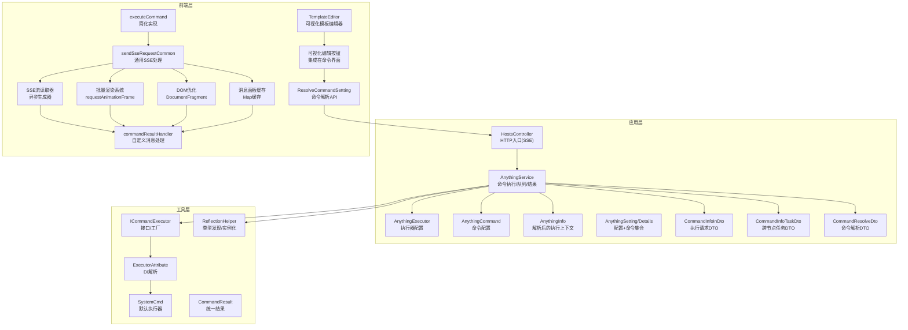
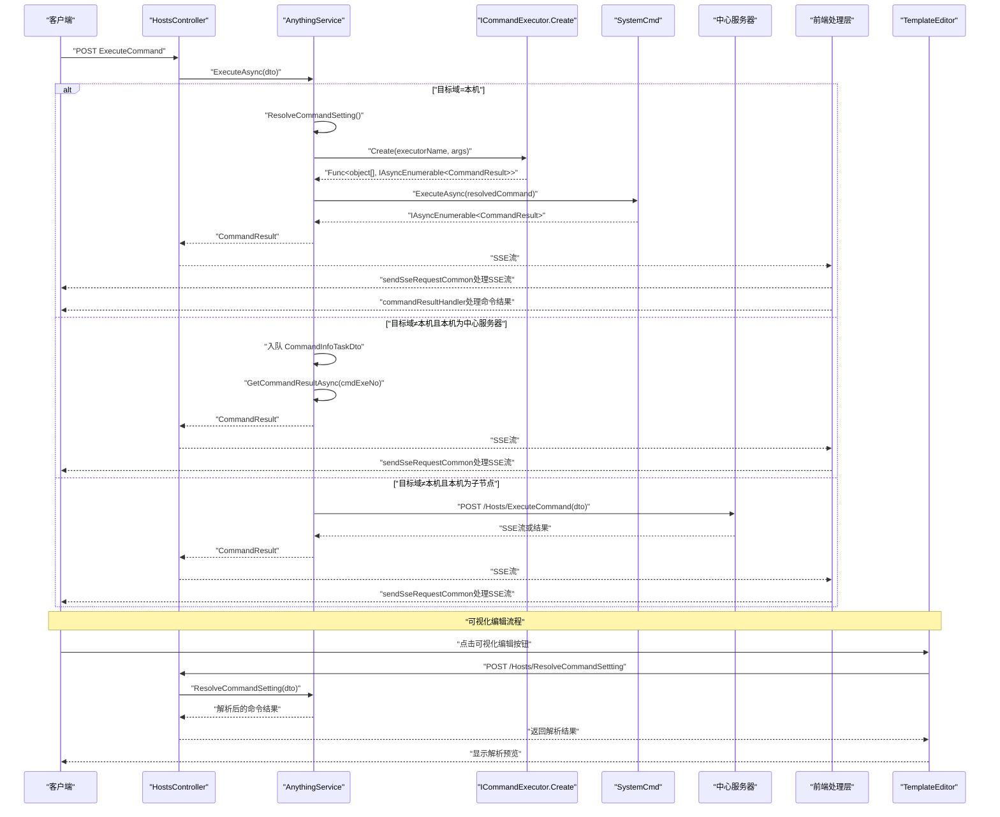
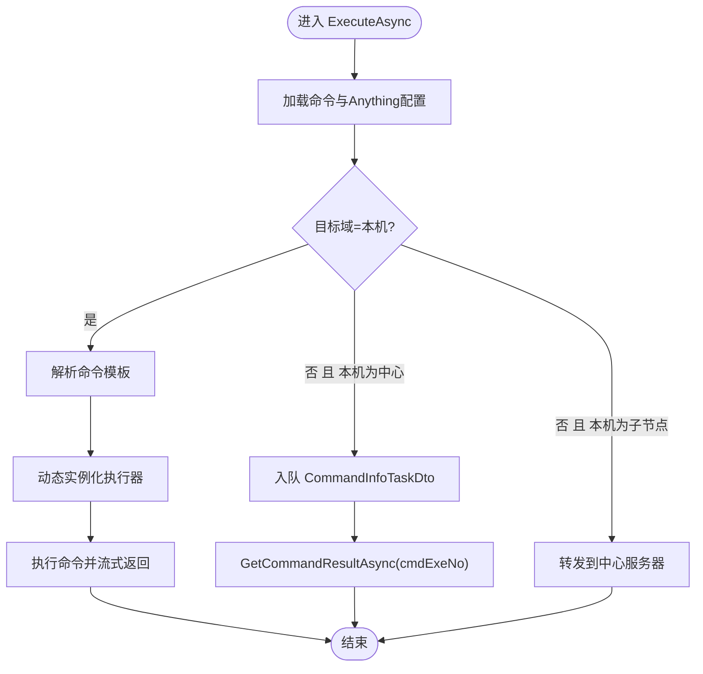
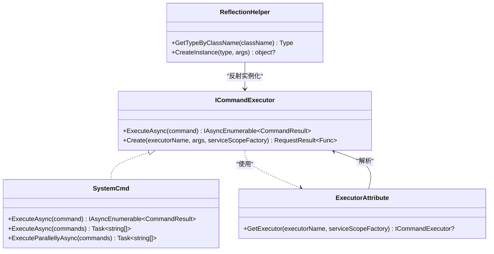
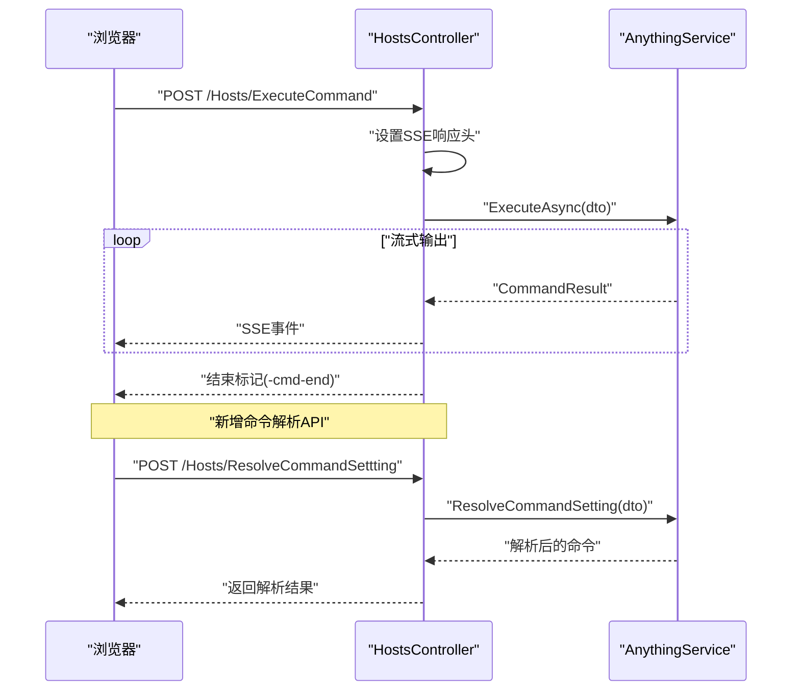
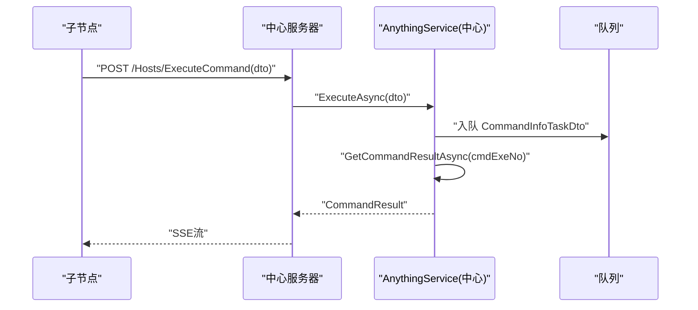
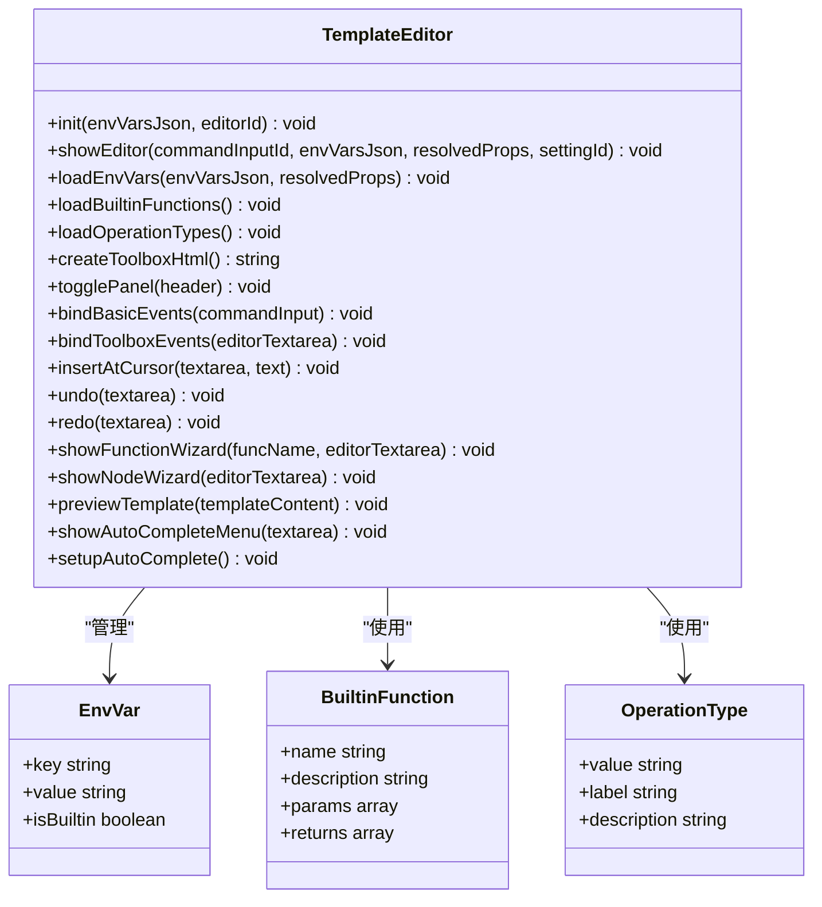
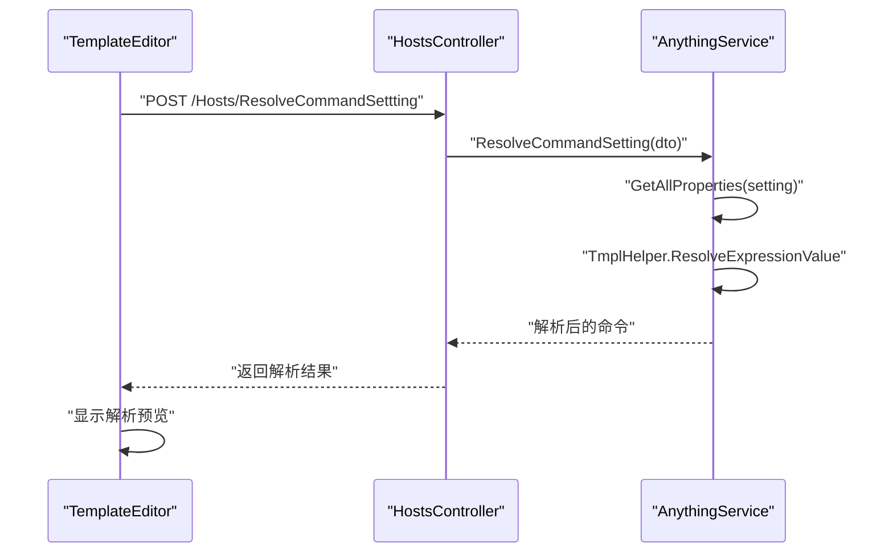
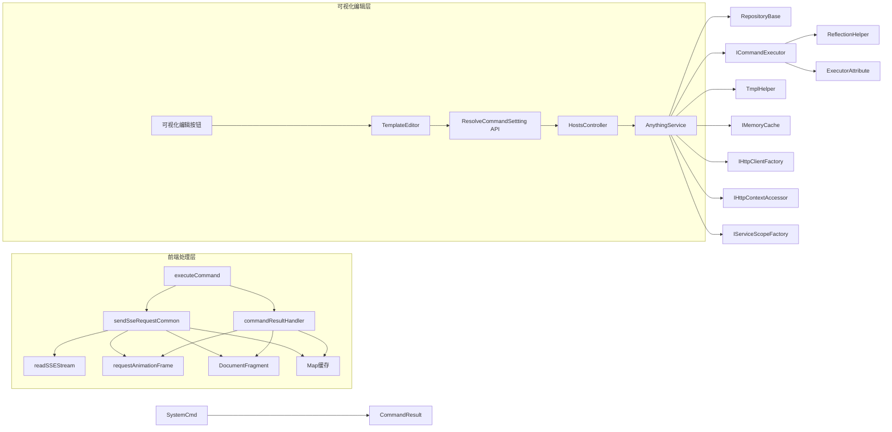

# 命令执行器系统

<cite>
**本文档引用的文件**
- [AnythingExecutor.cs](file://Sylas.RemoteTasks.App/RemoteHostModule/Anything/AnythingExecutor.cs)
- [AnythingCommand.cs](file://Sylas.RemoteTasks.App/RemoteHostModule/Anything/AnythingCommand.cs)
- [AnythingService.cs](file://Sylas.RemoteTasks.App/RemoteHostModule/Anything/AnythingService.cs)
- [AnythingInfo.cs](file://Sylas.RemoteTasks.App/RemoteHostModule/Anything/AnythingInfo.cs)
- [AnythingSetting.cs](file://Sylas.RemoteTasks.App/RemoteHostModule/Anything/AnythingSetting.cs)
- [AnythingSettingDetails.cs](file://Sylas.RemoteTasks.App/RemoteHostModule/Anything/AnythingSettingDetails.cs)
- [CommandInfoInDto.cs](file://Sylas.RemoteTasks.App/RemoteHostModule/Anything/CommandInfoInDto.cs)
- [CommandInfoTaskDto.cs](file://Sylas.RemoteTasks.App/RemoteHostModule/Anything/CommandInfoTaskDto.cs)
- [CommandResolveDto.cs](file://Sylas.RemoteTasks.App/RemoteHostModule/Anything/CommandResolveDto.cs)
- [ICommandExecutor.cs](file://Sylas.RemoteTasks.Utils/CommandExecutor/ICommandExecutor.cs)
- [SystemCmd.cs](file://Sylas.RemoteTasks.Utils/CommandExecutor/SystemCmd.cs)
- [ExecutorAttribute.cs](file://Sylas.RemoteTasks.Utils/CommandExecutor/ExecutorAttribute.cs)
- [CommandResult.cs](file://Sylas.RemoteTasks.Utils/CommandExecutor/CommandResult.cs)
- [ReflectionHelper.cs](file://Sylas.RemoteTasks.Utils/ReflectionHelper.cs)
- [HostsController.cs](file://Sylas.RemoteTasks.App/Controllers/HostsController.cs)
- [anything.js](file://Sylas.RemoteTasks.App/wwwroot/js/anything.js)
- [template-editor.js](file://Sylas.RemoteTasks.App/wwwroot/js/template-editor.js)
- [site.js](file://Sylas.RemoteTasks.App/wwwroot/js/site.js)
- [AnythingInfos.cshtml](file://Sylas.RemoteTasks.App/Views/Hosts/AnythingInfos.cshtml)
- [AnythingFlows.cshtml](file://Sylas.RemoteTasks.App/Views/Hosts/AnythingFlows.cshtml)
</cite>

## 更新摘要
**变更内容**
- 新增可视化编辑功能：在命令界面新增可视化编辑按钮，集成模板编辑器提供所见即所得的命令编辑体验
- 集成TemplateEditor：通过可视化编辑按钮调用TemplateEditor.showEditor方法，支持环境变量、内置函数、操作类型的可视化配置
- 增强用户体验：提供预览解析结果、自动补全、撤销重做等功能，显著提升命令模板编辑效率
- 新增ResolveCommandSettting API：支持实时解析命令模板，配合可视化编辑功能提供即时反馈

## 目录
1. [简介](#简介)
2. [项目结构](#项目结构)
3. [核心组件](#核心组件)
4. [架构总览](#架构总览)
5. [详细组件分析](#详细组件分析)
6. [可视化编辑功能](#可视化编辑功能)
7. [前端SSE流处理架构](#前端sse流处理架构)
8. [依赖关系分析](#依赖关系分析)
9. [性能考量](#性能考量)
10. [故障排查指南](#故障排查指南)
11. [结论](#结论)
12. [附录](#附录)

## 简介
本技术文档围绕"命令执行器系统"展开，重点阐释 AnythingExecutor 的设计与实现，包括执行器工厂模式、参数解析机制、动态实例化过程；详解命令执行流程（ExecuteAsync）、命令解析、执行结果处理；文档化命令队列管理机制（GetCommandTaskAsync 的阻塞等待、任务分发策略、结果收集机制）；并提供跨节点命令执行的网络通信协议与数据传输格式说明。最后给出执行器扩展开发指南与性能监控策略。

**更新** 本次更新重点集成了可视化编辑功能，通过新增的可视化编辑按钮和TemplateEditor模板编辑器，为用户提供所见即所得的命令模板编辑体验，显著提升了系统的易用性和开发效率。

## 项目结构
命令执行器系统主要分布在以下模块：
- 应用层（控制器与业务服务）
  - 控制器：HostsController 提供命令执行的 HTTP 入口，支持 Server-Sent Events 流式输出
  - 业务服务：AnythingService 负责命令解析、执行器动态实例化、跨节点任务队列与结果收集
  - 数据模型：AnythingExecutor、AnythingCommand、AnythingInfo、AnythingSetting、AnythingSettingDetails、CommandInfoInDto、CommandInfoTaskDto、CommandResolveDto
- 工具层（命令执行器与反射工具）
  - ICommandExecutor 接口与工厂方法
  - SystemCmd 默认执行器（本地命令执行）
  - ExecutorAttribute 用于基于 DI 的执行器解析
  - ReflectionHelper 提供类型发现与实例化
  - CommandResult 统一结果载体
- 前端层（SSE流处理与交互）
  - executeCommand 简化实现，调用 sendSseRequestCommon 通用函数
  - sendSseRequestCommon 通用SSE请求处理函数
  - commandResultHandler 自定义消息处理函数
  - **新增** TemplateEditor 可视化模板编辑器，提供命令模板的图形化编辑功能
  - **新增** 可视化编辑按钮，集成在命令界面中
  - 异步生成器SSE流读取器
  - 基于requestAnimationFrame的批量渲染系统
  - DocumentFragment DOM操作优化
  - 消息面板缓存机制



**图表来源**
- [HostsController.cs:230-234](file://Sylas.RemoteTasks.App/Controllers/HostsController.cs#L230-L234)
- [AnythingService.cs:294-389](file://Sylas.RemoteTasks.App/RemoteHostModule/Anything/AnythingService.cs#L294-L389)
- [AnythingService.cs:663-677](file://Sylas.RemoteTasks.App/RemoteHostModule/Anything/AnythingService.cs#L663-L677)
- [ICommandExecutor.cs:31-71](file://Sylas.RemoteTasks.Utils/CommandExecutor/ICommandExecutor.cs#L31-L71)
- [SystemCmd.cs:129-138](file://Sylas.RemoteTasks.Utils/CommandExecutor/SystemCmd.cs#L129-L138)
- [ExecutorAttribute.cs:18-23](file://Sylas.RemoteTasks.Utils/CommandExecutor/ExecutorAttribute.cs#L18-L23)
- [ReflectionHelper.cs:51-56](file://Sylas.RemoteTasks.Utils/ReflectionHelper.cs#L51-L56)
- [anything.js:370-387](file://Sylas.RemoteTasks.App/wwwroot/js/anything.js#L370-L387)
- [template-editor.js:337-422](file://Sylas.RemoteTasks.App/wwwroot/js/template-editor.js#L337-L422)
- [site.js:1426-1523](file://Sylas.RemoteTasks.App/wwwroot/js/site.js#L1426-L1523)

**章节来源**
- [HostsController.cs:230-234](file://Sylas.RemoteTasks.App/Controllers/HostsController.cs#L230-L234)
- [AnythingService.cs:294-389](file://Sylas.RemoteTasks.App/RemoteHostModule/Anything/AnythingService.cs#L294-L389)
- [AnythingService.cs:663-677](file://Sylas.RemoteTasks.App/RemoteHostModule/Anything/AnythingService.cs#L663-L677)
- [ICommandExecutor.cs:31-71](file://Sylas.RemoteTasks.Utils/CommandExecutor/ICommandExecutor.cs#L31-L71)
- [SystemCmd.cs:129-138](file://Sylas.RemoteTasks.Utils/CommandExecutor/SystemCmd.cs#L129-L138)
- [ExecutorAttribute.cs:18-23](file://Sylas.RemoteTasks.Utils/CommandExecutor/ExecutorAttribute.cs#L18-L23)
- [ReflectionHelper.cs:51-56](file://Sylas.RemoteTasks.Utils/ReflectionHelper.cs#L51-L56)
- [anything.js:370-387](file://Sylas.RemoteTasks.App/wwwroot/js/anything.js#L370-L387)
- [template-editor.js:337-422](file://Sylas.RemoteTasks.App/wwwroot/js/template-editor.js#L337-L422)
- [site.js:1426-1523](file://Sylas.RemoteTasks.App/wwwroot/js/site.js#L1426-L1523)

## 核心组件
- AnythingExecutor：存储执行器名称与参数模板（JSON），用于动态实例化
- AnythingCommand：存储命令名称、命令文本、执行状态查询命令、域与排序
- AnythingSetting/AnythingSettingDetails：Anything 的配置与命令集合
- AnythingInfo：解析后的执行上下文（标题、命令、属性、执行器名）
- ICommandExecutor：执行器接口与工厂方法，支持反射与 DI 解析
- SystemCmd：默认执行器，封装本地命令执行、并行执行与系统信息采集
- ExecutorAttribute：标记类为执行器并通过 DI 解析
- ReflectionHelper：按类名查找类型与创建实例
- CommandResult：统一的命令执行结果载体
- HostsController：HTTP 入口，SSE 流式返回实时结果
- **新增** TemplateEditor：可视化模板编辑器，提供命令模板的图形化编辑功能
- **新增** 可视化编辑按钮：集成在命令界面中，提供所见即所得的编辑体验
- **新增** ResolveCommandSettting API：支持实时解析命令模板
- **新增** executeCommand：简化实现的命令执行函数，调用 sendSseRequestCommon
- **新增** sendSseRequestCommon：通用SSE请求处理函数，提供标准化的SSE流处理能力
- **新增** commandResultHandler：自定义消息处理函数，专门处理 anything.js 的命令执行结果

**章节来源**
- [AnythingExecutor.cs:5-11](file://Sylas.RemoteTasks.App/RemoteHostModule/Anything/AnythingExecutor.cs#L5-L11)
- [AnythingCommand.cs:6-34](file://Sylas.RemoteTasks.App/RemoteHostModule/Anything/AnythingCommand.cs#L6-L34)
- [AnythingSetting.cs:8-32](file://Sylas.RemoteTasks.App/RemoteHostModule/Anything/AnythingSetting.cs#L8-L32)
- [AnythingSettingDetails.cs:3-10](file://Sylas.RemoteTasks.App/RemoteHostModule/Anything/AnythingSettingDetails.cs#L3-L10)
- [AnythingInfo.cs:9-36](file://Sylas.RemoteTasks.App/RemoteHostModule/Anything/AnythingInfo.cs#L9-L36)
- [ICommandExecutor.cs:14-71](file://Sylas.RemoteTasks.Utils/CommandExecutor/ICommandExecutor.cs#L14-L71)
- [SystemCmd.cs:129-138](file://Sylas.RemoteTasks.Utils/CommandExecutor/SystemCmd.cs#L129-L138)
- [ExecutorAttribute.cs:18-23](file://Sylas.RemoteTasks.Utils/CommandExecutor/ExecutorAttribute.cs#L18-L23)
- [ReflectionHelper.cs:51-56](file://Sylas.RemoteTasks.Utils/ReflectionHelper.cs#L51-L56)
- [CommandResult.cs:6-36](file://Sylas.RemoteTasks.Utils/CommandExecutor/CommandResult.cs#L6-L36)
- [HostsController.cs:230-234](file://Sylas.RemoteTasks.App/Controllers/HostsController.cs#L230-L234)
- [template-editor.js:5-18](file://Sylas.RemoteTasks.App/wwwroot/js/template-editor.js#L5-L18)
- [anything.js:370-387](file://Sylas.RemoteTasks.App/wwwroot/js/anything.js#L370-L387)
- [site.js:1426-1523](file://Sylas.RemoteTasks.App/wwwroot/js/site.js#L1426-L1523)

## 架构总览
系统采用"配置驱动 + 动态执行器 + SSE 流式输出 + 通用前端处理架构 + 可视化编辑器"的架构：
- 配置层：AnythingSetting/Details 描述操作对象与命令集合，AnythingExecutor 描述执行器与参数模板
- 解析层：AnythingService 解析模板、构建 AnythingInfo、动态实例化执行器
- 执行层：ICommandExecutor.ExecuteAsync 返回异步枚举，SystemCmd 提供默认实现
- 通信层：跨节点通过队列与 HTTP（SSE）传递任务与结果
- 控制层：HostsController 提供 HTTP 入口，SSE 输出实时结果
- **新增** 可视化编辑层：TemplateEditor 提供图形化模板编辑，可视化编辑按钮集成在命令界面中
- **新增** 前端处理层：executeCommand 调用 sendSseRequestCommon，sendSseRequestCommon 提供标准化SSE处理，commandResultHandler 专门处理命令结果



**图表来源**
- [HostsController.cs:230-234](file://Sylas.RemoteTasks.App/Controllers/HostsController.cs#L230-L234)
- [AnythingService.cs:294-389](file://Sylas.RemoteTasks.App/RemoteHostModule/Anything/AnythingService.cs#L294-L389)
- [AnythingService.cs:663-677](file://Sylas.RemoteTasks.App/RemoteHostModule/Anything/AnythingService.cs#L663-L677)
- [ICommandExecutor.cs:31-71](file://Sylas.RemoteTasks.Utils/CommandExecutor/ICommandExecutor.cs#L31-L71)
- [SystemCmd.cs:129-138](file://Sylas.RemoteTasks.Utils/CommandExecutor/SystemCmd.cs#L129-L138)
- [anything.js:370-387](file://Sylas.RemoteTasks.App/wwwroot/js/anything.js#L370-L387)
- [template-editor.js:855-889](file://Sylas.RemoteTasks.App/wwwroot/js/template-editor.js#L855-L889)
- [site.js:1426-1523](file://Sylas.RemoteTasks.App/wwwroot/js/site.js#L1426-L1523)

## 详细组件分析

### AnythingService：命令执行与队列管理
- ExecuteAsync：根据 CommandInfoInDto 查找命令与 Anything 配置，解析命令模板，动态实例化执行器，执行并流式返回结果；若目标域非本机且本机为中心服务器，则将任务入队；若本机为子节点，则转发到中心服务器
- ResolveCommandSetting：基于 Anything 的 Properties 解析命令模板，支持实时命令解析
- BuildAnythingInfoAsync：解析 AnythingExecutor 参数模板，使用反射或 DI 创建执行器实例，并缓存映射
- GetCommandTaskAsync：按域阻塞等待队列中的任务，轮询检查，避免忙等
- GetCommandResultAsync/SetCommandResult：基于内存队列收集跨节点执行结果，带超时控制与日志记录



**图表来源**
- [AnythingService.cs:294-389](file://Sylas.RemoteTasks.App/RemoteHostModule/Anything/AnythingService.cs#L294-L389)
- [CommandInfoTaskDto.cs:3-18](file://Sylas.RemoteTasks.App/RemoteHostModule/Anything/CommandInfoTaskDto.cs#L3-L18)

**章节来源**
- [AnythingService.cs:294-389](file://Sylas.RemoteTasks.App/RemoteHostModule/Anything/AnythingService.cs#L294-L389)
- [AnythingService.cs:663-677](file://Sylas.RemoteTasks.App/RemoteHostModule/Anything/AnythingService.cs#L663-L677)
- [CommandInfoInDto.cs:3-14](file://Sylas.RemoteTasks.App/RemoteHostModule/Anything/CommandInfoInDto.cs#L3-L14)

### ICommandExecutor 与 SystemCmd：执行器工厂与默认实现
- ICommandExecutor.Create：通过类名反射获取类型，优先使用带 ExecutorAttribute 的 DI 解析；否则通过构造函数参数实例化；包装 ExecuteAsync 方法为 Func<object[], IAsyncEnumerable<CommandResult>>
- SystemCmd：实现 ICommandExecutor，提供单命令与批量命令执行、并行执行、系统信息采集等能力；ExecuteAsync 将输出封装为 CommandResult 流



**图表来源**
- [ICommandExecutor.cs:14-71](file://Sylas.RemoteTasks.Utils/CommandExecutor/ICommandExecutor.cs#L14-L71)
- [SystemCmd.cs:129-138](file://Sylas.RemoteTasks.Utils/CommandExecutor/SystemCmd.cs#L129-L138)
- [ExecutorAttribute.cs:18-23](file://Sylas.RemoteTasks.Utils/CommandExecutor/ExecutorAttribute.cs#L18-L23)
- [ReflectionHelper.cs:51-56](file://Sylas.RemoteTasks.Utils/ReflectionHelper.cs#L51-L56)

**章节来源**
- [ICommandExecutor.cs:31-71](file://Sylas.RemoteTasks.Utils/CommandExecutor/ICommandExecutor.cs#L31-L71)
- [SystemCmd.cs:129-138](file://Sylas.RemoteTasks.Utils/CommandExecutor/SystemCmd.cs#L129-L138)
- [ExecutorAttribute.cs:18-23](file://Sylas.RemoteTasks.Utils/CommandExecutor/ExecutorAttribute.cs#L18-L23)
- [ReflectionHelper.cs:51-56](file://Sylas.RemoteTasks.Utils/ReflectionHelper.cs#L51-L56)

### HostsController：HTTP 入口与 SSE 输出
- ExecuteCommandAsync：设置 SSE 头部，逐条写出 CommandResult JSON，支持请求取消与结束标记
- ExecuteCommandsAsync：顺序执行多个命令并输出结果
- **新增** ResolveCommandSetttingAsync：提供命令模板实时解析功能



**图表来源**
- [HostsController.cs:120-158](file://Sylas.RemoteTasks.App/Controllers/HostsController.cs#L120-L158)
- [HostsController.cs:230-234](file://Sylas.RemoteTasks.App/Controllers/HostsController.cs#L230-L234)
- [AnythingService.cs:294-389](file://Sylas.RemoteTasks.App/RemoteHostModule/Anything/AnythingService.cs#L294-L389)
- [AnythingService.cs:663-677](file://Sylas.RemoteTasks.App/RemoteHostModule/Anything/AnythingService.cs#L663-L677)

**章节来源**
- [HostsController.cs:120-158](file://Sylas.RemoteTasks.App/Controllers/HostsController.cs#L120-L158)
- [HostsController.cs:230-234](file://Sylas.RemoteTasks.App/Controllers/HostsController.cs#L230-L234)

### 跨节点命令执行：网络通信与数据格式
- 子节点检测：当命令目标域不等于本机域且本机为中心服务器时，将任务入队；当本机为子节点时，通过 HTTP 将命令转发至中心服务器
- 数据传输：CommandInfoTaskDto 包含命令标识、执行编号、命令名与目标域；结果通过内存队列与 GetCommandResultAsync 收集，最终由控制器以 SSE 输出
- 协议：HTTP + JSON；前端以 SSE 接收流式结果



**图表来源**
- [AnythingService.cs:307-373](file://Sylas.RemoteTasks.App/RemoteHostModule/Anything/AnythingService.cs#L307-L373)
- [CommandInfoTaskDto.cs:3-18](file://Sylas.RemoteTasks.App/RemoteHostModule/Anything/CommandInfoTaskDto.cs#L3-L18)
- [HostsController.cs:120-158](file://Sylas.RemoteTasks.App/Controllers/HostsController.cs#L120-L158)

**章节来源**
- [AnythingService.cs:307-373](file://Sylas.RemoteTasks.App/RemoteHostModule/Anything/AnythingService.cs#L307-L373)
- [CommandInfoTaskDto.cs:3-18](file://Sylas.RemoteTasks.App/RemoteHostModule/Anything/CommandInfoTaskDto.cs#L3-L18)
- [HostsController.cs:120-158](file://Sylas.RemoteTasks.App/Controllers/HostsController.cs#L120-L158)

## 可视化编辑功能

### TemplateEditor：可视化模板编辑器
**新增** TemplateEditor 是全新的可视化模板编辑器，提供命令模板的图形化编辑功能：

- **环境变量管理**：支持用户设置的变量和内置变量的分离显示，提供一键插入功能
- **内置函数库**：包含多种内置函数，如文件操作、字符串处理、数据库操作等，支持参数配置和返回值保存
- **操作类型配置**：提供 Create、Override、Append、Prepend、Replace 等操作类型的可视化配置
- **条件语法支持**：支持 #IF...#IFEND 条件语法和 $for...$forend 循环语法的可视化插入
- **节点向导**：提供完整的节点配置向导，支持目标文件、操作类型、定位模式、内容等参数的可视化配置
- **预览功能**：支持实时预览模板解析结果，便于调试和验证
- **自动补全**：提供智能自动补全功能，支持 Alt+/ 触发
- **撤销重做**：支持 Ctrl+Z 撤销和 Ctrl+Y 重做操作
- **拖拽模态框**：支持模态框的拖拽操作，提升用户体验



**图表来源**
- [template-editor.js:5-18](file://Sylas.RemoteTasks.App/wwwroot/js/template-editor.js#L5-L18)
- [template-editor.js:41-74](file://Sylas.RemoteTasks.App/wwwroot/js/template-editor.js#L41-L74)
- [template-editor.js:79-161](file://Sylas.RemoteTasks.App/wwwroot/js/template-editor.js#L79-L161)
- [template-editor.js:166-174](file://Sylas.RemoteTasks.App/wwwroot/js/template-editor.js#L166-L174)
- [template-editor.js:337-422](file://Sylas.RemoteTasks.App/wwwroot/js/template-editor.js#L337-L422)

**章节来源**
- [template-editor.js:5-18](file://Sylas.RemoteTasks.App/wwwroot/js/template-editor.js#L5-L18)
- [template-editor.js:41-74](file://Sylas.RemoteTasks.App/wwwroot/js/template-editor.js#L41-L74)
- [template-editor.js:79-161](file://Sylas.RemoteTasks.App/wwwroot/js/template-editor.js#L79-L161)
- [template-editor.js:166-174](file://Sylas.RemoteTasks.App/wwwroot/js/template-editor.js#L166-L174)
- [template-editor.js:337-422](file://Sylas.RemoteTasks.App/wwwroot/js/template-editor.js#L337-L422)
- [template-editor.js:855-889](file://Sylas.RemoteTasks.App/wwwroot/js/template-editor.js#L855-L889)

### 可视化编辑按钮：集成在命令界面
**新增** 可视化编辑按钮是集成在命令界面中的新功能，提供便捷的命令模板编辑入口：

- **按钮位置**：位于命令输入框右侧，与解析模板、更新命令按钮并列
- **图标设计**：使用📝图标，直观表示编辑功能
- **事件绑定**：点击后调用 TemplateEditor.showEditor 方法
- **参数传递**：传递命令输入框的类名、环境变量JSON、解析后的属性和设置ID
- **错误处理**：如果 TemplateEditor 未加载，会显示错误提示

```javascript
// 可视化编辑按钮事件
card.querySelectorAll('.visual-edit-btn').forEach(x => x.onclick = e => {
    e.preventDefault();
    e.stopPropagation();
    const commandId = e.target.getAttribute('command-id');
    const anythingId = e.target.getAttribute('anything-id');
    const commandInputClass = `command-input-${commandId}`;
    // 调用模板编辑器，传递环境变量和 settingId
    if (typeof TemplateEditor !== 'undefined') {
        const cardStatus = cardsStatus.find(x => x.id == anythingId);
        const envVarsJson = cardStatus?.originProperties || '{}';
        const resolvedProps = cardStatus?.resolvedProperties || {};
        TemplateEditor.showEditor(commandInputClass, envVarsJson, resolvedProps, anythingId);
    } else {
        console.error('TemplateEditor 未加载');
        showErrorBox('模板编辑器未加载，请刷新页面重试');
    }
})
```

**章节来源**
- [anything.js:370-387](file://Sylas.RemoteTasks.App/wwwroot/js/anything.js#L370-L387)

### ResolveCommandSettting API：实时命令解析
**新增** ResolveCommandSettting API 提供实时命令模板解析功能：

- **接口定义**：HostsController.ResolveCommandSetttingAsync 方法
- **参数结构**：CommandResolveDto，包含 AnythingSetting ID 和命令文本
- **解析逻辑**：调用 AnythingService.ResolveCommandSettingAsync，基于环境变量解析命令模板
- **返回结果**：解析后的命令字符串，支持错误处理和异常情况
- **应用场景**：可视化编辑器的预览功能、命令调试、模板验证



**图表来源**
- [HostsController.cs:230-234](file://Sylas.RemoteTasks.App/Controllers/HostsController.cs#L230-L234)
- [AnythingService.cs:663-677](file://Sylas.RemoteTasks.App/RemoteHostModule/Anything/AnythingService.cs#L663-L677)
- [template-editor.js:855-889](file://Sylas.RemoteTasks.App/wwwroot/js/template-editor.js#L855-L889)

**章节来源**
- [HostsController.cs:230-234](file://Sylas.RemoteTasks.App/Controllers/HostsController.cs#L230-L234)
- [AnythingService.cs:663-677](file://Sylas.RemoteTasks.App/RemoteHostModule/Anything/AnythingService.cs#L663-L677)
- [template-editor.js:855-889](file://Sylas.RemoteTasks.App/wwwroot/js/template-editor.js#L855-L889)

### 模板编辑器界面集成
**新增** 模板编辑器与现有界面的无缝集成：

- **页面集成**：AnythingInfos.cshtml 页面引入 template-editor.js 脚本
- **模态框设计**：采用 Bootstrap 模态框，支持拖拽操作
- **工具箱布局**：左侧工具箱，右侧编辑区域，支持折叠展开
- **环境变量面板**：分离用户变量和内置变量，提供不同颜色标识
- **内置函数配置**：支持参数输入和返回值配置的向导界面
- **节点配置向导**：完整的节点配置界面，支持预览和插入操作

**章节来源**
- [AnythingInfos.cshtml:9-10](file://Sylas.RemoteTasks.App/Views/Hosts/AnythingInfos.cshtml#L9-L10)
- [template-editor.js:337-422](file://Sylas.RemoteTasks.App/wwwroot/js/template-editor.js#L337-L422)

## 前端SSE流处理架构

### executeCommand：简化实现的命令执行函数
**更新** executeCommand 函数已大幅简化，现在仅28行代码，通过调用 sendSseRequestCommon 通用函数实现：

- **标准化处理**：统一调用 sendSseRequestCommon，避免重复的SSE流处理逻辑
- **参数传递**：清晰传递URL、请求体、命令名称、按钮元素、消息面板等参数
- **超时控制**：支持自定义超时时间（默认3分钟）
- **错误处理**：通过 sendSseRequestCommon 统一处理认证失败、接口不存在等错误
- **资源管理**：自动管理Spinner显示与隐藏，确保资源正确释放

```javascript
/**
 * 执行单个命令 - 使用 async generator 消费 SSE 流
 */
async function executeCommand(commandId, commandName, executeBtn) {
    // 清空消息面板
    const msgPannel = document.querySelector(`button[command-name="${commandName}"]`)
        ?.closest('.command-item')
        ?.querySelector('.command-resolved');
    if (msgPannel) msgPannel.innerHTML = '';
    const requestBody = JSON.stringify({ commandId });
    // 支持SSE的fetch请求
    // ✅ 复用 sendSseRequestCommon，传入自定义的消息处理函数和超时时间
    await sendSseRequestCommon(
        '/Hosts/ExecuteCommand',            // url
        requestBody,                        // requestBody
        commandName,                        // requestTitle
        executeBtn,                         // spinnerEle
        msgPannel,                          // msgContainer
        null,                               // onstart
        commandResultHandler,               // 自定义消息处理函数
        60 * 3                              // 超时 3 分钟
    );
}
```

**章节来源**
- [anything.js:6-36](file://Sylas.RemoteTasks.App/wwwroot/js/anything.js#L6-L36)

### sendSseRequestCommon：通用SSE请求处理函数
**新增** sendSseRequestCommon 是全新的通用SSE请求处理函数，提供标准化的SSE流处理能力：

- **统一认证**：自动获取并附加访问令牌，处理认证失败场景
- **错误处理**：统一处理401、404等HTTP错误状态
- **异步生成器**：使用 readSSEStream 异步生成器逐条解析SSE流
- **批量渲染**：集成 requestAnimationFrame 批量渲染优化
- **超时控制**：支持自定义超时时间，防止无限等待
- **资源管理**：自动清理定时器和Spinner，确保资源正确释放
- **消息队列**：使用 globalMsgContainer 缓存消息，支持离线渲染

```javascript
/**
 * 发送 SSE 请求（通用版）
 * @param {string} url SSE 后端地址
 * @param {any} requestBody 请求体内容, json 格式
 * @param {string} requestTitle 当前请求的标识, 用于区分不同请求返回的消息
 * @param {HTMLElement} spinnerEle 发送请求的按钮
 * @param {HTMLElement} msgContainer 显示消息的容器
 * @param {Function} onstart 初始化函数
 * @param {Function} msgHandler 消息处理函数 (data, requestTitle, msgContainer) => isLastResult
 * @param {number} timeoutSeconds 超时时间（秒），默认 30 秒
 * @returns
 */
async function sendSseRequestCommon(url, requestBody, requestTitle, spinnerEle, msgContainer, onstart, msgHandler = null, timeoutSeconds = 30) {
    // 统一认证处理
    const accessToken = getAccessToken();
    if (!accessToken) {
        showWarningBox('身份已过期, 请重新登录', () => location.href = `/Home/Login?redirect_path=${location.pathname}`);
        return null;
    }
    
    // 发送HTTP请求
    const response = await fetch(url, {
        method: 'POST',
        headers: {
            'Content-Type': 'application/json',
            'X-Requested-With': 'XMLHttpRequest',
            'authorization': `Bearer ${accessToken}`
        },
        body: requestBody
    })

    // 错误处理
    if (!response.ok) {
        if (response.status === 401) {
            showWarningBox('身份已过期, 请重新登录', () => location.href = `/Home/Login?redirect_path=${location.pathname}`);
            return null;
        }
        else if (response.status === 404) {
            showErrorBox('接口不存在, 请确认请求方式和参数');
            return null;
        } else {
            showErrorBox(`请求异常:${response.statusText}`);
            return null;
        }
    }

    // 使用默认或自定义的消息处理函数
    const handler = msgHandler || msgsHandler;
    
    // 批量渲染定时器
    let msgNotFoundCount = 0;
    let pendingRender = false;
    const interval = window.setInterval(() => {
        if (globalMsgContainer[requestTitle]) {
            const msgCount = globalMsgContainer[requestTitle].length;
            if (msgCount === 0) {
                msgNotFoundCount++;
            } else {
                msgNotFoundCount = 0;
                // 使用 requestAnimationFrame 批量渲染
                if (!pendingRender) {
                    pendingRender = true;
                    requestAnimationFrame(() => {
                        const messages = globalMsgContainer[requestTitle].splice(0);
                        for (const data of messages) {
                            const isLastResult = handler(data, requestTitle, msgContainer);
                            if (isLastResult) {
                                window.clearInterval(interval);
                                closeSpinner(spinnerEle);
                                break;
                            }
                        }
                        pendingRender = false;
                    });
                }
            }
            // 超时检测
            if (msgNotFoundCount >= (timeoutSeconds * 1000) / frequency) {
                window.clearInterval(interval);
            }
        }
    }, frequency)

    // 使用 async generator 读取 SSE 流（已解码）
    for await (const data of readSSEStream(response)) {
        if (!globalMsgContainer[requestTitle]) {
            globalMsgContainer[requestTitle] = [data];
        } else {
            globalMsgContainer[requestTitle].push(data);
        }
    }

    // SSE 流结束后，立即处理剩余消息
    const remainingMessages = globalMsgContainer[requestTitle]?.splice(0) || [];
    for (const data of remainingMessages) {
        handler(data, requestTitle, msgContainer);
    }

    // 清理
    window.clearInterval(interval);
    closeSpinner(spinnerEle);
}
```

**章节来源**
- [site.js:1426-1523](file://Sylas.RemoteTasks.App/wwwroot/js/site.js#L1426-L1523)

### commandResultHandler：自定义消息处理函数
**新增** commandResultHandler 是专门为 anything.js 设计的自定义消息处理函数：

- **专用处理**：针对命令执行结果的特殊格式进行处理
- **DOM优化**：使用 DocumentFragment 批量构建DOM元素
- **进度条处理**：智能处理进度条显示，避免重复渲染
- **错误消息处理**：支持多行错误消息的格式化显示
- **成功状态处理**：首次成功执行时显示成功消息
- **消息截断**：超过长度限制的消息自动截断显示
- **滚动优化**：自动滚动到底部，保持用户阅读体验

```javascript
function commandResultHandler(data, commandName, msgPannel) {
    let isLastResult = false;
    if (!msgPannel) {
        return isLastResult;
    }

    // ✅ 使用 DocumentFragment 批量构建 DOM
    const fragment = document.createDocumentFragment();
    if (!data.succeed && data?.commandExecuteNo?.indexOf('-cmd-end') === -1) {
        const errMsg = data.message ? data.message : '操作失败';
        const errMsgLines = errMsg.split('\n');
        const titleP = document.createElement('p');
        titleP.style.color = 'red';
        titleP.textContent = `${commandName}:`;
        fragment.appendChild(titleP);

        for (var i = 0; i < errMsgLines.length; i++) {
            const p = document.createElement('p');
            p.style.color = 'red';
            p.innerHTML = `&nbsp;&nbsp;&nbsp;&nbsp;${trimMsg(errMsgLines[i], 50)}`;
            fragment.appendChild(p);
        }
    } else if (!data.message) {
        if (data.commandExecuteNo && data.commandExecuteNo.endsWith('-cmd-end')) {
            isLastResult = true;
        } else if (msgPannel.innerHTML.length === 0) {
            const p = document.createElement('p');
            p.style.color = 'green';
            p.textContent = `${commandName}: 操作成功 ✓`;
            fragment.appendChild(p);
        }
    } else {
        const msgs = data.message.split('\n');
        for (var i = 0; i < msgs.length; i++) {
            let msg = msgs[i];
            if (msg && msg.length > 50) {
                msg = trimMsg(msg, 50);
            }
            const processBarPattern = /\[=*>\s*\]\s*(\d+(\.\d+)*)\s*%/;
            const m = msg.match(processBarPattern);
            if (m && m.length > 2) {
                const last = msgPannel.lastChild;
                const lastHtml = last.outerHTML;
                if (last && lastHtml.endsWith('%</div>') && !lastHtml.endsWith('100.00 %</div>')) {
                    if (lastHtml.indexOf('100.00') > -1) {
                        console.warn('remove 100%');
                    }
                    last.remove();
                }
            }
            const div = document.createElement('div');
            div.style.cssText = 'color:gray; margin-left:20px;';
            div.textContent = msg;
            fragment.appendChild(div);
        }
        msgPannel.scrollTop = msgPannel.scrollHeight;
    }

    // ✅ 一次性追加到 DOM
    if (fragment.childNodes.length > 0) {
        msgPannel.appendChild(fragment);
        msgPannel.scrollTop = msgPannel.scrollHeight;
    }
    return isLastResult;
}
```

**章节来源**
- [anything.js:41-117](file://Sylas.RemoteTasks.App/wwwroot/js/anything.js#L41-L117)

### 异步生成器SSE流读取器
**新增** 使用 async generator 实现的 readSSEStream 函数，提供高效的SSE流处理能力：

- **逐条解析**：使用正则表达式匹配JSON格式，确保每条消息的完整性
- **错误处理**：包含JSON解析失败的异常捕获和警告日志
- **流式消费**：支持 for-await-of 循环直接消费SSE流
- **资源管理**：在 finally 块中释放读取器锁，确保资源正确回收

```javascript
/**
 * SSE 流读取器 - 使用 async generator 实现
 * 逐条解析并产出 JSON 数据
 */
async function* readSSEStream(response) {
    const reader = response.body.getReader();
    const decoder = new TextDecoder();
    
    try {
        while (true) {
            const { done, value } = await reader.read();
            if (done) break;
            
            // 解码二进制为文本
            const text = decoder.decode(value, { stream: true });
            
            // 解析 JSON（一次可能返回多条）
            const jsonList = text.match(/\{.+\}\n?/g);
            if (!jsonList) {
                console.warn('无法解析 JSON:', text);
                continue;
            }
            
            for (const json of jsonList) {
                try {
                    yield JSON.parse(json);
                } catch (e) {
                    console.warn('JSON 解析失败:', json);
                }
            }
        }
    } finally {
        reader.releaseLock();
    }
}
```

**章节来源**
- [site.js:1382-1412](file://Sylas.RemoteTasks.App/wwwroot/js/site.js#L1382-L1412)

### 基于requestAnimationFrame的批量渲染系统
**新增** 使用 requestAnimationFrame 优化DOM渲染性能：

- **批量处理**：通过 msgContainer 队列收集待渲染的消息，避免频繁DOM操作
- **节流渲染**：使用 pendingRender 标志防止重复渲染请求
- **动画帧优化**：在浏览器空闲时批量处理消息，提升UI响应性
- **频率控制**：通过 200ms 的频率间隔控制渲染节奏

```javascript
let pendingRender = false;
const interval = window.setInterval(() => {
    if (msgContainer[commandName]) {
        const msgCount = msgContainer[commandName].length;
        if (msgCount === 0) {
            msgNotFoundCount++;
        } else {
            msgNotFoundCount = 0;
            // ✅ 使用 requestAnimationFrame 批量渲染
            if (!pendingRender) {
                pendingRender = true;
                requestAnimationFrame(() => {
                    const messages = msgContainer[commandName].splice(0);  // 取出所有消息
                    for (const value of messages) {
                        const isLastResult = commandResultHandler(value, commandName);
                        if (isLastResult) {
                            window.clearInterval(interval);
                            closeSpinner(spinnerEle);
                            break;
                        }
                    }
                    pendingRender = false;
                });
            }
        }
        // 连续3min没有新消息, 则停止计时器
        const timeout = 60 * 3;
        if (msgNotFoundCount >= (timeout * 1000) / frequency) {
            console.log('clear interval(sse消息队列)')
            window.clearInterval(interval);
        }
    }
}, frequency)
```

**章节来源**
- [anything.js:79-122](file://Sylas.RemoteTasks.App/wwwroot/js/anything.js#L79-L122)

### DocumentFragment DOM操作优化
**新增** 使用 DocumentFragment 批量构建和插入DOM元素：

- **批量构建**：创建 DocumentFragment 作为临时容器，避免多次DOM查询
- **一次性插入**：将所有创建的DOM元素一次性添加到实际容器中
- **性能提升**：减少DOM操作次数，避免回流和重绘
- **滚动位置保持**：插入后自动滚动到底部，保持用户阅读体验

```javascript
// ✅ 使用 DocumentFragment 批量构建 DOM
const fragment = document.createDocumentFragment();
// ... 创建多个DOM元素 ...
// ✅ 一次性追加到 DOM
if (fragment.childNodes.length > 0) {
    msgPannel.appendChild(fragment);
    msgPannel.scrollTop = msgPannel.scrollHeight;
}
```

**章节来源**
- [anything.js:164-233](file://Sylas.RemoteTasks.App/wwwroot/js/anything.js#L164-L233)

### 消息面板缓存机制
**新增** 使用 Map 缓存 DOM 元素引用，避免重复查询：

- **缓存策略**：通过 msgPannelCache Map 存储命令名称到DOM元素的映射
- **懒加载**：首次访问时才查询DOM元素并缓存
- **性能优化**：避免重复的 querySelector 操作，提升查找效率
- **内存管理**：缓存生命周期与命令执行周期一致

```javascript
function getMsgPannel(commandName) {
    if (!msgPannelCache.has(commandName)) {
        const pannel = document.querySelector(`button[command-name="${commandName}"]`)
            ?.closest('.command-item')
            ?.querySelector('.command-resolved');
        if (pannel) msgPannelCache.set(commandName, pannel);
    }
    return msgPannelCache.get(commandName);
}
```

**章节来源**
- [anything.js:142-154](file://Sylas.RemoteTasks.App/wwwroot/js/anything.js#L142-L154)

### 重构的命令结果处理器
**新增** 优化的消息处理和进度条显示逻辑：

- **进度条处理**：识别 `[=>] 85.5%` 格式的进度条消息，自动处理重复和完成状态
- **结束标记识别**：正确识别 `-cmd-end` 结束标记，触发清理和关闭操作
- **错误消息处理**：支持多行错误消息的格式化显示
- **成功状态处理**：首次成功执行时显示成功消息
- **消息截断**：超过长度限制的消息自动截断显示

```javascript
const processBarPattern = /\[=*>\s*\]\s*(\d+(\.\d+)*)\s*%/;
const m = msg.match(processBarPattern);
if (m && m.length > 2) {
    const last = msgPannel.lastChild;
    const lastHtml = last.outerHTML;
    if (last && lastHtml.endsWith('%</div>') && !lastHtml.endsWith('100.00 %</div>')) {
        if (lastHtml.indexOf('100.00') > -1) {
            console.warn('remove 100%');
        }
        last.remove();
    }
}
```

**章节来源**
- [anything.js:138-225](file://Sylas.RemoteTasks.App/wwwroot/js/anything.js#L138-L225)

## 依赖关系分析
- AnythingService 依赖：
  - RepositoryBase<AnythingSetting/AnythingExecutor/AnythingCommand>：数据访问
  - ILogger/IMemoryCache/IHttpClientFactory/IHttpContextAccessor/IServiceScopeFactory：日志、缓存、HTTP、上下文、作用域
  - ICommandExecutor：执行器工厂
  - TmplHelper：模板解析
- ICommandExecutor.Create 依赖：
  - ReflectionHelper：类型发现
  - ExecutorAttribute + IServiceScopeFactory：DI 解析
- SystemCmd 依赖：
  - CommandResult：结果封装
  - System 环境：进程、文件、网络信息
- **新增** 前端处理层依赖：
  - sendSseRequestCommon：提供标准化SSE处理
  - commandResultHandler：专门处理命令执行结果
  - readSSEStream：异步生成器SSE流读取器
  - requestAnimationFrame：浏览器渲染优化
  - DocumentFragment：DOM批量操作
  - Map：缓存机制
  - **新增** TemplateEditor：提供可视化模板编辑功能
  - **新增** 可视化编辑按钮：集成在命令界面中
  - **新增** ResolveCommandSettting API：支持实时命令解析



**图表来源**
- [AnythingService.cs:30-38](file://Sylas.RemoteTasks.App/RemoteHostModule/Anything/AnythingService.cs#L30-L38)
- [ICommandExecutor.cs:31-71](file://Sylas.RemoteTasks.Utils/CommandExecutor/ICommandExecutor.cs#L31-L71)
- [SystemCmd.cs:129-138](file://Sylas.RemoteTasks.Utils/CommandExecutor/SystemCmd.cs#L129-L138)
- [anything.js:6-36](file://Sylas.RemoteTasks.App/wwwroot/js/anything.js#L6-L36)
- [anything.js:370-387](file://Sylas.RemoteTasks.App/wwwroot/js/anything.js#L370-L387)
- [template-editor.js:337-422](file://Sylas.RemoteTasks.App/wwwroot/js/template-editor.js#L337-L422)
- [HostsController.cs:230-234](file://Sylas.RemoteTasks.App/Controllers/HostsController.cs#L230-L234)
- [site.js:1426-1523](file://Sylas.RemoteTasks.App/wwwroot/js/site.js#L1426-L1523)

**章节来源**
- [AnythingService.cs:30-38](file://Sylas.RemoteTasks.App/RemoteHostModule/Anything/AnythingService.cs#L30-L38)
- [ICommandExecutor.cs:31-71](file://Sylas.RemoteTasks.Utils/CommandExecutor/ICommandExecutor.cs#L31-L71)
- [SystemCmd.cs:129-138](file://Sylas.RemoteTasks.Utils/CommandExecutor/SystemCmd.cs#L129-L138)
- [anything.js:6-36](file://Sylas.RemoteTasks.App/wwwroot/js/anything.js#L6-L36)
- [anything.js:370-387](file://Sylas.RemoteTasks.App/wwwroot/js/anything.js#L370-L387)
- [template-editor.js:337-422](file://Sylas.RemoteTasks.App/wwwroot/js/template-editor.js#L337-L422)
- [HostsController.cs:230-234](file://Sylas.RemoteTasks.App/Controllers/HostsController.cs#L230-L234)
- [site.js:1426-1523](file://Sylas.RemoteTasks.App/wwwroot/js/site.js#L1426-L1523)

## 性能考量
- 异步流式输出：SSE 逐条写出 CommandResult，降低前端等待与内存压力
- 缓存策略：对 AnythingInfo 与执行器配置进行短期缓存，减少重复解析与实例化
- 队列轮询：GetCommandTaskAsync 采用固定延迟轮询，避免忙等；建议结合信号量或阻塞队列优化
- 并行执行：SystemCmd 提供 ExecuteParallellyAsync，适合多命令并行场景；注意资源竞争与输出合并
- 日志与超时：GetCommandResultAsync 设置超时与周期性日志，防止无限等待
- **新增** 前端性能优化：
  - 统一SSE处理：sendSseRequestCommon 统一处理认证、错误、渲染等逻辑
  - 异步生成器：避免阻塞主线程，提升SSE流处理效率
  - requestAnimationFrame：利用浏览器渲染优化，减少UI卡顿
  - DocumentFragment：批量DOM操作，避免频繁回流
  - 消息面板缓存：减少DOM查询开销，提升渲染速度
  - 进度条优化：智能处理进度条显示，避免重复渲染
  - 资源管理：自动清理定时器和Spinner，防止内存泄漏
  - **新增** 可视化编辑器优化：TemplateEditor 使用虚拟DOM和增量更新，提升编辑性能
  - **新增** 模态框拖拽：makeModalDraggable 函数优化拖拽性能，避免频繁重绘

## 故障排查指南
- 未知命令或执行器：检查 CommandInfoInDto.CommandId 与 AnythingExecutor 配置
- 执行器参数解析失败：确认 AnythingExecutor.Arguments 的 JSON 结构与类型转换
- 跨节点无结果：检查 AppStatus.Domain 与命令 Domain 是否一致；确认中心服务器队列是否入队；检查子节点是否正确转发
- SSE 未结束：确认控制器在 finally 中发送结束标记"-cmd-end"
- 超时问题：GetCommandResultAsync 默认超时，适当调整或增加日志定位瓶颈
- **新增** 可视化编辑问题：
  - TemplateEditor 未加载：检查页面是否正确引入 template-editor.js
  - 可视化编辑按钮无效：确认按钮事件绑定是否正常，检查 console 错误
  - 命令解析失败：检查 ResolveCommandSettting API 是否正常响应，验证环境变量格式
  - 模态框无法拖拽：检查 makeModalDraggable 函数是否正确加载
  - 自动补全功能异常：检查 Alt+/ 快捷键绑定和自动补全菜单显示
- **新增** 前端性能问题：
  - executeCommand 简化后仍能正常工作：检查 sendSseRequestCommon 的调用参数
  - SSE流读取异常：检查 readSSEStream 函数的JSON解析逻辑
  - 渲染卡顿：确认 requestAnimationFrame 的使用是否正确
  - DOM操作异常：验证 DocumentFragment 的使用和插入时机
  - 缓存失效：检查 msgPannelCache 的生命周期管理
  - 认证失败：检查 getAccessToken 的返回值和 sendSseRequestCommon 的认证处理

**章节来源**
- [AnythingService.cs:294-389](file://Sylas.RemoteTasks.App/RemoteHostModule/Anything/AnythingService.cs#L294-L389)
- [HostsController.cs:120-158](file://Sylas.RemoteTasks.App/Controllers/HostsController.cs#L120-L158)
- [HostsController.cs:230-234](file://Sylas.RemoteTasks.App/Controllers/HostsController.cs#L230-L234)
- [anything.js:6-36](file://Sylas.RemoteTasks.App/wwwroot/js/anything.js#L6-L36)
- [anything.js:370-387](file://Sylas.RemoteTasks.App/wwwroot/js/anything.js#L370-L387)
- [template-editor.js:855-889](file://Sylas.RemoteTasks.App/wwwroot/js/template-editor.js#L855-L889)
- [site.js:1426-1523](file://Sylas.RemoteTasks.App/wwwroot/js/site.js#L1426-L1523)

## 结论
命令执行器系统通过"配置驱动 + 动态执行器 + SSE 流式输出 + 通用前端处理架构 + 可视化编辑器"的架构，实现了灵活、可扩展且高性能的命令执行框架。AnythingService 负责解析、实例化与跨节点协调；ICommandExecutor 提供统一接口与工厂能力；SystemCmd 提供默认实现与系统信息采集。前端层通过 executeCommand 简化实现、sendSseRequestCommon 通用处理函数和 commandResultHandler 自定义处理器，显著提升了代码复用性和可维护性。**新增的可视化编辑功能**通过 TemplateEditor 和可视化编辑按钮，为用户提供所见即所得的命令模板编辑体验，支持环境变量管理、内置函数配置、操作类型设置、条件语法插入等高级功能。通过合理的缓存、队列、超时机制和前端性能优化，系统在易用性与性能之间取得了最佳平衡。

## 附录

### 配置与使用示例（步骤说明）
- 配置 AnythingExecutor
  - 在数据库中新增执行器记录，设置 Name 与 Arguments（JSON 数组，包含 ArgumentValue 与 ArgumentType）
  - 在 AnythingSetting 中选择 Executor
- 配置 AnythingCommand
  - 设置命令名称、命令文本（可含模板变量）、执行状态查询命令、目标域与排序
- 触发执行
  - 调用 /Hosts/ExecuteCommand，传入 CommandInfoInDto（包含 CommandId 与可选 CommandExecuteNo）
  - 前端通过 executeCommand 调用 sendSseRequestCommon，自动处理SSE流和DOM渲染
- **新增** 可视化编辑使用
  - 在命令界面点击📝可视化编辑按钮
  - 在模板编辑器中配置环境变量、内置函数、操作类型
  - 使用预览功能验证命令解析结果
  - 点击应用按钮将编辑后的模板应用到命令

**章节来源**
- [AnythingExecutor.cs:5-11](file://Sylas.RemoteTasks.App/RemoteHostModule/Anything/AnythingExecutor.cs#L5-L11)
- [AnythingCommand.cs:6-34](file://Sylas.RemoteTasks.App/RemoteHostModule/Anything/AnythingCommand.cs#L6-L34)
- [AnythingSetting.cs:8-32](file://Sylas.RemoteTasks.App/RemoteHostModule/Anything/AnythingSetting.cs#L8-L32)
- [CommandInfoInDto.cs:3-14](file://Sylas.RemoteTasks.App/RemoteHostModule/Anything/CommandInfoInDto.cs#L3-L14)
- [HostsController.cs:120-158](file://Sylas.RemoteTasks.App/Controllers/HostsController.cs#L120-L158)
- [HostsController.cs:230-234](file://Sylas.RemoteTasks.App/Controllers/HostsController.cs#L230-L234)
- [anything.js:6-36](file://Sylas.RemoteTasks.App/wwwroot/js/anything.js#L6-L36)
- [anything.js:370-387](file://Sylas.RemoteTasks.App/wwwroot/js/anything.js#L370-L387)
- [template-editor.js:337-422](file://Sylas.RemoteTasks.App/wwwroot/js/template-editor.js#L337-L422)

### 扩展开发指南
- 新增执行器
  - 实现 ICommandExecutor 接口，提供 ExecuteAsync 返回 IAsyncEnumerable<CommandResult>
  - 若需 DI 注入，使用 ExecutorAttribute 标记类，并在服务注册中以键值绑定
  - 在 AnythingExecutor.Arguments 中配置参数模板，支持类型转换
- 参数解析
  - 使用 TmplHelper.ResolveExpressionValue 解析 Anything 的 Properties 与命令模板
  - 注意类型转换（如 Int32/Int64）与空值处理
- 跨节点扩展
  - 在中心服务器维护 _serverNodeQueues，按 Domain 分区管理
  - 子节点通过 HTTP 转发命令，中心服务器负责结果聚合与 SSE 输出
- **新增** 前端扩展开发
  - 使用 sendSseRequestCommon 作为基础，传入自定义的 msgHandler 实现特定页面的处理逻辑
  - 通过 commandResultHandler 模式，实现页面特定的消息处理和DOM操作
  - 利用 readSSEStream 异步生成器，支持自定义SSE流解析逻辑
  - 借助 requestAnimationFrame 和 DocumentFragment，优化页面渲染性能
  - **新增** TemplateEditor 扩展：可扩展内置函数库、操作类型、工具箱面板
  - **新增** 可视化编辑器集成：可在其他页面集成 TemplateEditor 功能
- **新增** 可视化编辑器扩展
  - 扩展内置函数库：在 loadBuiltinFunctions 中添加新的函数定义
  - 添加新的操作类型：在 loadOperationTypes 中扩展操作类型列表
  - 自定义工具箱面板：通过 createToolboxHtml 添加新的工具面板
  - 集成新的语法支持：扩展条件语法和循环语法的可视化配置

**章节来源**
- [ICommandExecutor.cs:14-71](file://Sylas.RemoteTasks.Utils/CommandExecutor/ICommandExecutor.cs#L14-L71)
- [ExecutorAttribute.cs:18-23](file://Sylas.RemoteTasks.Utils/CommandExecutor/ExecutorAttribute.cs#L18-L23)
- [ReflectionHelper.cs:51-56](file://Sylas.RemoteTasks.Utils/ReflectionHelper.cs#L51-L56)
- [AnythingService.cs:522-631](file://Sylas.RemoteTasks.App/RemoteHostModule/Anything/AnythingService.cs#L522-L631)
- [anything.js:6-36](file://Sylas.RemoteTasks.App/wwwroot/js/anything.js#L6-L36)
- [anything.js:370-387](file://Sylas.RemoteTasks.App/wwwroot/js/anything.js#L370-L387)
- [template-editor.js:79-161](file://Sylas.RemoteTasks.App/wwwroot/js/template-editor.js#L79-L161)
- [template-editor.js:166-174](file://Sylas.RemoteTasks.App/wwwroot/js/template-editor.js#L166-L174)
- [template-editor.js:179-315](file://Sylas.RemoteTasks.App/wwwroot/js/template-editor.js#L179-L315)
- [site.js:1426-1523](file://Sylas.RemoteTasks.App/wwwroot/js/site.js#L1426-L1523)

### 前端性能优化最佳实践
- **SSE流处理**：使用 sendSseRequestCommon 统一处理SSE流，避免重复的认证和错误处理代码
- **批量渲染**：通过 requestAnimationFrame 合理安排渲染时机，避免频繁重排
- **DOM操作**：使用 DocumentFragment 批量构建DOM，减少回流和重绘
- **缓存策略**：合理使用Map缓存DOM元素引用，避免重复查询
- **进度条优化**：智能处理进度条显示，避免重复渲染和闪烁
- **内存管理**：及时清理定时器和缓存，防止内存泄漏
- **代码复用**：通过通用函数减少重复代码，提高维护性
- ****新增** 可视化编辑器优化**：
  - 使用虚拟DOM和增量更新，避免不必要的重渲染
  - 模态框拖拽优化：使用 transform 替代 top/left 属性
  - 自动补全性能：使用防抖和节流优化输入响应
  - 撤销重做栈管理：限制最大栈深度，避免内存泄漏
  - 工具箱懒加载：按需加载工具箱内容，提升初始加载性能

**章节来源**
- [anything.js:6-36](file://Sylas.RemoteTasks.App/wwwroot/js/anything.js#L6-L36)
- [anything.js:370-387](file://Sylas.RemoteTasks.App/wwwroot/js/anything.js#L370-L387)
- [template-editor.js:575-641](file://Sylas.RemoteTasks.App/wwwroot/js/template-editor.js#L575-L641)
- [template-editor.js:1000-1009](file://Sylas.RemoteTasks.App/wwwroot/js/template-editor.js#L1000-L1009)
- [site.js:1426-1523](file://Sylas.RemoteTasks.App/wwwroot/js/site.js#L1426-L1523)