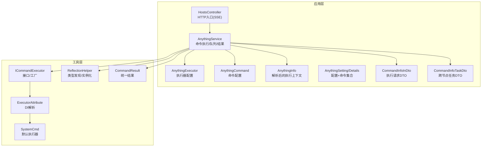
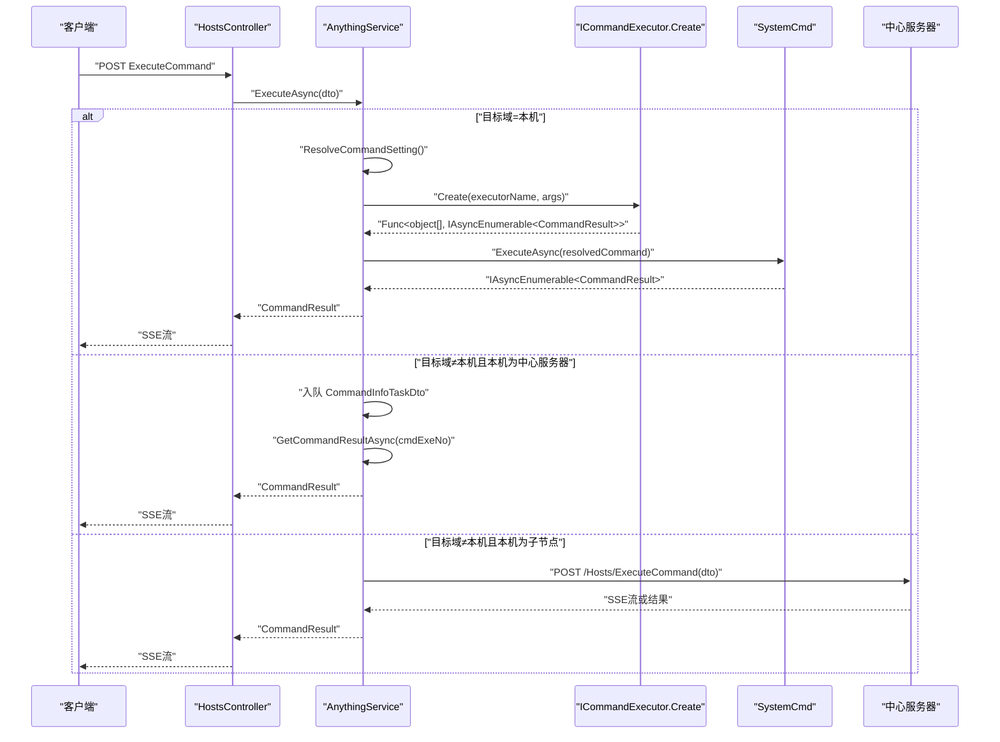
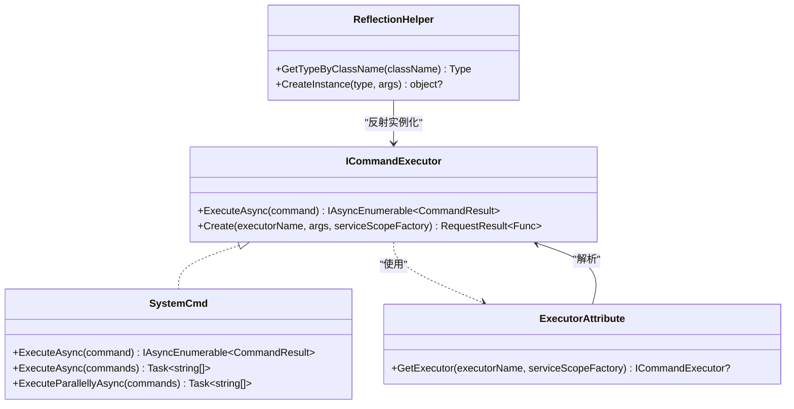
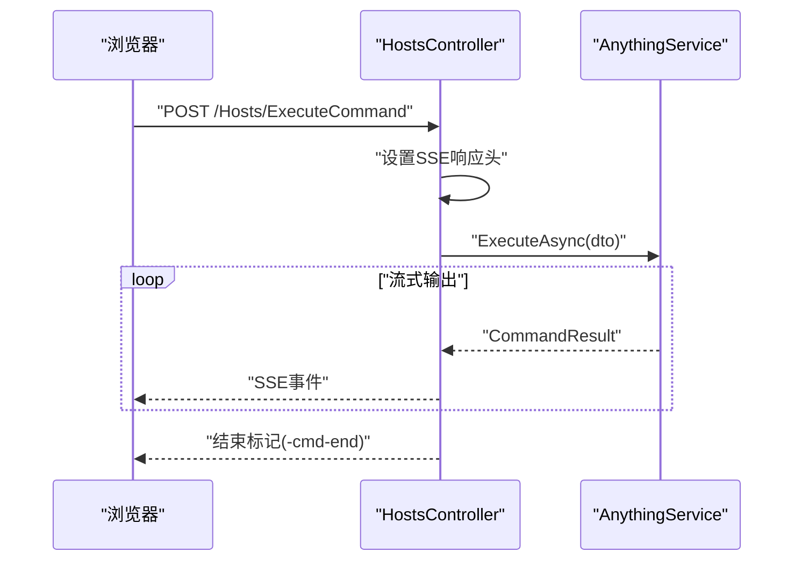
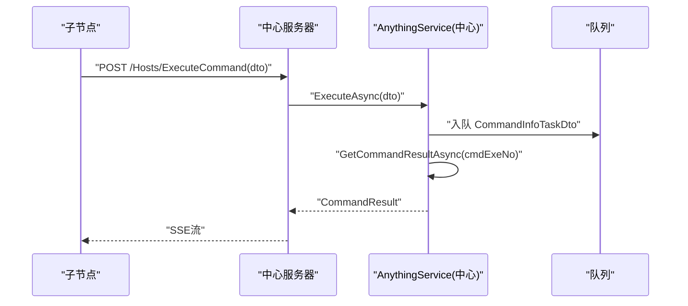
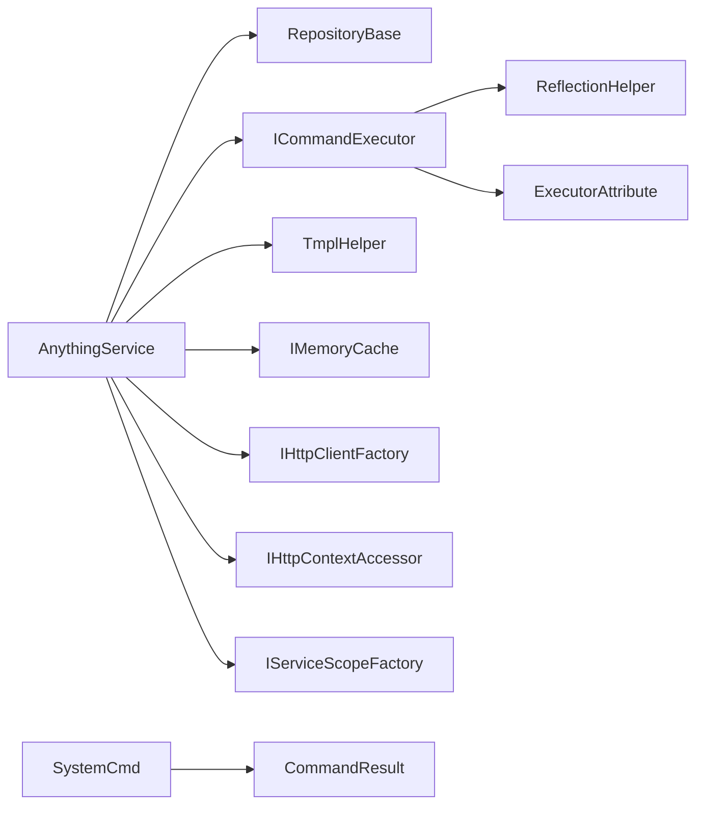

# 命令执行器系统

<cite>
**本文引用的文件**
- [AnythingExecutor.cs](file://Sylas.RemoteTasks.App/RemoteHostModule/Anything/AnythingExecutor.cs)
- [AnythingCommand.cs](file://Sylas.RemoteTasks.App/RemoteHostModule/Anything/AnythingCommand.cs)
- [AnythingService.cs](file://Sylas.RemoteTasks.App/RemoteHostModule/Anything/AnythingService.cs)
- [AnythingInfo.cs](file://Sylas.RemoteTasks.App/RemoteHostModule/Anything/AnythingInfo.cs)
- [AnythingSetting.cs](file://Sylas.RemoteTasks.App/RemoteHostModule/Anything/AnythingSetting.cs)
- [AnythingSettingDetails.cs](file://Sylas.RemoteTasks.App/RemoteHostModule/Anything/AnythingSettingDetails.cs)
- [CommandInfoInDto.cs](file://Sylas.RemoteTasks.App/RemoteHostModule/Anything/CommandInfoInDto.cs)
- [CommandInfoTaskDto.cs](file://Sylas.RemoteTasks.App/RemoteHostModule/Anything/CommandInfoTaskDto.cs)
- [ICommandExecutor.cs](file://Sylas.RemoteTasks.Utils/CommandExecutor/ICommandExecutor.cs)
- [SystemCmd.cs](file://Sylas.RemoteTasks.Utils/CommandExecutor/SystemCmd.cs)
- [ExecutorAttribute.cs](file://Sylas.RemoteTasks.Utils/CommandExecutor/ExecutorAttribute.cs)
- [CommandResult.cs](file://Sylas.RemoteTasks.Utils/CommandExecutor/CommandResult.cs)
- [ReflectionHelper.cs](file://Sylas.RemoteTasks.Utils/ReflectionHelper.cs)
- [HostsController.cs](file://Sylas.RemoteTasks.App/Controllers/HostsController.cs)
</cite>

## 目录
1. [简介](#简介)
2. [项目结构](#项目结构)
3. [核心组件](#核心组件)
4. [架构总览](#架构总览)
5. [详细组件分析](#详细组件分析)
6. [依赖关系分析](#依赖关系分析)
7. [性能考量](#性能考量)
8. [故障排查指南](#故障排查指南)
9. [结论](#结论)
10. [附录](#附录)

## 简介
本技术文档围绕“命令执行器系统”展开，重点阐释 AnythingExecutor 的设计与实现，包括执行器工厂模式、参数解析机制、动态实例化过程；详解命令执行流程（ExecuteAsync）、命令解析、执行结果处理；文档化命令队列管理机制（GetCommandTaskAsync 的阻塞等待、任务分发策略、结果收集机制）；并提供跨节点命令执行的网络通信协议与数据传输格式说明。最后给出执行器扩展开发指南与性能监控策略。

## 项目结构
命令执行器系统主要分布在以下模块：
- 应用层（控制器与业务服务）
  - 控制器：HostsController 提供命令执行的 HTTP 入口，支持 Server-Sent Events 流式输出
  - 业务服务：AnythingService 负责命令解析、执行器动态实例化、跨节点任务队列与结果收集
  - 数据模型：AnythingExecutor、AnythingCommand、AnythingInfo、AnythingSetting、AnythingSettingDetails、CommandInfoInDto、CommandInfoTaskDto
- 工具层（命令执行器与反射工具）
  - ICommandExecutor 接口与工厂方法
  - SystemCmd 默认执行器（本地命令执行）
  - ExecutorAttribute 用于基于 DI 的执行器解析
  - ReflectionHelper 提供类型发现与实例化
  - CommandResult 统一结果载体

图表来源
- [HostsController.cs](file://Sylas.RemoteTasks.App/Controllers/HostsController.cs#L85-L124)
- [AnythingService.cs](file://Sylas.RemoteTasks.App/RemoteHostModule/Anything/AnythingService.cs#L294-L389)
- [ICommandExecutor.cs](file://Sylas.RemoteTasks.Utils/CommandExecutor/ICommandExecutor.cs#L31-L71)
- [SystemCmd.cs](file://Sylas.RemoteTasks.Utils/CommandExecutor/SystemCmd.cs#L129-L138)
- [ExecutorAttribute.cs](file://Sylas.RemoteTasks.Utils/CommandExecutor/ExecutorAttribute.cs#L18-L23)
- [ReflectionHelper.cs](file://Sylas.RemoteTasks.Utils/ReflectionHelper.cs#L51-L56)
- [AnythingExecutor.cs](file://Sylas.RemoteTasks.App/RemoteHostModule/Anything/AnythingExecutor.cs#L5-L11)
- [AnythingCommand.cs](file://Sylas.RemoteTasks.App/RemoteHostModule/Anything/AnythingCommand.cs#L6-L34)
- [AnythingInfo.cs](file://Sylas.RemoteTasks.App/RemoteHostModule/Anything/AnythingInfo.cs#L9-L36)
- [AnythingSetting.cs](file://Sylas.RemoteTasks.App/RemoteHostModule/Anything/AnythingSetting.cs#L8-L32)
- [AnythingSettingDetails.cs](file://Sylas.RemoteTasks.App/RemoteHostModule/Anything/AnythingSettingDetails.cs#L3-L10)
- [CommandInfoInDto.cs](file://Sylas.RemoteTasks.App/RemoteHostModule/Anything/CommandInfoInDto.cs#L3-L14)
- [CommandInfoTaskDto.cs](file://Sylas.RemoteTasks.App/RemoteHostModule/Anything/CommandInfoTaskDto.cs#L3-L18)

章节来源
- [HostsController.cs](file://Sylas.RemoteTasks.App/Controllers/HostsController.cs#L85-L124)
- [AnythingService.cs](file://Sylas.RemoteTasks.App/RemoteHostModule/Anything/AnythingService.cs#L294-L389)
- [ICommandExecutor.cs](file://Sylas.RemoteTasks.Utils/CommandExecutor/ICommandExecutor.cs#L31-L71)

## 核心组件
- AnythingExecutor：存储执行器名称与参数模板（JSON），用于动态实例化
- AnythingCommand：存储命令名称、命令文本、执行状态查询命令、域与排序
- AnythingSetting/AnythingSettingDetails：Anything 的配置与命令集合
- AnythingInfo：解析后的执行上下文（标题、命令、属性、执行器名）
- ICommandExecutor：执行器接口与工厂方法，支持反射与 DI 解析
- SystemCmd：默认执行器，封装本地命令执行、并行执行与系统信息采集
- ExecutorAttribute：标记类为执行器并通过 DI 解析
- ReflectionHelper：按类名查找类型与创建实例
- CommandResult：统一的命令执行结果载体
- HostsController：HTTP 入口，SSE 流式返回执行结果

章节来源
- [AnythingExecutor.cs](file://Sylas.RemoteTasks.App/RemoteHostModule/Anything/AnythingExecutor.cs#L5-L11)
- [AnythingCommand.cs](file://Sylas.RemoteTasks.App/RemoteHostModule/Anything/AnythingCommand.cs#L6-L34)
- [AnythingSetting.cs](file://Sylas.RemoteTasks.App/RemoteHostModule/Anything/AnythingSetting.cs#L8-L32)
- [AnythingSettingDetails.cs](file://Sylas.RemoteTasks.App/RemoteHostModule/Anything/AnythingSettingDetails.cs#L3-L10)
- [AnythingInfo.cs](file://Sylas.RemoteTasks.App/RemoteHostModule/Anything/AnythingInfo.cs#L9-L36)
- [ICommandExecutor.cs](file://Sylas.RemoteTasks.Utils/CommandExecutor/ICommandExecutor.cs#L14-L71)
- [SystemCmd.cs](file://Sylas.RemoteTasks.Utils/CommandExecutor/SystemCmd.cs#L129-L138)
- [ExecutorAttribute.cs](file://Sylas.RemoteTasks.Utils/CommandExecutor/ExecutorAttribute.cs#L18-L23)
- [ReflectionHelper.cs](file://Sylas.RemoteTasks.Utils/ReflectionHelper.cs#L51-L56)
- [CommandResult.cs](file://Sylas.RemoteTasks.Utils/CommandExecutor/CommandResult.cs#L6-L36)
- [HostsController.cs](file://Sylas.RemoteTasks.App/Controllers/HostsController.cs#L85-L124)

## 架构总览
系统采用“配置驱动 + 动态执行器 + SSE 流式输出”的架构：
- 配置层：AnythingSetting/Details 描述操作对象与命令集合，AnythingExecutor 描述执行器与参数模板
- 解析层：AnythingService 解析模板、构建 AnythingInfo、动态实例化执行器
- 执行层：ICommandExecutor.ExecuteAsync 返回异步枚举，SystemCmd 提供默认实现
- 通信层：跨节点通过队列与 HTTP（SSE）传递任务与结果
- 控制层：HostsController 提供 HTTP 入口，SSE 输出实时结果

图表来源
- [HostsController.cs](file://Sylas.RemoteTasks.App/Controllers/HostsController.cs#L85-L124)
- [AnythingService.cs](file://Sylas.RemoteTasks.App/RemoteHostModule/Anything/AnythingService.cs#L294-L389)
- [ICommandExecutor.cs](file://Sylas.RemoteTasks.Utils/CommandExecutor/ICommandExecutor.cs#L31-L71)
- [SystemCmd.cs](file://Sylas.RemoteTasks.Utils/CommandExecutor/SystemCmd.cs#L129-L138)

## 详细组件分析

### AnythingService：命令执行与队列管理
- ExecuteAsync：根据 CommandInfoInDto 查找命令与 Anything 配置，解析命令模板，动态实例化执行器，执行并流式返回结果；若目标域非本机且本机为中心服务器，则将任务入队；若本机为子节点，则转发到中心服务器
- ResolveCommandSetting：基于 Anything 的 Properties 解析命令模板
- BuildAnythingInfoAsync：解析 AnythingExecutor 参数模板，使用反射或 DI 创建执行器实例，并缓存映射
- GetCommandTaskAsync：按域阻塞等待队列中的任务，轮询检查，避免忙等
- GetCommandResultAsync/SetCommandResult：基于内存队列收集跨节点执行结果，带超时控制与日志记录

图表来源
- [AnythingService.cs](file://Sylas.RemoteTasks.App/RemoteHostModule/Anything/AnythingService.cs#L294-L389)
- [CommandInfoTaskDto.cs](file://Sylas.RemoteTasks.App/RemoteHostModule/Anything/CommandInfoTaskDto.cs#L3-L18)

章节来源
- [AnythingService.cs](file://Sylas.RemoteTasks.App/RemoteHostModule/Anything/AnythingService.cs#L294-L389)
- [CommandInfoInDto.cs](file://Sylas.RemoteTasks.App/RemoteHostModule/Anything/CommandInfoInDto.cs#L3-L14)

### ICommandExecutor 与 SystemCmd：执行器工厂与默认实现
- ICommandExecutor.Create：通过类名反射获取类型，优先使用带 ExecutorAttribute 的 DI 解析；否则通过构造函数参数实例化；包装 ExecuteAsync 方法为 Func<object[], IAsyncEnumerable<CommandResult>>
- SystemCmd：实现 ICommandExecutor，提供单命令与批量命令执行、并行执行、系统信息采集等能力；ExecuteAsync 将输出封装为 CommandResult 流

图表来源
- [ICommandExecutor.cs](file://Sylas.RemoteTasks.Utils/CommandExecutor/ICommandExecutor.cs#L14-L71)
- [SystemCmd.cs](file://Sylas.RemoteTasks.Utils/CommandExecutor/SystemCmd.cs#L129-L138)
- [ExecutorAttribute.cs](file://Sylas.RemoteTasks.Utils/CommandExecutor/ExecutorAttribute.cs#L18-L23)
- [ReflectionHelper.cs](file://Sylas.RemoteTasks.Utils/ReflectionHelper.cs#L51-L56)

章节来源
- [ICommandExecutor.cs](file://Sylas.RemoteTasks.Utils/CommandExecutor/ICommandExecutor.cs#L31-L71)
- [SystemCmd.cs](file://Sylas.RemoteTasks.Utils/CommandExecutor/SystemCmd.cs#L129-L138)
- [ExecutorAttribute.cs](file://Sylas.RemoteTasks.Utils/CommandExecutor/ExecutorAttribute.cs#L18-L23)
- [ReflectionHelper.cs](file://Sylas.RemoteTasks.Utils/ReflectionHelper.cs#L51-L56)

### HostsController：HTTP 入口与 SSE 输出
- ExecuteCommandAsync：设置 SSE 头部，逐条写出 CommandResult JSON，支持请求取消与结束标记
- ExecuteCommandsAsync：顺序执行多个命令并输出结果

图表来源
- [HostsController.cs](file://Sylas.RemoteTasks.App/Controllers/HostsController.cs#L85-L124)
- [AnythingService.cs](file://Sylas.RemoteTasks.App/RemoteHostModule/Anything/AnythingService.cs#L294-L389)

章节来源
- [HostsController.cs](file://Sylas.RemoteTasks.App/Controllers/HostsController.cs#L85-L124)

### 跨节点命令执行：网络通信与数据格式
- 子节点检测：当命令目标域不等于本机域且本机为中心服务器时，将任务入队；当本机为子节点时，通过 HTTP 将命令转发至中心服务器
- 数据传输：CommandInfoTaskDto 包含命令标识、执行编号、命令名与目标域；结果通过内存队列与 GetCommandResultAsync 收集，最终由控制器以 SSE 输出
- 协议：HTTP + JSON；前端以 SSE 接收流式结果

图表来源
- [AnythingService.cs](file://Sylas.RemoteTasks.App/RemoteHostModule/Anything/AnythingService.cs#L307-L373)
- [CommandInfoTaskDto.cs](file://Sylas.RemoteTasks.App/RemoteHostModule/Anything/CommandInfoTaskDto.cs#L3-L18)
- [HostsController.cs](file://Sylas.RemoteTasks.App/Controllers/HostsController.cs#L85-L124)

章节来源
- [AnythingService.cs](file://Sylas.RemoteTasks.App/RemoteHostModule/Anything/AnythingService.cs#L307-L373)
- [CommandInfoTaskDto.cs](file://Sylas.RemoteTasks.App/RemoteHostModule/Anything/CommandInfoTaskDto.cs#L3-L18)
- [HostsController.cs](file://Sylas.RemoteTasks.App/Controllers/HostsController.cs#L85-L124)

## 依赖关系分析
- AnythingService 依赖：
  - RepositoryBase<AnythingSetting/AnythingExecutor/AnythingCommand>：数据访问
  - ILogger/IMemoryCache/IHttpClientFactory/IHttpContextAccessor/IServiceScopeFactory：日志、缓存、HTTP、上下文、作用域
  - ICommandExecutor：执行器工厂
  - TmplHelper：模板解析
- ICommandExecutor.Create 依赖：
  - ReflectionHelper：类型发现
  - ExecutorAttribute + IServiceScopeFactory：DI 解析
- SystemCmd 依赖：
  - CommandResult：结果封装
  - System 环境：进程、文件、网络信息

图表来源
- [AnythingService.cs](file://Sylas.RemoteTasks.App/RemoteHostModule/Anything/AnythingService.cs#L30-L38)
- [ICommandExecutor.cs](file://Sylas.RemoteTasks.Utils/CommandExecutor/ICommandExecutor.cs#L31-L71)
- [SystemCmd.cs](file://Sylas.RemoteTasks.Utils/CommandExecutor/SystemCmd.cs#L129-L138)

章节来源
- [AnythingService.cs](file://Sylas.RemoteTasks.App/RemoteHostModule/Anything/AnythingService.cs#L30-L38)
- [ICommandExecutor.cs](file://Sylas.RemoteTasks.Utils/CommandExecutor/ICommandExecutor.cs#L31-L71)
- [SystemCmd.cs](file://Sylas.RemoteTasks.Utils/CommandExecutor/SystemCmd.cs#L129-L138)

## 性能考量
- 异步流式输出：SSE 逐条写出 CommandResult，降低前端等待与内存压力
- 缓存策略：对 AnythingInfo 与执行器配置进行短期缓存，减少重复解析与实例化
- 队列轮询：GetCommandTaskAsync 采用固定延迟轮询，避免忙等；建议结合信号量或阻塞队列优化
- 并行执行：SystemCmd 提供 ExecuteParallellyAsync，适合多命令并行场景；注意资源竞争与输出合并
- 日志与超时：GetCommandResultAsync 设置超时与周期性日志，防止无限等待

## 故障排查指南
- 未知命令或执行器：检查 CommandInfoInDto.CommandId 与 AnythingExecutor 配置
- 执行器参数解析失败：确认 AnythingExecutor.Arguments 的 JSON 结构与类型转换
- 跨节点无结果：检查 AppStatus.Domain 与命令 Domain 是否一致；确认中心服务器队列是否入队；检查子节点是否正确转发
- SSE 未结束：确认控制器在 finally 中发送结束标记“-cmd-end”
- 超时问题：GetCommandResultAsync 默认超时，适当调整或增加日志定位瓶颈

章节来源
- [AnythingService.cs](file://Sylas.RemoteTasks.App/RemoteHostModule/Anything/AnythingService.cs#L294-L389)
- [HostsController.cs](file://Sylas.RemoteTasks.App/Controllers/HostsController.cs#L116-L124)

## 结论
命令执行器系统通过“配置驱动 + 动态执行器 + SSE 流式输出”的方式，实现了灵活、可扩展的命令执行框架。AnythingService 负责解析、实例化与跨节点协调；ICommandExecutor 提供统一接口与工厂能力；SystemCmd 提供默认实现与系统信息采集。通过合理的缓存、队列与超时机制，系统在易用性与性能之间取得平衡。

## 附录

### 配置与使用示例（步骤说明）
- 配置 AnythingExecutor
  - 在数据库中新增执行器记录，设置 Name 与 Arguments（JSON 数组，包含 ArgumentValue 与 ArgumentType）
  - 在 AnythingSetting 中选择 Executor
- 配置 AnythingCommand
  - 设置命令名称、命令文本（可含模板变量）、执行状态查询命令、目标域与排序
- 触发执行
  - 调用 /Hosts/ExecuteCommand，传入 CommandInfoInDto（包含 CommandId 与可选 CommandExecuteNo）
  - 前端以 SSE 接收实时结果，直到收到结束标记“-cmd-end”

章节来源
- [AnythingExecutor.cs](file://Sylas.RemoteTasks.App/RemoteHostModule/Anything/AnythingExecutor.cs#L5-L11)
- [AnythingCommand.cs](file://Sylas.RemoteTasks.App/RemoteHostModule/Anything/AnythingCommand.cs#L6-L34)
- [AnythingSetting.cs](file://Sylas.RemoteTasks.App/RemoteHostModule/Anything/AnythingSetting.cs#L8-L32)
- [CommandInfoInDto.cs](file://Sylas.RemoteTasks.App/RemoteHostModule/Anything/CommandInfoInDto.cs#L3-L14)
- [HostsController.cs](file://Sylas.RemoteTasks.App/Controllers/HostsController.cs#L85-L124)

### 扩展开发指南
- 新增执行器
  - 实现 ICommandExecutor 接口，提供 ExecuteAsync 返回 IAsyncEnumerable<CommandResult>
  - 若需 DI 注入，使用 ExecutorAttribute 标记类，并在服务注册中以键值绑定
  - 在 AnythingExecutor.Arguments 中配置参数模板，支持类型转换
- 参数解析
  - 使用 TmplHelper.ResolveExpressionValue 解析 Anything 的 Properties 与命令模板
  - 注意类型转换（如 Int32/Int64）与空值处理
- 跨节点扩展
  - 在中心服务器维护 _serverNodeQueues，按 Domain 分区管理
  - 子节点通过 HTTP 转发命令，中心服务器负责结果聚合与 SSE 输出

章节来源
- [ICommandExecutor.cs](file://Sylas.RemoteTasks.Utils/CommandExecutor/ICommandExecutor.cs#L14-L71)
- [ExecutorAttribute.cs](file://Sylas.RemoteTasks.Utils/CommandExecutor/ExecutorAttribute.cs#L18-L23)
- [ReflectionHelper.cs](file://Sylas.RemoteTasks.Utils/ReflectionHelper.cs#L51-L56)
- [AnythingService.cs](file://Sylas.RemoteTasks.App/RemoteHostModule/Anything/AnythingService.cs#L522-L631)