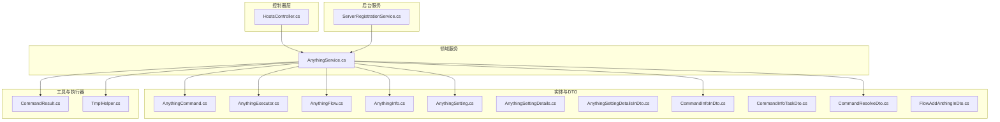
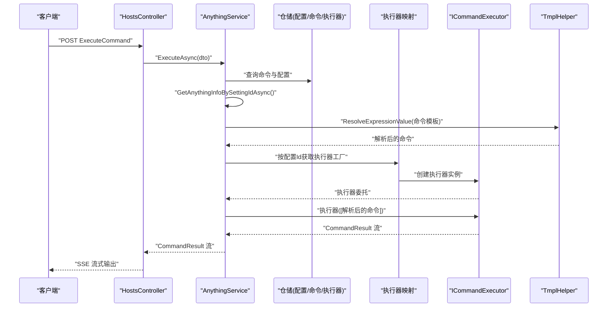
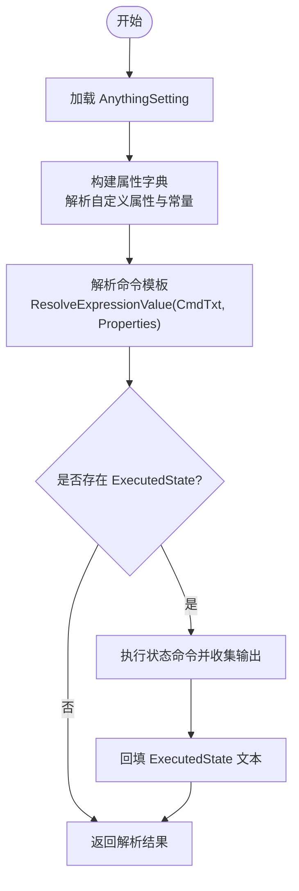
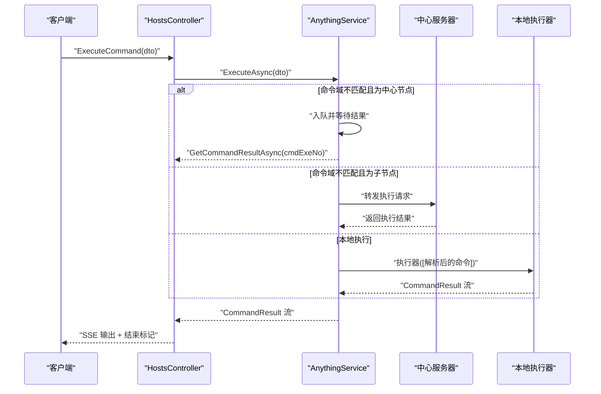
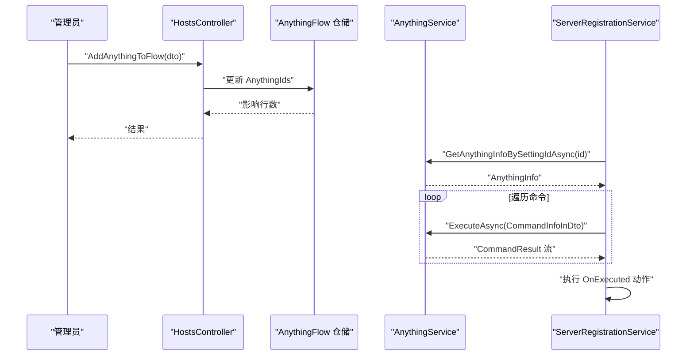
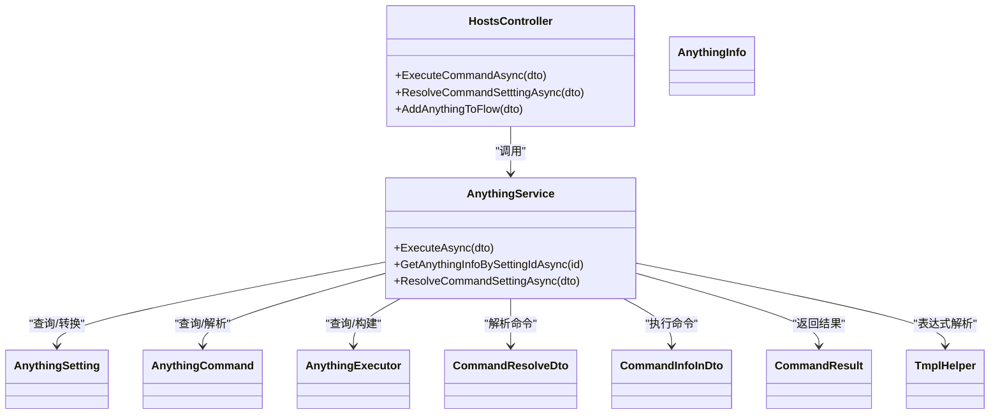

# 命令管理功能

<cite>
**本文引用的文件**
- [AnythingCommand.cs](file://Sylas.RemoteTasks.App/RemoteHostModule/Anything/AnythingCommand.cs)
- [AnythingExecutor.cs](file://Sylas.RemoteTasks.App/RemoteHostModule/Anything/AnythingExecutor.cs)
- [AnythingFlow.cs](file://Sylas.RemoteTasks.App/RemoteHostModule/Anything/AnythingFlow.cs)
- [AnythingInfo.cs](file://Sylas.RemoteTasks.App/RemoteHostModule/Anything/AnythingInfo.cs)
- [AnythingSetting.cs](file://Sylas.RemoteTasks.App/RemoteHostModule/Anything/AnythingSetting.cs)
- [AnythingSettingDetails.cs](file://Sylas.RemoteTasks.App/RemoteHostModule/Anything/AnythingSettingDetails.cs)
- [AnythingSettingDetailsInDto.cs](file://Sylas.RemoteTasks.App/RemoteHostModule/Anything/AnythingSettingDetailsInDto.cs)
- [CommandInfoInDto.cs](file://Sylas.RemoteTasks.App/RemoteHostModule/Anything/CommandInfoInDto.cs)
- [CommandInfoTaskDto.cs](file://Sylas.RemoteTasks.App/RemoteHostModule/Anything/CommandInfoTaskDto.cs)
- [CommandResolveDto.cs](file://Sylas.RemoteTasks.App/RemoteHostModule/Anything/CommandResolveDto.cs)
- [FlowAddAnthingInDto.cs](file://Sylas.RemoteTasks.App/RemoteHostModule/Anything/FlowAddAnthingInDto.cs)
- [AnythingService.cs](file://Sylas.RemoteTasks.App/RemoteHostModule/Anything/AnythingService.cs)
- [HostsController.cs](file://Sylas.RemoteTasks.App/Controllers/HostsController.cs)
- [CommandResult.cs](file://Sylas.RemoteTasks.Utils/CommandExecutor/CommandResult.cs)
- [TmplHelper.cs](file://Sylas.RemoteTasks.Utils/Template/TmplHelper.cs)
- [ServerRegistrationService.cs](file://Sylas.RemoteTasks.App/BackgroundServices/ServerRegistrationService.cs)
</cite>

## 目录
1. [简介](#简介)
2. [项目结构](#项目结构)
3. [核心组件](#核心组件)
4. [架构总览](#架构总览)
5. [详细组件分析](#详细组件分析)
6. [依赖关系分析](#依赖关系分析)
7. [性能考虑](#性能考虑)
8. [故障排查指南](#故障排查指南)
9. [结论](#结论)
10. [附录](#附录)

## 简介
本文件系统性地文档化“命令管理功能”，围绕 AnythingCommand 实体模型、命令解析与模板变量、命令执行生命周期与错误恢复、以及命令流程管理（工作流）展开。重点覆盖以下方面：
- AnythingCommand 实体模型：字段语义、与 AnythingSetting/AnythingExecutor 的关系、执行状态字段的用途
- 命令解析机制：CommandResolveDto 数据结构、表达式解析算法、模板替换过程
- 命令流程管理：FlowAddAnthingInDto 的流程配置、命令序列执行、状态跟踪机制
- 生命周期与错误恢复：跨节点命令转发、异步流式输出、超时与取消处理
- 调试技巧与性能优化：日志记录、缓存策略、模板解析性能

## 项目结构
命令管理功能主要位于 Sylas.RemoteTasks.App 的 RemoteHostModule/Anything 子模块，并通过控制器与后台服务协同完成命令的配置、解析、执行与流程编排。

图表来源
- [HostsController.cs](file://Sylas.RemoteTasks.App/Controllers/HostsController.cs#L1-L468)
- [AnythingService.cs](file://Sylas.RemoteTasks.App/RemoteHostModule/Anything/AnythingService.cs#L1-L680)
- [AnythingCommand.cs](file://Sylas.RemoteTasks.App/RemoteHostModule/Anything/AnythingCommand.cs#L1-L35)
- [AnythingExecutor.cs](file://Sylas.RemoteTasks.App/RemoteHostModule/Anything/AnythingExecutor.cs#L1-L12)
- [AnythingFlow.cs](file://Sylas.RemoteTasks.App/RemoteHostModule/Anything/AnythingFlow.cs#L1-L29)
- [AnythingInfo.cs](file://Sylas.RemoteTasks.App/RemoteHostModule/Anything/AnythingInfo.cs#L1-L38)
- [AnythingSetting.cs](file://Sylas.RemoteTasks.App/RemoteHostModule/Anything/AnythingSetting.cs#L1-L34)
- [AnythingSettingDetails.cs](file://Sylas.RemoteTasks.App/RemoteHostModule/Anything/AnythingSettingDetails.cs#L1-L11)
- [AnythingSettingDetailsInDto.cs](file://Sylas.RemoteTasks.App/RemoteHostModule/Anything/AnythingSettingDetailsInDto.cs#L1-L32)
- [CommandInfoInDto.cs](file://Sylas.RemoteTasks.App/RemoteHostModule/Anything/CommandInfoInDto.cs#L1-L15)
- [CommandInfoTaskDto.cs](file://Sylas.RemoteTasks.App/RemoteHostModule/Anything/CommandInfoTaskDto.cs#L1-L19)
- [CommandResolveDto.cs](file://Sylas.RemoteTasks.App/RemoteHostModule/Anything/CommandResolveDto.cs#L1-L15)
- [FlowAddAnthingInDto.cs](file://Sylas.RemoteTasks.App/RemoteHostModule/Anything/FlowAddAnthingInDto.cs#L1-L10)
- [CommandResult.cs](file://Sylas.RemoteTasks.Utils/CommandExecutor/CommandResult.cs#L1-L37)
- [TmplHelper.cs](file://Sylas.RemoteTasks.Utils/Template/TmplHelper.cs#L544-L585)
- [ServerRegistrationService.cs](file://Sylas.RemoteTasks.App/BackgroundServices/ServerRegistrationService.cs#L266-L320)

章节来源
- [HostsController.cs](file://Sylas.RemoteTasks.App/Controllers/HostsController.cs#L1-L468)
- [AnythingService.cs](file://Sylas.RemoteTasks.App/RemoteHostModule/Anything/AnythingService.cs#L1-L680)

## 核心组件
- AnythingCommand：命令实体，承载命令名称、命令文本、执行状态查询命令、所属域、排序等
- AnythingExecutor：命令执行器配置，包含执行器名称与参数模板
- AnythingSetting/AnythingSettingDetails：命令配置主体及其详情（含命令集合）
- AnythingInfo：运行时聚合对象，包含标题、属性、命令集合与执行器名称
- CommandResolveDto：命令解析输入 DTO，包含配置 Id 与待解析命令文本
- CommandInfoInDto/CommandInfoTaskDto：命令执行输入与跨节点任务 DTO
- FlowAddAnthingInDto：工作流节点添加输入 DTO
- AnythingFlow：工作流实体，包含标题、环境变量、节点顺序、计划任务与执行后动作
- CommandResult：命令执行结果模型
- TmplHelper：模板解析工具，支持表达式解析与变量替换

章节来源
- [AnythingCommand.cs](file://Sylas.RemoteTasks.App/RemoteHostModule/Anything/AnythingCommand.cs#L1-L35)
- [AnythingExecutor.cs](file://Sylas.RemoteTasks.App/RemoteHostModule/Anything/AnythingExecutor.cs#L1-L12)
- [AnythingSetting.cs](file://Sylas.RemoteTasks.App/RemoteHostModule/Anything/AnythingSetting.cs#L1-L34)
- [AnythingSettingDetails.cs](file://Sylas.RemoteTasks.App/RemoteHostModule/Anything/AnythingSettingDetails.cs#L1-L11)
- [AnythingInfo.cs](file://Sylas.RemoteTasks.App/RemoteHostModule/Anything/AnythingInfo.cs#L1-L38)
- [CommandResolveDto.cs](file://Sylas.RemoteTasks.App/RemoteHostModule/Anything/CommandResolveDto.cs#L1-L15)
- [CommandInfoInDto.cs](file://Sylas.RemoteTasks.App/RemoteHostModule/Anything/CommandInfoInDto.cs#L1-L15)
- [CommandInfoTaskDto.cs](file://Sylas.RemoteTasks.App/RemoteHostModule/Anything/CommandInfoTaskDto.cs#L1-L19)
- [FlowAddAnthingInDto.cs](file://Sylas.RemoteTasks.App/RemoteHostModule/Anything/FlowAddAnthingInDto.cs#L1-L10)
- [AnythingFlow.cs](file://Sylas.RemoteTasks.App/RemoteHostModule/Anything/AnythingFlow.cs#L1-L29)
- [CommandResult.cs](file://Sylas.RemoteTasks.Utils/CommandExecutor/CommandResult.cs#L1-L37)
- [TmplHelper.cs](file://Sylas.RemoteTasks.Utils/Template/TmplHelper.cs#L544-L585)

## 架构总览
命令管理采用“控制器-服务-执行器-模板引擎”的分层设计。控制器负责接收请求、建立 SSE 流式响应；服务负责解析配置、构建 AnythingInfo、解析命令模板、选择执行器并执行；执行器通过工厂创建具体执行器实例；模板引擎负责表达式解析与变量替换；后台服务负责工作流的定时执行与结果处理。

图表来源
- [HostsController.cs](file://Sylas.RemoteTasks.App/Controllers/HostsController.cs#L85-L124)
- [AnythingService.cs](file://Sylas.RemoteTasks.App/RemoteHostModule/Anything/AnythingService.cs#L294-L389)
- [CommandResult.cs](file://Sylas.RemoteTasks.Utils/CommandExecutor/CommandResult.cs#L1-L37)
- [TmplHelper.cs](file://Sylas.RemoteTasks.Utils/Template/TmplHelper.cs#L544-L585)

## 详细组件分析

### AnythingCommand 实体模型
- 字段语义
  - AnythingId：所属 Anything 的标识
  - Name：命令名称
  - CommandTxt：命令内容文本（可包含模板表达式）
  - ExecutedState：用于查询命令执行状态的命令（例如进程检测）
  - Domain：命令所属主机域名
  - OrderNo：命令排序
- 关系
  - 与 AnythingSetting 一对多：一个配置包含多个命令
  - 与执行器无关，仅承载命令文本与状态查询
- 执行状态管理
  - ExecutedState 作为状态查询命令，在构建 AnythingInfo 时会实际执行并回填状态文本

章节来源
- [AnythingCommand.cs](file://Sylas.RemoteTasks.App/RemoteHostModule/Anything/AnythingCommand.cs#L1-L35)
- [AnythingService.cs](file://Sylas.RemoteTasks.App/RemoteHostModule/Anything/AnythingService.cs#L594-L618)

### AnythingExecutor 执行器配置
- 字段
  - Name：执行器名称（如 SystemCmd）
  - Arguments：参数模板数组（JSON 序列化），每个元素包含 ArgumentValue 与 ArgumentType
- 参数解析
  - 服务在构建 AnythingInfo 时，基于 Properties 解析每个参数值，并按类型转换
  - 解析后的参数数组用于创建执行器实例

章节来源
- [AnythingExecutor.cs](file://Sylas.RemoteTasks.App/RemoteHostModule/Anything/AnythingExecutor.cs#L1-L12)
- [AnythingService.cs](file://Sylas.RemoteTasks.App/RemoteHostModule/Anything/AnythingService.cs#L536-L591)

### AnythingSetting 与 AnythingSettingDetails
- AnythingSetting：配置主体，包含标题、属性 JSON、执行器 Id
- AnythingSettingDetails：扩展类，包含命令集合
- ToDetails/ToAnythingSetting：在 DTO 与实体之间转换

章节来源
- [AnythingSetting.cs](file://Sylas.RemoteTasks.App/RemoteHostModule/Anything/AnythingSetting.cs#L1-L34)
- [AnythingSettingDetails.cs](file://Sylas.RemoteTasks.App/RemoteHostModule/Anything/AnythingSettingDetails.cs#L1-L11)
- [AnythingSettingDetailsInDto.cs](file://Sylas.RemoteTasks.App/RemoteHostModule/Anything/AnythingSettingDetailsInDto.cs#L1-L32)

### AnythingInfo 运行时聚合对象
- 字段
  - Title：标题
  - Commands：命令集合
  - Properties：属性字典
  - SettingId：配置 Id
  - CommandExecutor：执行器名称
- 作用
  - 作为服务构建的运行时对象，便于后续解析与执行

章节来源
- [AnythingInfo.cs](file://Sylas.RemoteTasks.App/RemoteHostModule/Anything/AnythingInfo.cs#L1-L38)
- [AnythingService.cs](file://Sylas.RemoteTasks.App/RemoteHostModule/Anything/AnythingService.cs#L620-L631)

### 命令解析机制与模板变量
- CommandResolveDto
  - Id：AnythingSetting 的 Id
  - CmdTxt：待解析的命令文本
- 表达式解析算法
  - 服务根据 Id 获取 AnythingSetting，解析其 Properties
  - 使用 TmplHelper.ResolveExpressionValue 对 CmdTxt 进行表达式解析
  - 支持集合、正则、属性路径等多种解析器
- 模板替换过程
  - 构建 AnythingInfo 时，对每个命令的 CommandTxt 进行解析
  - 若存在 ExecutedState，则先执行状态命令，再回填状态文本
- 典型用法
  - 控制器提供 ResolveCommandSettting 接口，供前端预览解析结果

图表来源
- [AnythingService.cs](file://Sylas.RemoteTasks.App/RemoteHostModule/Anything/AnythingService.cs#L637-L677)
- [AnythingService.cs](file://Sylas.RemoteTasks.App/RemoteHostModule/Anything/AnythingService.cs#L594-L618)
- [TmplHelper.cs](file://Sylas.RemoteTasks.Utils/Template/TmplHelper.cs#L544-L585)

章节来源
- [CommandResolveDto.cs](file://Sylas.RemoteTasks.App/RemoteHostModule/Anything/CommandResolveDto.cs#L1-L15)
- [AnythingService.cs](file://Sylas.RemoteTasks.App/RemoteHostModule/Anything/AnythingService.cs#L637-L677)
- [TmplHelper.cs](file://Sylas.RemoteTasks.Utils/Template/TmplHelper.cs#L544-L585)

### 命令执行生命周期与错误恢复
- 生命周期阶段
  - 输入校验：CommandInfoInDto
  - 命令查询与 AnythingInfo 构建
  - 命令解析与执行器选择
  - 执行与流式输出
  - 跨节点转发与结果汇聚
- 错误恢复策略
  - 超时控制：等待远程结果时设置超时，超时返回提示
  - 取消处理：客户端取消时中断循环
  - 异常捕获：控制器层捕获异常并返回错误结果
  - 结果标记：以特殊结束标记通知客户端流结束

图表来源
- [HostsController.cs](file://Sylas.RemoteTasks.App/Controllers/HostsController.cs#L85-L124)
- [AnythingService.cs](file://Sylas.RemoteTasks.App/RemoteHostModule/Anything/AnythingService.cs#L294-L389)
- [CommandResult.cs](file://Sylas.RemoteTasks.Utils/CommandExecutor/CommandResult.cs#L1-L37)

章节来源
- [CommandInfoInDto.cs](file://Sylas.RemoteTasks.App/RemoteHostModule/Anything/CommandInfoInDto.cs#L1-L15)
- [HostsController.cs](file://Sylas.RemoteTasks.App/Controllers/HostsController.cs#L85-L124)
- [AnythingService.cs](file://Sylas.RemoteTasks.App/RemoteHostModule/Anything/AnythingService.cs#L294-L389)

### 命令流程管理（工作流）
- FlowAddAnthingInDto
  - FlowId：目标工作流 Id
  - AnythingId：要添加的 Anything 配置 Id
  - AnythingIndex：插入位置索引
- 工作流实体
  - AnythingIds：逗号分隔的节点 Id 列表
  - EnvVars：工作流级环境变量
  - Schedule/ScheduleDomain：计划任务与域限制
  - OnExecuted：执行完成后触发的动作
- 节点操作
  - 添加、删除、重排节点
  - 同步节点属性到工作流 EnvVars
- 后台执行
  - ServerRegistrationService 按顺序遍历节点命令，串行执行并通过 SSE 输出

图表来源
- [HostsController.cs](file://Sylas.RemoteTasks.App/Controllers/HostsController.cs#L301-L368)
- [AnythingFlow.cs](file://Sylas.RemoteTasks.App/RemoteHostModule/Anything/AnythingFlow.cs#L1-L29)
- [ServerRegistrationService.cs](file://Sylas.RemoteTasks.App/BackgroundServices/ServerRegistrationService.cs#L266-L320)

章节来源
- [FlowAddAnthingInDto.cs](file://Sylas.RemoteTasks.App/RemoteHostModule/Anything/FlowAddAnthingInDto.cs#L1-L10)
- [HostsController.cs](file://Sylas.RemoteTasks.App/Controllers/HostsController.cs#L301-L368)
- [AnythingFlow.cs](file://Sylas.RemoteTasks.App/RemoteHostModule/Anything/AnythingFlow.cs#L1-L29)
- [ServerRegistrationService.cs](file://Sylas.RemoteTasks.App/BackgroundServices/ServerRegistrationService.cs#L266-L320)

### 具体用例：创建复杂命令流程与条件执行
- 创建 Anything 配置与命令
  - 通过控制器接口添加 AnythingSetting 与命令
  - 在 Properties 中定义变量，命令中使用表达式引用
- 构建工作流
  - 使用 AddAnythingToFlow 将多个节点按顺序加入
  - 使用 SyncEnvVars 将节点变量合并到工作流 EnvVars
- 条件执行
  - 在命令中使用模板表达式实现条件判断（如集合/正则解析器）
  - 在 OnExecuted 中编写后置动作，结合 Base64 结果传递

章节来源
- [HostsController.cs](file://Sylas.RemoteTasks.App/Controllers/HostsController.cs#L164-L225)
- [HostsController.cs](file://Sylas.RemoteTasks.App/Controllers/HostsController.cs#L425-L465)
- [AnythingService.cs](file://Sylas.RemoteTasks.App/RemoteHostModule/Anything/AnythingService.cs#L637-L677)

## 依赖关系分析
- 组件耦合
  - HostsController 依赖 AnythingService
  - AnythingService 依赖仓储、内存缓存、HTTP 工厂、执行器工厂、模板工具
  - AnythingInfo 依赖 AnythingSetting/AnythingCommand/AnythingExecutor
- 外部依赖
  - 模板解析依赖 TmplHelper
  - 执行器依赖 ICommandExecutor 工厂
  - 工作流依赖后台服务轮询与定时器

图表来源
- [HostsController.cs](file://Sylas.RemoteTasks.App/Controllers/HostsController.cs#L1-L468)
- [AnythingService.cs](file://Sylas.RemoteTasks.App/RemoteHostModule/Anything/AnythingService.cs#L1-L680)
- [AnythingSetting.cs](file://Sylas.RemoteTasks.App/RemoteHostModule/Anything/AnythingSetting.cs#L1-L34)
- [AnythingCommand.cs](file://Sylas.RemoteTasks.App/RemoteHostModule/Anything/AnythingCommand.cs#L1-L35)
- [AnythingExecutor.cs](file://Sylas.RemoteTasks.App/RemoteHostModule/Anything/AnythingExecutor.cs#L1-L12)
- [AnythingInfo.cs](file://Sylas.RemoteTasks.App/RemoteHostModule/Anything/AnythingInfo.cs#L1-L38)
- [CommandResolveDto.cs](file://Sylas.RemoteTasks.App/RemoteHostModule/Anything/CommandResolveDto.cs#L1-L15)
- [CommandInfoInDto.cs](file://Sylas.RemoteTasks.App/RemoteHostModule/Anything/CommandInfoInDto.cs#L1-L15)
- [CommandResult.cs](file://Sylas.RemoteTasks.Utils/CommandExecutor/CommandResult.cs#L1-L37)
- [TmplHelper.cs](file://Sylas.RemoteTasks.Utils/Template/TmplHelper.cs#L544-L585)

## 性能考虑
- 缓存策略
  - 内存缓存：AllAnythingInfos 与单个 AnythingInfo，滑动过期
  - 执行器缓存：Executor 查询结果短期缓存
- 异步与流式
  - 使用 IAsyncEnumerable 与 SSE 输出，降低内存占用
- 解析优化
  - 模板解析避免重复计算，合理拆分表达式
- 并发与队列
  - 跨节点命令使用队列，避免阻塞主线程

章节来源
- [AnythingService.cs](file://Sylas.RemoteTasks.App/RemoteHostModule/Anything/AnythingService.cs#L255-L277)
- [AnythingService.cs](file://Sylas.RemoteTasks.App/RemoteHostModule/Anything/AnythingService.cs#L544-L550)
- [HostsController.cs](file://Sylas.RemoteTasks.App/Controllers/HostsController.cs#L85-L124)

## 故障排查指南
- 常见问题
  - 未知命令：ExecuteAsync 抛出“未知的命令”异常
  - 无效执行器：构建 AnythingInfo 时找不到执行器或参数解析失败
  - 跨节点失败：子节点无授权或中心服务器不可达
  - 解析异常：命令模板解析为空，检查 Properties 与表达式语法
- 调试技巧
  - 使用 ResolveCommandSetttingAsync 预览命令解析结果
  - 查看日志：服务端记录等待队列、超时与取消事件
  - 观察 SSE：确保客户端正确处理“-cmd-end”结束标记
- 恢复策略
  - 超时：等待超时返回提示，稍后查看结果
  - 取消：客户端取消时服务端及时终止循环
  - 错误：控制器捕获异常并返回错误消息

章节来源
- [AnythingService.cs](file://Sylas.RemoteTasks.App/RemoteHostModule/Anything/AnythingService.cs#L294-L389)
- [HostsController.cs](file://Sylas.RemoteTasks.App/Controllers/HostsController.cs#L85-L124)
- [CommandResult.cs](file://Sylas.RemoteTasks.Utils/CommandExecutor/CommandResult.cs#L1-L37)

## 结论
命令管理功能通过清晰的实体模型、灵活的模板解析与执行器抽象、以及工作流编排，实现了从配置到执行再到结果反馈的完整闭环。服务层承担了解析与调度职责，控制器提供流式输出能力，后台服务支撑自动化执行。建议在生产环境中充分利用缓存、合理设计模板表达式，并通过日志与监控持续优化执行性能与稳定性。

## 附录
- 关键接口与方法参考
  - ExecuteCommandAsync：命令执行入口（SSE）
  - ExecuteAsync：命令执行核心逻辑
  - ResolveCommandSettingAsync：命令解析
  - GetAnythingInfoBySettingIdAsync：构建运行时对象
  - AddAnythingToFlow/Remove/Reorder：工作流节点管理
- 相关文件路径
  - [HostsController.cs](file://Sylas.RemoteTasks.App/Controllers/HostsController.cs#L85-L124)
  - [AnythingService.cs](file://Sylas.RemoteTasks.App/RemoteHostModule/Anything/AnythingService.cs#L294-L389)
  - [AnythingService.cs](file://Sylas.RemoteTasks.App/RemoteHostModule/Anything/AnythingService.cs#L637-L677)
  - [ServerRegistrationService.cs](file://Sylas.RemoteTasks.App/BackgroundServices/ServerRegistrationService.cs#L266-L320)