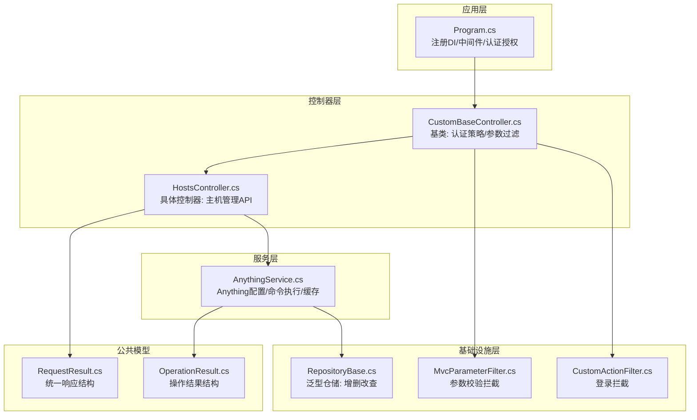
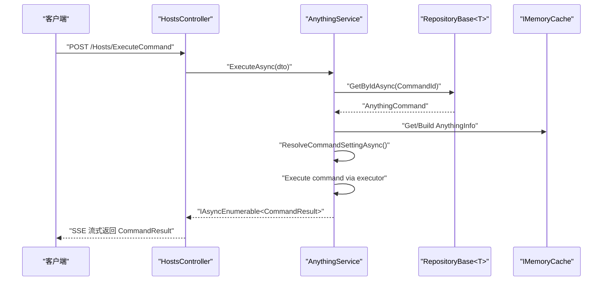
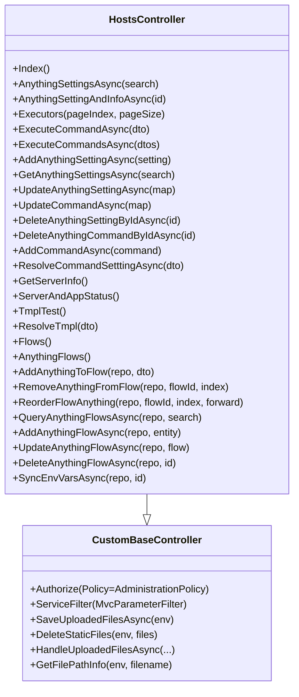
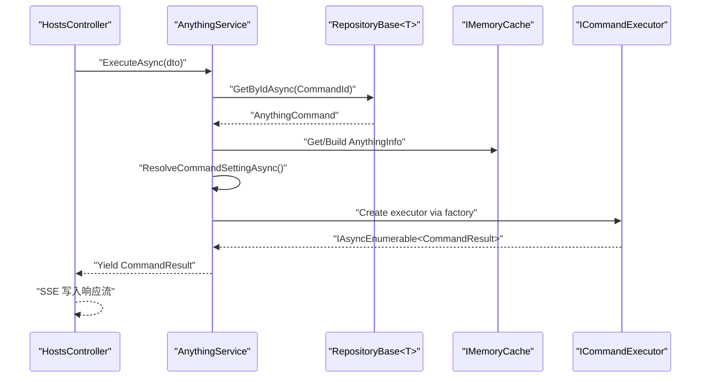
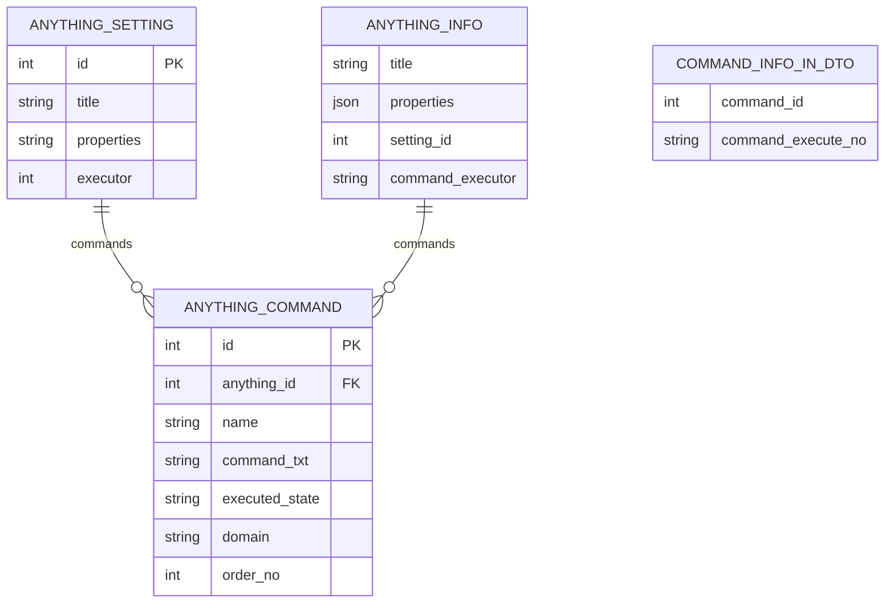
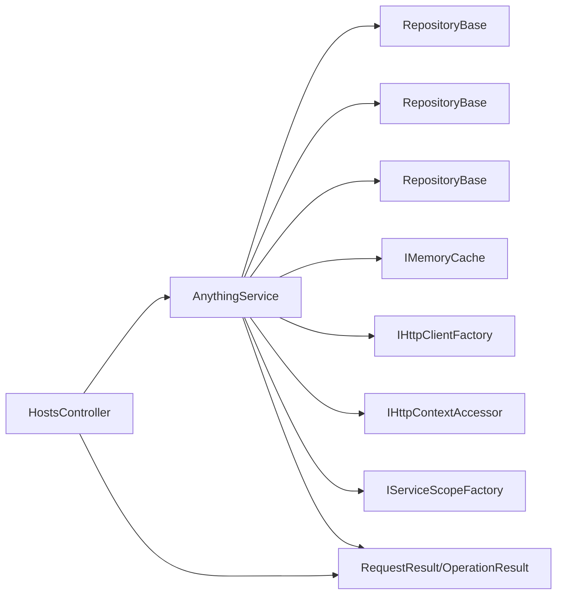
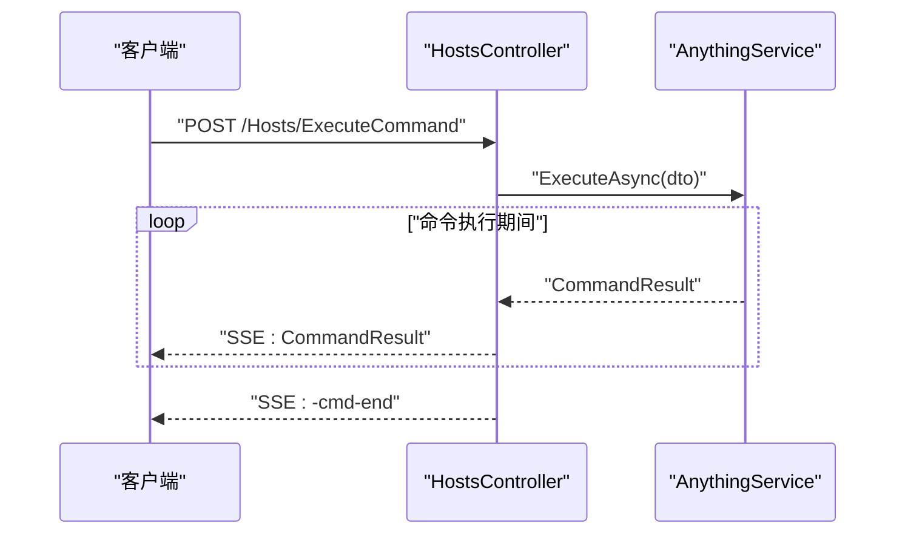

# 控制器集成接口

<cite>
**本文引用的文件**
- [HostsController.cs](file://Sylas.RemoteTasks.App/Controllers/HostsController.cs)
- [CustomBaseController.cs](file://Sylas.RemoteTasks.App/Controllers/CustomBaseController.cs)
- [AnythingService.cs](file://Sylas.RemoteTasks.App/RemoteHostModule/Anything/AnythingService.cs)
- [RepositoryBase.cs](file://Sylas.RemoteTasks.App/Infrastructure/RepositoryBase.cs)
- [Program.cs](file://Sylas.RemoteTasks.App/Program.cs)
- [CustomActionFilter.cs](file://Sylas.RemoteTasks.App/Infrastructure/CustomActionFilter.cs)
- [MvcParameterFilter.cs](file://Sylas.RemoteTasks.App/Infrastructure/MvcParameterFilter.cs)
- [RequestResult.cs](file://Sylas.RemoteTasks.Common/Dtos/RequestResult.cs)
- [OperationResult.cs](file://Sylas.RemoteTasks.Common/Dtos/OperationResult.cs)
- [AnythingSetting.cs](file://Sylas.RemoteTasks.App/RemoteHostModule/Anything/AnythingSetting.cs)
- [AnythingCommand.cs](file://Sylas.RemoteTasks.App/RemoteHostModule/Anything/AnythingCommand.cs)
- [AnythingInfo.cs](file://Sylas.RemoteTasks.App/RemoteHostModule/Anything/AnythingInfo.cs)
- [CommandInfoInDto.cs](file://Sylas.RemoteTasks.App/RemoteHostModule/Anything/CommandInfoInDto.cs)
- [Sylas.RemoteTasks.App.csproj](file://Sylas.RemoteTasks.App/Sylas.RemoteTasks.App.csproj)
</cite>

## 目录
1. [简介](#简介)
2. [项目结构](#项目结构)
3. [核心组件](#核心组件)
4. [架构总览](#架构总览)
5. [详细组件分析](#详细组件分析)
6. [依赖关系分析](#依赖关系分析)
7. [性能考量](#性能考量)
8. [故障排查指南](#故障排查指南)
9. [结论](#结论)
10. [附录：API 规范与示例](#附录api-规范与示例)

## 简介
本文档围绕 HostsController 的设计与实现展开，系统性阐述其继承关系、基础控制器功能、HTTP 接口规范、与 AnythingService 的集成模式（依赖注入、服务调用流程、异常处理）、中间件与安全认证集成、以及 API 测试与调试建议。文档同时给出面向开发与运维的实践指南，帮助读者快速理解并正确使用该控制器提供的远程主机管理能力。

## 项目结构
- 控制器层位于 Controllers 目录，HostsController 继承自 CustomBaseController，并通过依赖注入使用 AnythingService 与仓储基础设施。
- 业务服务层位于 RemoteHostModule/Anything，AnythingService 负责 Anything 配置、命令解析与执行、缓存与远程转发等核心逻辑。
- 基础设施层位于 Infrastructure，RepositoryBase 提供统一的仓储访问能力；MvcParameterFilter 与 CustomActionFilter 提供参数校验与登录拦截。
- 响应模型位于 Common/Dtos，RequestResult 与 OperationResult 统一前后端交互格式。
- 应用入口 Program.cs 注册 DI 服务、认证授权策略与中间件管道。

图表来源
- [Program.cs](file://Sylas.RemoteTasks.App/Program.cs#L60-L87)
- [CustomBaseController.cs](file://Sylas.RemoteTasks.App/Controllers/CustomBaseController.cs#L10-L14)
- [HostsController.cs](file://Sylas.RemoteTasks.App/Controllers/HostsController.cs#L19-L26)
- [AnythingService.cs](file://Sylas.RemoteTasks.App/RemoteHostModule/Anything/AnythingService.cs#L30-L38)
- [RepositoryBase.cs](file://Sylas.RemoteTasks.App/Infrastructure/RepositoryBase.cs#L10-L12)
- [MvcParameterFilter.cs](file://Sylas.RemoteTasks.App/Infrastructure/MvcParameterFilter.cs#L7-L36)
- [CustomActionFilter.cs](file://Sylas.RemoteTasks.App/Infrastructure/CustomActionFilter.cs#L7-L22)
- [RequestResult.cs](file://Sylas.RemoteTasks.Common/Dtos/RequestResult.cs#L6-L63)
- [OperationResult.cs](file://Sylas.RemoteTasks.Common/Dtos/OperationResult.cs#L8-L50)

章节来源
- [Program.cs](file://Sylas.RemoteTasks.App/Program.cs#L60-L87)
- [CustomBaseController.cs](file://Sylas.RemoteTasks.App/Controllers/CustomBaseController.cs#L10-L14)
- [HostsController.cs](file://Sylas.RemoteTasks.App/Controllers/HostsController.cs#L19-L26)
- [AnythingService.cs](file://Sylas.RemoteTasks.App/RemoteHostModule/Anything/AnythingService.cs#L30-L38)
- [RepositoryBase.cs](file://Sylas.RemoteTasks.App/Infrastructure/RepositoryBase.cs#L10-L12)
- [MvcParameterFilter.cs](file://Sylas.RemoteTasks.App/Infrastructure/MvcParameterFilter.cs#L7-L36)
- [CustomActionFilter.cs](file://Sylas.RemoteTasks.App/Infrastructure/CustomActionFilter.cs#L7-L22)
- [RequestResult.cs](file://Sylas.RemoteTasks.Common/Dtos/RequestResult.cs#L6-L63)
- [OperationResult.cs](file://Sylas.RemoteTasks.Common/Dtos/OperationResult.cs#L8-L50)

## 核心组件
- HostsController：提供远程主机管理的 HTTP 接口，包括 Anything 配置与命令管理、命令执行（单条/批量）、工作流节点管理、模板解析、服务器信息查询等。
- CustomBaseController：统一认证策略（基于角色与作用域的授权策略）与参数过滤（ModelState 校验失败时返回统一错误响应）。
- AnythingService：Anything 配置与命令的增删改查、命令解析、执行器构建与缓存、跨节点命令转发、结果聚合与流式输出。
- RepositoryBase：基于 Dapper 的泛型仓储，提供分页查询、按主键查询、新增、更新（全量/局部）、删除等能力。
- 统一响应模型：RequestResult<T> 与 OperationResult，确保前后端一致的响应结构。

章节来源
- [HostsController.cs](file://Sylas.RemoteTasks.App/Controllers/HostsController.cs#L19-L26)
- [CustomBaseController.cs](file://Sylas.RemoteTasks.App/Controllers/CustomBaseController.cs#L10-L14)
- [AnythingService.cs](file://Sylas.RemoteTasks.App/RemoteHostModule/Anything/AnythingService.cs#L30-L38)
- [RepositoryBase.cs](file://Sylas.RemoteTasks.App/Infrastructure/RepositoryBase.cs#L10-L12)
- [RequestResult.cs](file://Sylas.RemoteTasks.Common/Dtos/RequestResult.cs#L6-L63)
- [OperationResult.cs](file://Sylas.RemoteTasks.Common/Dtos/OperationResult.cs#L8-L50)

## 架构总览
HostsController 通过依赖注入获得 AnythingService 实例，控制器方法直接调用服务完成业务处理。服务内部使用 RepositoryBase 访问数据库，结合内存缓存与执行器映射实现高性能命令执行。认证与授权策略在 CustomBaseController 上统一生效，参数校验与登录拦截分别由 MvcParameterFilter 与 CustomActionFilter 承担。

图表来源
- [HostsController.cs](file://Sylas.RemoteTasks.App/Controllers/HostsController.cs#L85-L124)
- [AnythingService.cs](file://Sylas.RemoteTasks.App/RemoteHostModule/Anything/AnythingService.cs#L294-L389)
- [RepositoryBase.cs](file://Sylas.RemoteTasks.App/Infrastructure/RepositoryBase.cs#L31-L40)
- [RequestResult.cs](file://Sylas.RemoteTasks.Common/Dtos/RequestResult.cs#L6-L63)

章节来源
- [HostsController.cs](file://Sylas.RemoteTasks.App/Controllers/HostsController.cs#L85-L124)
- [AnythingService.cs](file://Sylas.RemoteTasks.App/RemoteHostModule/Anything/AnythingService.cs#L294-L389)
- [RepositoryBase.cs](file://Sylas.RemoteTasks.App/Infrastructure/RepositoryBase.cs#L31-L40)
- [RequestResult.cs](file://Sylas.RemoteTasks.Common/Dtos/RequestResult.cs#L6-L63)

## 详细组件分析

### 继承关系与基础控制器功能
- 继承关系：HostsController 继承自 CustomBaseController，后者通过特性标注启用基于角色与作用域的授权策略，并挂载参数过滤器。
- 基础功能：
  - 统一认证策略：要求用户具备特定角色与作用域声明，否则拒绝访问。
  - 参数过滤：当 ModelState 无效时，返回包含错误详情的统一响应。
  - 文件上传辅助：提供保存/删除/处理上传文件的通用方法，便于控制器扩展。

图表来源
- [CustomBaseController.cs](file://Sylas.RemoteTasks.App/Controllers/CustomBaseController.cs#L10-L14)
- [HostsController.cs](file://Sylas.RemoteTasks.App/Controllers/HostsController.cs#L19-L26)

章节来源
- [CustomBaseController.cs](file://Sylas.RemoteTasks.App/Controllers/CustomBaseController.cs#L10-L14)
- [HostsController.cs](file://Sylas.RemoteTasks.App/Controllers/HostsController.cs#L19-L26)

### API 接口规范与实现要点
- 统一响应格式：所有返回均封装为 RequestResult<T> 或 OperationResult，包含 Code、ErrMsg、Data 字段。
- 参数校验：通过 MvcParameterFilter 自动拦截无效参数并返回 400。
- 认证授权：CustomBaseController 应用授权策略，未满足条件的请求将被拒绝。
- 命令执行：支持单条与批量命令执行，采用 SSE 流式返回 CommandResult，客户端需按约定解析“-cmd-end”结束标记。
- 工作流管理：提供工作流节点的增删改查、重排与环境变量同步。

章节来源
- [RequestResult.cs](file://Sylas.RemoteTasks.Common/Dtos/RequestResult.cs#L6-L63)
- [OperationResult.cs](file://Sylas.RemoteTasks.Common/Dtos/OperationResult.cs#L8-L50)
- [MvcParameterFilter.cs](file://Sylas.RemoteTasks.App/Infrastructure/MvcParameterFilter.cs#L7-L36)
- [CustomBaseController.cs](file://Sylas.RemoteTasks.App/Controllers/CustomBaseController.cs#L10-L14)
- [HostsController.cs](file://Sylas.RemoteTasks.App/Controllers/HostsController.cs#L85-L124)

### 与 AnythingService 的集成模式
- 依赖注入：在 Program.cs 中注册 AnythingService 为瞬时服务；控制器通过构造函数注入。
- 服务调用流程：
  - 控制器方法接收 DTO/参数，调用 AnythingService。
  - 服务通过 RepositoryBase 访问数据库，结合内存缓存与执行器映射执行命令。
  - 支持跨节点命令转发与结果聚合，最终以流式方式返回给控制器。
- 异常处理机制：
  - 服务内部捕获异常并序列化为 CommandResult 返回。
  - 控制器在 finally 中发送“-cmd-end”结束标记，保证客户端能正确结束订阅。

图表来源
- [HostsController.cs](file://Sylas.RemoteTasks.App/Controllers/HostsController.cs#L85-L124)
- [AnythingService.cs](file://Sylas.RemoteTasks.App/RemoteHostModule/Anything/AnythingService.cs#L294-L389)
- [RepositoryBase.cs](file://Sylas.RemoteTasks.App/Infrastructure/RepositoryBase.cs#L31-L40)

章节来源
- [Program.cs](file://Sylas.RemoteTasks.App/Program.cs#L61-L62)
- [HostsController.cs](file://Sylas.RemoteTasks.App/Controllers/HostsController.cs#L85-L124)
- [AnythingService.cs](file://Sylas.RemoteTasks.App/RemoteHostModule/Anything/AnythingService.cs#L294-L389)
- [RepositoryBase.cs](file://Sylas.RemoteTasks.App/Infrastructure/RepositoryBase.cs#L31-L40)

### 数据模型与实体
- AnythingSetting：Anything 配置实体，包含标题、属性（JSON 字符串）与默认执行器。
- AnythingCommand：命令实体，包含命令文本、执行状态查询、所属主机域名与排序。
- AnythingInfo：运行时对象，包含标题、命令集合、属性字典与执行器名称。
- CommandInfoInDto：命令执行输入 DTO，包含命令 ID 与执行编号。

图表来源
- [AnythingSetting.cs](file://Sylas.RemoteTasks.App/RemoteHostModule/Anything/AnythingSetting.cs#L8-L32)
- [AnythingCommand.cs](file://Sylas.RemoteTasks.App/RemoteHostModule/Anything/AnythingCommand.cs#L7-L33)
- [AnythingInfo.cs](file://Sylas.RemoteTasks.App/RemoteHostModule/Anything/AnythingInfo.cs#L9-L36)
- [CommandInfoInDto.cs](file://Sylas.RemoteTasks.App/RemoteHostModule/Anything/CommandInfoInDto.cs#L3-L14)

章节来源
- [AnythingSetting.cs](file://Sylas.RemoteTasks.App/RemoteHostModule/Anything/AnythingSetting.cs#L8-L32)
- [AnythingCommand.cs](file://Sylas.RemoteTasks.App/RemoteHostModule/Anything/AnythingCommand.cs#L7-L33)
- [AnythingInfo.cs](file://Sylas.RemoteTasks.App/RemoteHostModule/Anything/AnythingInfo.cs#L9-L36)
- [CommandInfoInDto.cs](file://Sylas.RemoteTasks.App/RemoteHostModule/Anything/CommandInfoInDto.cs#L3-L14)

### 中间件与安全认证集成
- 认证与授权：
  - 在 Program.cs 中注册认证服务并配置授权策略，要求用户具备特定角色与作用域。
  - CustomBaseController 应用授权策略，未满足条件的请求将被拒绝。
- 参数过滤：
  - MvcParameterFilter 在 Action 执行前校验 ModelState，无效时返回统一错误响应。
- 登录拦截：
  - CustomActionFilter 在 Action 执行后检查用户身份，未认证则重定向至登录页。

章节来源
- [Program.cs](file://Sylas.RemoteTasks.App/Program.cs#L74-L87)
- [CustomBaseController.cs](file://Sylas.RemoteTasks.App/Controllers/CustomBaseController.cs#L10-L14)
- [MvcParameterFilter.cs](file://Sylas.RemoteTasks.App/Infrastructure/MvcParameterFilter.cs#L7-L36)
- [CustomActionFilter.cs](file://Sylas.RemoteTasks.App/Infrastructure/CustomActionFilter.cs#L7-L22)

## 依赖关系分析
- 控制器对服务的依赖：HostsController 通过构造函数注入 AnythingService。
- 服务对仓储的依赖：AnythingService 通过构造函数注入多个 RepositoryBase<T> 实例。
- 服务对基础设施的依赖：AnythingService 使用内存缓存、HTTP 客户端工厂、HTTP 上下文访问器与作用域工厂。
- 统一响应模型：控制器与服务均返回 RequestResult<T>/OperationResult，保持一致的契约。

图表来源
- [HostsController.cs](file://Sylas.RemoteTasks.App/Controllers/HostsController.cs#L19-L26)
- [AnythingService.cs](file://Sylas.RemoteTasks.App/RemoteHostModule/Anything/AnythingService.cs#L30-L38)
- [RepositoryBase.cs](file://Sylas.RemoteTasks.App/Infrastructure/RepositoryBase.cs#L10-L12)
- [RequestResult.cs](file://Sylas.RemoteTasks.Common/Dtos/RequestResult.cs#L6-L63)
- [OperationResult.cs](file://Sylas.RemoteTasks.Common/Dtos/OperationResult.cs#L8-L50)

章节来源
- [HostsController.cs](file://Sylas.RemoteTasks.App/Controllers/HostsController.cs#L19-L26)
- [AnythingService.cs](file://Sylas.RemoteTasks.App/RemoteHostModule/Anything/AnythingService.cs#L30-L38)
- [RepositoryBase.cs](file://Sylas.RemoteTasks.App/Infrastructure/RepositoryBase.cs#L10-L12)
- [RequestResult.cs](file://Sylas.RemoteTasks.Common/Dtos/RequestResult.cs#L6-L63)
- [OperationResult.cs](file://Sylas.RemoteTasks.Common/Dtos/OperationResult.cs#L8-L50)

## 性能考量
- 缓存策略：AnythingService 对 AnythingInfo 与执行器进行缓存，减少重复解析与构建成本。
- 流式输出：命令执行采用 SSE 流式返回，降低一次性大响应的内存压力。
- 数据库访问：RepositoryBase 提供分页查询与按主键查询，避免全表扫描；不同数据库类型自动适配返回自增主键的 SQL。
- 并发控制：命令执行与结果聚合采用异步枚举与队列机制，避免阻塞主线程。

章节来源
- [AnythingService.cs](file://Sylas.RemoteTasks.App/RemoteHostModule/Anything/AnythingService.cs#L255-L277)
- [HostsController.cs](file://Sylas.RemoteTasks.App/Controllers/HostsController.cs#L85-L124)
- [RepositoryBase.cs](file://Sylas.RemoteTasks.App/Infrastructure/RepositoryBase.cs#L71-L104)

## 故障排查指南
- 参数校验失败：检查请求体与查询参数是否符合模型定义；查看统一错误响应中的错误列表。
- 未认证或权限不足：确认用户具备所需角色与作用域；检查授权策略配置。
- 命令执行异常：关注服务端日志与 CommandResult 的错误消息；确认命令模板解析与执行器参数是否正确。
- 跨节点执行失败：检查中心服务器地址与令牌传递；确认目标节点可达且授权有效。
- 工作流同步失败：确认工作流与节点存在；检查环境变量合并逻辑。

章节来源
- [MvcParameterFilter.cs](file://Sylas.RemoteTasks.App/Infrastructure/MvcParameterFilter.cs#L7-L36)
- [Program.cs](file://Sylas.RemoteTasks.App/Program.cs#L74-L87)
- [AnythingService.cs](file://Sylas.RemoteTasks.App/RemoteHostModule/Anything/AnythingService.cs#L336-L373)
- [HostsController.cs](file://Sylas.RemoteTasks.App/Controllers/HostsController.cs#L301-L314)

## 结论
HostsController 通过清晰的继承体系与统一的响应模型，提供了完整的远程主机管理能力。AnythingService 作为核心业务引擎，结合仓储、缓存与执行器工厂，实现了高内聚低耦合的架构设计。配合认证授权与参数过滤中间件，系统在安全性与可用性方面具备良好保障。建议在生产环境中重点关注缓存命中率、命令执行超时与跨节点通信稳定性，并持续优化模板解析与执行器参数生成逻辑。

## 附录：API 规范与示例

### 通用响应结构
- RequestResult<T>：包含 Code、ErrMsg、Data 字段。
- OperationResult：包含 Succeed、Message、Data 字段。

章节来源
- [RequestResult.cs](file://Sylas.RemoteTasks.Common/Dtos/RequestResult.cs#L6-L63)
- [OperationResult.cs](file://Sylas.RemoteTasks.Common/Dtos/OperationResult.cs#L8-L50)

### 认证与授权
- 授权策略：要求用户具备特定角色与作用域声明。
- 中间件顺序：认证 → 授权 → 控制器执行。

章节来源
- [Program.cs](file://Sylas.RemoteTasks.App/Program.cs#L74-L87)
- [CustomBaseController.cs](file://Sylas.RemoteTasks.App/Controllers/CustomBaseController.cs#L10-L14)

### API 列表与调用示例（路径与方法）
以下为控制器公开的主要接口（路径与方法），具体参数与响应请参考各方法实现与统一响应结构。

- 获取 Anything 配置分页
  - 方法：GET/POST
  - 路径：/Hosts/AnythingSettingsAsync
  - 输入：DataSearch（可选）
  - 输出：RequestResult<PagedData<AnythingSetting>>

- 获取 Anything 配置详情与命令
  - 方法：GET
  - 路径：/Hosts/AnythingSettingAndInfoAsync/{id}
  - 输入：id（整数）
  - 输出：RequestResult<object>（包含 AnythingSetting 与 AnythingInfo）

- 查询命令执行器列表
  - 方法：GET
  - 路径：/Hosts/Executors
  - 查询参数：pageIndex、pageSize
  - 输出：RequestResult<PagedData<AnythingExecutor>>

- 执行单条命令（SSE）
  - 方法：POST
  - 路径：/Hosts/ExecuteCommand
  - 输入：CommandInfoInDto
  - 输出：SSE 流，逐条返回 CommandResult，以“-cmd-end”结束

- 执行多条命令（SSE）
  - 方法：POST
  - 路径：/Hosts/ExecuteCommands
  - 输入：CommandInfoInDto[]
  - 输出：SSE 流，逐条返回 CommandResult，以“-cmd-end”结束

- 新增 Anything 配置
  - 方法：POST
  - 路径：/Hosts/AddAnythingSettingAsync
  - 输入：AnythingSetting
  - 输出：RequestResult<bool>

- 查询 Anything 配置（分页）
  - 方法：POST
  - 路径：/Hosts/GetAnythingSettingsAsync
  - 输入：DataSearch（可选）
  - 输出：PagedData<AnythingSetting>

- 更新 Anything 配置
  - 方法：POST
  - 路径：/Hosts/UpdateAnythingSettingAsync
  - 输入：Dictionary<string, string>
  - 输出：RequestResult<OperationResult>

- 更新命令
  - 方法：POST
  - 路径：/Hosts/UpdateCommandAsync
  - 输入：Dictionary<string, string>
  - 输出：RequestResult<OperationResult>

- 删除 Anything 配置
  - 方法：GET/POST
  - 路径：/Hosts/DeleteAnythingSettingByIdAsync/{id}
  - 输入：id（整数）
  - 输出：RequestResult<bool>

- 删除命令
  - 方法：GET/POST
  - 路径：/Hosts/DeleteAnythingCommandByIdAsync/{id}
  - 输入：id（整数）
  - 输出：RequestResult<bool>

- 添加命令
  - 方法：POST
  - 路径：/Hosts/AddCommandAsync
  - 输入：AnythingCommand
  - 输出：RequestResult<bool>

- 解析命令模板
  - 方法：POST
  - 路径：/Hosts/ResolveCommandSetttingAsync
  - 输入：CommandResolveDto
  - 输出：RequestResult<string>

- 获取服务器信息
  - 方法：GET
  - 路径：/Hosts/GetServerInfo
  - 输出：RequestResult<ServerInfo>

- 模板解析测试
  - 方法：POST
  - 路径：/Hosts/ResolveTmpl
  - 输入：ResolveTmplDto
  - 输出：RequestResult<string>

- 工作流页面
  - 方法：GET
  - 路径：/Hosts/Flows
  - 输出：视图

- Anything 工作流页面
  - 方法：GET
  - 路径：/Hosts/AnythingFlows
  - 输出：视图

- 为工作流添加节点
  - 方法：POST
  - 路径：/Hosts/AddAnythingToFlow
  - 输入：FlowAddAnthingInDto
  - 输出：RequestResult<bool>

- 从工作流删除节点
  - 方法：GET/POST
  - 路径：/Hosts/RemoveAnythingFromFlow
  - 查询参数：flowId、removeIndex
  - 输出：RequestResult<bool>

- 重排工作流节点
  - 方法：GET/POST
  - 路径：/Hosts/ReorderFlowAnything
  - 查询参数：flowId、anythingIndex、forward
  - 输出：RequestResult<bool>

- 查询工作流（分页）
  - 方法：POST
  - 路径：/Hosts/QueryAnythingFlowsAsync
  - 输入：DataSearch（可选）
  - 输出：RequestResult<PagedData<AnythingFlow>>

- 新增工作流
  - 方法：POST
  - 路径：/Hosts/AddAnythingFlowAsync
  - 输入：AnythingFlow
  - 输出：RequestResult<bool>

- 更新工作流
  - 方法：POST
  - 路径：/Hosts/UpdateAnythingFlowAsync
  - 输入：AnythingFlow
  - 输出：RequestResult<bool>

- 删除工作流
  - 方法：POST
  - 路径：/Hosts/DeleteAnythingFlowAsync
  - 输入：int id
  - 输出：RequestResult<bool>

- 同步环境变量到工作流
  - 方法：POST
  - 路径：/Hosts/SyncEnvVarsAsync
  - 输入：int id
  - 输出：RequestResult<bool>

章节来源
- [HostsController.cs](file://Sylas.RemoteTasks.App/Controllers/HostsController.cs#L32-L56)
- [HostsController.cs](file://Sylas.RemoteTasks.App/Controllers/HostsController.cs#L73-L77)
- [HostsController.cs](file://Sylas.RemoteTasks.App/Controllers/HostsController.cs#L85-L124)
- [HostsController.cs](file://Sylas.RemoteTasks.App/Controllers/HostsController.cs#L131-L158)
- [HostsController.cs](file://Sylas.RemoteTasks.App/Controllers/HostsController.cs#L164-L167)
- [HostsController.cs](file://Sylas.RemoteTasks.App/Controllers/HostsController.cs#L173-L178)
- [HostsController.cs](file://Sylas.RemoteTasks.App/Controllers/HostsController.cs#L184-L187)
- [HostsController.cs](file://Sylas.RemoteTasks.App/Controllers/HostsController.cs#L194-L197)
- [HostsController.cs](file://Sylas.RemoteTasks.App/Controllers/HostsController.cs#L204-L207)
- [HostsController.cs](file://Sylas.RemoteTasks.App/Controllers/HostsController.cs#L213-L216)
- [HostsController.cs](file://Sylas.RemoteTasks.App/Controllers/HostsController.cs#L222-L225)
- [HostsController.cs](file://Sylas.RemoteTasks.App/Controllers/HostsController.cs#L231-L234)
- [HostsController.cs](file://Sylas.RemoteTasks.App/Controllers/HostsController.cs#L240-L244)
- [HostsController.cs](file://Sylas.RemoteTasks.App/Controllers/HostsController.cs#L268-L279)
- [HostsController.cs](file://Sylas.RemoteTasks.App/Controllers/HostsController.cs#L282-L294)
- [HostsController.cs](file://Sylas.RemoteTasks.App/Controllers/HostsController.cs#L290-L294)
- [HostsController.cs](file://Sylas.RemoteTasks.App/Controllers/HostsController.cs#L301-L314)
- [HostsController.cs](file://Sylas.RemoteTasks.App/Controllers/HostsController.cs#L322-L335)
- [HostsController.cs](file://Sylas.RemoteTasks.App/Controllers/HostsController.cs#L336-L368)
- [HostsController.cs](file://Sylas.RemoteTasks.App/Controllers/HostsController.cs#L375-L380)
- [HostsController.cs](file://Sylas.RemoteTasks.App/Controllers/HostsController.cs#L387-L391)
- [HostsController.cs](file://Sylas.RemoteTasks.App/Controllers/HostsController.cs#L398-L402)
- [HostsController.cs](file://Sylas.RemoteTasks.App/Controllers/HostsController.cs#L409-L419)
- [HostsController.cs](file://Sylas.RemoteTasks.App/Controllers/HostsController.cs#L425-L465)

### 命令执行流程（SSE）
- 客户端建立与服务器的 SSE 连接，服务端持续推送 CommandResult。
- 当命令执行结束时，服务端发送“-cmd-end”标记，客户端据此停止订阅。

图表来源
- [HostsController.cs](file://Sylas.RemoteTasks.App/Controllers/HostsController.cs#L85-L124)
- [AnythingService.cs](file://Sylas.RemoteTasks.App/RemoteHostModule/Anything/AnythingService.cs#L294-L389)

### 测试与调试建议
- 单元测试：针对控制器方法与服务方法编写单元测试，覆盖正常路径与异常路径。
- 集成测试：模拟认证与授权场景，验证参数过滤与登录拦截行为。
- 日志与监控：开启服务端日志，关注命令执行超时、跨节点转发失败与缓存未命中等情况。
- 前端联调：使用浏览器开发者工具观察 SSE 连接状态与消息解析；确保正确识别“-cmd-end”。

章节来源
- [Program.cs](file://Sylas.RemoteTasks.App/Program.cs#L74-L87)
- [MvcParameterFilter.cs](file://Sylas.RemoteTasks.App/Infrastructure/MvcParameterFilter.cs#L7-L36)
- [CustomActionFilter.cs](file://Sylas.RemoteTasks.App/Infrastructure/CustomActionFilter.cs#L7-L22)
- [HostsController.cs](file://Sylas.RemoteTasks.App/Controllers/HostsController.cs#L85-L124)
- [AnythingService.cs](file://Sylas.RemoteTasks.App/RemoteHostModule/Anything/AnythingService.cs#L440-L491)