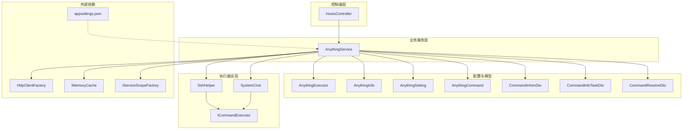
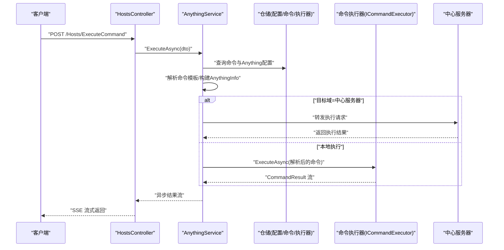
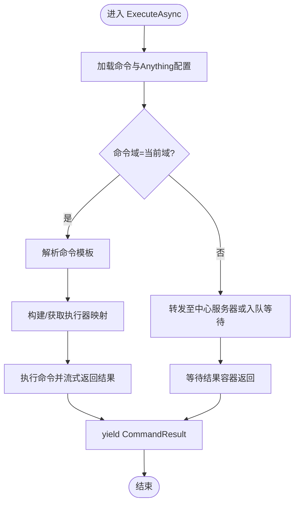
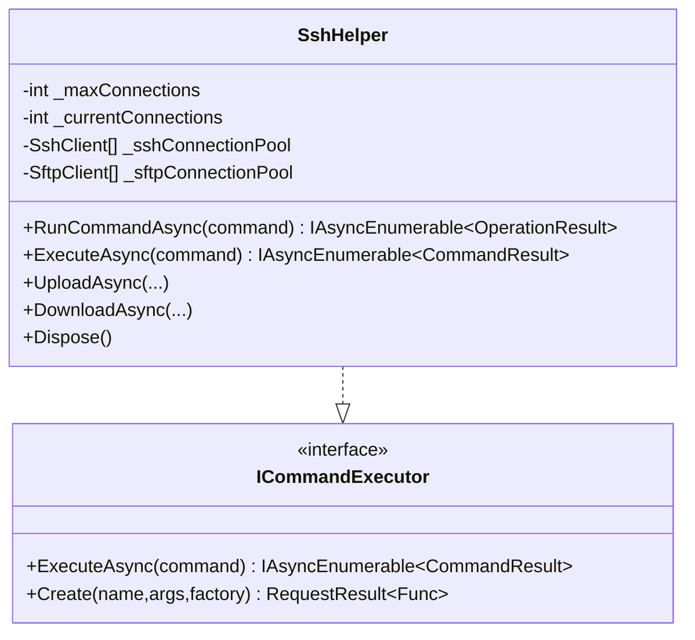
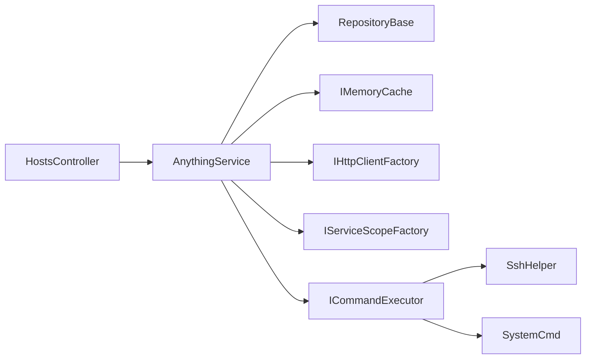

# 远程主机管理

<cite>
**本文引用的文件**
- [AnythingService.cs](file://Sylas.RemoteTasks.App/RemoteHostModule/Anything/AnythingService.cs)
- [AnythingExecutor.cs](file://Sylas.RemoteTasks.App/RemoteHostModule/Anything/AnythingExecutor.cs)
- [AnythingInfo.cs](file://Sylas.RemoteTasks.App/RemoteHostModule/Anything/AnythingInfo.cs)
- [AnythingSetting.cs](file://Sylas.RemoteTasks.App/RemoteHostModule/Anything/AnythingSetting.cs)
- [AnythingCommand.cs](file://Sylas.RemoteTasks.App/RemoteHostModule/Anything/AnythingCommand.cs)
- [AnythingSettingDetails.cs](file://Sylas.RemoteTasks.App/RemoteHostModule/Anything/AnythingSettingDetails.cs)
- [CommandInfoInDto.cs](file://Sylas.RemoteTasks.App/RemoteHostModule/Anything/CommandInfoInDto.cs)
- [CommandInfoTaskDto.cs](file://Sylas.RemoteTasks.App/RemoteHostModule/Anything/CommandInfoTaskDto.cs)
- [CommandResolveDto.cs](file://Sylas.RemoteTasks.App/RemoteHostModule/Anything/CommandResolveDto.cs)
- [HostsController.cs](file://Sylas.RemoteTasks.App/Controllers/HostsController.cs)
- [SshHelper.cs](file://Sylas.RemoteTasks.Utils/CommandExecutor/SshHelper.cs)
- [ICommandExecutor.cs](file://Sylas.RemoteTasks.Utils/CommandExecutor/ICommandExecutor.cs)
- [SystemCmd.cs](file://Sylas.RemoteTasks.Utils/CommandExecutor/SystemCmd.cs)
- [appsettings.json](file://Sylas.RemoteTasks.App/appsettings.json)
</cite>

## 目录
1. [简介](#简介)
2. [项目结构](#项目结构)
3. [核心组件](#核心组件)
4. [架构总览](#架构总览)
5. [详细组件分析](#详细组件分析)
6. [依赖关系分析](#依赖关系分析)
7. [性能考虑](#性能考虑)
8. [故障排查指南](#故障排查指南)
9. [结论](#结论)
10. [附录](#附录)

## 简介
本技术文档聚焦于远程主机管理模块，围绕 AnythingService 的核心能力展开，涵盖远程主机连接管理、命令执行机制、任务调度系统；深入解析 AnythingExecutor 的实现原理（SSH 连接建立、命令解析、执行结果处理）；系统化说明 AnythingInfo 配置模型的字段含义与使用方法；提供与控制器层的集成方式与 API 接口规范；并给出错误处理策略、性能优化建议与故障排查指南。

## 项目结构
远程主机管理模块位于 Sylas.RemoteTasks.App 的 RemoteHostModule/Anything 目录下，配合 Utils 层的命令执行器（SSH、系统命令等），并通过控制器层暴露 REST API。关键文件如下：
- 业务与配置模型：AnythingService、AnythingExecutor、AnythingInfo、AnythingSetting、AnythingCommand、AnythingSettingDetails、CommandInfoInDto、CommandInfoTaskDto、CommandResolveDto
- 控制器：HostsController
- 执行器实现：SshHelper、ICommandExecutor、SystemCmd
- 全局配置：appsettings.json

图表来源
- [HostsController.cs](file://Sylas.RemoteTasks.App/Controllers/HostsController.cs#L19-L468)
- [AnythingService.cs](file://Sylas.RemoteTasks.App/RemoteHostModule/Anything/AnythingService.cs#L30-L680)
- [SshHelper.cs](file://Sylas.RemoteTasks.Utils/CommandExecutor/SshHelper.cs#L18-L619)
- [SystemCmd.cs](file://Sylas.RemoteTasks.Utils/CommandExecutor/SystemCmd.cs#L23-L788)
- [ICommandExecutor.cs](file://Sylas.RemoteTasks.Utils/CommandExecutor/ICommandExecutor.cs#L14-L74)
- [appsettings.json](file://Sylas.RemoteTasks.App/appsettings.json#L31-L35)

章节来源
- [HostsController.cs](file://Sylas.RemoteTasks.App/Controllers/HostsController.cs#L19-L468)
- [AnythingService.cs](file://Sylas.RemoteTasks.App/RemoteHostModule/Anything/AnythingService.cs#L30-L680)

## 核心组件
- AnythingService：远程主机管理的核心业务服务，负责 Anything 配置与命令的增删改查、命令解析、执行器构建、跨节点任务调度与结果汇聚。
- AnythingExecutor：命令执行器元数据，包含执行器名称与参数模板。
- AnythingInfo：运行时配置对象，封装标题、命令集合、属性字典、命令执行器名称与设置 Id。
- AnythingSetting/AnythingSettingDetails：Anything 的持久化配置与详情（含命令集合）。
- AnythingCommand：单条命令配置，支持命令文本、状态查询、域归属与排序。
- CommandInfoInDto/CommandInfoTaskDto：命令执行输入与跨节点任务传输对象。
- CommandResolveDto：命令模板解析 DTO。
- HostsController：对外暴露 REST API，基于 SSE 流式返回命令执行结果。
- SshHelper/SystemCmd：SSH 与本地系统命令执行器实现，统一 ICommandExecutor 接口。
- appsettings.json：中心服务器地址、Web 服务端口等全局配置。

章节来源
- [AnythingService.cs](file://Sylas.RemoteTasks.App/RemoteHostModule/Anything/AnythingService.cs#L30-L680)
- [AnythingExecutor.cs](file://Sylas.RemoteTasks.App/RemoteHostModule/Anything/AnythingExecutor.cs#L5-L11)
- [AnythingInfo.cs](file://Sylas.RemoteTasks.App/RemoteHostModule/Anything/AnythingInfo.cs#L9-L38)
- [AnythingSetting.cs](file://Sylas.RemoteTasks.App/RemoteHostModule/Anything/AnythingSetting.cs#L8-L34)
- [AnythingCommand.cs](file://Sylas.RemoteTasks.App/RemoteHostModule/Anything/AnythingCommand.cs#L7-L35)
- [CommandInfoInDto.cs](file://Sylas.RemoteTasks.App/RemoteHostModule/Anything/CommandInfoInDto.cs#L3-L15)
- [CommandInfoTaskDto.cs](file://Sylas.RemoteTasks.App/RemoteHostModule/Anything/CommandInfoTaskDto.cs#L3-L19)
- [CommandResolveDto.cs](file://Sylas.RemoteTasks.App/RemoteHostModule/Anything/CommandResolveDto.cs#L3-L15)
- [HostsController.cs](file://Sylas.RemoteTasks.App/Controllers/HostsController.cs#L19-L468)
- [SshHelper.cs](file://Sylas.RemoteTasks.Utils/CommandExecutor/SshHelper.cs#L18-L619)
- [SystemCmd.cs](file://Sylas.RemoteTasks.Utils/CommandExecutor/SystemCmd.cs#L23-L788)
- [ICommandExecutor.cs](file://Sylas.RemoteTasks.Utils/CommandExecutor/ICommandExecutor.cs#L14-L74)
- [appsettings.json](file://Sylas.RemoteTasks.App/appsettings.json#L31-L35)

## 架构总览
远程主机管理采用“控制器-服务-执行器”三层架构，结合内存缓存与服务作用域工厂，实现配置解析、执行器动态创建与命令执行的解耦。跨节点命令通过队列与结果容器进行异步汇聚，最终以 Server-Sent Events 形式返回给客户端。

图表来源
- [HostsController.cs](file://Sylas.RemoteTasks.App/Controllers/HostsController.cs#L85-L124)
- [AnythingService.cs](file://Sylas.RemoteTasks.App/RemoteHostModule/Anything/AnythingService.cs#L294-L389)
- [SshHelper.cs](file://Sylas.RemoteTasks.Utils/CommandExecutor/SshHelper.cs#L551-L558)
- [SystemCmd.cs](file://Sylas.RemoteTasks.Utils/CommandExecutor/SystemCmd.cs#L129-L138)

## 详细组件分析

### AnythingService：远程主机连接管理、命令执行与任务调度
- 配置与命令管理
  - 分页查询 AnythingSetting、按 Id 获取详情、增删改查 AnythingCommand、缓存 AnythingInfo 与执行器。
  - 通过模板解析 Properties 动态替换命令中的占位符。
- 命令执行
  - ExecuteAsync 接收 CommandInfoInDto，解析命令、选择执行器、执行并流式返回 CommandResult。
  - 支持跨节点：当命令 Domain 与当前域不一致且处于中心节点时，将任务入队；否则向中心服务器转发。
- 任务调度
  - GetCommandTaskAsync 从 domain 对应队列阻塞式取出任务；SetCommandResult/SetCommandResultAsync 通过静态容器与轮询机制汇聚结果。
- 缓存与性能
  - 使用 IMemoryCache 缓存 AllAnythingInfos、单个 AnythingInfo 与执行器，滑动过期时间降低重复解析成本。

图表来源
- [AnythingService.cs](file://Sylas.RemoteTasks.App/RemoteHostModule/Anything/AnythingService.cs#L294-L389)
- [AnythingService.cs](file://Sylas.RemoteTasks.App/RemoteHostModule/Anything/AnythingService.cs#L399-L491)

章节来源
- [AnythingService.cs](file://Sylas.RemoteTasks.App/RemoteHostModule/Anything/AnythingService.cs#L45-L106)
- [AnythingService.cs](file://Sylas.RemoteTasks.App/RemoteHostModule/Anything/AnythingService.cs#L255-L277)
- [AnythingService.cs](file://Sylas.RemoteTasks.App/RemoteHostModule/Anything/AnythingService.cs#L294-L389)
- [AnythingService.cs](file://Sylas.RemoteTasks.App/RemoteHostModule/Anything/AnythingService.cs#L399-L491)
- [AnythingService.cs](file://Sylas.RemoteTasks.App/RemoteHostModule/Anything/AnythingService.cs#L529-L631)

### AnythingExecutor：执行器元数据
- 字段
  - Name：执行器类名（需与 ICommandExecutor 实现匹配）
  - Arguments：JSON 字符串，包含参数模板与类型，用于构建执行器实例参数
- 作用
  - 作为 AnythingSetting.Executor 引用，驱动运行时动态创建执行器实例

章节来源
- [AnythingExecutor.cs](file://Sylas.RemoteTasks.App/RemoteHostModule/Anything/AnythingExecutor.cs#L5-L11)

### AnythingInfo：运行时配置模型
- 字段
  - Title：标题（模板解析后）
  - Commands：命令集合（模板解析后）
  - Properties：键值对属性（模板解析后）
  - SettingId：配置 Id
  - CommandExecutor：执行器名称
- 用途
  - 作为前端展示与命令执行的上下文载体

章节来源
- [AnythingInfo.cs](file://Sylas.RemoteTasks.App/RemoteHostModule/Anything/AnythingInfo.cs#L9-L38)

### AnythingSetting/AnythingSettingDetails：配置模型
- AnythingSetting
  - Title、Properties（JSON 字符串）、Executor（执行器 Id）
  - ToDetails：将命令集合组合为详情对象
- AnythingSettingDetails
  - 继承 AnythingSetting，并包含 Commands 集合

章节来源
- [AnythingSetting.cs](file://Sylas.RemoteTasks.App/RemoteHostModule/Anything/AnythingSetting.cs#L8-L34)
- [AnythingSettingDetails.cs](file://Sylas.RemoteTasks.App/RemoteHostModule/Anything/AnythingSettingDetails.cs#L3-L11)

### AnythingCommand：命令配置
- 字段
  - AnythingId、Name、CommandTxt、ExecutedState、Domain、OrderNo
- 说明
  - ExecutedState 用于获取命令执行后的状态查询命令
  - Domain 用于跨节点路由

章节来源
- [AnythingCommand.cs](file://Sylas.RemoteTasks.App/RemoteHostModule/Anything/AnythingCommand.cs#L7-L35)

### CommandInfoInDto/CommandInfoTaskDto/CommandResolveDto：传输与解析对象
- CommandInfoInDto：执行命令输入（CommandId、CommandExecuteNo）
- CommandInfoTaskDto：跨节点任务输入（继承 CommandInfoInDto，增加 SettingId、CommandName、Domain）
- CommandResolveDto：命令模板解析输入（Id、CmdTxt）

章节来源
- [CommandInfoInDto.cs](file://Sylas.RemoteTasks.App/RemoteHostModule/Anything/CommandInfoInDto.cs#L3-L15)
- [CommandInfoTaskDto.cs](file://Sylas.RemoteTasks.App/RemoteHostModule/Anything/CommandInfoTaskDto.cs#L3-L19)
- [CommandResolveDto.cs](file://Sylas.RemoteTasks.App/RemoteHostModule/Anything/CommandResolveDto.cs#L3-L15)

### HostsController：控制器与 API 规范
- 接口
  - GET /Hosts/AnythingSettingsAsync：分页查询 Anything 配置
  - GET /Hosts/AnythingSettingAndInfoAsync：按 Id 获取配置与解析后的 AnythingInfo
  - GET /Hosts/Executors：分页查询执行器
  - POST /Hosts/ExecuteCommand：执行命令（SSE 流）
  - POST /Hosts/ExecuteCommandsAsync：批量执行命令（SSE 流）
  - POST /Hosts/AddAnythingSettingAsync、PUT /Hosts/UpdateAnythingSettingAsync、DELETE /Hosts/DeleteAnythingSettingByIdAsync
  - POST /Hosts/AddCommandAsync、PUT /Hosts/UpdateCommandAsync、DELETE /Hosts/DeleteAnythingCommandByIdAsync
  - POST /Hosts/ResolveCommandSetttingAsync：解析命令模板
  - GET /Hosts/GetServerInfo：获取服务器与应用信息
- SSE 返回
  - 服务端持续推送 CommandResult JSON，以“-cmd-end”标记结束

章节来源
- [HostsController.cs](file://Sylas.RemoteTasks.App/Controllers/HostsController.cs#L32-L124)
- [HostsController.cs](file://Sylas.RemoteTasks.App/Controllers/HostsController.cs#L131-L158)
- [HostsController.cs](file://Sylas.RemoteTasks.App/Controllers/HostsController.cs#L164-L225)
- [HostsController.cs](file://Sylas.RemoteTasks.App/Controllers/HostsController.cs#L231-L234)
- [HostsController.cs](file://Sylas.RemoteTasks.App/Controllers/HostsController.cs#L240-L244)

### SshHelper：SSH 连接与命令执行
- 连接管理
  - 连接池：SshClient、SftpClient 池化复用，最大连接数限制，线程安全
  - 自动重连：检测断开后自动重建
- 命令执行
  - 支持多行命令块识别与分段执行
  - upload/download：支持本地-远程文件/目录上传下载，支持 include/exclude 过滤
  - 临时脚本：多行命令会写入本地临时文件并在远端执行后清理
- 结果返回
  - IAsyncEnumerable<CommandResult> 流式返回

图表来源
- [SshHelper.cs](file://Sylas.RemoteTasks.Utils/CommandExecutor/SshHelper.cs#L18-L619)
- [ICommandExecutor.cs](file://Sylas.RemoteTasks.Utils/CommandExecutor/ICommandExecutor.cs#L14-L74)

章节来源
- [SshHelper.cs](file://Sylas.RemoteTasks.Utils/CommandExecutor/SshHelper.cs#L36-L80)
- [SshHelper.cs](file://Sylas.RemoteTasks.Utils/CommandExecutor/SshHelper.cs#L206-L318)
- [SshHelper.cs](file://Sylas.RemoteTasks.Utils/CommandExecutor/SshHelper.cs#L319-L421)
- [SshHelper.cs](file://Sylas.RemoteTasks.Utils/CommandExecutor/SshHelper.cs#L423-L484)
- [SshHelper.cs](file://Sylas.RemoteTasks.Utils/CommandExecutor/SshHelper.cs#L551-L558)

### SystemCmd：本地系统命令执行
- 本地命令执行：通过 PowerShell/Bash 执行命令，支持多命令并行与顺序执行
- 服务器信息采集：CPU、内存、磁盘、应用运行时信息
- 与 ICommandExecutor 接口一致，可作为 AnythingExecutor 的默认实现

章节来源
- [SystemCmd.cs](file://Sylas.RemoteTasks.Utils/CommandExecutor/SystemCmd.cs#L129-L138)
- [SystemCmd.cs](file://Sylas.RemoteTasks.Utils/CommandExecutor/SystemCmd.cs#L144-L221)
- [SystemCmd.cs](file://Sylas.RemoteTasks.Utils/CommandExecutor/SystemCmd.cs#L630-L648)

## 依赖关系分析
- 服务层依赖
  - 仓储：AnythingSetting、AnythingExecutor、AnythingCommand
  - 缓存：IMemoryCache
  - HTTP：IHttpClientFactory
  - 作用域：IServiceScopeFactory
- 执行器依赖
  - SshHelper 依赖 Renci.SshNet
  - SystemCmd 依赖系统 Shell
- 控制器依赖
  - HostsController 依赖 AnythingService 并通过 SSE 返回结果

图表来源
- [HostsController.cs](file://Sylas.RemoteTasks.App/Controllers/HostsController.cs#L19-L468)
- [AnythingService.cs](file://Sylas.RemoteTasks.App/RemoteHostModule/Anything/AnythingService.cs#L30-L680)
- [SshHelper.cs](file://Sylas.RemoteTasks.Utils/CommandExecutor/SshHelper.cs#L18-L619)
- [SystemCmd.cs](file://Sylas.RemoteTasks.Utils/CommandExecutor/SystemCmd.cs#L23-L788)

章节来源
- [HostsController.cs](file://Sylas.RemoteTasks.App/Controllers/HostsController.cs#L19-L468)
- [AnythingService.cs](file://Sylas.RemoteTasks.App/RemoteHostModule/Anything/AnythingService.cs#L30-L680)

## 性能考虑
- 连接池与并发
  - SshHelper 使用连接池与信号量控制最大并发，避免连接泄漏与抖动
- 缓存策略
  - AnythingInfo 与执行器使用滑动过期缓存，减少重复解析与实例化开销
- 流式执行
  - 命令执行与结果返回均为 IAsyncEnumerable，降低内存峰值与延迟
- 跨节点
  - 使用队列与结果容器聚合，避免长连接与阻塞等待

章节来源
- [SshHelper.cs](file://Sylas.RemoteTasks.Utils/CommandExecutor/SshHelper.cs#L20-L30)
- [AnythingService.cs](file://Sylas.RemoteTasks.App/RemoteHostModule/Anything/AnythingService.cs#L274-L276)
- [AnythingService.cs](file://Sylas.RemoteTasks.App/RemoteHostModule/Anything/AnythingService.cs#L543-L550)

## 故障排查指南
- 常见问题定位
  - SSH 连接失败：检查私钥路径、用户名、端口与目标主机可达性
  - 命令执行无输出：确认命令是否正确、权限是否足够、是否为多行命令导致临时脚本未清理
  - 跨节点执行失败：确认 appsettings.json 中 CenterWebServer 与中心服务器连通性
  - 结果未返回：检查客户端是否正确处理 SSE，服务端是否在 finally 中发送“-cmd-end”
- 日志与诊断
  - 服务端日志包含连接创建、断开重连、命令执行与错误信息
  - 可通过 SystemCmd.GetServerAndAppInfoAsync 获取服务器与应用状态辅助诊断

章节来源
- [SshHelper.cs](file://Sylas.RemoteTasks.Utils/CommandExecutor/SshHelper.cs#L46-L78)
- [HostsController.cs](file://Sylas.RemoteTasks.App/Controllers/HostsController.cs#L110-L121)
- [appsettings.json](file://Sylas.RemoteTasks.App/appsettings.json#L31-L35)
- [SystemCmd.cs](file://Sylas.RemoteTasks.Utils/CommandExecutor/SystemCmd.cs#L630-L648)

## 结论
远程主机管理模块通过 AnythingService 将配置、模板解析、执行器选择与跨节点调度有机整合，结合 SshHelper/SystemCmd 提供稳定可靠的命令执行能力。控制器层以 SSE 流式输出提升交互体验。整体设计具备良好的扩展性与可维护性，适合在多节点环境下进行远程运维与自动化任务编排。

## 附录

### API 接口规范（摘要）
- 获取 Anything 配置分页
  - 方法：GET
  - 路径：/Hosts/AnythingSettingsAsync
  - 返回：RequestResult<PagedData<AnythingSetting>>
- 获取 Anything 配置与解析后的信息
  - 方法：GET
  - 路径：/Hosts/AnythingSettingAndInfoAsync?id={id}
  - 返回：RequestResult<object>（包含 AnythingSetting 与 AnythingInfo）
- 查询执行器
  - 方法：GET
  - 路径：/Hosts/Executors?pageIndex={i}&pageSize={n}
  - 返回：RequestResult<PagedData<AnythingExecutor>>
- 执行命令（SSE）
  - 方法：POST
  - 路径：/Hosts/ExecuteCommand
  - 请求体：CommandInfoInDto
  - 返回：SSE 流，逐条 CommandResult，以“-cmd-end”结束
- 批量执行命令（SSE）
  - 方法：POST
  - 路径：/Hosts/ExecuteCommandsAsync
  - 请求体：CommandInfoInDto[]
  - 返回：SSE 流
- 添加/更新/删除 Anything 配置与命令
  - 方法：POST/PUT/DELETE
  - 路径：/Hosts/AddAnythingSettingAsync、/Hosts/UpdateAnythingSettingAsync、/Hosts/DeleteAnythingSettingByIdAsync、/Hosts/AddCommandAsync、/Hosts/UpdateCommandAsync、/Hosts/DeleteAnythingCommandByIdAsync
  - 返回：RequestResult 或 Json
- 解析命令模板
  - 方法：POST
  - 路径：/Hosts/ResolveCommandSetttingAsync
  - 请求体：CommandResolveDto
  - 返回：RequestResult<string>
- 获取服务器与应用信息
  - 方法：GET
  - 路径：/Hosts/GetServerInfo
  - 返回：RequestResult<ServerInfo>

章节来源
- [HostsController.cs](file://Sylas.RemoteTasks.App/Controllers/HostsController.cs#L32-L124)
- [HostsController.cs](file://Sylas.RemoteTasks.App/Controllers/HostsController.cs#L131-L158)
- [HostsController.cs](file://Sylas.RemoteTasks.App/Controllers/HostsController.cs#L164-L225)
- [HostsController.cs](file://Sylas.RemoteTasks.App/Controllers/HostsController.cs#L231-L234)
- [HostsController.cs](file://Sylas.RemoteTasks.App/Controllers/HostsController.cs#L240-L244)

### 配置项参考
- CenterServer：中心服务器域名
- CenterWebServer：中心服务器 Web 地址
- TcpPort：TCP 端口（用于节点通信）

章节来源
- [appsettings.json](file://Sylas.RemoteTasks.App/appsettings.json#L31-L35)
- [appsettings.json](file://Sylas.RemoteTasks.App/appsettings.json#L29)