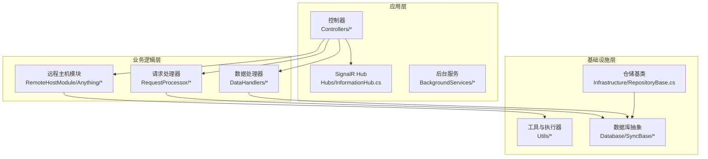
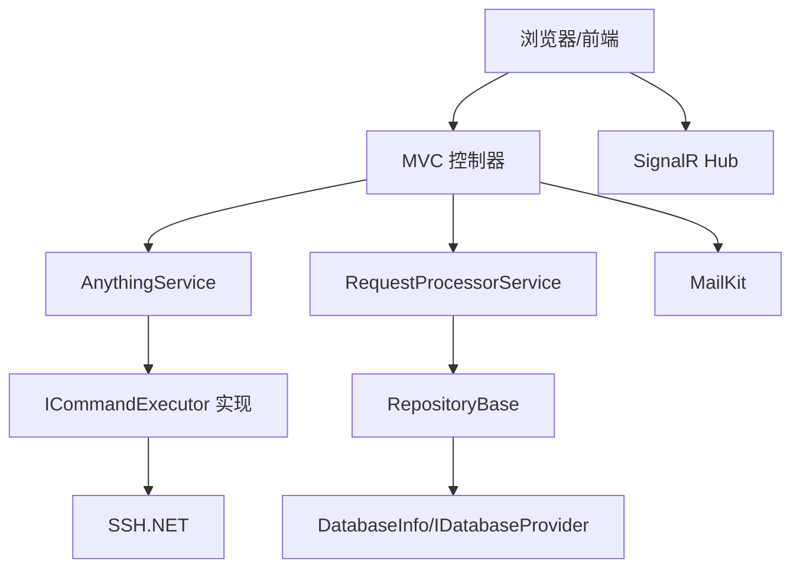
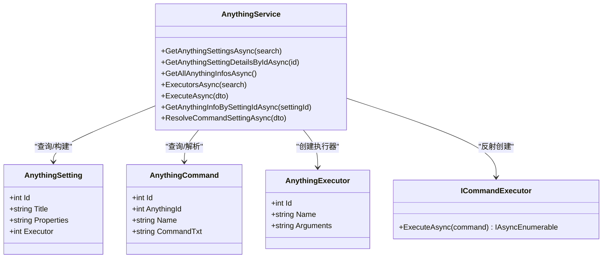
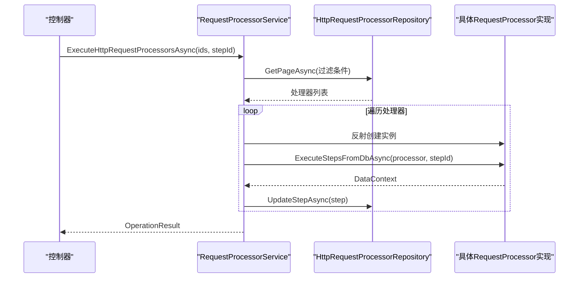
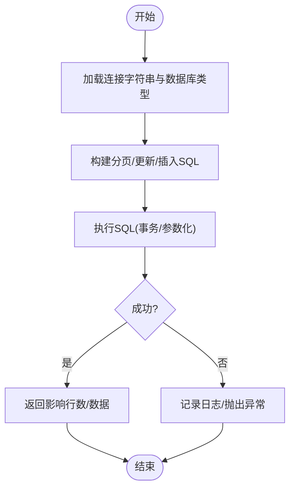
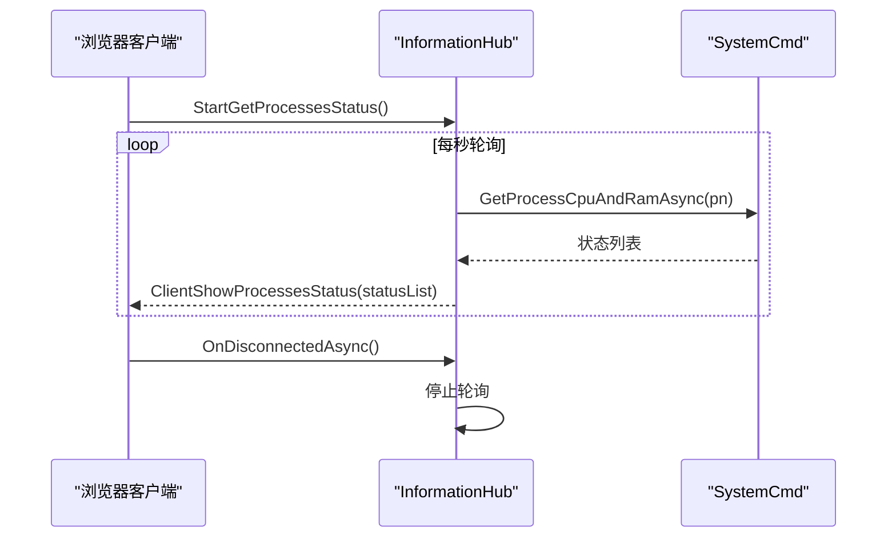
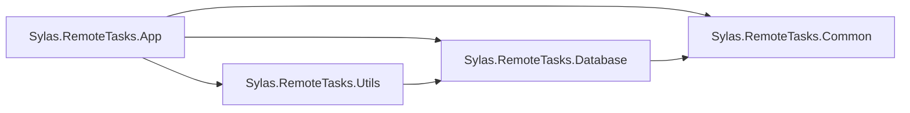

# 项目概述

<cite>
**本文档引用的文件**
- [README.md](file://README.md)
- [Program.cs](file://Sylas.RemoteTasks.App/Program.cs)
- [appsettings.json](file://Sylas.RemoteTasks.App/appsettings.json)
- [Sylas.RemoteTasks.App.csproj](file://Sylas.RemoteTasks.App/Sylas.RemoteTasks.App.csproj)
- [Sylas.RemoteTasks.Common.csproj](file://Sylas.RemoteTasks.Common/Sylas.RemoteTasks.Common.csproj)
- [Sylas.RemoteTasks.Database.csproj](file://Sylas.RemoteTasks.Database/Sylas.RemoteTasks.Database.csproj)
- [Sylas.RemoteTasks.Utils.csproj](file://Sylas.RemoteTasks.Utils/Sylas.RemoteTasks.Utils.csproj)
- [HomeController.cs](file://Sylas.RemoteTasks.App/Controllers/HomeController.cs)
- [HostsController.cs](file://Sylas.RemoteTasks.App/Controllers/HostsController.cs)
- [SyncController.cs](file://Sylas.RemoteTasks.App/Controllers/SyncController.cs)
- [AnythingService.cs](file://Sylas.RemoteTasks.App/RemoteHostModule/Anything/AnythingService.cs)
- [RequestProcessorService.cs](file://Sylas.RemoteTasks.App/RequestProcessor/RequestProcessorService.cs)
- [InformationHub.cs](file://Sylas.RemoteTasks.App/Hubs/InformationHub.cs)
- [DataHandler.cs](file://Sylas.RemoteTasks.App/DataHandlers/DataHandler.cs)
- [DatabaseInfo.cs](file://Sylas.RemoteTasks.Database/SyncBase/DatabaseInfo.cs)
- [ICommandExecutor.cs](file://Sylas.RemoteTasks.Utils/CommandExecutor/ICommandExecutor.cs)
- [RepositoryBase.cs](file://Sylas.RemoteTasks.App/Infrastructure/RepositoryBase.cs)
</cite>

## 目录
1. [引言](#引言)
2. [项目结构](#项目结构)
3. [核心组件](#核心组件)
4. [架构总览](#架构总览)
5. [详细组件分析](#详细组件分析)
6. [依赖关系分析](#依赖关系分析)
7. [性能考虑](#性能考虑)
8. [故障排除指南](#故障排除指南)
9. [结论](#结论)

## 引言
Sylas.RemoteTasks 是一个基于 .NET 10 的现代化远程任务管理系统，旨在统一管理远程主机、编排复杂任务流程、实现跨系统数据同步与实时通信。项目采用分层架构与模块化设计，结合 ASP.NET Core MVC、SignalR、依赖注入与仓储模式，提供可扩展的任务编排、命令执行、数据同步与监控能力。

- 核心目标
  - 统一远程主机管理与命令执行
  - 支持可视化任务编排与工作流
  - 提供跨数据库的数据同步与迁移
  - 实现实时状态监控与双向通信

- 主要特性
  - 远程主机与命令执行：通过“Anything”模块管理主机与命令，支持模板解析与多执行器
  - 任务编排：基于“请求处理器”的步骤化流水线，支持数据上下文传递与数据处理器链式处理
  - 数据同步：支持多数据库类型、批量导入导出、JSON 导入、表结构自动创建与字段类型转换
  - 实时通信：通过 SignalR 推送进程状态与命令执行结果
  - 安全与鉴权：集成 OIDC/JWT 认证与授权策略，支持管理员策略与作用域校验

- 技术栈概览
  - 后端：ASP.NET Core 8/9（.NET 10）、SignalR、Dapper、多数据库驱动
  - 前端：Bootstrap、jQuery、SignalR 浏览器客户端
  - 工具与库：SSH.NET、MailKit、RazorEngine、System.Text.Json、Newtonsoft.Json

## 项目结构
项目采用多项目解决方案，按领域与职责划分模块：

- Sylas.RemoteTasks.App：Web 应用主体，包含控制器、Hub、后台服务、请求处理器、数据处理器与基础设施
- Sylas.RemoteTasks.Common：公共工具与 DTO
- Sylas.RemoteTasks.Database：数据库抽象、同步基类与数据库工具
- Sylas.RemoteTasks.Utils：命令执行器、模板引擎、系统与网络辅助工具
- Sylas.RemoteTasks.Test：单元测试与集成测试

图表来源
- [Program.cs](file://Sylas.RemoteTasks.App/Program.cs#L1-L122)
- [HostsController.cs](file://Sylas.RemoteTasks.App/Controllers/HostsController.cs#L1-L468)
- [SyncController.cs](file://Sylas.RemoteTasks.App/Controllers/SyncController.cs#L1-L457)
- [InformationHub.cs](file://Sylas.RemoteTasks.App/Hubs/InformationHub.cs#L1-L59)
- [AnythingService.cs](file://Sylas.RemoteTasks.App/RemoteHostModule/Anything/AnythingService.cs#L1-L680)
- [RequestProcessorService.cs](file://Sylas.RemoteTasks.App/RequestProcessor/RequestProcessorService.cs#L1-L72)
- [RepositoryBase.cs](file://Sylas.RemoteTasks.App/Infrastructure/RepositoryBase.cs#L1-L233)
- [DatabaseInfo.cs](file://Sylas.RemoteTasks.Database/SyncBase/DatabaseInfo.cs#L1-L800)

章节来源
- [Sylas.RemoteTasks.App.csproj](file://Sylas.RemoteTasks.App/Sylas.RemoteTasks.App.csproj#L1-L61)
- [Sylas.RemoteTasks.Common.csproj](file://Sylas.RemoteTasks.Common/Sylas.RemoteTasks.Common.csproj#L1-L16)
- [Sylas.RemoteTasks.Database.csproj](file://Sylas.RemoteTasks.Database/Sylas.RemoteTasks.Database.csproj#L1-L52)
- [Sylas.RemoteTasks.Utils.csproj](file://Sylas.RemoteTasks.Utils/Sylas.RemoteTasks.Utils.csproj#L1-L47)

## 核心组件
- 控制器层
  - HomeController：提供代码生成、数据库查询与页面渲染入口
  - HostsController：远程主机与命令管理、工作流与模板解析、服务器状态展示
  - SyncController：请求处理器管理、数据同步与 JSON 导入、跨库数据传输

- 服务与模块
  - AnythingService：远程主机配置、命令解析与执行、执行器映射与缓存
  - RequestProcessorService：请求处理器执行、步骤链路与数据上下文传递
  - InformationHub：进程状态实时推送

- 基础设施
  - RepositoryBase：泛型仓储，支持分页、局部更新、动态 SQL 生成
  - DatabaseInfo：多数据库连接、SQL 构建、分页查询、动态更新与表结构管理
  - ICommandExecutor：命令执行器抽象与反射创建

章节来源
- [HomeController.cs](file://Sylas.RemoteTasks.App/Controllers/HomeController.cs#L1-L975)
- [HostsController.cs](file://Sylas.RemoteTasks.App/Controllers/HostsController.cs#L1-L468)
- [SyncController.cs](file://Sylas.RemoteTasks.App/Controllers/SyncController.cs#L1-L457)
- [AnythingService.cs](file://Sylas.RemoteTasks.App/RemoteHostModule/Anything/AnythingService.cs#L1-L680)
- [RequestProcessorService.cs](file://Sylas.RemoteTasks.App/RequestProcessor/RequestProcessorService.cs#L1-L72)
- [InformationHub.cs](file://Sylas.RemoteTasks.App/Hubs/InformationHub.cs#L1-L59)
- [RepositoryBase.cs](file://Sylas.RemoteTasks.App/Infrastructure/RepositoryBase.cs#L1-L233)
- [DatabaseInfo.cs](file://Sylas.RemoteTasks.Database/SyncBase/DatabaseInfo.cs#L1-L800)
- [ICommandExecutor.cs](file://Sylas.RemoteTasks.Utils/CommandExecutor/ICommandExecutor.cs#L1-L74)

## 架构总览
系统采用分层与模块化架构，强调关注点分离与可测试性：

- 表现层：MVC 控制器与 SignalR Hub
- 应用层：服务编排与业务协调
- 基础设施层：数据库抽象、仓储与工具
- 外部集成：SSH、HTTP、邮件、模板引擎

图表来源
- [Program.cs](file://Sylas.RemoteTasks.App/Program.cs#L1-L122)
- [HostsController.cs](file://Sylas.RemoteTasks.App/Controllers/HostsController.cs#L1-L468)
- [SyncController.cs](file://Sylas.RemoteTasks.App/Controllers/SyncController.cs#L1-L457)
- [InformationHub.cs](file://Sylas.RemoteTasks.App/Hubs/InformationHub.cs#L1-L59)
- [AnythingService.cs](file://Sylas.RemoteTasks.App/RemoteHostModule/Anything/AnythingService.cs#L1-L680)
- [RequestProcessorService.cs](file://Sylas.RemoteTasks.App/RequestProcessor/RequestProcessorService.cs#L1-L72)
- [RepositoryBase.cs](file://Sylas.RemoteTasks.App/Infrastructure/RepositoryBase.cs#L1-L233)
- [DatabaseInfo.cs](file://Sylas.RemoteTasks.Database/SyncBase/DatabaseInfo.cs#L1-L800)
- [ICommandExecutor.cs](file://Sylas.RemoteTasks.Utils/CommandExecutor/ICommandExecutor.cs#L1-L74)

## 详细组件分析

### 远程主机与命令执行模块（AnythingService）
- 设计要点
  - 以“AnythingSetting/AnythingCommand/AnythingExecutor”为核心模型，支持模板解析与缓存
  - 通过反射与依赖注入创建命令执行器，统一命令执行接口
  - 支持中心服务器与子节点的命令转发与结果聚合
  - 提供工作流节点管理与环境变量同步

图表来源
- [AnythingService.cs](file://Sylas.RemoteTasks.App/RemoteHostModule/Anything/AnythingService.cs#L1-L680)
- [ICommandExecutor.cs](file://Sylas.RemoteTasks.Utils/CommandExecutor/ICommandExecutor.cs#L1-L74)

章节来源
- [HostsController.cs](file://Sylas.RemoteTasks.App/Controllers/HostsController.cs#L1-L468)
- [AnythingService.cs](file://Sylas.RemoteTasks.App/RemoteHostModule/Anything/AnythingService.cs#L1-L680)
- [ICommandExecutor.cs](file://Sylas.RemoteTasks.Utils/CommandExecutor/ICommandExecutor.cs#L1-L74)

### 请求处理器与数据同步（RequestProcessorService）
- 设计要点
  - 通过配置或数据库加载处理器与步骤，按顺序执行
  - 支持数据上下文在步骤间传递，便于链式处理
  - 步骤执行后持久化上下文，支持断点续跑

图表来源
- [RequestProcessorService.cs](file://Sylas.RemoteTasks.App/RequestProcessor/RequestProcessorService.cs#L1-L72)
- [SyncController.cs](file://Sylas.RemoteTasks.App/Controllers/SyncController.cs#L1-L457)

章节来源
- [RequestProcessorService.cs](file://Sylas.RemoteTasks.App/RequestProcessor/RequestProcessorService.cs#L1-L72)
- [SyncController.cs](file://Sylas.RemoteTasks.App/Controllers/SyncController.cs#L1-L457)

### 数据同步与数据库抽象（DatabaseInfo/RepositoryBase）
- 设计要点
  - DatabaseInfo 提供多数据库连接、SQL 构建、分页查询、动态更新与表结构管理
  - RepositoryBase<T> 提供泛型仓储，支持分页、局部更新与动态 SQL 生成
  - 支持不同数据库参数占位符与自增主键返回差异

图表来源
- [DatabaseInfo.cs](file://Sylas.RemoteTasks.Database/SyncBase/DatabaseInfo.cs#L1-L800)
- [RepositoryBase.cs](file://Sylas.RemoteTasks.App/Infrastructure/RepositoryBase.cs#L1-L233)

章节来源
- [DatabaseInfo.cs](file://Sylas.RemoteTasks.Database/SyncBase/DatabaseInfo.cs#L1-L800)
- [RepositoryBase.cs](file://Sylas.RemoteTasks.App/Infrastructure/RepositoryBase.cs#L1-L233)

### 实时通信与监控（InformationHub）
- 设计要点
  - 通过 SignalR 推送进程 CPU/内存占用状态
  - 支持客户端订阅与断开清理

图表来源
- [InformationHub.cs](file://Sylas.RemoteTasks.App/Hubs/InformationHub.cs#L1-L59)

章节来源
- [InformationHub.cs](file://Sylas.RemoteTasks.App/Hubs/InformationHub.cs#L1-L59)

## 依赖关系分析
- 项目依赖
  - App 依赖 Utils 与 Database，Common 作为共享库
  - Utils 再依赖 Database，形成清晰的层次化依赖
- 关键外部库
  - SignalR、SSH.NET、MailKit、Dapper、System.Text.Json、Newtonsoft.Json

图表来源
- [Sylas.RemoteTasks.App.csproj](file://Sylas.RemoteTasks.App/Sylas.RemoteTasks.App.csproj#L1-L61)
- [Sylas.RemoteTasks.Utils.csproj](file://Sylas.RemoteTasks.Utils/Sylas.RemoteTasks.Utils.csproj#L1-L47)
- [Sylas.RemoteTasks.Database.csproj](file://Sylas.RemoteTasks.Database/Sylas.RemoteTasks.Database.csproj#L1-L52)
- [Sylas.RemoteTasks.Common.csproj](file://Sylas.RemoteTasks.Common/Sylas.RemoteTasks.Common.csproj#L1-L16)

章节来源
- [Sylas.RemoteTasks.App.csproj](file://Sylas.RemoteTasks.App/Sylas.RemoteTasks.App.csproj#L1-L61)
- [Sylas.RemoteTasks.Utils.csproj](file://Sylas.RemoteTasks.Utils/Sylas.RemoteTasks.Utils.csproj#L1-L47)
- [Sylas.RemoteTasks.Database.csproj](file://Sylas.RemoteTasks.Database/Sylas.RemoteTasks.Database.csproj#L1-L52)
- [Sylas.RemoteTasks.Common.csproj](file://Sylas.RemoteTasks.Common/Sylas.RemoteTasks.Common.csproj#L1-L16)

## 性能考虑
- 数据访问
  - 使用 Dapper 进行高性能 ORM 操作，避免实体跟踪
  - 事务内批量执行 SQL，减少往返次数
- 命令执行
  - 通过缓存执行器与解析结果，减少重复反射与模板解析成本
- 实时通信
  - SignalR 推送采用 SSE/长连接，注意客户端断开与资源释放
- 配置与部署
  - Kestrel 最大请求体大小可配置，上传场景建议按需调整
  - Dockerfile 与发布配置支持容器化部署

## 故障排除指南
- 认证与授权
  - 确认 IdentityServer 配置正确，管理员角色与作用域匹配
- 数据库连接
  - 检查连接字符串格式与关键字白名单，确保加密连接字符串可正常解密
- 命令执行
  - 若执行器创建失败，检查执行器类名与参数映射；确认模板解析结果非空
- 请求处理器
  - 确认处理器与步骤存在且顺序正确，断点续跑时检查上下文持久化
- 实时监控
  - 客户端断开后 Hub 会停止轮询，检查 OnDisconnectedAsync 处理

章节来源
- [Program.cs](file://Sylas.RemoteTasks.App/Program.cs#L74-L87)
- [appsettings.json](file://Sylas.RemoteTasks.App/appsettings.json#L1-L142)
- [AnythingService.cs](file://Sylas.RemoteTasks.App/RemoteHostModule/Anything/AnythingService.cs#L294-L389)
- [RequestProcessorService.cs](file://Sylas.RemoteTasks.App/RequestProcessor/RequestProcessorService.cs#L11-L69)
- [InformationHub.cs](file://Sylas.RemoteTasks.App/Hubs/InformationHub.cs#L51-L56)

## 结论
Sylas.RemoteTasks 通过清晰的分层架构与模块化设计，提供了从远程主机管理、任务编排到数据同步与实时通信的一体化能力。其依赖注入、仓储模式与多数据库抽象使其具备良好的可维护性与扩展性；结合 SignalR 与模板引擎，满足现代企业级远程任务管理需求。建议在生产环境中完善日志与监控、强化安全配置，并持续优化命令执行与数据同步的性能瓶颈。