# 项目简介

<cite>
**本文档引用的文件**
- [README.md](file://README.md)
- [Program.cs](file://Sylas.RemoteTasks.App/Program.cs)
- [Sylas.RemoteTasks.App.csproj](file://Sylas.RemoteTasks.App/Sylas.RemoteTasks.App.csproj)
- [README.md](file://Sylas.RemoteTasks.Database/README.md)
- [README.md](file://Sylas.RemoteTasks.Utils/README.md)
- [StringExtensions.cs](file://Sylas.RemoteTasks.Common/Extensions/StringExtensions.cs)
- [HomeController.cs](file://Sylas.RemoteTasks.App/Controllers/HomeController.cs)
- [HostsController.cs](file://Sylas.RemoteTasks.App/Controllers/HostsController.cs)
- [InformationHub.cs](file://Sylas.RemoteTasks.App/Hubs/InformationHub.cs)
- [RequestProcessorService.cs](file://Sylas.RemoteTasks.App/RequestProcessor/RequestProcessorService.cs)
- [AnythingService.cs](file://Sylas.RemoteTasks.App/RemoteHostModule/Anything/AnythingService.cs)
- [HttpExecutor.cs](file://Sylas.RemoteTasks.Utils/CommandExecutor/HttpExecutor.cs)
- [DatabaseExecutor.cs](file://Sylas.RemoteTasks.Utils/CommandExecutor/DatabaseExecutor.cs)
- [SyncController.cs](file://Sylas.RemoteTasks.App/Controllers/SyncController.cs)
</cite>

## 目录
1. [引言](#引言)
2. [项目结构](#项目结构)
3. [核心组件](#核心组件)
4. [架构概览](#架构概览)
5. [详细组件分析](#详细组件分析)
6. [依赖分析](#依赖分析)
7. [性能考虑](#性能考虑)
8. [故障排除指南](#故障排除指南)
9. [结论](#结论)

## 引言

Sylas.RemoteTasks 是一个基于 .NET 10 的现代化远程任务管理系统，专注于解决远程主机自动化操作、任务编排、数据同步和实时通信等核心问题。该项目采用模块化设计，通过统一的任务执行引擎和灵活的命令解析机制，为企业级用户提供了一套完整的远程运维解决方案。

### 核心价值主张

- **统一任务执行平台**：提供跨平台、跨协议的远程任务执行能力
- **可视化编排系统**：支持图形化的任务流程设计和监控
- **实时通信能力**：基于 SignalR 实现实时状态推送和进程监控
- **安全可靠保障**：内置加密传输和访问控制机制
- **高度可扩展性**：模块化架构支持功能扩展和定制开发

### 目标用户群体

- **企业运维团队**：需要集中管理多台服务器的IT管理员
- **DevOps工程师**：负责部署自动化和基础设施管理的专业人员
- **系统集成商**：需要提供远程运维解决方案的第三方服务商
- **技术团队负责人**：需要统一管理远程任务和监控系统的项目管理者

### 应用场景

- **批量服务器管理**：同时对多台服务器执行相同的维护任务
- **自动化部署流水线**：CI/CD流程中的远程部署和验证环节
- **数据同步与迁移**：跨数据库和跨系统的数据同步服务
- **远程监控与告警**：实时监控服务器状态和应用程序性能
- **任务调度与编排**：复杂的多步骤任务自动化执行

## 项目结构

项目采用分层架构设计，按照功能模块进行组织，确保代码的可维护性和可扩展性。

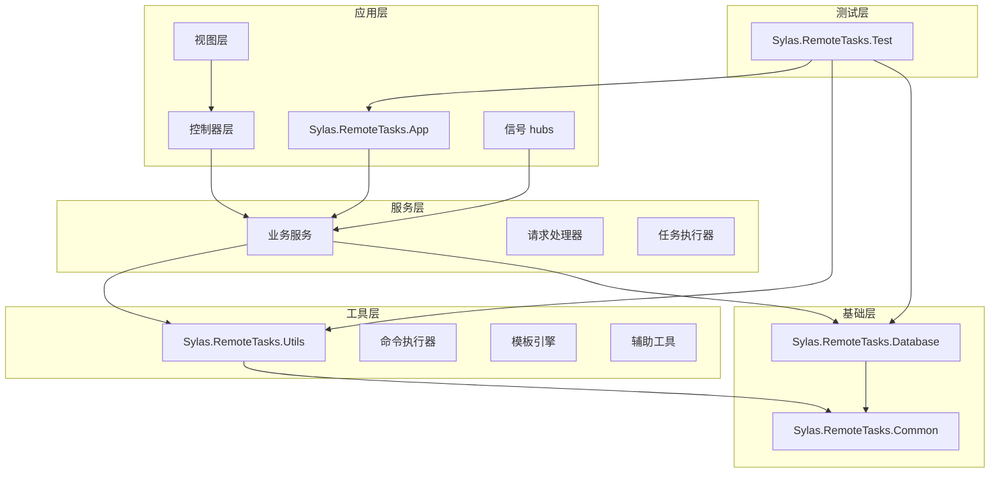

**图表来源**
- [Program.cs](file://Sylas.RemoteTasks.App/Program.cs#L1-L122)
- [Sylas.RemoteTasks.App.csproj](file://Sylas.RemoteTasks.App/Sylas.RemoteTasks.App.csproj#L1-L61)

### 设计理念

项目遵循以下设计理念：

- **模块化设计**：每个功能模块独立封装，降低耦合度
- **依赖注入**：通过IoC容器管理对象生命周期和依赖关系
- **接口抽象**：定义清晰的接口契约，便于扩展和替换
- **异步编程**：充分利用.NET的异步特性提升并发性能
- **错误处理**：统一的异常处理机制和错误响应格式

### 技术选型原因

- **.NET 10**：最新稳定版本，性能优异，生态完善
- **ASP.NET Core**：高性能Web框架，支持跨平台部署
- **SignalR**：简化实时通信开发，支持多种传输协议
- **Dapper**：轻量级ORM，提供高性能数据库操作
- **RazorEngine**：模板引擎，支持动态代码生成
- **Docker**：容器化部署，确保环境一致性

**章节来源**
- [Program.cs](file://Sylas.RemoteTasks.App/Program.cs#L1-L122)
- [Sylas.RemoteTasks.App.csproj](file://Sylas.RemoteTasks.App/Sylas.RemoteTasks.App.csproj#L1-L61)

## 核心组件

### 任务执行引擎

任务执行引擎是系统的核心，负责协调各个组件完成复杂的远程任务。

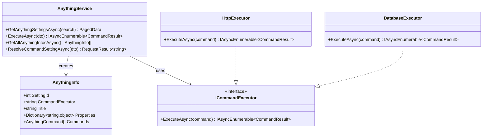

**图表来源**
- [AnythingService.cs](file://Sylas.RemoteTasks.App/RemoteHostModule/Anything/AnythingService.cs#L1-L680)
- [HttpExecutor.cs](file://Sylas.RemoteTasks.Utils/CommandExecutor/HttpExecutor.cs#L1-L40)
- [DatabaseExecutor.cs](file://Sylas.RemoteTasks.Utils/CommandExecutor/DatabaseExecutor.cs#L1-L32)

### 实时通信系统

基于SignalR的实时通信系统，提供服务器状态监控和进程管理功能。

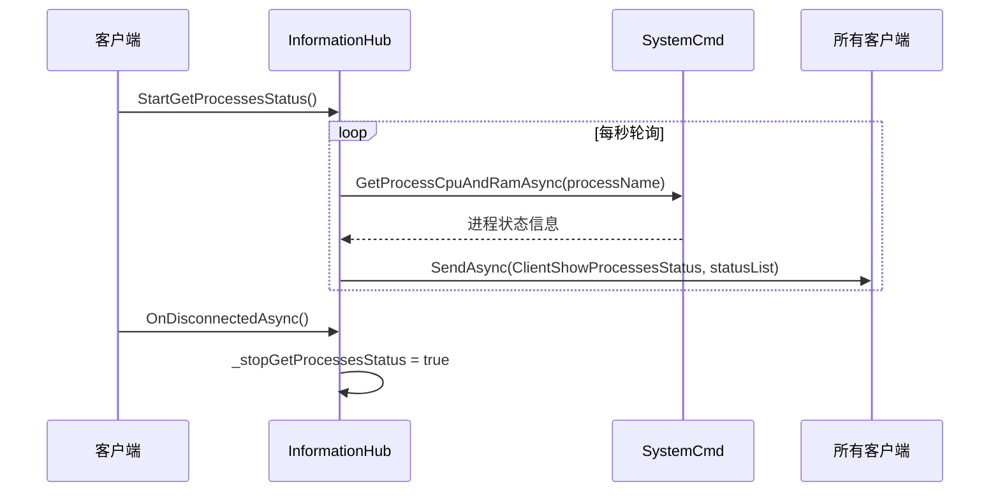

**图表来源**
- [InformationHub.cs](file://Sylas.RemoteTasks.App/Hubs/InformationHub.cs#L1-L59)

### 数据同步模块

提供跨数据库的数据同步和迁移功能，支持多种数据库类型。

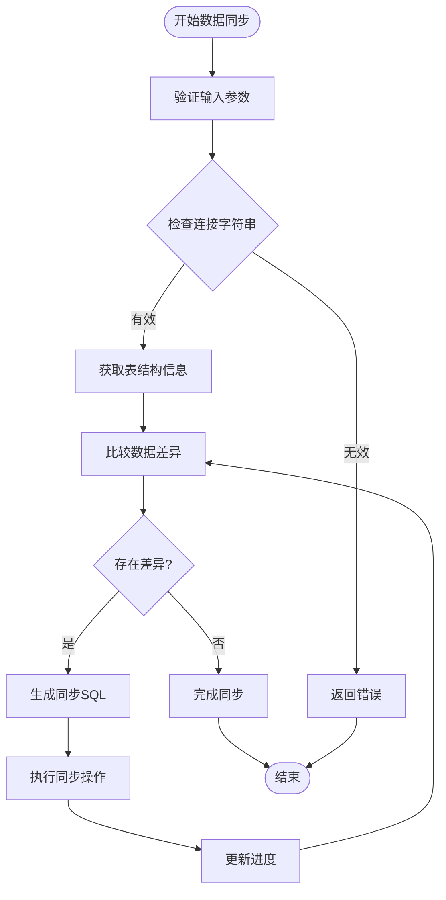

**图表来源**
- [SyncController.cs](file://Sylas.RemoteTasks.App/Controllers/SyncController.cs#L365-L390)

**章节来源**
- [AnythingService.cs](file://Sylas.RemoteTasks.App/RemoteHostModule/Anything/AnythingService.cs#L1-L680)
- [InformationHub.cs](file://Sylas.RemoteTasks.App/Hubs/InformationHub.cs#L1-L59)
- [SyncController.cs](file://Sylas.RemoteTasks.App/Controllers/SyncController.cs#L365-L390)

## 架构概览

系统采用分层架构，从底层基础设施到上层应用服务，每一层都有明确的职责分工。

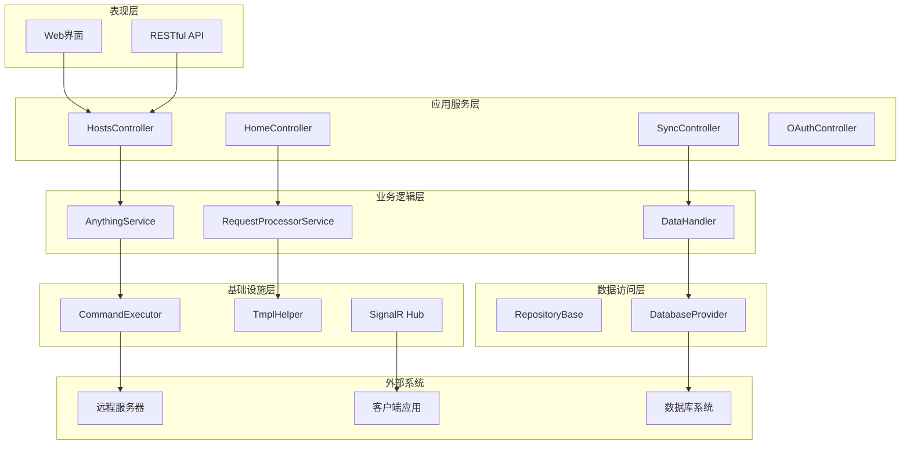

**图表来源**
- [Program.cs](file://Sylas.RemoteTasks.App/Program.cs#L1-L122)
- [HostsController.cs](file://Sylas.RemoteTasks.App/Controllers/HostsController.cs#L1-L468)
- [HomeController.cs](file://Sylas.RemoteTasks.App/Controllers/HomeController.cs#L1-L975)

### 控制流分析

系统的主要控制流程包括任务执行、数据同步和实时通信三个核心场景。

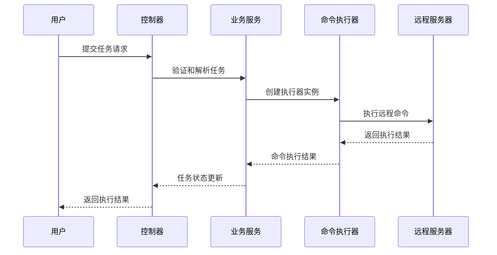

**图表来源**
- [HostsController.cs](file://Sylas.RemoteTasks.App/Controllers/HostsController.cs#L85-L124)
- [AnythingService.cs](file://Sylas.RemoteTasks.App/RemoteHostModule/Anything/AnythingService.cs#L294-L389)

**章节来源**
- [Program.cs](file://Sylas.RemoteTasks.App/Program.cs#L1-L122)
- [HostsController.cs](file://Sylas.RemoteTasks.App/Controllers/HostsController.cs#L1-L468)
- [HomeController.cs](file://Sylas.RemoteTasks.App/Controllers/HomeController.cs#L1-L975)

## 详细组件分析

### 任务编排系统

任务编排系统是整个系统的核心功能，支持复杂的多步骤任务执行和状态管理。

#### 任务执行流程

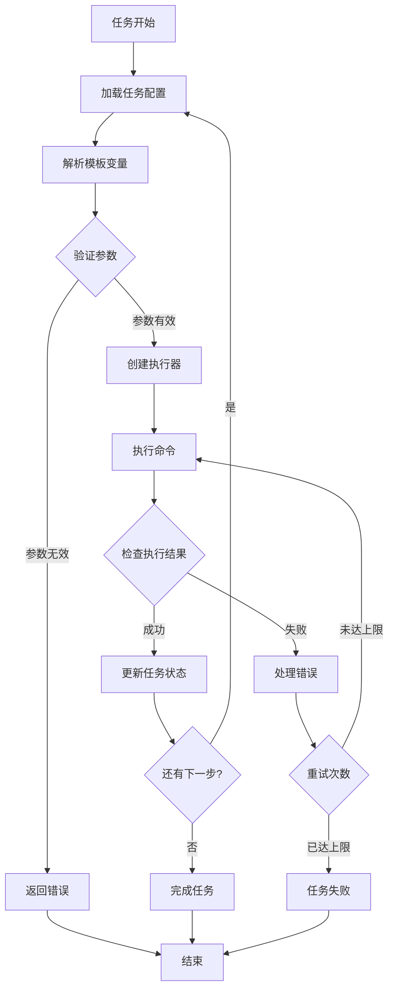

**图表来源**
- [AnythingService.cs](file://Sylas.RemoteTasks.App/RemoteHostModule/Anything/AnythingService.cs#L294-L389)

#### 命令执行器架构

系统支持多种类型的命令执行器，每种执行器负责特定类型的远程操作。

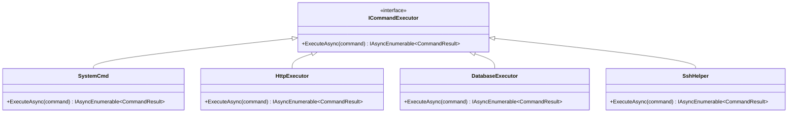

**图表来源**
- [HttpExecutor.cs](file://Sylas.RemoteTasks.Utils/CommandExecutor/HttpExecutor.cs#L1-L40)
- [DatabaseExecutor.cs](file://Sylas.RemoteTasks.Utils/CommandExecutor/DatabaseExecutor.cs#L1-L32)

**章节来源**
- [AnythingService.cs](file://Sylas.RemoteTasks.App/RemoteHostModule/Anything/AnythingService.cs#L1-L680)
- [HttpExecutor.cs](file://Sylas.RemoteTasks.Utils/CommandExecutor/HttpExecutor.cs#L1-L40)
- [DatabaseExecutor.cs](file://Sylas.RemoteTasks.Utils/CommandExecutor/DatabaseExecutor.cs#L1-L32)

### 数据同步引擎

数据同步引擎提供了强大的跨数据库数据迁移和同步能力，支持多种数据库类型和同步策略。

#### 同步策略

系统支持多种数据同步策略，包括全量同步、增量同步和结构同步。

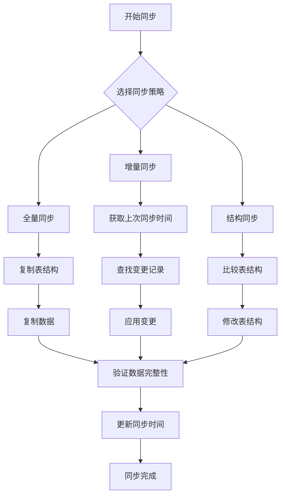

**图表来源**
- [SyncController.cs](file://Sylas.RemoteTasks.App/Controllers/SyncController.cs#L370-L390)

#### 数据处理管道

数据同步过程中采用了管道式的处理方式，确保数据处理的高效性和可靠性。

**章节来源**
- [SyncController.cs](file://Sylas.RemoteTasks.App/Controllers/SyncController.cs#L365-L390)

### 实时监控系统

实时监控系统通过SignalR实现实时状态推送，为用户提供直观的系统状态可视化。

#### 进程监控流程

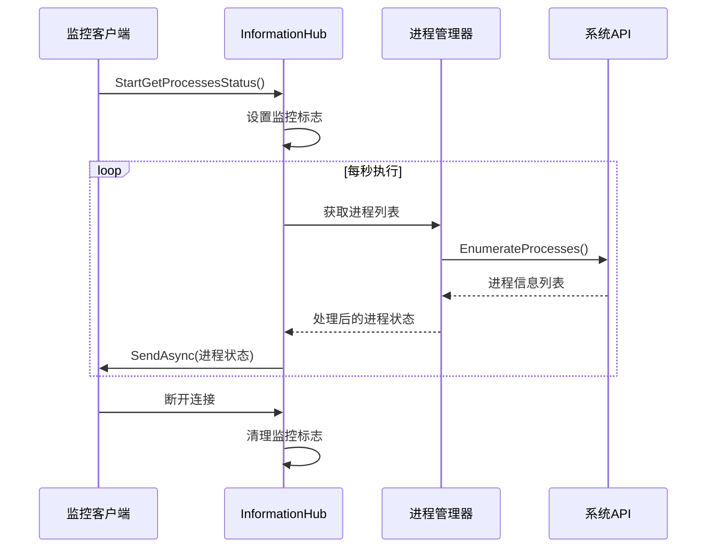

**图表来源**
- [InformationHub.cs](file://Sylas.RemoteTasks.App/Hubs/InformationHub.cs#L1-L59)

**章节来源**
- [InformationHub.cs](file://Sylas.RemoteTasks.App/Hubs/InformationHub.cs#L1-L59)

## 依赖分析

项目采用模块化依赖设计，各模块之间的依赖关系清晰明确。

```mermaid
graph TB
subgraph "核心依赖"
DotNet[.NET 10 Runtime]
AspNetCore[ASP.NET Core]
SignalR[SignalR Core]
end
subgraph "数据库相关"
Dapper[Dapper ORM]
MySql[MySql Provider]
SqlServer[Sql Server Provider]
Sqlite[Sqlite Provider]
end
subgraph "工具库"
Newtonsoft[Newtonsoft.Json]
RazorEngine[RazorEngine]
BCrypt[Bcrypt.Net]
end
subgraph "安全相关"
IdentityModel[IdentityModel]
JWT[JWT Bearer]
OpenId[OpenId Connect]
end
App[Sylas.RemoteTasks.App] --> DotNet
App --> AspNetCore
App --> SignalR
App --> Dapper
App --> Newtonsoft
App --> IdentityModel
Utils[Sylas.RemoteTasks.Utils] --> DotNet
Utils --> Newtonsoft
Utils --> BCrypt
Database[Sylas.RemoteTasks.Database] --> Dapper
Database --> DotNet
Common[Sylas.RemoteTasks.Common] --> DotNet
Common --> Newtonsoft
```

**图表来源**
- [Sylas.RemoteTasks.App.csproj](file://Sylas.RemoteTasks.App/Sylas.RemoteTasks.App.csproj#L33-L40)

### 依赖关系特点

- **低耦合高内聚**：各模块职责明确，依赖关系简单
- **版本兼容性**：所有包都针对.NET 10进行了优化
- **安全性考虑**：内置了完整的身份认证和授权机制
- **性能优化**：选择了高性能的第三方库和框架

**章节来源**
- [Sylas.RemoteTasks.App.csproj](file://Sylas.RemoteTasks.App/Sylas.RemoteTasks.App.csproj#L1-L61)

## 性能考虑

系统在设计时充分考虑了性能优化，采用了多种技术和策略来提升整体性能。

### 异步编程模型

系统全面采用异步编程模型，避免阻塞操作影响整体性能。

- **异步I/O操作**：数据库查询、文件操作、网络请求全部异步化
- **异步集合**：使用IAsyncEnumerable提供高效的流式处理
- **并发控制**：合理使用SemaphoreSlim等同步原语控制并发度

### 缓存策略

实现了多层次的缓存机制，减少重复计算和数据库访问。

- **内存缓存**：使用IMemoryCache缓存频繁访问的数据
- **配置缓存**：缓存解析后的模板和配置信息
- **执行器缓存**：缓存已创建的命令执行器实例

### 连接池管理

数据库连接采用连接池管理，提高连接复用效率。

- **自动连接复用**：避免频繁创建和销毁数据库连接
- **连接超时控制**：合理的连接超时和重试机制
- **资源清理**：确保连接正确释放，避免资源泄漏

## 故障排除指南

### 常见问题及解决方案

#### 任务执行失败

**问题现象**：任务执行过程中出现异常或超时

**可能原因**：
- 远程服务器连接失败
- 命令权限不足
- 网络超时
- 命令语法错误

**解决步骤**：
1. 检查远程服务器连接状态
2. 验证执行用户的权限设置
3. 查看网络连接质量
4. 测试命令在目标服务器上的执行

#### 数据同步异常

**问题现象**：数据同步过程中出现数据不一致

**可能原因**：
- 源数据库连接异常
- 目标数据库权限不足
- 同步策略配置错误
- 数据冲突处理不当

**解决步骤**：
1. 验证数据库连接字符串
2. 检查目标数据库写入权限
3. 确认同步策略配置
4. 分析数据冲突日志

#### 实时通信中断

**问题现象**：SignalR连接断开或消息丢失

**可能原因**：
- 网络不稳定
- 代理服务器配置问题
- 客户端浏览器限制
- 服务器资源不足

**解决步骤**：
1. 检查网络连接稳定性
2. 验证代理服务器配置
3. 测试不同浏览器兼容性
4. 监控服务器资源使用情况

**章节来源**
- [HostsController.cs](file://Sylas.RemoteTasks.App/Controllers/HostsController.cs#L85-L124)
- [InformationHub.cs](file://Sylas.RemoteTasks.App/Hubs/InformationHub.cs#L1-L59)

## 结论

Sylas.RemoteTasks 项目是一个功能完整、架构清晰的现代化远程任务管理系统。通过采用最新的 .NET 10 技术栈和模块化设计理念，系统在保证功能完整性的同时，也具备了良好的可扩展性和可维护性。

### 主要优势

- **技术先进**：基于 .NET 10 和 ASP.NET Core，充分利用现代 .NET 的性能优势
- **功能全面**：涵盖远程任务执行、数据同步、实时监控等核心功能
- **架构清晰**：分层设计和模块化组织，便于理解和维护
- **扩展性强**：插件化的命令执行器和灵活的配置机制
- **用户体验好**：提供直观的Web界面和实时的状态反馈

### 发展前景

随着企业数字化转型的深入，远程任务管理和自动化运维的需求将持续增长。Sylas.RemoteTasks 项目具备了良好的技术基础和发展潜力，可以在以下方面进一步完善：

- **云原生支持**：增强对容器化和微服务架构的支持
- **智能运维**：集成AI/ML技术实现智能化的运维决策
- **多租户架构**：支持多组织、多项目的隔离和管理
- **国际化支持**：完善多语言和多地区适配
- **生态集成**：与主流DevOps工具链的深度集成

该项目为远程运维领域提供了一个优秀的参考实现，无论是在技术选型还是架构设计方面，都值得学习和借鉴。